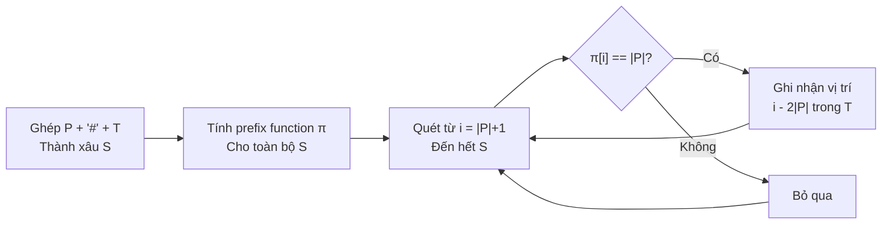

# Bài 9: KMP - Tìm Xâu Mẫu O(N + M)!

> **Tác giả:** FPTOJ Wiki<br>
> **Nội dung tham khảo từ:** CP-Algorithms, VNOI Wiki, USACO Guide

---

## Bạn sẽ học được gì?

- Tại sao thuật toán ngây thơ (Brute-force) thất bại với dữ liệu lớn
- Bản chất của **Hàm tiền tố** (Prefix Function) $\pi$ và tại sao nó là chìa khóa
- Cơ chế "nhảy cóc" của KMP — tại sao không bao giờ lùi con trỏ trong text
- Cài đặt KMP tìm xâu mẫu, đếm số lần xuất hiện, tìm chu kỳ
- Phân tích độ phức tạp Thời gian $O(N + M)$ và Không gian $O(N + M)$

---

## 1. Bản chất vấn đề

### Bài toán

Cho văn bản $T$ độ dài $N$ và mẫu $P$ độ dài $M$. Tìm **tất cả các vị trí** $i$ sao cho $T[i \ldots i+M-1] = P$.

**Ví dụ:** $T = \text{"aabcabaab"}$, $P = \text{"ab"}$. Kết quả: xuất hiện tại vị trí $1$, $4$, $7$.

### Tại sao Brute-force thất bại?

Brute-force so sánh $P$ với $T$ tại **mỗi vị trí** $i = 0, 1, \ldots, N - M$:

- Tại vị trí $i$: so sánh $T[i]$ vs $P[0]$, $T[i+1]$ vs $P[1]$, $\ldots$, $T[i+M-1]$ vs $P[M-1]$
- Nếu khớp hết → tìm thấy. Nếu sai tại vị trí $j$ → nhảy sang vị trí $i + 1$

**Độ phức tạp:** $O(N \times M)$ trong trường hợp xấu nhất.

**Ví dụ gây TLE:** $T = \text{"aaaaaaa\ldots a"}$ (toàn ký tự `a`), $P = \text{"aaaa\ldots ab"}$ ($M-1$ ký tự `a` rồi `b`). Tại mỗi vị trí, phải so sánh $M-1$ ký tự rồi mới phát hiện sai → $N \times M$ phép so sánh.

Với $N = 10^6$, $M = 10^3$ → $10^9$ phép so sánh → **TLE!**

### Tư duy cốt lõi

Khi brute-force so sánh thất bại tại vị trí $j$ trong $P$, nó **vứt bỏ** mọi thông tin đã khớp trước đó và bắt đầu lại từ đầu. KMP nhận ra:

> Khi $T[i] \neq P[j]$, ta **đã biết** rằng $P[0 \ldots j-1] = T[i-j+1 \ldots i]$. Nếu trong đoạn $P[0 \ldots j-1]$ có một tiền tố trùng với hậu tố, ta có thể **nhảy thẳng** con trỏ $j$ về vị trí đó mà **không cần so sánh lại** từ $P[0]$.

Đây chính là ý tưởng của **Hàm tiền tố** $\pi$.

---

## 2. Hàm tiền tố (Prefix Function)

### Định nghĩa chính thức

Cho xâu $S$ độ dài $n$. Hàm tiền tố $\pi[i]$ là **độ dài tiền tố chuẩn dài nhất** của $S[0 \ldots i]$ mà **cũng là hậu tố** của $S[0 \ldots i]$, với ràng buộc tiền tố đó **không được bằng chính xâu** $S[0 \ldots i]$.

$$\pi[i] = \max\{k : 0 \leq k < i+1, \; S[0 \ldots k-1] = S[i-k+1 \ldots i]\}$$

**Nói đơn giản:** $\pi[i]$ = độ dài đoạn đầu của $S[0 \ldots i]$ khớp chính xác với đoạn cuối, nhưng đoạn đó phải **ngắn hơn** toàn bộ xâu.

### Ví dụ: Tính $\pi$ cho $S = \text{"aabaaab"}$

| $i$ | $S[0 \ldots i]$ | Tiền tố = Hậu tố? | $\pi[i]$ |
|-----|-----------------|---------------------|-----------|
| 0 | `a` | Không có tiền tố chuẩn (phải ngắn hơn xâu) | 0 |
| 1 | `aa` | `"a"` = `"a"` → độ dài 1 | 1 |
| 2 | `aab` | Không có | 0 |
| 3 | `aaba` | `"a"` = `"a"` → độ dài 1 | 1 |
| 4 | `aabaa` | `"aa"` = `"aa"` → độ dài 2 | 2 |
| 5 | `aabaaa` | `"aa"` = `"aa"` → độ dài 2 | 2 |
| 6 | `aabaaab` | `"aab"` = `"aab"` → độ dài 3 | 3 |

### Tại sao $\pi$ là chìa khóa của KMP?

Giả sử ta đang so sánh $P$ với $T$, đã khớp $P[0 \ldots j-1]$ với $T$ nhưng thất bại tại $P[j]$. Lúc này ta **đã biết**:

- $P[0 \ldots j-1] = T[\text{vị trí tương ứng}]$

Nếu $\pi[j-1] = k > 0$, thì $P[0 \ldots k-1] = P[j-k \ldots j-1]$. Vì $P[j-k \ldots j-1]$ đã khớp với $T$, nên $P[0 \ldots k-1]$ cũng khớp với $T$ → **nhảy thẳng** $j$ về $k$ mà không cần so sánh lại!

### Thuật toán tính $\pi$

**Cốt lõi:** Sử dụng kết quả đã tính ở bước trước. Khi $S[i] \neq S[j]$, nhảy $j = \pi[j-1]$ thay vì về $0$.

**Tại sao nhảy về $\pi[j-1]$ mà không mất thông tin?**

Khi $S[i] \neq S[j]$ tại bước tính $\pi[i]$, ta đã biết $S[0 \ldots j-1] = S[i-j \ldots i-1]$. Giá trị $\pi[j-1]$ cho biết có một tiền tố của $S[0 \ldots j-1]$ trùng với hậu tố của nó. Tiền tố này cũng trùng với đoạn $S[i - \pi[j-1] \ldots i-1]$ → ta đã "miễn phí" $\pi[j-1]$ ký tự khớp!

**Phân tích từng bước** với $S = \text{"aabaaab"}$:

| Bước | $i$ | $S[i]$ | $j$ ban đầu | So sánh | Hành động | $\pi[i]$ | $j$ mới |
|------|-----|--------|-------------|---------|-----------|-----------|---------|
| 1 | 1 | `a` | $j = \pi[0] = 0$ | $S[1]=a = S[0]=a$ | $j++$ | 1 | 1 |
| 2 | 2 | `b` | $j = \pi[1] = 1$ | $S[2]=b \neq S[1]=a$ | $j = \pi[0] = 0$ | 0 | 0 |
| 3 | 2 | `b` | $j = 0$ | $S[2]=b \neq S[0]=a$ | Dừng, ghi $\pi[2]=0$ | 0 | 0 |
| 4 | 3 | `a` | $j = \pi[2] = 0$ | $S[3]=a = S[0]=a$ | $j++$ | 1 | 1 |
| 5 | 4 | `a` | $j = \pi[3] = 1$ | $S[4]=a = S[1]=a$ | $j++$ | 2 | 2 |
| 6 | 5 | `a` | $j = \pi[4] = 2$ | $S[5]=a \neq S[2]=b$ | $j = \pi[1] = 1$ | — | 1 |
| 7 | 5 | `a` | $j = 1$ | $S[5]=a = S[1]=a$ | $j++$ | 2 | 2 |
| 8 | 6 | `b` | $j = \pi[5] = 2$ | $S[6]=b = S[2]=b$ | $j++$ | 3 | 3 |

### Cài đặt

=== "C++"

    ```cpp
    vector<int> prefixFunction(string s) {
        int n = s.length();
        vector<int> pi(n, 0);
        for (int i = 1; i < n; i++) {
            int j = pi[i - 1];
            while (j > 0 && s[i] != s[j])
                j = pi[j - 1];
            if (s[i] == s[j])
                j++;
            pi[i] = j;
        }
        return pi;
    }
    ```

=== "Python"

    ```python
    def prefix_function(s):
        n = len(s)
        pi = [0] * n
        for i in range(1, n):
            j = pi[i - 1]
            while j > 0 and s[i] != s[j]:
                j = pi[j - 1]
            if s[i] == s[j]:
                j += 1
            pi[i] = j
        return pi
    ```

### Chứng minh tính đúng đắn và độ phức tạp

**Tính đúng đắn:** Tại bước $i$, biến $j$ luôn đại diện cho độ dài tiền tố dài nhất của $S[0 \ldots i-1]$ mà cũng là hậu tố. Khi $S[i] = S[j]$, ta mở rộng thêm 1 ký tự. Khi $S[i] \neq S[j]$, ta nhảy $j = \pi[j-1]$ — giá trị này cho biết tiền tố ngắn hơn nhưng vẫn khớp hậu tố.

**Độ phức tạp Thời gian:** $O(n)$.

Chứng minh: Xét tổng số lần **tăng** $j$ (trong `j++`) và tổng số lần **giảm** $j$ (trong `j = pi[j-1]`):

- Mỗi lần `j++` xảy ra đúng 1 lần cho mỗi $i$ → tổng $\leq n$
- $j$ bắt đầu từ $0$, chỉ giảm khi `j = pi[j-1]`, và không bao giờ giảm xuống dưới $0$
- Số lần giảm $\leq$ số lần tăng → tổng $\leq 2n$

→ $O(n)$.

**Độ phức tạp Không gian:** $O(n)$ cho mảng $\pi$.

---

## 3. KMP - Tìm xâu mẫu

### Ý tưởng

Gép xâu $S = P + \text{"\#"} + T$, trong đó `\#` là ký tự không xuất hiện trong $P$ và $T$. Tính prefix function $\pi$ của $S$.

**Tại sao dùng `\#`?** Ký tự `\#` đảm bảo rằng khi tính $\pi$ cho phần $T$, giá trị $\pi[i]$ **không bao giờ vượt quá** $|P|$ — vì `\#` không khớp với bất kỳ ký tự nào trong $P$, nên chuỗi khớp bị "cắt" tại vị trí `\#`.

**Kết luận:** Khi $\pi[i] = |P|$ (với $i$ nằm trong phần $T$), ta tìm thấy $P$ xuất hiện trong $T$ tại vị trí $i - 2|P|$.

### Phân tích chi tiết với $T = \text{"aabcabaab"}$, $P = \text{"ab"}$

Xâu ghép $S = P + \text{"\#"} + T = \text{"ab\#aabcabaab"}$, độ dài $|S| = 12$.

| $i$ | 0 | 1 | 2 | 3 | 4 | 5 | 6 | 7 | 8 | 9 | 10 | 11 |
|-----|---|---|---|---|---|---|---|---|---|---|----|----|
| $S[i]$ | a | b | # | a | a | b | c | a | b | a | a | b |
| $\pi[i]$ | 0 | 0 | 0 | 1 | 1 | 2 | 0 | 1 | 2 | 1 | 1 | 2 |

**Quét tìm kết quả** (chỉ xét $i$ từ $|P|+1 = 3$ trở đi):

- $i = 5$: $\pi[5] = 2 = |P|$ → tìm thấy! Vị trí trong $T$: $i - 2|P| = 5 - 4 = 1$
- $i = 8$: $\pi[8] = 2 = |P|$ → tìm thấy! Vị trí trong $T$: $i - 2|P| = 8 - 4 = 4$
- $i = 11$: $\pi[11] = 2 = |P|$ → tìm thấy! Vị trí trong $T$: $i - 2|P| = 11 - 4 = 7$

**Kiểm tra:** $T = \text{"aabcabaab"}$

| Vị trí | $T[1 \ldots 2]$ | $T[4 \ldots 5]$ | $T[7 \ldots 8]$ |
|--------|-----------------|-----------------|-----------------|
| Giá trị | `"ab"` ✓ | `"ab"` ✓ | `"ab"` ✓ |

Kết quả: $[1, 4, 7]$.

### Luồng hoạt động của KMP (Mermaid)



### Cài đặt

=== "C++"

    ```cpp
    vector<int> kmpSearch(string text, string pattern) {
        string combined = pattern + "#" + text;
        vector<int> pi = prefixFunction(combined);
        vector<int> positions;
        int m = pattern.length();
        for (int i = m + 1; i < (int)combined.length(); i++) {
            if (pi[i] == m)
                positions.push_back(i - 2 * m);
        }
        return positions;
    }
    ```

=== "Python"

    ```python
    def kmp_search(text, pattern):
        combined = pattern + "#" + text
        pi = prefix_function(combined)
        positions = []
        m = len(pattern)
        for i in range(m + 1, len(combined)):
            if pi[i] == m:
                positions.append(i - 2 * m)
        return positions
    ```

### Chứng minh tính đúng đắn

**Định lý:** $\pi[i] = m$ khi và chỉ khi $P$ xuất hiện trong $T$ kết thúc tại vị trí $i - m - 1$ trong xâu ghép, tức là vị trí $i - 2m$ trong $T$ gốc.

**Chứng minh:**

$(\Rightarrow)$ Nếu $\pi[i] = m$, thì $S[0 \ldots m-1] = S[i-m+1 \ldots i]$. Vì $S[0 \ldots m-1] = P$ và $S[i-m+1 \ldots i]$ nằm trong phần $T$ (vì $i > m$), nên $P$ xuất hiện trong $T$.

$(\Leftarrow)$ Nếu $P$ xuất hiện tại vị trí $pos$ trong $T$, thì $T[pos \ldots pos+m-1] = P$. Trong xâu ghép, vị trí tương ứng là $i = pos + m + 1$ (do offset của $P$ và `\#`). Vì $S[0 \ldots m-1] = P = S[i-m+1 \ldots i]$ và `\#` ngăn không cho khớp dài hơn $m$, nên $\pi[i] = m$.

**Độ phức tạp:**

- Thời gian: $O(|P| + |T|)$ — tính prefix function trên xâu ghép độ dài $|P| + 1 + |T|$
- Không gian: $O(|P| + |T|)$ cho mảng $\pi$ và xâu ghép

---

## 4. Cách cài đặt thay thế: Duyệt trực tiếp trên Text

Ngoài cách ghép xâu, ta có thể cài đặt KMP theo cách "classic" — duy trì con trỏ $j$ trên $P$ và duyệt $T$ trực tiếp. Cách này **tiết kiệm bộ nhớ** hơn khi $T$ rất lớn.

### Ý tưởng

Duy trì $j$ = độ dài tiền tố của $P$ đã khớp với $T$ kết thúc tại vị trí hiện tại. Khi $T[i] \neq P[j]$, nhảy $j = \pi[j-1]$.

**Cơ chế chi tiết:**

- Nếu $T[i] = P[j]$: tăng $j$. Nếu $j = M$ → tìm thấy $P$ tại $i - M + 1$, đặt $j = \pi[j-1]$ để tiếp tục tìm (xử lý overlap)
- Nếu $T[i] \neq P[j]$: nếu $j > 0$, nhảy $j = \pi[j-1]$ (không tăng $i$). Nếu $j = 0$, tăng $i$

### Trace chi tiết: $T = \text{"aabcabaab"}$, $P = \text{"ab"}$

Prefix function của $P$: $\pi_P = [0, 0]$.

| Bước | $i$ | $j$ | $T[i]$ | $P[j]$ | So sánh | Hành động | Tìm thấy? |
|------|-----|-----|--------|--------|---------|-----------|-----------|
| 1 | 0 | 0 | `a` | `a` | Khớp | $j = 1$ | Không |
| 2 | 1 | 1 | `a` | `b` | Sai | $j = \pi[0] = 0$ | — |
| 3 | 1 | 0 | `a` | `a` | Khớp | $j = 1$ | Không |
| 4 | 2 | 1 | `b` | `b` | Khớp | $j = 2 = M$ | **Tìm tại 1!** $j = \pi[1] = 0$ |
| 5 | 3 | 0 | `c` | `a` | Sai | $j = 0$, tăng $i$ | — |
| 6 | 4 | 0 | `a` | `a` | Khớp | $j = 1$ | Không |
| 7 | 5 | 1 | `b` | `b` | Khớp | $j = 2 = M$ | **Tìm tại 4!** $j = \pi[1] = 0$ |
| 8 | 6 | 0 | `a` | `a` | Khớp | $j = 1$ | Không |
| 9 | 7 | 1 | `b` | `b` | Khớp | $j = 2 = M$ | **Tìm tại 7!** $j = \pi[1] = 0$ |

Kết quả: $[1, 4, 7]$.

### Cài đặt

=== "C++"

    ```cpp
    vector<int> kmpSearchDirect(string text, string pattern) {
        int n = text.length(), m = pattern.length();
        vector<int> pi = prefixFunction(pattern);
        vector<int> positions;
        int j = 0;
        for (int i = 0; i < n; i++) {
            while (j > 0 && text[i] != pattern[j])
                j = pi[j - 1];
            if (text[i] == pattern[j])
                j++;
            if (j == m) {
                positions.push_back(i - m + 1);
                j = pi[j - 1]; // Tiếp tục tìm (overlap)
            }
        }
        return positions;
    }
    ```

=== "Python"

    ```python
    def kmp_search_direct(text, pattern):
        n, m = len(text), len(pattern)
        pi = prefix_function(pattern)
        positions = []
        j = 0
        for i in range(n):
            while j > 0 and text[i] != pattern[j]:
                j = pi[j - 1]
            if text[i] == pattern[j]:
                j += 1
            if j == m:
                positions.append(i - m + 1)
                j = pi[j - 1]  # Tiếp tục tìm (overlap)
        return positions
    ```

### So sánh hai cách cài đặt

| | Cách 1: Ghép xâu | Cách 2: Duyệt trực tiếp |
|--|-------------------|------------------------|
| **Bộ nhớ** | $O(N + M)$ cho xâu ghép + $\pi$ | $O(M)$ cho $\pi$ của pattern |
| **Code** | Ngắn hơn, dễ hiểu hơn | Dài hơn, cần quản lý $j$ thủ công |
| **Khi nào dùng** | $N, M$ vừa phải ($\leq 10^6$) | $T$ rất lớn, chỉ có thể đọc từng ký tự |

---

## 5. Ứng dụng thực tế

### 5.1. Đếm số lần xuất hiện (kể cả overlap)

Với $T = \text{"aaaa"}$, $P = \text{"aa"}$: có **3** lần xuất hiện (tại vị trí $0, 1, 2$), không phải 2.

KMP tự xử lý overlap vì sau khi tìm thấy, nó nhảy $j = \pi[j-1]$ thay vì reset về $0$.

=== "C++"

    ```cpp
    int countOccurrences(string text, string pattern) {
        string combined = pattern + "#" + text;
        vector<int> pi = prefixFunction(combined);
        int count = 0, m = pattern.length();
        for (int i = m + 1; i < (int)combined.length(); i++)
            if (pi[i] == m) count++;
        return count;
    }
    ```

=== "Python"

    ```python
    def count_occurrences(text, pattern):
        combined = pattern + "#" + text
        pi = prefix_function(combined)
        m = len(pattern)
        return sum(1 for i in range(m + 1, len(combined)) if pi[i] == m)
    ```

### 5.2. Tìm chu kỳ nhỏ nhất của xâu

Xâu $S$ có chu kỳ nhỏ nhất độ dài $d$ khi $S = P + P + \ldots + P$ ($P$ lặp lại $n/d$ lần).

**Công thức:** $d = n - \pi[n-1]$. Nếu $n \mod d = 0$ thì $S$ có chu kỳ $d$, ngược lại chu kỳ là $n$ (không có chu kỳ).

**Ví dụ:** $S = \text{"abcabcabc"}$, $n = 9$, $\pi[8] = 6$ → $d = 9 - 6 = 3$. Kiểm tra: $9 \mod 3 = 0$ → chu kỳ `"abc"`.

**Tại sao công thức này đúng?**

$\pi[n-1] = 6$ nghĩa là 6 ký tự đầu trùng 6 ký tự cuối: $S[0 \ldots 5] = S[3 \ldots 8]$. Tức là `"abcabc" = "abcabc"`. Điều này ngầm chỉ rằng $S$ được tạo thành từ `"abc"` lặp lại.

=== "C++"

    ```cpp
    int shortestPeriod(string s) {
        vector<int> pi = prefixFunction(s);
        int n = s.length();
        int d = n - pi[n - 1];
        if (n % d == 0) return d;
        return n;
    }
    ```

=== "Python"

    ```python
    def shortest_period(s):
        pi = prefix_function(s)
        n = len(s)
        d = n - pi[-1]
        return d if n % d == 0 else n
    ```

### 5.3. Kiểm tra xâu có phải lặp lại không

=== "C++"

    ```cpp
    bool isRepeated(string s) {
        vector<int> pi = prefixFunction(s);
        int n = s.length();
        int d = n - pi[n - 1];
        return (n % d == 0 && d < n);
    }
    ```

=== "Python"

    ```python
    def is_repeated(s):
        pi = prefix_function(s)
        n = len(s)
        d = n - pi[-1]
        return n % d == 0 and d < n
    ```

---

## 6. Lưu ý / Cạm bẫy hay gặp

### Bẫy 1: Off-by-one trong prefix function

$\pi[0]$ luôn bằng $0$ theo định nghĩa. Vòng lặp **phải** bắt đầu từ $i = 1$.

=== "C++"

    ```cpp
    // SAI: Bắt đầu từ i = 0 → ghi đè pi[0], sai logic
    for (int i = 0; i < n; i++) { ... }

    // ĐÚNG: Bắt đầu từ i = 1
    for (int i = 1; i < n; i++) { ... }
    ```

=== "Python"

    ```python
    # SAI
    for i in range(n): ...

    # ĐÚNG
    for i in range(1, n): ...
    ```

### Bẫy 2: Quên ký tự phân tách khi ghép xâu

Nếu không dùng `\#`, prefix function có thể "match" ngay trong $P$.

=== "C++"

    ```cpp
    // SAI: Không dùng delimiter
    string combined = pattern + text;  // Có thể match ở vị trí < m

    // ĐÚNG: Dùng ký tự không xuất hiện trong pattern/text
    string combined = pattern + "#" + text;
    ```

=== "Python"

    ```python
    # SAI
    combined = pattern + text

    # ĐÚNG
    combined = pattern + "#" + text
    ```

### Bẫy 3: Sai vị trí kết quả khi ghép xâu

Vị trí trong $T$ gốc = $i - 2m$ (không phải $i - m$), vì xâu ghép có $P$ ở đầu và `\#` ở giữa.

### Bẫy 4: Quên xử lý overlap

Sau khi tìm thấy $P$, phải đặt $j = \pi[j-1]$ để tiếp tục tìm. Nếu reset $j = 0$, sẽ bỏ sót các lần xuất hiện chồng chéo.

### Bẫy 5: Bộ nhớ với xâu lớn

Với $N = 10^7$, xâu ghép có độ dài $\sim 2 \times 10^7$, mảng $\pi$ cần $\sim 80$MB (kiểu `int`). Nếu giới hạn bộ nhớ thấp, dùng cách cài đặt "duyệt trực tiếp" (Section 4) để chỉ cần $O(M)$ bộ nhớ cho $\pi$ của pattern.

### So sánh: KMP vs Hash vs Z-algorithm

| Tiêu chí | KMP | Hash (Rabin-Karp) | Z-algorithm |
|-----------|-----|-------------------|-------------|
| Độ phức tạp | $O(N + M)$ xác định | $O(N + M)$ trung bình | $O(N + M)$ xác định |
| Chính xác | 100% | Có xác suất collision | 100% |
| Bộ nhớ | $O(N + M)$ hoặc $O(M)$ | $O(N)$ (rolling hash) | $O(N + M)$ |
| Code độ khó | Trung bình | Dễ | Trung bình |
| Xử lý overlap | Tự nhiên | Cần thêm logic | Tự nhiên |
| Tìm nhiều pattern | Cần chạy lại | Dùng set/hash | Cần chạy lại |

---

## 7. Bài tập luyện tập

| Bài | Nền tảng | Độ khó | Chủ đề |
|-----|----------|--------|--------|
| [CSES - Pattern Positions](https://cses.fi/problemset/task/2107) | CSES | ⭐⭐ | KMP tìm vị trí |
| [SPOJ - NHAY](https://www.spoj.com/problems/NHAY/) | SPOJ | ⭐⭐ | KMP cơ bản |
| [VNOJ - SUBSTR](https://oj.vnoi.info/problem/substr) | VNOJ | ⭐⭐ | Tìm xâu con |
| [CF - MUH and Cube Walls](https://codeforces.com/problemset/problem/471/D) | CF | ⭐⭐⭐ | KMP nâng cao |
| [VNOJ - NKPALIN](https://oj.vnoi.info/problem/nkpalin) | VNOJ | ⭐⭐⭐ | Palindrome + KMP |
| [VNOJ - PALINY](https://oj.vnoi.info/problem/paliny) | VNOJ | ⭐⭐⭐ | Palindrome dài nhất |

!!! tip "Thử tương tác"
    - [KMP String Search - Algorithm Visualizer](https://algorithm-visualizer.org/dynamic-programming/knuth-morris-pratts-string-search)
    - [Z String Search - Algorithm Visualizer](https://algorithm-visualizer.org/dynamic-programming/z-string-search)

---

## 8. Bài viết liên quan

- [Bài 14: Hash xâu & Z-algorithm](hash-xau-z-algorithm.md)
- [Bài 20: Manacher (Palindrome)](manacher.md)
- [Bài 17: Trie](trie.md)
- [Bài 51: Aho-Corasick](aho-corasick.md)

## Tài liệu tham khảo

- [CP-Algorithms - Prefix Function & KMP](https://cp-algorithms.com/string/prefix-function.html)
- [CP-Algorithms - Z-function](https://cp-algorithms.com/string/z-function.html)
- [Topcoder - Introduction to String Searching](https://www.topcoder.com/community/competitive-programming/tutorials/introduction-to-string-searching-algorithms/)
- [USACO Guide - String Searching](https://usaco.guide/adv/string-search)
- [GeeksforGeeks - KMP Algorithm](https://www.geeksforgeeks.org/dsa/kmp-algorithm-for-pattern-searching/)
- [Codeforces - KMP Resource for Beginners](https://codeforces.com/blog/entry/92981)
