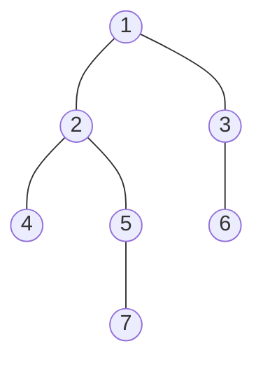
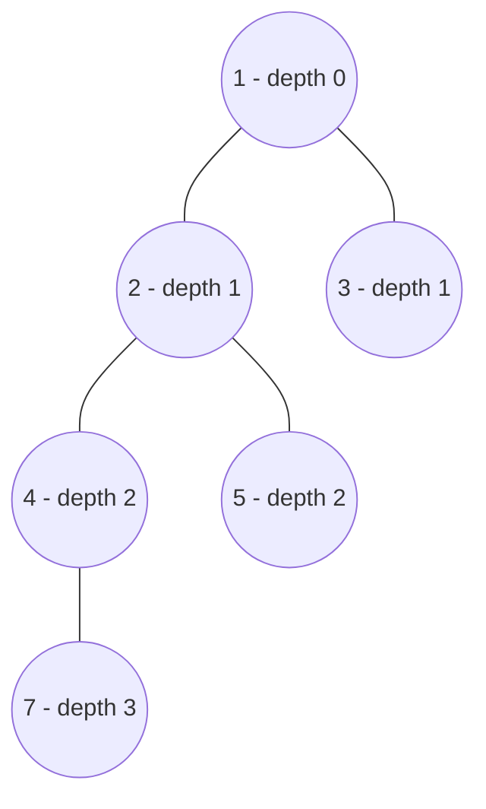
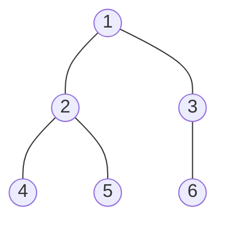

# Bài 31: LCA & Binary Lifting — Tổ tiên chung gần nhất

> **Tác giả:** Hà Trí Kiên<br>
> **Nội dung tham khảo từ:** CP-Algorithms, VNOI Wiki

---

## Bản chất vấn đề

### Bài toán

Cho cây $N$ đỉnh. Có $Q$ câu hỏi: **tổ tiên chung gần nhất (LCA)** của hai đỉnh $u$ và $v$ là đỉnh nào?

**LCA (Lowest Common Ancestor)** của $u$ và $v$ là nút vừa là tổ tiên của $u$, vừa là tổ tiên của $v$, và có khoảng cách đến gốc lớn nhất (tức là gần $u, v$ nhất).



Các ví dụ trên cây mẫu:

| Cặp đỉnh | LCA | Giải thích |
|-----------|-----|------------|
| $(4, 7)$ | $2$ | Cả 4 và 7 đều có tổ tiên là 2, nhưng 2 gần hơn 1 |
| $(4, 5)$ | $2$ | Tổ tiên chung gần nhất |
| $(7, 6)$ | $1$ | Tổ tiên chung duy nhất là gốc |
| $(4, 4)$ | $4$ | Chính nó |

### Tại sao LCA quan trọng?

LCA xuất hiện ở rất nhiều bài toán cây:

- **Khoảng cách giữa 2 đỉnh:** $\text{dist}(u, v) = \text{depth}[u] + \text{depth}[v] - 2 \cdot \text{depth}[\text{LCA}(u, v)]$
- **Đường đi giữa 2 đỉnh** trên cây
- **Bài toán cộng/trên đường đi** trong cây (kết hợp với Segment Tree)

### Phương pháp thô: $O(N)$ mỗi truy vấn

Ý tưởng đơn giản: đưa $u$ và $v$ lên cùng độ sâu, sau đó nhảy đồng thời lên cho đến khi gặp nhau. Mỗi bước tốn $O(1)$, tối đa $N$ bước.

Với $Q = 10^5$ truy vấn, tổng độ phức tạp là $O(NQ) = 10^{10}$ — quá chậm, cần phương pháp tốt hơn.

---

## Tư duy cốt lõi

### Binary Lifting: nhảy theo lũy thừa 2

Thay vì nhảy từng bước lên cha, ta nhảy $2^k$ bước một lúc. Đây là kỹ thuật **binary lifting** (nhảy nhị phân).

**Bảng tiền xử lý:** Tính trước $\text{up}[v][k]$ = đỉnh cách $v$ đúng $2^k$ bước lên trên.

| Bước nhảy | Ý nghĩa | Ví dụ |
|-----------|----------|-------|
| $\text{up}[v][0]$ | Cha trực tiếp của $v$ | Nhảy $2^0 = 1$ bước |
| $\text{up}[v][1]$ | Ông của $v$ | Nhảy $2^1 = 2$ bước |
| $\text{up}[v][2]$ | Nhảy $4$ bước lên trên | Nhảy $2^2 = 4$ bước |
| $\text{up}[v][k]$ | Nhảy $2^k$ bước lên trên | Tổng quát |

**Công thức truy hồi:**

$$\text{up}[v][k] = \text{up}[\text{up}[v][k-1]][k-1]$$

Tức là: nhảy $2^k$ bước = nhảy $2^{k-1}$ bước hai lần liên tiếp.

### Minh họa bảng $\text{up}$



| $v$ | $\text{up}[v][0]$ | $\text{up}[v][1]$ | $\text{up}[v][2]$ |
|-----|-------------------|-------------------|-------------------|
| 7 | 4 | 2 | 1 |
| 4 | 2 | 1 | 0 (null) |
| 2 | 1 | 0 | 0 |
| 5 | 2 | 1 | 0 |
| 3 | 1 | 0 | 0 |
| 1 | 0 | 0 | 0 |

Ví dụ: $\text{up}[7][2] = \text{up}[\text{up}[7][1]][1] = \text{up}[2][1] = 1$. Từ đỉnh 7, nhảy $4$ bước lên trên = đỉnh 1.

### Tìm LCA bằng Binary Lifting

Thuật toán gồm 2 giai đoạn:

**Giai đoạn 1 — Đưa 2 đỉnh lên cùng độ sâu:**

Giả sử $\text{depth}[u] > \text{depth}[v]$. Cần đưa $u$ lên $\text{depth}[u] - \text{depth}[v]$ bước. Biểu diễn hiệu số này dưới dạng nhị phân, rồi nhảy theo từng bit.

**Giai đoạn 2 — Tìm LCA khi đã cùng độ sâu:**

Duyệt $k$ từ lớn xuống nhỏ. Nếu $\text{up}[u][k] \neq \text{up}[v][k]$, nhảy cả hai lên $2^k$ bước. Sau vòng lặp, $u$ và $v$ là con trực tiếp của LCA, nên $\text{up}[u][0]$ chính là LCA.

---

## Phân tích tính đúng đắn

### Tại sao giai đoạn 2 hoạt động?

Giả sử $\text{LCA}(u, v)$ nằm ở độ sâu $d$. Sau giai đoạn 1, cả $u$ và $v$ đều ở cùng độ sâu.

Khi duyệt $k$ từ $\text{LOG} - 1$ về $0$:

- Nếu $\text{up}[u][k] = \text{up}[v][k]$: nhảy $2^k$ bước sẽ **vượt qua** LCA hoặc đến đúng LCA. Ta **không nhảy** — giữ nguyên để tìm vị trí chính xác hơn.
- Nếu $\text{up}[u][k] \neq \text{up}[v][k]$: nhảy $2^k$ bước vẫn chưa gặp nhau. Ta **nhảy** — tiến gần LCA hơn mà không vượt qua.

Sau vòng lặp, $u$ và $v$ nằm ngay bên dưới LCA (là con trực tiếp). Do đó $\text{up}[u][0] = \text{LCA}(u, v)$.

### Tại sao nhảy từ bit cao xuống thấp?

Đây là kỹ thuật **tham lam trên bit**: mỗi bước ta quyết định nhảy hay không nhảy $2^k$ bước, đảm bảo tổng các bước nhảy bằng đúng khoảng cách cần di chuyển. Tương tự cách biểu diễn một số nguyên dưới dạng tổng các lũy thừa 2.

Ví dụ: cần nhảy $5 = 101_2$ bước. Duyệt $k = 2, 1, 0$:

- $k = 2$: bit 1 được bật → nhảy $4$ bước
- $k = 1$: bit 0 → không nhảy
- $k = 0$: bit 1 được bật → nhảy $1$ bước

Tổng: $4 + 1 = 5$ bước.

### Tính đúng đắn của công thức $\text{up}[v][k]$

Chứng minh bằng quy nạp:

- **Cơ sở:** $\text{up}[v][0] = \text{cha}(v)$ — đúng theo định nghĩa.
- **Bước quy nạp:** Giả sử $\text{up}[v][k-1]$ là đỉnh cách $v$ đúng $2^{k-1}$ bước. Vậy $\text{up}[\text{up}[v][k-1]][k-1]$ là đỉnh cách $\text{up}[v][k-1]$ thêm $2^{k-1}$ bước. Tổng cộng cách $v$ đúng $2^{k-1} + 2^{k-1} = 2^k$ bước.

---

## Đánh giá độ phức tạp

| Hạng mục | Độ phức tạp | Giải thích |
|----------|-------------|------------|
| Tiền xử lý | $O(N \log N)$ | DFS qua $N$ đỉnh, mỗi đỉnh tính $\text{LOG}$ giá trị $\text{up}$ |
| Bộ nhớ | $O(N \log N)$ | Bảng $\text{up}[N][\text{LOG}]$ |
| Mỗi truy vấn LCA | $O(\text{LOG}) = O(\log N)$ | Duyệt qua $\text{LOG}$ bit 2 lần |
| Tổng $Q$ truy vấn | $O(Q \log N)$ | |

Với $N = 10^5$, $\text{LOG} \approx 17$. Mỗi truy vấn chỉ tốn khoảng 17 phép so sánh — rất nhanh.

---

## Code hoàn chỉnh

=== "C++"

    ```cpp
    #include <bits/stdc++.h>
    using namespace std;

    const int MAXN = 200005;
    const int LOG = 20;

    vector<int> adj[MAXN];
    int depth[MAXN], up[MAXN][LOG];

    void dfs(int v, int p) {
        depth[v] = depth[p] + 1;
        up[v][0] = p;
        for (int k = 1; k < LOG; k++)
            up[v][k] = up[up[v][k-1]][k-1];
        for (int u : adj[v])
            if (u != p) dfs(u, v);
    }

    int lca(int u, int v) {
        if (depth[u] < depth[v]) swap(u, v);

        int diff = depth[u] - depth[v];
        for (int k = 0; k < LOG; k++)
            if (diff & (1 << k))
                u = up[u][k];

        if (u == v) return u;

        for (int k = LOG - 1; k >= 0; k--)
            if (up[u][k] != up[v][k]) {
                u = up[u][k];
                v = up[v][k];
            }
        return up[u][0];
    }

    int main() {
        ios::sync_with_stdio(false); cin.tie(0);
        int n, q;
        cin >> n >> q;

        for (int i = 2; i <= n; i++) {
            int p; cin >> p;
            adj[p].push_back(i);
            adj[i].push_back(p);
        }

        depth[0] = -1;
        dfs(1, 0);

        while (q--) {
            int u, v; cin >> u >> v;
            cout << lca(u, v) << "\n";
        }
    }
    ```

=== "Python"

    ```python
    import sys
    sys.setrecursionlimit(300000)
    input = sys.stdin.readline

    class LCA:
        def __init__(self, n, root, adj):
            self.LOG = n.bit_length()
            self.adj = adj
            self.depth = [0] * (n + 1)
            self.up = [[0] * self.LOG for _ in range(n + 1)]
            self._dfs(root, 0)

        def _dfs(self, v, p):
            self.depth[v] = self.depth[p] + 1
            self.up[v][0] = p
            for k in range(1, self.LOG):
                self.up[v][k] = self.up[self.up[v][k-1]][k-1]
            for u in self.adj[v]:
                if u != p:
                    self._dfs(u, v)

        def get_lca(self, u, v):
            if self.depth[u] < self.depth[v]:
                u, v = v, u

            diff = self.depth[u] - self.depth[v]
            for k in range(self.LOG):
                if diff & (1 << k):
                    u = self.up[u][k]

            if u == v:
                return u

            for k in range(self.LOG - 1, -1, -1):
                if self.up[u][k] != self.up[v][k]:
                    u = self.up[u][k]
                    v = self.up[v][k]
            return self.up[u][0]

        def distance(self, u, v):
            l = self.get_lca(u, v)
            return self.depth[u] + self.depth[v] - 2 * self.depth[l]
    ```

---

## Ứng dụng: Khoảng cách trên cây

Khoảng cách giữa hai đỉnh $u, v$ trên cây được tính bằng công thức:

$$\text{dist}(u, v) = \text{depth}[u] + \text{depth}[v] - 2 \cdot \text{depth}[\text{LCA}(u, v)]$$

Ví dụ với cây mẫu:



Tính $\text{dist}(4, 6)$:

| Đại lượng | Giá trị |
|-----------|---------|
| $\text{LCA}(4, 6)$ | $1$ |
| $\text{depth}[4]$ | $2$ |
| $\text{depth}[6]$ | $2$ |
| $\text{depth}[1]$ | $0$ |
| $\text{dist}(4, 6)$ | $2 + 2 - 2 \times 0 = 4$ |

Đường đi: $4 \to 2 \to 1 \to 3 \to 6$ — đúng 4 cạnh.

---

## Lưu ý và cạm bẫy

### $\text{LOG}$ phải đủ lớn

Nếu $\text{LOG}$ quá nhỏ, thuật toán không nhảy đủ bước và trả về kết quả sai.

| Giá trị $\text{LOG}$ | Nhảy tối đa | Thích hợp cho $N$ tối đa |
|----------------------|-------------|--------------------------|
| $10$ | $2^{10} = 1024$ | $10^3$ |
| $17$ | $2^{17} = 131072$ | $10^5$ |
| $20$ | $2^{20} \approx 10^6$ | $10^6$ |
| $25$ | $2^{25} \approx 3.3 \times 10^7$ | $10^7$ |

Quy tắc: chọn $\text{LOG} \geq \lceil \log_2 N \rceil$.

### $\text{up}[\text{root}][k]$ phải bằng 0

Gốc có $\text{up}[\text{root}][0] = 0$ (không có cha). Đảm bảo đỉnh 0 không tồn tại trong cây để tránh lỗi truy cập mảng.

### Khởi tạo $\text{depth}[0] = -1$

Để $\text{depth}[\text{root}] = \text{depth}[0] + 1 = 0$. Nếu quên dòng này, tất cả giá trị depth sẽ bị lệch 1.

### Xử lý cây có gốc khác 1

Nếu gốc không phải đỉnh 1, chỉ cần gọi `dfs(root, 0)` thay vì `dfs(1, 0)`.

---

## Bài tập luyện tập

| Bài | Nền tảng | Độ khó | Chủ đề |
|-----|----------|--------|--------|
| [CSES - Company Queries I](https://cses.fi/problemset/task/1687) | CSES | ⭐⭐ | Binary Lifting |
| [CSES - Company Queries II](https://cses.fi/problemset/task/1688) | CSES | ⭐⭐ | LCA |
| [CSES - Distance Queries](https://cses.fi/problemset/task/1135) | CSES | ⭐⭐ | Khoảng cách cây |
| [CSES - Path Queries](https://cses.fi/problemset/task/1138) | CSES | ⭐⭐⭐ | Cộng trên đường đi |
| [SPOJ - LCA](https://www.spoj.com/problems/LCA/) | SPOJ | ⭐⭐ | LCA cơ bản |
| [LeetCode - Lowest Common Ancestor of a Binary Tree](https://leetcode.com/problems/lowest-common-ancestor-of-a-binary-tree/) | LC | ⭐⭐ | LCA cơ bản |
| [LeetCode - Kth Ancestor of a Tree Node](https://leetcode.com/problems/kth-ancestor-of-a-tree-node/) | LC | ⭐⭐⭐ | Binary Lifting |
| [CSES - Planets Queries I](https://cses.fi/problemset/task/1750) | CSES | ⭐⭐ | Binary Lifting trên đồ thị hàm |

---

## Tài liệu tham khảo

- [CP-Algorithms - LCA with Binary Lifting](https://cp-algorithms.com/graph/lca_binary_lifting.html)
- [CP-Algorithms - LCA](https://cp-algorithms.com/graph/lca.html)
- [VNOI Wiki - LCA Binary Lifting](https://wiki.vnoi.info/algo/data-structures/lca-binlift)
- [YouTube - LCA (takeuforward)](https://www.youtube.com/watch?v=qPxS_rY0OJw)

**Bài tiếp theo:** [Greedy →](greedy.md)
