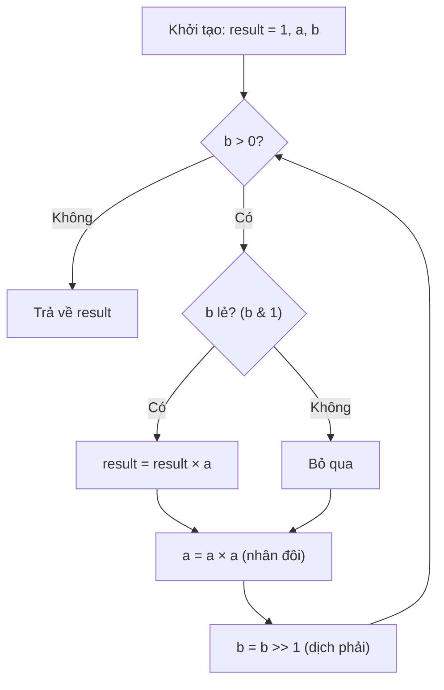
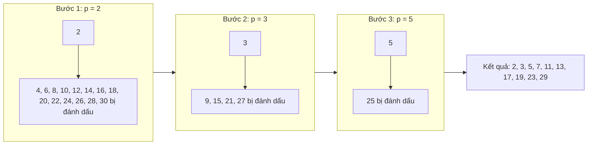

# Bài 11: Lũy Thừa Nhị Phân & Sàng Nguyên Tố

> **Tác giả:** Hà Trí Kiên<br>
> **Nội dung tham khảo từ:** VNOI Wiki - Lũy thừa nhị phân, Sàng nguyên tố

---

## Bản chất vấn đề

### Lũy thừa nhị phân (Binary Exponentiation)

Cho số nguyên $a$ và số mũ $b$ (có thể lên đến $10^{18}$). Cần tính $a^b$ hoặc $a^b \bmod p$.

**Cách tiếp cận naïve:** Nhân $a$ với chính nó $b$ lần → $O(b)$ phép nhân. Với $b = 10^{18}$, thuật toán chạy không kịp.

**Cách tiếp cận tối ưu:** Tận dụng biểu diễn nhị phân của $b$ để tính trong $O(\log b)$ phép nhân. Đây chính là **Binary Exponentiation**.

### Sàng nguyên tố Eratosthenes

Cho số nguyên $N$ (có thể đến $10^7$ hoặc lớn hơn). Cần liệt kê tất cả số nguyên tố từ $2$ đến $N$, hoặc tiền xử lý để kiểm tra nguyên tố / phân tích thừa số cho nhiều truy vấn.

**Cách tiếp cận naïve:** Kiểm tra từng số $i$ có phải nguyên tố không bằng cách thử chia → $O(N\sqrt{N})$.

**Cách tiếp cận tối ưu:** Dùng **Sàng Eratosthenes** — đánh dấu bội số của mỗi nguyên tố → $O(N \log \log N)$.

---

## Tư duy cốt lõi

### 1. Binary Exponentiation

#### Ý tưởng cốt lõi

Thay vì tính $a^b$ bằng $b$ phép nhân, ta khai thác quy tắc:

$$
a^b = \begin{cases} (a^{b/2})^2 & \text{nếu } b \text{ chẵn} \\ (a^{\lfloor b/2 \rfloor})^2 \times a & \text{nếu } b \text{ lẻ} \end{cases}
$$

Mỗi bước **chia đôi** số mũ → chỉ cần $O(\log b)$ bước.

#### Kết nối với biểu diễn nhị phân

Số mũ $b$ có thể viết dưới dạng nhị phân. Mỗi bit bằng $1$ tương ứng với một lũy thừa của $a$ cần nhân vào kết quả:

| Bit vị trí | Giá trị | Lũy thừa tương ứng |
|:---:|:---:|:---:|
| 0 | $2^0 = 1$ | $a^1$ |
| 1 | $2^1 = 2$ | $a^2$ |
| 2 | $2^2 = 4$ | $a^4$ |
| 3 | $2^3 = 8$ | $a^8$ |
| $k$ | $2^k$ | $a^{2^k}$ |

Ví dụ: $b = 13 = 1101_2 = 2^3 + 2^2 + 2^0$ → $a^{13} = a^8 \cdot a^4 \cdot a^1$.

#### Minh họa từng bước: Tính $3^{10}$

$10 = 1010_2$, tức $2^3 + 2^1 = 8 + 2$.

| Bước | $a$ (lũy thừa tích lũy) | $b$ (số mũ còn lại) | Bit hiện tại | $result$ | Hành động |
|:---:|:---:|:---:|:---:|:---:|:---|
| 1 | $3^1 = 3$ | $10$ | $0$ | $1$ | $b$ chẵn → chỉ nhân đôi $a$ |
| 2 | $3^2 = 9$ | $5$ | $1$ | $1 \times 9 = 9$ | $b$ lẻ → nhân $result$, rồi nhân đôi $a$ |
| 3 | $3^4 = 81$ | $2$ | $0$ | $9$ | $b$ chẵn → chỉ nhân đôi $a$ |
| 4 | $3^8 = 6561$ | $1$ | $1$ | $9 \times 6561 = 59049$ | $b$ lẻ → nhân $result$. $b = 0$, dừng! |

Kết quả: $3^{10} = 59049$.

#### Quy trình thuật toán



#### Các trường hợp biên

| Trường hợp | Kết quả | Ghi chú |
|:---|:---:|:---|
| $a^0$ | $1$ | Bất kỳ số nào mũ 0 đều bằng 1 |
| $a^1$ | $a$ | Chỉ 1 bước |
| $0^b$ ($b > 0$) | $0$ | Luôn bằng 0 |
| $1^b$ | $1$ | Luôn bằng 1 |
| $a^b \bmod 1$ | $0$ | Modulo 1 luôn bằng 0 |

#### Code

=== "C++"

    ```cpp
    long long power(long long a, long long b) {
        long long result = 1;
        while (b > 0) {
            if (b & 1)
                result *= a;
            a *= a;
            b >>= 1;
        }
        return result;
    }

    long long powerMod(long long a, long long b, long long MOD) {
        long long result = 1;
        a %= MOD;
        while (b > 0) {
            if (b & 1)
                result = (__int128)result * a % MOD;
            a = (__int128)a * a % MOD;
            b >>= 1;
        }
        return result;
    }
    ```

=== "Python"

    ```python
    # Python có sẵn pow(a, b, mod) — rất nhanh, nên dùng trong thi đấu
    result = pow(2, 100, 10**9 + 7)

    # Tự cài đặt để hiểu thuật toán
    def power_mod(a, b, mod):
        result = 1
        a %= mod
        while b > 0:
            if b & 1:
                result = result * a % mod
            a = a * a % mod
            b >>= 1
        return result
    ```

#### Phân tích tính đúng đắn

**Bất biến (Invariant):** Sau mỗi vòng lặp, luôn đúng $result \times a^b = a^{b_{\text{ban đầu}}}$, trong đó $b$ là giá trị hiện tại của số mũ.

- **Khởi tạo:** $result = 1$, $b = b_0$ → $1 \times a^{b_0} = a^{b_0}$. Đúng.
- **Mỗi bước:**
    - Nếu $b$ lẻ: $result' = result \times a$, $a' = a^2$, $b' = \lfloor b/2 \rfloor$. Khi đó $result' \times (a')^{b'} = result \times a \times (a^2)^{\lfloor b/2 \rfloor} = result \times a^{1 + 2\lfloor b/2 \rfloor} = result \times a^b$. Đúng.
    - Nếu $b$ chẵn: $result' = result$, $a' = a^2$, $b' = b/2$. Khi đó $result' \times (a')^{b'} = result \times (a^2)^{b/2} = result \times a^b$. Đúng.
- **Kết thúc:** $b = 0$ → $result \times a^0 = result = a^{b_0}$. Đúng.

#### Đánh giá độ phức tạp

| | Giá trị |
|:---|:---|
| **Thời gian** | $O(\log b)$ — mỗi bước chia đôi $b$ |
| **Bộ nhớ** | $O(1)$ — chỉ dùng vài biến |
| **Số phép nhân** | $\lfloor \log_2 b \rfloor$ phép nhân đôi $a$ + tối đa $\lfloor \log_2 b \rfloor$ phép nhân vào $result$ |

Bảng tra cứu nhanh:

| $b$ | Số bước |
|:---:|:---:|
| $10$ | $4$ |
| $10^6$ | $20$ |
| $10^9$ | $30$ |
| $10^{18}$ | $60$ |

---

### 2. Ứng dụng: Tính $\binom{n}{k} \bmod p$

Để tính $\binom{n}{k} = \frac{n!}{k!(n-k)!} \pmod{p}$ với $p$ là số nguyên tố (thường $10^9 + 7$), ta cần **nghịch đảo modulo**. Dùng định lý Fermat nhỏ: $a^{-1} \equiv a^{p-2} \pmod{p}$.

#### Ý tưởng

1. Precompute $fact[i] = i! \bmod p$ và $inv\_fact[i] = (i!)^{-1} \bmod p$
2. $inv\_fact[i]$ có thể tính từ $inv\_fact[i+1]$: $(i!)^{-1} = ((i+1)!)^{-1} \times (i+1)$
3. $\binom{n}{k} = fact[n] \times inv\_fact[k] \times inv\_fact[n-k] \bmod p$

#### Code

=== "C++"

    ```cpp
    const int MOD = 1e9 + 7;
    const int MAXN = 200001;
    long long fact[MAXN], inv_fact[MAXN];

    void precompute() {
        fact[0] = 1;
        for (int i = 1; i < MAXN; i++)
            fact[i] = fact[i-1] * i % MOD;
        inv_fact[MAXN-1] = powerMod(fact[MAXN-1], MOD - 2, MOD);
        for (int i = MAXN - 2; i >= 0; i--)
            inv_fact[i] = inv_fact[i+1] * (i+1) % MOD;
    }

    long long nCk(int n, int k) {
        if (k < 0 || k > n) return 0;
        return fact[n] % MOD * inv_fact[k] % MOD * inv_fact[n-k] % MOD;
    }
    ```

=== "Python"

    ```python
    MOD = 10**9 + 7
    MAXN = 200001
    fact = [1] * MAXN
    for i in range(1, MAXN):
        fact[i] = fact[i-1] * i % MOD

    inv_fact = [1] * MAXN
    inv_fact[MAXN-1] = pow(fact[MAXN-1], MOD - 2, MOD)
    for i in range(MAXN - 2, -1, -1):
        inv_fact[i] = inv_fact[i+1] * (i+1) % MOD

    def nCk(n, k):
        if k < 0 or k > n: return 0
        return fact[n] * inv_fact[k] % MOD * inv_fact[n-k] % MOD
    ```

---

### 3. Ứng dụng: Ma trận lũy thừa (Matrix Exponentiation)

Nhiều bài toán dãy số có dạng truy hồi $f(n) = a \cdot f(n-1) + b \cdot f(n-2)$, cần tính $f(n)$ với $n$ rất lớn ($10^{18}$). Dùng ma trận lũy thừa:

$$
\begin{pmatrix} f(n) \\ f(n-1) \end{pmatrix} = \begin{pmatrix} a & b \\ 1 & 0 \end{pmatrix}^{n-1} \times \begin{pmatrix} f(1) \\ f(0) \end{pmatrix}
$$

Tính ma trận mũ trong $O(k^3 \log n)$ với $k$ là kích thước ma trận.

#### Code: Fibonacci trong $O(\log n)$

=== "C++"

    ```cpp
    const int MOD = 1e9 + 7;

    struct Matrix {
        long long a[2][2];
        Matrix() { a[0][0] = a[1][1] = 0; a[0][1] = a[1][0] = 0; }
    };

    Matrix multiply(Matrix A, Matrix B) {
        Matrix C;
        for (int i = 0; i < 2; i++)
            for (int j = 0; j < 2; j++)
                for (int k = 0; k < 2; k++)
                    C.a[i][j] = (C.a[i][j] + A.a[i][k] * B.a[k][j]) % MOD;
        return C;
    }

    Matrix matrixPow(Matrix base, long long exp) {
        Matrix result;
        result.a[0][0] = result.a[1][1] = 1;
        while (exp > 0) {
            if (exp & 1) result = multiply(result, base);
            base = multiply(base, base);
            exp >>= 1;
        }
        return result;
    }

    long long fibonacci(long long n) {
        if (n <= 1) return n;
        Matrix base;
        base.a[0][0] = 1; base.a[0][1] = 1;
        base.a[1][0] = 1; base.a[1][1] = 0;
        Matrix result = matrixPow(base, n - 1);
        return result.a[0][0];
    }
    ```

=== "Python"

    ```python
    MOD = 10**9 + 7

    def mat_mult(A, B):
        return [
            [(A[0][0]*B[0][0] + A[0][1]*B[1][0]) % MOD,
             (A[0][0]*B[0][1] + A[0][1]*B[1][1]) % MOD],
            [(A[1][0]*B[0][0] + A[1][1]*B[1][0]) % MOD,
             (A[1][0]*B[0][1] + A[1][1]*B[1][1]) % MOD]
        ]

    def mat_pow(base, exp):
        result = [[1, 0], [0, 1]]
        while exp > 0:
            if exp & 1:
                result = mat_mult(result, base)
            base = mat_mult(base, base)
            exp >>= 1
        return result

    def fibonacci(n):
        if n <= 1: return n
        base = [[1, 1], [1, 0]]
        return mat_pow(base, n - 1)[0][0]
    ```

---

### 4. Sàng Eratosthenes

#### Bản chất vấn đề

Cho $N$, cần đánh dấu tất cả số nguyên tố từ $2$ đến $N$.

#### Tư duy cốt lõi

Bắt đầu từ số nguyên tố nhỏ nhất là $2$. Đánh dấu tất cả bội số của $2$ (trừ chính $2$). Chuyển sang số lớn hơn chưa bị đánh dấu — đó là $3$ — đánh dấu bội số của $3$. Tiếp tục cho đến $\sqrt{N}$.

**Tại sao chỉ cần duyệt đến $\sqrt{N}$?** Nếu $N$ có ước nguyên tố $p > \sqrt{N}$, thì $N/p < \sqrt{N}$, nghĩa là $N$ đã bị đánh dấu bởi ước nhỏ hơn.

**Tại sao bắt đầu đánh dấu từ $i^2$?** Với số nguyên tố $i$, các bội $2i, 3i, \ldots, (i-1) \cdot i$ đã bị đánh dấu bởi các số nguyên tố nhỏ hơn $i$. Bội đầu tiên chưa bị đánh dấu là $i \times i = i^2$.

#### Minh họa sàng với $N = 30$



Kết quả sau khi sàng: các số **không bị đánh dấu** là số nguyên tố: $\{2, 3, 5, 7, 11, 13, 17, 19, 23, 29\}$.

#### Code

=== "C++"

    ```cpp
    vector<bool> sieve(int n) {
        vector<bool> isPrime(n + 1, true);
        isPrime[0] = isPrime[1] = false;
        for (int i = 2; (long long)i * i <= n; i++) {
            if (isPrime[i]) {
                for (int j = i * i; j <= n; j += i)
                    isPrime[j] = false;
            }
        }
        return isPrime;
    }

    bool isPrime(int n) {
        if (n < 2) return false;
        if (n == 2) return true;
        if (n % 2 == 0) return false;
        for (int i = 3; (long long)i * i <= n; i += 2)
            if (n % i == 0) return false;
        return true;
    }

    vector<int> getPrimes(const vector<bool>& isPrime) {
        vector<int> primes;
        for (int i = 2; i < (int)isPrime.size(); i++)
            if (isPrime[i]) primes.push_back(i);
        return primes;
    }
    ```

=== "Python"

    ```python
    def sieve(n):
        is_prime = [True] * (n + 1)
        is_prime[0] = is_prime[1] = False
        for i in range(2, int(n**0.5) + 1):
            if is_prime[i]:
                for j in range(i*i, n+1, i):
                    is_prime[j] = False
        return is_prime

    def is_prime(n):
        if n < 2: return False
        if n == 2: return True
        if n % 2 == 0: return False
        for i in range(3, int(n**0.5) + 1, 2):
            if n % i == 0: return False
        return True

    def get_primes(is_prime):
        return [i for i, p in enumerate(is_prime) if p]
    ```

#### Phân tích tính đúng đắn

**Bất biến:** Sau khi xử lý xong số nguyên tố $p$, tất cả bội của $p$ trong $[2, N]$ đã bị đánh dấu là hợp số.

- **Khởi tạo:** Tất cả số từ $2$ đến $N$ được giả sử là nguyên tố (`true`).
- **Mỗi bước $i$:** Nếu $i$ chưa bị đánh dấu (tức $i$ là nguyên tố), tất cả bội $j = i^2, i^2 + i, i^2 + 2i, \ldots$ được đánh dấu là hợp số. Các bội $2i, 3i, \ldots, (i-1)i$ đã bị đánh dấu trước đó bởi các nguyên tố nhỏ hơn.
- **Dừng tại $\sqrt{N}$:** Mọi hợp số $n \le N$ đều có ước nguyên tố $\le \sqrt{N}$, nên đã bị đánh dấu.
- **Kết luận:** Mọi số còn lại chưa bị đánh dấu đều là nguyên tố.

#### Đánh giá độ phức tạp

| | Giá trị |
|:---|:---|
| **Thời gian** | $O(N \log \log N)$ |
| **Bộ nhớ** | $O(N)$ |

Chi tiết: Với mỗi nguyên tố $p$, ta đánh dấu $\approx N/p$ bội số. Tổng:

$$\frac{N}{2} + \frac{N}{3} + \frac{N}{5} + \frac{N}{7} + \cdots = N \sum_{p \le N} \frac{1}{p} \approx N \ln \ln N$$

Bảng giới hạn thực tế:

| $N$ | Bộ nhớ (`bool`) | Thời gian | Ghi chú |
|:---:|:---:|:---:|:---|
| $10^6$ | $\approx 1$ MB | $< 0.01$s | Rất OK |
| $10^7$ | $\approx 10$ MB | $\approx 0.05$s | OK |
| $10^8$ | $\approx 100$ MB | $\approx 0.5$s | Có thể thiếu bộ nhớ |
| $10^9$ | $\approx 1$ GB | $\approx 5$s | Phải dùng sàng phân đoạn |

---

### 5. Sàng SPF (Smallest Prime Factor)

#### Bản chất vấn đề

Precompute **thừa số nguyên tố nhỏ nhất** (Smallest Prime Factor) cho mọi số từ $1$ đến $N$. Sau đó, phân tích thừa số nguyên tố của bất kỳ số nào trong $O(\log N)$.

#### Tư duy cốt lõi

Khởi đầu: $spf[i] = i$ cho mọi $i$. Duyệt $i$ từ $2$ đến $\sqrt{N}$: nếu $spf[i] = i$ (tức $i$ là nguyên tố), đánh dấu $spf[j] = i$ cho mọi bội $j$ của $i$ mà chưa có SPF nhỏ hơn.

Sau khi sàng, để phân tích thừa số của $n$: lặp lại lấy $spf[n]$, chia $n$ cho $spf[n]$ cho đến khi $n = 1$.

#### Code

=== "C++"

    ```cpp
    vector<int> spf(MAXN);
    void sieve_spf() {
        for (int i = 1; i < MAXN; i++) spf[i] = i;
        for (int i = 2; (long long)i * i < MAXN; i++) {
            if (spf[i] == i) {
                for (int j = i * i; j < MAXN; j += i)
                    if (spf[j] == j) spf[j] = i;
            }
        }
    }

    vector<int> get_factors(int n) {
        vector<int> res;
        while (n > 1) {
            res.push_back(spf[n]);
            n /= spf[n];
        }
        return res;
    }

    vector<int> get_prime_factors(int n) {
        vector<int> res;
        while (n > 1) {
            int p = spf[n];
            res.push_back(p);
            while (n % p == 0) n /= p;
        }
        return res;
    }
    ```

=== "Python"

    ```python
    MAXN = 10**7 + 1
    spf = list(range(MAXN))

    def sieve_spf():
        for i in range(2, int(MAXN**0.5) + 1):
            if spf[i] == i:
                for j in range(i*i, MAXN, i):
                    if spf[j] == j:
                        spf[j] = i

    def get_factors(n):
        res = []
        while n > 1:
            res.append(spf[n])
            n //= spf[n]
        return res

    def get_prime_factors(n):
        res = []
        while n > 1:
            p = spf[n]
            res.append(p)
            while n % p == 0:
                n //= p
        return res
    ```

#### Phân tích tính đúng đắn

**Bất biến:** Sau khi sàng xong, $spf[n]$ luôn là ước nguyên tố nhỏ nhất của $n$.

- Với mỗi nguyên tố $i$, ta duyệt bội $j = i^2, i^2 + i, \ldots$. Nếu $spf[j] = j$ (chưa được gán), gán $spf[j] = i$.
- Vì ta duyệt $i$ tăng dần, giá trị gán đầu tiên cho $spf[j]$ chính là nguyên tố nhỏ nhất chia hết $j$.
- Khi phân tích: mỗi bước lấy $spf[n]$ rồi chia $n$ cho $spf[n]$, đảm bảo lấy đúng thừa số nguyên tố nhỏ nhất còn lại.

#### Đánh giá độ phức tạp

| | Giá trị |
|:---|:---|
| **Precompute** | $O(N \log \log N)$ — tương đương sàng Eratosthenes |
| **Mỗi truy vấn phân tích** | $O(\log N)$ — mỗi bước chia ít nhất một lần |
| **Bộ nhớ** | $O(N)$ |

---

### 6. Sàng đếm ước

Dùng kỹ thuật tương tự sàng Eratosthenes để đếm số ước của mọi số từ $1$ đến $N$.

#### Code

=== "C++"

    ```cpp
    vector<int> countDivisors(int n) {
        vector<int> d(n + 1, 0);
        for (int i = 1; i <= n; i++)
            for (int j = i; j <= n; j += i)
                d[j]++;
        return d;
    }
    ```

=== "Python"

    ```python
    def count_divisors(n):
        d = [0] * (n + 1)
        for i in range(1, n + 1):
            for j in range(i, n + 1, i):
                d[j] += 1
        return d
    ```

#### Đánh giá độ phức tạp

| | Giá trị |
|:---|:---|
| **Thời gian** | $O(N \log N)$ — tổng harmonic series: $\sum_{i=1}^{N} \frac{N}{i} = N \cdot H_N \approx N \ln N$ |
| **Bộ nhớ** | $O(N)$ |

---

### 7. Sàng phân đoạn (Segmented Sieve)

Khi $N$ rất lớn ($10^9$ trở lên), sàng Eratosthenes thường tốn quá nhiều bộ nhớ. Sàng phân đoạn chia khoảng $[L, R]$ thành các đoạn nhỏ, sàng từng đoạn.

#### Tư duy cốt lõi

1. Sàng nhỏ: tìm tất cả nguyên tố $\le \sqrt{R}$ bằng Eratosthenes thường
2. Với mỗi nguyên tố $p$ tìm được, đánh dấu bội của $p$ trong khoảng $[L, R]$
3. Các số chưa bị đánh dấu trong $[L, R]$ là nguyên tố

#### Code

=== "C++"

    ```cpp
    vector<bool> segmentedSieve(long long L, long long R) {
        long long lim = sqrt(R);
        vector<bool> small(lim + 1, true);
        vector<long long> primes;
        for (long long i = 2; i <= lim; i++) {
            if (small[i]) {
                primes.push_back(i);
                for (long long j = i * i; j <= lim; j += i)
                    small[j] = false;
            }
        }

        vector<bool> isPrime(R - L + 1, true);
        for (long long p : primes) {
            long long start = max(p * p, ((L + p - 1) / p) * p);
            for (long long j = start; j <= R; j += p)
                isPrime[j - L] = false;
        }

        if (L == 1) isPrime[0] = false;
        return isPrime;
    }
    ```

=== "Python"

    ```python
    import math

    def segmented_sieve(L, R):
        lim = int(math.isqrt(R))
        small = [True] * (lim + 1)
        primes = []
        for i in range(2, lim + 1):
            if small[i]:
                primes.append(i)
                for j in range(i*i, lim + 1, i):
                    small[j] = False

        is_prime = [True] * (R - L + 1)
        for p in primes:
            start = max(p * p, ((L + p - 1) // p) * p)
            for j in range(start, R + 1, p):
                is_prime[j - L] = False

        if L == 1:
            is_prime[0] = False
        return is_prime
    ```

#### Đánh giá độ phức tạp

| | Giá trị |
|:---|:---|
| **Thời gian** | $O((R - L + 1) \log \log R + \sqrt{R} \log \log \sqrt{R})$ |
| **Bộ nhớ** | $O(\sqrt{R} + (R - L + 1))$ |

---

## Bẫy thường gặp & Mẹo thi đấu

### Bẫy 1: Tràn số khi tính lũy thừa

Khi $\text{MOD} \approx 10^9$, phép nhân $a \times a$ có thể vượt quá `long long` (tối đa $\approx 9.2 \times 10^{18}$).

=== "C++"

    ```cpp
    // SAI: a*a có thể tràn long long
    result = result * a % MOD;

    // ĐÚNG: Ép kiểu __int128 (GCC/Clang)
    result = (__int128)result * a % MOD;

    // ĐÚNG: Dùng phép nhân modular an toàn
    long long safeMul(long long a, long long b, long long MOD) {
        long long result = 0;
        a %= MOD;
        while (b > 0) {
            if (b & 1) result = (result + a) % MOD;
            a = (a + a) % MOD;
            b >>= 1;
        }
        return result;
    }
    ```

=== "Python"

    ```python
    # Python tự động dùng bigint, không tràn số
    # Nhưng vẫn cần modulo để giữ số nhỏ và tăng tốc
    result = result * a % MOD
    ```

### Bẫy 2: Quên modulo ở mỗi bước

Chỉ modulo ở kết quả cuối sẽ gây tràn số ngay. Phải modulo sau **mỗi** phép nhân:

=== "C++"

    ```cpp
    // SAI: Chỉ modulo ở kết quả cuối → tràn số ngay
    result = result * a * a * a;
    result %= MOD;

    // ĐÚNG: Modulo sau MỖI phép nhân
    result = result * a % MOD;
    result = result * a % MOD;
    ```

=== "Python"

    ```python
    # SAI
    result = result * a * a * a
    result %= mod

    # ĐÚNG
    result = result * a % mod
    result = result * a % mod
    ```

### Bẫy 3: $i \times i$ tràn `int`

=== "C++"

    ```cpp
    // SAI: i * i tràn int nếu i > 46340
    for (int i = 2; i * i <= n; i++)

    // ĐÚNG: Ép kiểu long long
    for (long long i = 2; i * i <= n; i++)
    // Hoặc:
    for (int i = 2; i <= (int)sqrt(n); i++)
    ```

### Bẫy 4: SPF quên khởi đầu đúng

=== "C++"

    ```cpp
    // SAI: Không khởi đầu spf[i] = i
    vector<int> spf(MAXN, 0);  // spf[i] = 0 → sai logic!

    // ĐÚNG: Phải khởi đầu mỗi số có SPF là chính nó
    for (int i = 1; i < MAXN; i++) spf[i] = i;
    ```

### Bảng tổng hợp: Khi nào dùng gì?

| Bài toán | Dùng gì | Độ phức tạp |
|:---|:---|:---:|
| Tính $a^b \bmod \text{MOD}$ | `powerMod(a, b, MOD)` | $O(\log b)$ |
| Tính Fibonacci $F(n)$, $n = 10^{18}$ | Matrix Exponentiation | $O(8 \log n)$ |
| Kiểm tra nguyên tố $N \le 10^7$ | Sàng Eratosthenes precompute | $O(1)$ / truy vấn |
| Kiểm tra nguyên tố $N \le 10^{12}$ | Miller-Rabin (nâng cao) | $O(k \log^2 N)$ |
| Phân tích thừa số nhiều lần | Sàng SPF precompute | $O(\log N)$ / truy vấn |
| Đếm ước của $N$ | Phân tích thừa số → nhân $(a_i + 1)$ | $O(\log N)$ với SPF |
| Tính $\binom{n}{k} \bmod p$ | Precompute fact + inv_fact | $O(1)$ / truy vấn |

---

## Bài tập luyện tập

### Cơ bản — Lũy thừa nhị phân

| Bài | Nền tảng | Độ khó | Chủ đề | Ghi chú |
|:---|:---|:---:|:---|:---|
| [CSES - Exponentiation](https://cses.fi/problemset/task/1095) | CSES | ⭐⭐ | $a^b \bmod p$ | Bài khởi đầu, luyện code |
| [CSES - Exponentiation II](https://cses.fi/problemset/task/1712) | CSES | ⭐⭐⭐ | $a^{b^c} \bmod p$ | Fermat nhỏ: $a^{b^c \bmod (p-1)}$ |
| [CSES - Counting Necklaces](https://cses.fi/problemset/task/2209) | CSES | ⭐⭐⭐ | Lũy thừa mod | Ứng dụng power mod |
| [VNOJ - VPOWER](https://oj.vnoi.info/problem/vpower) | VNOJ | ⭐⭐ | Power mod | Lũy thừa nhị phân cơ bản |

### Cơ bản — Sàng nguyên tố

| Bài | Nền tảng | Độ khó | Chủ đề | Ghi chú |
|:---|:---|:---:|:---|:---|
| [CSES - Primes](https://cses.fi/problemset/task/2162) | CSES | ⭐⭐ | Liệt kê nguyên tố | Sàng Eratosthenes |
| [CSES - Counting Divisors](https://cses.fi/problemset/task/1713) | CSES | ⭐⭐ | Đếm ước | Sàng đếm ước hoặc SPF |
| [CSES - Binomial Coefficients](https://cses.fi/problemset/task/1079) | CSES | ⭐⭐ | $\binom{n}{k} \bmod p$ | Precompute fact + inv_fact |
| [SPOJ - Prime Generator](https://www.spoj.com/problems/PRIME1/) | SPOJ | ⭐⭐ | Sàng phân đoạn | In nguyên tố trong $[m, n]$ |
| [VNOJ - NTBONUS](https://oj.vnoi.info/problem/ntbonus) | VNOJ | ⭐⭐ | Sàng + đếm | Ứng dụng sàng |

### Trung bình — Kết hợp

| Bài | Nền tảng | Độ khó | Chủ đề | Ghi chú |
|:---|:---|:---:|:---|:---|
| [Codeforces - Almost Prime](https://codeforces.com/problemset/problem/26/A) | CF | ⭐⭐ | Đếm thừa số | Sàng + đếm số ước nguyên tố |
| [Codeforces - T-primes](https://codeforces.com/problemset/problem/230/B) | CF | ⭐⭐ | Kiểm tra T-prime | T-prime = bình phương nguyên tố |
| [Codeforces - Noldbach Problem](https://codeforces.com/problemset/problem/17/A) | CF | ⭐⭐ | Nguyên tố liên tiếp | Sàng + kiểm tra |
| [CSES - Common Divisors](https://cses.fi/problemset/task/1081) | CSES | ⭐⭐⭐ | GCD lớn nhất | Sàng ước hoặc sieve-style |
| [VNOJ - VOMARBLE](https://oj.vnoi.info/problem/vomarble) | VNOJ | ⭐⭐⭐ | Combinatorics | $\binom{n}{k} \bmod p$ |

### Nâng cao

| Bài | Nền tảng | Độ khó | Chủ đề | Ghi chú |
|:---|:---|:---:|:---|:---|
| [Codeforces - Christmas Trees](https://codeforces.com/problemset/problem/1401/D) | CF | ⭐⭐⭐⭐ | Sắp xếp + chia ước | Sàng thừa số + greedy |
| [CSES - Prime Multiples](https://cses.fi/problemset/task/2185) | CSES | ⭐⭐⭐⭐ | Nguyên lý bao hàm | Sàng nguyên tố + bitmask |
| [SPOJ - DIVSUM](https://www.spoj.com/problems/DIVSUM/) | SPOJ | ⭐⭐ | Tổng ước | Sàng tổng ước |
| [Codeforces - Smash the Rocks](https://codeforces.com/problemset/problem/1606/D) | CF | ⭐⭐⭐⭐ | Matrix exponentiation | Ma trận lũy thừa |

---

## Bài viết liên quan

- [Bài 18: Euclid & Modular Inverse](euclid-modular-inverse.md)
- [Bài 26: Số học nâng cao](so-hoc-nang-cao.md)
- [Bài 19: Tổ hợp & Xác suất](to-hop-xac-suat.md)

## Tài liệu tham khảo

- [VNOI Wiki - Lũy thừa nhị phân](https://wiki.vnoi.info/algo/algebra/binary_exponentation)
- [VNOI Wiki - Sàng nguyên tố](https://wiki.vnoi.info/algo/algebra/prime_sieve)
- [CP-Algorithms - Binary Exponentiation](https://cp-algorithms.com/algebra/binary-exp.html)
- [CP-Algorithms - Sieve of Eratosthenes](https://cp-algorithms.com/algebra/sieve-of-eratosthenes.html)
- [HackerEarth - Number Theory](https://www.hackerearth.com/practice/math/number-theory/basic-number-theory-1/tutorial/)

**Bài tiếp theo:** [Quy hoạch động →](quy-hoach-dong.md)
