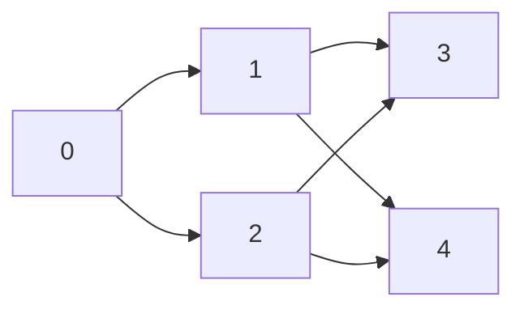

# Bài 27: Lý Thuyết Trò Chơi — Sprague-Grundy & Nim

> **Tác giả:** Hà Trí Kiên
> **Tham khảo:** VNOI Wiki, CP-Algorithms, Errichto

---

## 1. Bản chất vấn đề

### 1.1 Lý thuyết trò chơi trong CP là gì?

Trong competitive programming, lý thuyết trò chơi xử lý các bài toán có các tính chất sau:

- Có **2 người chơi luân phiên** thực hiện nước đi
- Cả hai đều chơi **hoàn hảo** (không bao giờ mắc sai lầm)
- Trò chơi **xác định** (không có yếu tố ngẫu nhiên)
- Trò chơi **kết thúc hữu hạn** (không hòa)

**Câu hỏi cốt lõi:** Cho trạng thái ban đầu, người đi trước thắng hay người đi sau thắng?

### 1.2 P-position và N-position

Đây là khái niệm nền tảng cho toàn bộ lý thuyết trò chơi:

| Ký hiệu | Nghĩa | Điều kiện |
|----------|-------|-----------|
| **P-position** | **P**revious player wins — người **vừa đi** thắng, tức người đang đi **thua** | Grundy $= 0$ |
| **N-position** | **N**ext player wins — người **sắp đi** thắng | Grundy $\neq 0$ |

**Quy tắc chuyển trạng thái:**

- Mọi trạng thái mà có thể đi đến $\geq 1$ P-position $\Rightarrow$ **N-position**
- Mọi trạng thái mà **tất cả** nước đi đều dẫn đến N-position $\Rightarrow$ **P-position**
- Trạng thái kết thúc (không có nước đi) $\Rightarrow$ **P-position** (người đến lượt thua)

### 1.3 Nim — Bài toán gốc

Có $N$ đống đá, mỗi đống có $a_i$ viên. Hai người luân phiên lấy đá:

- Mỗi lượt lấy $\geq 1$ viên từ **đúng 1 đống**
- Ai lấy viên cuối cùng **thắng** (normal play)

**Kết quả kinh điển:**

$$a_1 \oplus a_2 \oplus \cdots \oplus a_n \neq 0 \implies \text{Người đi trước THẮNG (N-position)}$$

$$a_1 \oplus a_2 \oplus \cdots \oplus a_n = 0 \implies \text{Người đi trước THUA (P-position)}$$

---

## 2. Tư duy cốt lõi

### 2.1 Tại sao XOR liên quan đến Nim?

XOR là phép toán phát hiện sự **bất đối xứng** giữa các đống. Khi $\bigoplus a_i = 0$, các đống ở trạng thái "cân bằng hoàn hảo" — bất kỳ nước đi nào cũng phá vỡ sự cân bằng, và đối thủ thông minh sẽ khôi phục lại trạng thái XOR bằng 0.

**Ví dụ minh họa:**

| Đống | Số viên | Nhị phân |
|------|---------|----------|
| A | 3 | `011` |
| B | 5 | `101` |
| C | 6 | `110` |

Tính XOR: $3 \oplus 5 \oplus 6 = 0$ (nhị phân: `011 ⊕ 101 ⊕ 110 = 000`)

$\Rightarrow$ Người đi trước **THUA** (P-position).

### 2.2 Grundy Number (Sprague-Grundy) — Mở rộng cho mọi trò chơi

Nim chỉ áp dụng cho trò chơi "lấy đá từ đống tự do". Rất nhiều bài toán CP phức tạp hơn: lấy đá với giới hạn, đi trên đồ thị có hướng, chia đống đá...

**Grundy number** mở rộng khái niệm Nim cho **bất kỳ trò chơi nào** thoả mãn điều kiện Sprague-Grundy.

**Định nghĩa:**

$$G(\text{state}) = \text{MEX}\{G(\text{next\_state}) \mid \text{next\_state là trạng thái có thể đi được}\}$$

Trong đó $\text{MEX}(S)$ là giá trị nguyên không âm nhỏ nhất **không có** trong tập $S$:

$$\text{MEX}(S) = \min\{k \geq 0 \mid k \notin S\}$$

Ví dụ: $\text{MEX}(\{0, 1, 3\}) = 2$, $\text{MEX}(\{1, 2, 3\}) = 0$, $\text{MEX}(\emptyset) = 0$.

**Tại sao Grundy hoạt động?** Grundy number thực chất là "kích thước đống Nim tương đương":

- Trạng thái có $G = 0$ tương đương đống Nim rỗng (thua)
- Trạng thái có $G = k$ tương đương đống Nim có $k$ viên

Khi kết hợp nhiều trò chơi con (game sum), chỉ cần XOR các Grundy numbers — giống hệt Nim!

### 2.3 Tính Grundy cho Subtraction Game {1, 2, 3}

**Luật:** Có 1 đống $n$ viên đá. Mỗi lượt lấy 1, 2, hoặc 3 viên. Ai lấy cuối cùng thắng.

Bảng tính Grundy:

| $n$ | Các trạng thái kế tiếp | Tập Grundy kế tiếp | $G(n)$ | Loại |
|-----|------------------------|---------------------|---------|------|
| 0 | (không có) | $\emptyset$ | 0 | P |
| 1 | $\{0\}$ | $\{G(0)\} = \{0\}$ | 1 | N |
| 2 | $\{0, 1\}$ | $\{G(1), G(0)\} = \{1, 0\}$ | 2 | N |
| 3 | $\{0, 1, 2\}$ | $\{G(2), G(1), G(0)\} = \{2, 1, 0\}$ | 3 | N |
| 4 | $\{1, 2, 3\}$ | $\{G(3), G(2), G(1)\} = \{3, 2, 1\}$ | 0 | **P** |
| 5 | $\{2, 3, 4\}$ | $\{G(4), G(3), G(2)\} = \{0, 3, 2\}$ | 1 | N |
| 6 | $\{3, 4, 5\}$ | $\{G(5), G(4), G(3)\} = \{1, 0, 3\}$ | 2 | N |
| 7 | $\{4, 5, 6\}$ | $\{G(6), G(5), G(4)\} = \{2, 1, 0\}$ | 3 | N |
| 8 | $\{5, 6, 7\}$ | $\{G(7), G(6), G(5)\} = \{3, 2, 1\}$ | 0 | **P** |

**Nhận xét:** Với subtraction set $\{1, 2, 3\}$, $G(n) = n \bmod 4$. N-position khi $n \bmod 4 \neq 0$.

### 2.4 Ví dụ: Subtraction Game {1, 3, 4}

| $n$ | 0 | 1 | 2 | 3 | 4 | 5 | 6 | 7 | 8 | 9 | 10 |
|-----|---|---|---|---|---|---|---|---|---|---|---|
| $G(n)$ | 0 | 1 | 0 | 1 | 2 | 3 | 2 | 0 | 1 | 0 | 1 |
| Loại | P | N | P | N | N | N | N | **P** | N | **P** | N |

P-positions: $0, 2, 7, 9, \ldots$ — không có pattern đơn giản như mod, phải tính.

### 2.5 Trò chơi trên DAG

**Bài toán:** Cho DAG có $n$ đỉnh, mỗi đỉnh có thể đi đến các đỉnh kề. Người chơi di chuyển quân cờ, ai không đi được thua.



Tính Grundy (duyệt ngược topological order):

| Đỉnh | Các đỉnh kế tiếp | Grundy kế tiếp | $G(u)$ | Loại |
|------|-------------------|-----------------|---------|------|
| 4 | (sink) | $\emptyset$ | 0 | P |
| 3 | (sink) | $\emptyset$ | 0 | P |
| 2 | $\{3, 4\}$ | $\{0, 0\} = \{0\}$ | 1 | N |
| 1 | $\{3, 4\}$ | $\{0, 0\} = \{0\}$ | 1 | N |
| 0 | $\{1, 2\}$ | $\{1, 1\} = \{1\}$ | 0 | **P** |

### 2.6 Tổng hợp trò chơi (Game Sum)

**Định lý Sprague-Grundy:** Nếu trò chơi là **tổng** của nhiều trò chơi con độc lập, Grundy của trò chơi tổng bằng XOR các Grundy của trò chơi con:

$$G(G_1 + G_2 + \cdots + G_k) = G(G_1) \oplus G(G_2) \oplus \cdots \oplus G(G_k)$$

**Ví dụ:** 3 đống đá, mỗi đống có thể lấy 1, 2, hoặc 3 viên:

| Đống | Số viên | $G(n) = n \bmod 4$ |
|------|---------|---------------------|
| 1 | 5 | 1 |
| 2 | 7 | 3 |
| 3 | 3 | 3 |

Tổng Grundy: $1 \oplus 3 \oplus 3 = 1 \neq 0 \Rightarrow$ Người đi trước **THẮNG**.

---

## 3. Phân tích tính đúng đắn

### 3.1 Chứng minh kết quả Nim

**Trường hợp 1: $\bigoplus a_i \neq 0$ (người đi trước thắng)**

Gọi $s = a_1 \oplus a_2 \oplus \cdots \oplus a_n \neq 0$.

1. Tìm bit cao nhất của $s$, giả sử là bit thứ $k$
2. Chọn đống $i$ mà bit thứ $k$ của $a_i$ là 1 (phải tồn tại vì bit thứ $k$ của $s$ là 1)
3. Đặt $a_i' = a_i \oplus s$. Khi đó $a_i' < a_i$ (vì bit cao nhất bị tắt)
4. Lấy $a_i - a_i'$ viên từ đống $i$
5. XOR mới: $s \oplus a_i \oplus a_i' = s \oplus a_i \oplus (a_i \oplus s) = 0$

$\Rightarrow$ Đối thủ nhận trạng thái XOR $= 0$.

**Trường hợp 2: $\bigoplus a_i = 0$ (người đi trước thua)**

- Bất kỳ nước đi nào cũng làm XOR $\neq 0$
- Đối thủ luôn có thể đưa XOR về 0 (theo logic trên)
- Cuối cùng, trạng thái $(0, 0, \ldots, 0)$ có XOR $= 0$ — người đi trước không còn nước đi

### 3.2 Chứng minh Sprague-Grundy

Mọi trò chơi thoả mãn điều kiện Sprague-Grundy (trò chơi kết thúc, không hòa, thông tin hoàn hảo) đều tương đương với một đống Nim.

**Ý tưởng chứng minh:**

1. Trạng thái kết thúc có $G = 0$ (đúng — không có nước đi, MEX của tập rỗng $= 0$)
2. Nếu $G(\text{state}) = k > 0$, tồn tại nước đi đến trạng thái có $G = 0, 1, \ldots, k-1$ (theo định nghĩa MEX)
3. Nếu $G(\text{state}) = 0$, mọi nước đi đều đến trạng thái có $G > 0$ (theo định nghĩa MEX)

$\Rightarrow$ Grundy number xác định chính xác P-position và N-position.

### 3.3 Misère Nim (lấy cuối cùng thua)

Luật "lấy cuối cùng **thua**" khác hoàn toàn normal play:

- Nếu tất cả đống $\leq 1$: thắng khi XOR $= 0$ (ngược lại normal play)
- Nếu có đống $> 1$: thắng khi XOR $\neq 0$ (giống normal play)

---

## 4. Đánh giá độ phức tạp

### 4.1 Nim cổ điển

| Thao tác | Độ phức tạp |
|----------|-------------|
| Kiểm tra thắng/thua | $O(n)$ — chỉ cần XOR $n$ số |
| Tìm nước đi tối ưu | $O(n)$ — quét tìm đống phù hợp |

### 4.2 Subtraction Game (1 đống, tập $S$)

| Thao tác | Độ phức tạp |
|----------|-------------|
| Tính $G(n)$ | $O(n \cdot |S|)$ — bottom-up DP |

Lưu ý: Grundy numbers có **chu kỳ** sau một điểm, có thể tối ưu thành $O(|S| \cdot \text{chu kỳ})$.

### 4.3 Grundy trên DAG

| Thao tác | Độ phức tạp |
|----------|-------------|
| Tính Grundy cho tất cả đỉnh | $O(V + E)$ — DFS + memoization |

### 4.4 Game Sum ($k$ trò chơi con)

| Thao tác | Độ phức tạp |
|----------|-------------|
| Kết hợp kết quả | $O(k)$ — XOR $k$ Grundy numbers |

Tổng: bằng tổng độ phức tạp tính Grundy từng trò chơi con $+ O(k)$.

---

## 5. Code mẫu

### 5.1 Nim cổ điển

=== "C++"

    ```cpp
    #include <bits/stdc++.h>
    using namespace std;

    bool firstPlayerWins(vector<int>& piles) {
        int xorSum = 0;
        for (int x : piles) xorSum ^= x;
        return xorSum != 0;
    }

    pair<int,int> findWinningMove(vector<int>& piles) {
        int xorSum = 0;
        for (int x : piles) xorSum ^= x;
        if (xorSum == 0) return {-1, -1};

        for (int i = 0; i < (int)piles.size(); i++) {
            int target = piles[i] ^ xorSum;
            if (target < piles[i]) {
                return {i, piles[i] - target};
            }
        }
        return {-1, -1};
    }
    ```

=== "Python"

    ```python
    def first_player_wins(piles):
        xor_sum = 0
        for x in piles:
            xor_sum ^= x
        return xor_sum != 0

    def find_winning_move(piles):
        xor_sum = 0
        for x in piles:
            xor_sum ^= x
        if xor_sum == 0:
            return None
        for i, x in enumerate(piles):
            target = x ^ xor_sum
            if target < x:
                return (i, x - target)
        return None
    ```

### 5.2 Grundy Number — Bottom-up DP

=== "C++"

    ```cpp
    #include <bits/stdc++.h>
    using namespace std;

    int mex(vector<int>& s) {
        sort(s.begin(), s.end());
        s.erase(unique(s.begin(), s.end()), s.end());
        for (int i = 0; i < (int)s.size(); i++)
            if (s[i] != i) return i;
        return s.size();
    }

    int grundy[1001];

    int computeGrundy(int n, vector<int>& moves) {
        grundy[0] = 0;
        for (int i = 1; i <= n; i++) {
            vector<int> nextStates;
            for (int m : moves) {
                if (i >= m) nextStates.push_back(grundy[i - m]);
            }
            grundy[i] = mex(nextStates);
        }
        return grundy[n];
    }
    ```

=== "Python"

    ```python
    def mex(s):
        s = sorted(set(s))
        for i in range(len(s)):
            if s[i] != i:
                return i
        return len(s)

    def compute_grundy(n, moves):
        dp = [0] * (n + 1)
        for i in range(1, n + 1):
            next_states = [dp[i - m] for m in moves if i >= m]
            dp[i] = mex(next_states)
        return dp[n]
    ```

### 5.3 Grundy trên DAG

=== "C++"

    ```cpp
    #include <bits/stdc++.h>
    using namespace std;

    const int MAXN = 100005;
    vector<int> adj[MAXN];
    int grundy[MAXN];
    bool computed[MAXN];

    int dfs(int u) {
        if (computed[u]) return grundy[u];
        computed[u] = true;
        set<int> nextValues;
        for (int v : adj[u]) {
            nextValues.insert(dfs(v));
        }
        int g = 0;
        while (nextValues.count(g)) g++;
        return grundy[u] = g;
    }
    ```

=== "Python"

    ```python
    import sys
    sys.setrecursionlimit(200000)

    def dfs(u, adj, memo):
        if u in memo:
            return memo[u]
        next_values = set()
        for v in adj[u]:
            next_values.add(dfs(v, adj, memo))
        g = 0
        while g in next_values:
            g += 1
        memo[u] = g
        return g
    ```

### 5.4 Wythoff's Game

=== "C++"

    ```cpp
    #include <bits/stdc++.h>
    using namespace std;

    bool isWythoffP(int a, int b) {
        if (a > b) swap(a, b);
        double phi = (1 + sqrt(5)) / 2;
        int k = b - a;
        return a == (int)(k * phi);
    }
    ```

=== "Python"

    ```python
    import math

    def is_wythoff_p(a, b):
        if a > b:
            a, b = b, a
        phi = (1 + math.sqrt(5)) / 2
        k = b - a
        return a == int(k * phi)
    ```

### 5.5 Green Hackenbush (Tree)

=== "C++"

    ```cpp
    #include <bits/stdc++.h>
    using namespace std;

    const int MAXN = 100005;
    vector<int> adj[MAXN];

    int treeGrundy(int u, int parent) {
        int g = 0;
        for (int v : adj[u]) {
            if (v != parent) {
                g ^= (treeGrundy(v, u) + 1);
            }
        }
        return g;
    }
    ```

=== "Python"

    ```python
    import sys
    sys.setrecursionlimit(200000)

    def tree_grundy(u, parent, adj):
        g = 0
        for v in adj[u]:
            if v != parent:
                g ^= (tree_grundy(v, u, adj) + 1)
        return g
    ```

---

## 6. Cạm bẫy thường gặp

### 6.1 Nhầm luật Misère vs Normal

| Luật | Điều kiện thắng |
|------|-----------------|
| Normal (lấy cuối cùng thắng) | XOR $\neq 0$ $\Rightarrow$ thắng |
| Misère (lấy cuối cùng thua), có đống $> 1$ | XOR $\neq 0$ $\Rightarrow$ thắng (giống normal) |
| Misère, tất cả đống $\leq 1$ | XOR $= 0$ $\Rightarrow$ thắng (ngược normal) |

### 6.2 Grundy $= 0$ không có nghĩa là "không có nước đi"

Grundy $= 0$ nghĩa là P-position (người đi trước thua). Có thể có rất nhiều nước đi, nhưng **tất cả** đều dẫn đến N-position.

### 6.3 Quên memoization $\Rightarrow$ TLE

Đệ quy tính Grundy mà không memoize sẽ có độ phức tạp $O(2^n)$. Luôn dùng memoization hoặc bottom-up DP.

### 6.4 MEX implementation sai

Phải **sort + loại trùng** trước khi tìm MEX. Sai lầm phổ biến: chỉ kiểm tra phần tử đầu.

### 6.5 Khi nào dùng MEX vs XOR?

| Bài toán | Phép toán |
|----------|-----------|
| Nim cổ điển ($N$ đống, lấy tự do) | XOR trực tiếp các $a_i$ |
| Tính Grundy cho 1 trò chơi đơn lẻ | MEX |
| Tổng nhiều trò chơi con | XOR các Grundy numbers |
| Trò chơi trên DAG | Tính Grundy bằng MEX, không phải XOR |
| Wythoff's Game | Dùng tỷ lệ vàng, không dùng XOR |

---

## 7. Bài tập luyện tập

### Nim cơ bản

| Bài | Nền tảng | Độ khó | Chủ đề |
|-----|----------|--------|--------|
| [CSES - Nim Game I](https://cses.fi/problemset/task/1730) | CSES | ⭐⭐ | Nim cổ điển |
| [CSES - Nim Game II](https://cses.fi/problemset/task/1098) | CSES | ⭐⭐ | Nim biến thể |
| [SPOJ - MCOINS](https://www.spoj.com/problems/MCOINS/) | SPOJ | ⭐⭐ | Subtraction game |

### Sprague-Grundy

| Bài | Nền tảng | Độ khó | Chủ đề |
|-----|----------|--------|--------|
| [CF - 15C](https://codeforces.com/problemset/problem/15/C) | CF | ⭐⭐ | Nim nhiều đống |
| [CF - 1191D](https://codeforces.com/problemset/problem/1191/D) | CF | ⭐⭐⭐ | Game phân tích |
| [CF - 138D](https://codeforces.com/problemset/problem/138/D) | CF | ⭐⭐⭐⭐ | Game trên lưới |
| [CF - 9D](https://codeforces.com/problemset/problem/9/D) | CF | ⭐⭐⭐⭐ | Game trên cây |
| [Atcoder DP Contest - Grundy](https://atcoder.jp/contests/dp/tasks) | Atcoder | ⭐⭐⭐ | Game DP |

### Game trên DAG / Trees

| Bài | Nền tảng | Độ khó | Chủ đề |
|-----|----------|--------|--------|
| [CF - 2B](https://codeforces.com/problemset/problem/2/B) | CF | ⭐⭐⭐ | Game trên DAG |
| [CF - 455B](https://codeforces.com/problemset/problem/455/B) | CF | ⭐⭐⭐ | Game trên cây |
| [CF - 1109D](https://codeforces.com/problemset/problem/1109/D) | CF | ⭐⭐⭐⭐ | Game trên cây nâng cao |

### Wythoff & Special Games

| Bài | Nền tảng | Độ khó | Chủ đề |
|-----|----------|--------|--------|
| [SPOJ - MCOINS](https://www.spoj.com/problems/MCOINS/) | SPOJ | ⭐⭐ | Subtraction game |
| [CF - 317D](https://codeforces.com/problemset/problem/317/D) | CF | ⭐⭐⭐⭐ | Game theory nâng cao |
| [CF - 982D](https://codeforces.com/problemset/problem/982/D) | CF | ⭐⭐⭐⭐ | Game + Sorting |

### Bài tập tổng hợp

| Bài | Nền tảng | Độ khó | Chủ đề |
|-----|----------|--------|--------|
| [Kattis - Game of Stones](https://open.kattis.com/problems/gameofstones) | Kattis | ⭐⭐ | Nim + Subtraction |
| [DMOJ - Game Theory](https://dmoj.ca/problem/game) | DMOJ | ⭐⭐⭐ | Grundy tổng hợp |
| [LightOJ - Guilty Prince](https://lightoj.com/problem/guilty-prince) | LightOJ | ⭐⭐⭐ | Game trên lưới |
| [VNOJ - nksgame](https://oj.vnoi.info/problem/nksgame) | VNOJ | ⭐⭐ | Game theory |
| [VNOJ - nkgame](https://oj.vnoi.info/problem/nkgame) | VNOJ | ⭐⭐ | Game trên dãy số |
| [VNOJ - nkjump](https://oj.vnoi.info/problem/nkjump) | VNOJ | ⭐⭐ | Game + DP |

---

## 8. Tài liệu tham khảo

- [VNOI Wiki - Lý thuyết trò chơi](https://wiki.vnoi.info/algo/math/game-theory)
- [CP-Algorithms - Sprague-Grundy Theorem](https://cp-algorithms.com/game_theory/sprague-grundy-nim.html)
- [Errichto - Nim Game & Sprague-Grundy (YouTube)](https://www.youtube.com/watch?v=6jMRgUeJ2YQ)
- [William Fiset - Game Theory (YouTube)](https://www.youtube.com/playlist?list=PLDV1Zeh2NRsDj3NzHbbF7JwNRFOKhl_7U)
- [Stanford - Game Theory Notes](https://web.stanford.edu/~guertin/game_theory_notes.html)

## Bài viết liên quan

- [Bài 5: Phép toán bit](phep-toan-bit.md) — XOR là nền tảng cho Nim
- [Bài 12: Quy hoạch động](quy-hoach-dong.md) — Grundy dùng DP
- [Bài 18: Euclid & Modular Inverse](euclid-modular-inverse.md) — Modular arithmetic trong subtraction games
