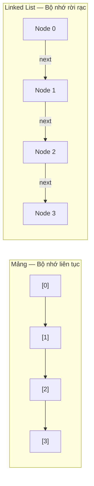
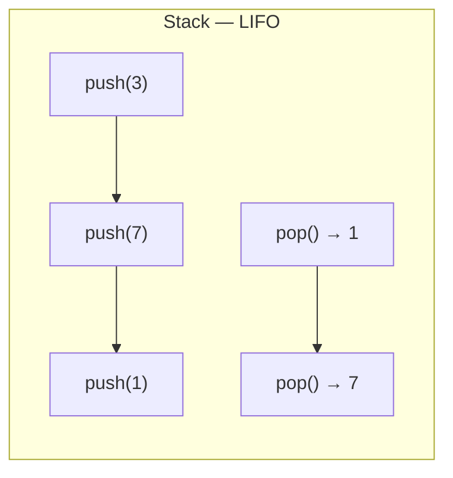
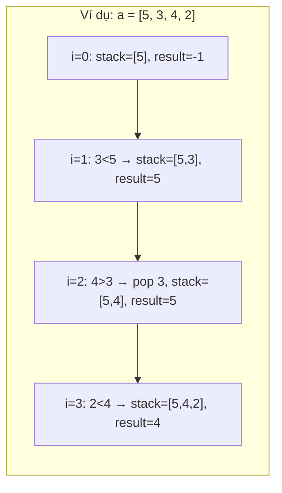
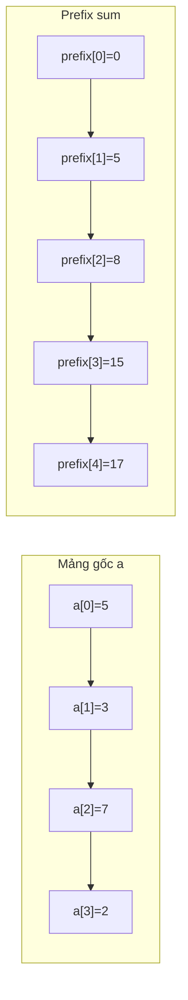
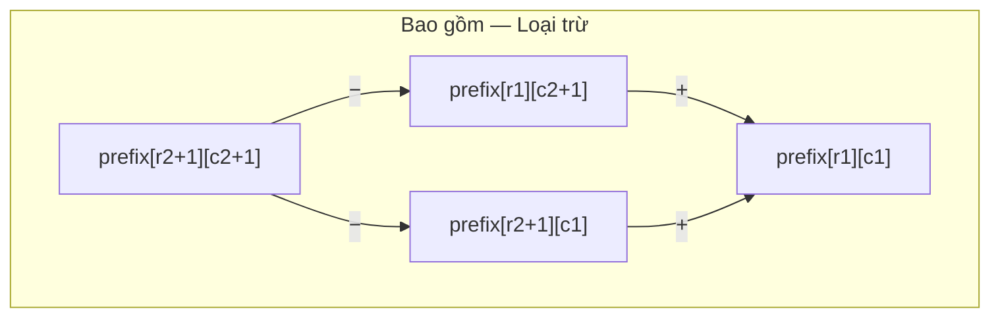
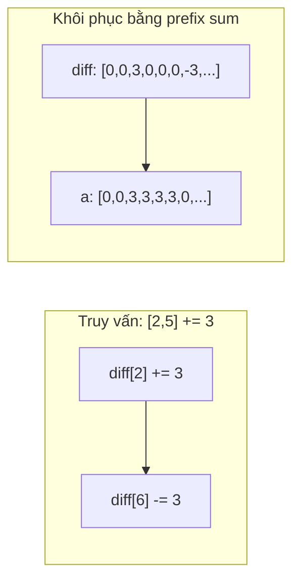

# Bài 7: Mảng, Stack, Prefix Sum và Difference Array

> **Tác giả:** FPTOJ Team<br>
>
> **Nội dung tham khảo từ:** VNOI Wiki — Mảng và danh sách liên kết, Stack, Mảng cộng dồn và mảng hiệu

---

## Mảng vs Danh sách liên kết

### Bản chất vấn đề

Cấu trúc dữ liệu lưu trữ dãy phần tử, nhưng khác biệt cốt lõi ở cách **bộ nhớ được cấp phát**:

- **Mảng (Array):** Bộ nhớ liên tục — biết địa chỉ đầu, truy cập bất kỳ vị trí nào trong $O(1)$.
- **Danh sách liên kết (Linked List):** Bộ nhớ rời rạc — mỗi node biết "node tiếp theo là ai", muốn đến vị trí $i$ phải đi từ đầu.

### Tư duy cốt lõi



Chọn cấu trúc nào phụ thuộc vào **thao tác ưu tiên**:

| Thao tác | Mảng | Danh sách liên kết |
|----------|------|---------------------|
| Truy cập phần tử thứ $i$ | $O(1)$ | $O(N)$ |
| Thêm / xóa ở đầu | $O(N)$ | $O(1)$ |
| Thêm / xóa ở cuối | $O(1)$ | $O(1)$ (nếu có con trỏ cuối) |
| Thêm / xóa ở giữa | $O(N)$ | $O(1)$ (nếu đã có con trỏ) |

### Phân tích tính đúng đắn

Mảng truy cập $O(1)$ vì địa chỉ phần tử thứ $i$ được tính trực tiếp: `base + i * sizeof(element)`. Linked list không có công thức này nên phải duyệt từ đầu.

=== "C++"

    ```cpp
    struct Node {
        int data;
        Node* next;
    };

    // Thêm node mới vào đầu — O(1)
    Node* addFirst(Node* head, int value) {
        Node* newNode = new Node();
        newNode->data = value;
        newNode->next = head;
        return newNode;
    }

    // Duyệt toàn bộ danh sách — O(N)
    void printList(Node* head) {
        Node* cur = head;
        while (cur != NULL) {
            cout << cur->data << " ";
            cur = cur->next;
        }
    }
    ```

=== "Python"

    ```python
    class Node:
        def __init__(self, data):
            self.data = data
            self.next = None

    # Thêm node vào đầu — O(1)
    def add_first(head, value):
        new_node = Node(value)
        new_node.next = head
        return new_node
    ```

### Đánh giá độ phức tạp

| Phép toán | Mảng | Danh sách liên kết |
|-----------|------|---------------------|
| Truy cập ngẫu nhiên | $O(1)$ | $O(N)$ |
| Tìm kiếm | $O(N)$ | $O(N)$ |
| Chèn đầu / xóa đầu | $O(N)$ / $O(N)$ | $O(1)$ / $O(1)$ |
| Bộ nhớ | Ít hơn (không lưu con trỏ) | Nhiều hơn (mỗi node thêm 1 con trỏ) |

---

## Stack (Ngăn xếp)

### Bản chất vấn đề

Nhiều bài toán yêu cầu xử lý phần tử theo thứ tự **vào sau, ra trước** — ví dụ kiểm tra ngoặc hợp lệ, biểu thức toán học, duyệt cây. Stack là cấu trúc dữ liệu giải quyết chính xác nhu cầu này.

### Tư duy cốt lõi

**LIFO** — Last In, First Out: phần tử được thêm vào sau cùng sẽ được lấy ra đầu tiên.



| Thao tác | Ý nghĩa | Độ phức tạp |
|----------|----------|-------------|
| `push(x)` | Thêm $x$ vào đỉnh stack | $O(1)$ |
| `pop()` | Loại bỏ phần tử ở đỉnh | $O(1)$ |
| `top()` | Xem phần tử ở đỉnh | $O(1)$ |
| `empty()` | Kiểm tra stack rỗng | $O(1)$ |

### Phân tích tính đúng đắn

**Ứng dụng 1: Kiểm tra dãy ngoặc đúng**

Ý tưởng: gặp dấu `(` thì push, gặp `)` thì pop. Nếu stack rỗng khi cần pop → sai. Cuối cùng stack phải rỗng.

=== "C++"

    ```cpp
    bool isValid(string s) {
        stack<char> st;
        for (char c : s) {
            if (c == '(') {
                st.push(c);
            } else {
                if (st.empty()) return false;
                st.pop();
            }
        }
        return st.empty();
    }
    ```

=== "Python"

    ```python
    def is_valid(s):
        st = []
        for c in s:
            if c == '(':
                st.append(c)
            else:
                if not st:
                    return False
                st.pop()
        return len(st) == 0
    ```

**Ứng dụng 2: Stack đơn điệu — Tìm phần tử lớn hơn bên trái**

Bài toán: với mỗi phần tử $a[i]$, tìm phần tử lớn hơn **gần nhất** bên trái.

**Tư duy:** Duy trì stack giảm dần. Khi xét $a[i]$, mọi phần tử trên stack nhỏ hơn $a[i]$ **không bao giờ là đáp án** cho bất kỳ $a[j]$ nào ($j \ge i$), vì $a[i]$ to hơn mà lại gần hơn → an tâm pop ra.



=== "C++"

    ```cpp
    vector<int> findGreater(vector<int>& a) {
        stack<int> st;
        vector<int> result(a.size(), -1);
        for (int i = 0; i < a.size(); i++) {
            while (!st.empty() && st.top() <= a[i])
                st.pop();
            if (!st.empty())
                result[i] = st.top();
            st.push(a[i]);
        }
        return result;
    }
    ```

=== "Python"

    ```python
    def find_greater(a):
        st = []
        result = [-1] * len(a)
        for i in range(len(a)):
            while st and st[-1] <= a[i]:
                st.pop()
            if st:
                result[i] = st[-1]
            st.append(a[i])
        return result
    ```

### Đánh giá độ phức tạp

Mỗi phần tử được **push đúng 1 lần** và **pop tối đa 1 lần** → tổng thao tác $\le 2N$ → $O(N)$.

---

## Mảng cộng dồn (Prefix Sum)

### Bản chất vấn đề

Cho mảng $a[0], a[1], \ldots, a[N-1]$, trả lời nhanh truy vấn: **tổng đoạn $[l, r]$ là bao nhiêu?**

Nếu tính trực tiếp mỗi truy vấn mất $O(N)$, với $Q$ truy vấn tổng là $O(NQ)$. Prefix sum giảm xuống $O(N + Q)$.

### Tư duy cốt lõi

**Tổng quãng đường:** Bạn đi từ A → B → C → D. Ghi nhớ tổng quãng đường từ đầu đến mỗi điểm. Muốn biết quãng đường B → C? Lấy tổng đến C trừ tổng đến B.

**Công thức:**

$$
\text{prefix}[i] = \sum_{k=0}^{i-1} a[k]
$$

$$
\text{Tổng đoạn } [l, r] = \text{prefix}[r+1] - \text{prefix}[l]
$$



Tổng đoạn $[1, 3] = \text{prefix}[4] - \text{prefix}[1] = 17 - 5 = 12$.

### Phân tích tính đúng đắn

Prefix sum hoạt động dựa trên tính chất **hiệu hai tổng liên tiếp**:

$$
\text{prefix}[r+1] - \text{prefix}[l] = \sum_{k=0}^{r} a[k] - \sum_{k=0}^{l-1} a[k] = \sum_{k=l}^{r} a[k]
$$

Đây là phép trừ trực tiếp — không cần duyệt lại đoạn $[l, r]$.

=== "C++"

    ```cpp
    vector<int> buildPrefixSum(vector<int>& a) {
        int n = a.size();
        vector<int> prefix(n + 1, 0);
        for (int i = 0; i < n; i++)
            prefix[i + 1] = prefix[i] + a[i];
        return prefix;
    }

    int rangeSum(vector<int>& prefix, int l, int r) {
        return prefix[r + 1] - prefix[l];
    }
    ```

=== "Python"

    ```python
    def build_prefix_sum(a):
        prefix = [0] * (len(a) + 1)
        for i in range(len(a)):
            prefix[i + 1] = prefix[i] + a[i]
        return prefix

    def range_sum(prefix, l, r):
        return prefix[r + 1] - prefix[l]
    ```

### Đánh giá độ phức tạp

| Giai đoạn | Độ phức tạp |
|-----------|-------------|
| Dựng mảng prefix | $O(N)$ |
| Mỗi truy vấn | $O(1)$ |
| Tổng $Q$ truy vấn | $O(N + Q)$ |

---

## Prefix Sum 2D (Tổng hình chữ nhật)

### Bản chất vấn đề

Cho lưới $N \times M$, trả lời nhanh: **tổng các phần tử trong hình chữ nhật từ $(r_1, c_1)$ đến $(r_2, c_2)$ là bao nhiêu?**

### Tư duy cốt lõi

Dùng nguyên lý **bao gồm — loại trừ** (inclusion-exclusion). Tổng hình chữ nhật từ $(0,0)$ đến $(i-1, j-1)$ được tính bằng:

$$
\text{prefix}[i][j] = a[i-1][j-1] + \text{prefix}[i-1][j] + \text{prefix}[i][j-1] - \text{prefix}[i-1][j-1]
$$

Truy vấn hình chữ nhật $(r_1, c_1)$ đến $(r_2, c_2)$:

$$
\text{sum} = \text{prefix}[r_2+1][c_2+1] - \text{prefix}[r_1][c_2+1] - \text{prefix}[r_2+1][c_1] + \text{prefix}[r_1][c_1]
$$



### Phân tích tính đúng đắn

Phần tử $(r_1, c_1)$ bị trừ 2 lần khi trừ hàng và cột, nên phải cộng lại 1 lần. Đây chính là nguyên lý inclusion-exclusion cho 2 tập hợp.

=== "C++"

    ```cpp
    int a[MAXN][MAXN], prefix[MAXN][MAXN];

    void build2D(int n, int m) {
        for (int i = 1; i <= n; i++)
            for (int j = 1; j <= m; j++)
                prefix[i][j] = a[i][j]
                             + prefix[i-1][j]
                             + prefix[i][j-1]
                             - prefix[i-1][j-1];
    }

    int query2D(int r1, int c1, int r2, int c2) {
        return prefix[r2][c2]
             - prefix[r1-1][c2]
             - prefix[r2][c1-1]
             + prefix[r1-1][c1-1];
    }
    ```

=== "Python"

    ```python
    def build_2d(a, n, m):
        prefix = [[0] * (m + 1) for _ in range(n + 1)]
        for i in range(1, n + 1):
            for j in range(1, m + 1):
                prefix[i][j] = (a[i-1][j-1]
                               + prefix[i-1][j]
                               + prefix[i][j-1]
                               - prefix[i-1][j-1])
        return prefix

    def query_2d(prefix, r1, c1, r2, c2):
        return (prefix[r2][c2]
              - prefix[r1-1][c2]
              - prefix[r2][c1-1]
              + prefix[r1-1][c1-1])
    ```

### Đánh giá độ phức tạp

| Giai đoạn | Độ phức tạp |
|-----------|-------------|
| Dựng prefix 2D | $O(N \times M)$ |
| Mỗi truy vấn | $O(1)$ |

**Ứng dụng:** Đếm ô màu đen trong hình chữ nhật con, tính tổng pixel (integral image trong xử lý ảnh).

---

## Tìm đoạn con có tổng lớn nhất (Kadane's Algorithm)

### Bản chất vấn đề

Cho mảng $a[0 \ldots N-1]$, tìm đoạn con liên tiếp có tổng lớn nhất.

### Tư duy cốt lõi

Với mỗi vị trí $i$, hỏi: "nếu buộc phải kết thúc tại $i$, đoạn tốt nhất bắt đầu từ đâu?" Nếu tổng tích lũy $\text{curSum} < 0$ thì bỏ hết trước đó, bắt đầu lại từ $a[i]$.

$$
\text{curSum} = \max(a[i],\ \text{curSum} + a[i])
$$

$$
\text{maxSum} = \max(\text{maxSum},\ \text{curSum})
$$

=== "C++"

    ```cpp
    long long maxSubarraySum(vector<int>& a) {
        long long maxSum = a[0], curSum = a[0];
        for (int i = 1; i < a.size(); i++) {
            curSum = max((long long)a[i], curSum + a[i]);
            maxSum = max(maxSum, curSum);
        }
        return maxSum;
    }
    ```

=== "Python"

    ```python
    def max_subarray_sum(a):
        max_sum = cur_sum = a[0]
        for i in range(1, len(a)):
            cur_sum = max(a[i], cur_sum + a[i])
            max_sum = max(max_sum, cur_sum)
        return max_sum
    ```

### Phân tích tính đúng đắn

Khi $\text{curSum} < 0$, mọi đoạn bắt đầu trước vị trí $i$ đều có tổng nhỏ hơn $a[i]$ đơn độc. Do đó "bỏ hết" là tối ưu. Thuật toán duyệt 1 lần, mỗi bước quyết định "tiếp tục" hoặc "bắt đầu lại" — đảm bảo không bỏ sót đoạn tối ưu.

### Đánh giá độ phức tạp

| Phép toán | Độ phức tạp |
|-----------|-------------|
| Duyệt mảng | $O(N)$ |
| Không gian | $O(1)$ |

---

## Mảng hiệu (Difference Array)

### Bản chất vấn đề

Cho mảng $a[0 \ldots N-1]$, thực hiện nhiều truy vấn: **cộng $k$ vào tất cả phần tử trong đoạn $[l, r]$**. Sau đó khôi phục mảng kết quả.

Nếu cập nhật trực tiếp mỗi truy vấn mất $O(N)$, với $Q$ truy vấn tổng là $O(NQ)$. Difference array giảm xuống $O(N + Q)$.

### Tư duy cốt lõi

Thay vì cộng $k$ vào từng phần tử $a[l], a[l+1], \ldots, a[r]$, chỉ cần:

- $\text{diff}[l] \mathrel{+}= k$ (bắt đầu cộng từ đây)
- $\text{diff}[r+1] \mathrel{-}= k$ (ngừng cộng từ đây)

Sau tất cả truy vấn, tính prefix sum trên $\text{diff}$ để khôi phục mảng gốc.



### Phân tích tính đúng đắn

Sau khi cộng $k$ vào $\text{diff}[l]$ và trừ $k$ khỏi $\text{diff}[r+1]$, prefix sum tại vị trí $i$:

- Nếu $i < l$: không bị ảnh hưởng → đúng.
- Nếu $l \le i \le r$: được cộng $k$ (từ $\text{diff}[l]$) → đúng.
- Nếu $i > r$: được cộng $k$ rồi trừ $k$ (từ $\text{diff}[r+1]$) → không đổi → đúng.

=== "C++"

    ```cpp
    // Cập nhật đoạn [l, r] thêm k — O(1)
    void update(vector<int>& diff, int l, int r, int k) {
        diff[l] += k;
        if (r + 1 < diff.size())
            diff[r + 1] -= k;
    }

    // Khôi phục mảng gốc từ mảng hiệu — O(N)
    vector<int> restoreArray(vector<int>& diff) {
        vector<int> a(diff.size());
        a[0] = diff[0];
        for (int i = 1; i < diff.size(); i++)
            a[i] = a[i - 1] + diff[i];
        return a;
    }
    ```

=== "Python"

    ```python
    # Cập nhật đoạn [l, r] thêm k — O(1)
    def update(diff, l, r, k):
        diff[l] += k
        if r + 1 < len(diff):
            diff[r + 1] -= k

    # Khôi phục mảng gốc từ mảng hiệu — O(N)
    def restore_array(diff):
        a = [0] * len(diff)
        a[0] = diff[0]
        for i in range(1, len(diff)):
            a[i] = a[i - 1] + diff[i]
        return a
    ```

### Đánh giá độ phức tạp

| Giai đoạn | Độ phức tạp |
|-----------|-------------|
| Mỗi truy vấn cập nhật | $O(1)$ |
| Khôi phục mảng | $O(N)$ |
| Tổng $Q$ truy vấn | $O(N + Q)$ |

---

## Bài tập minh họa: Karen and Coffee (CF 816B)

### Bản chất vấn đề

Có $n$ truy vấn "tăng nhiệt độ đoạn $[l, r]$ thêm 1". Hỏi: có bao nhiêu vị trí có giá trị $\ge k$?

### Tư duy cốt lõi

Dùng difference array để xử lý $n$ cập nhật trong $O(N)$, rồi dùng prefix sum trên kết quả để trả lời truy vấn đếm.

### Phân tích tính đúng đắn

Sau khi khôi phục, mảng $a[i]$ = số lần vị trí $i$ được "tưới". Chuyển sang mảng nhị phân: $b[i] = 1$ nếu $a[i] \ge k$, rồi prefix sum trên $b$ để đếm nhanh.

=== "C++"

    ```cpp
    int main() {
        int n, k, q;
        cin >> n >> k >> q;
        vector<int> diff(200002, 0);
        for (int i = 0; i < n; i++) {
            int l, r; cin >> l >> r;
            diff[l]++;
            diff[r + 1]--;
        }
        vector<int> a(200002, 0), prefix(200002, 0);
        for (int i = 1; i <= 200000; i++) {
            a[i] = a[i - 1] + diff[i];
            prefix[i] = prefix[i - 1] + (a[i] >= k);
        }
        for (int i = 0; i < q; i++) {
            int l, r; cin >> l >> r;
            cout << prefix[r] - prefix[l - 1] << endl;
        }
    }
    ```

=== "Python"

    ```python
    import sys
    input = sys.stdin.readline

    n, k, q = map(int, input().split())
    diff = [0] * 200002
    for _ in range(n):
        l, r = map(int, input().split())
        diff[l] += 1
        diff[r + 1] -= 1

    a = [0] * 200002
    prefix = [0] * 200002
    for i in range(1, 200001):
        a[i] = a[i - 1] + diff[i]
        prefix[i] = prefix[i - 1] + (1 if a[i] >= k else 0)

    for _ in range(q):
        l, r = map(int, input().split())
        print(prefix[r] - prefix[l - 1])
    ```

### Đánh giá độ phức tạp

| Giai đoạn | Độ phức tạp |
|-----------|-------------|
| Xử lý $n$ cập nhật | $O(N)$ |
| Khôi phục + xây prefix | $O(N)$ |
| Trả lời $q$ truy vấn | $O(Q)$ |
| **Tổng** | $O(N + Q)$ |

---

## Cạm bẫy thường gặp

### Prefix Sum: 1-indexed vs 0-indexed

| Cách | Công thức | Tổng $[l, r]$ |
|------|-----------|----------------|
| $\text{prefix}[0] = 0$ (khuyến khích) | $\text{prefix}[i] = \sum_{k=0}^{i-1} a[k]$ | $\text{prefix}[r+1] - \text{prefix}[l]$ |
| $\text{prefix}[i] = \sum_{k=0}^{i} a[k]$ | $\text{prefix}[0] = a[0]$ | $\text{prefix}[r] - \text{prefix}[l-1]$ (cẩn thận $l=0$) |

**Lỗi thường gặp:** Quên xét $l = 0$ ở cách 2 → truy cập $\text{prefix}[-1]$.

### Overflow khi tính Prefix Sum

Nếu $a[i]$ có thể đến $10^9$ và $N$ đến $10^5$ → tổng lớn nhất $\approx 10^{14}$ → **phải dùng `long long`**.

### Difference Array: Quên xét $r+1$ ra ngoài mảng

Phải kiểm tra $r + 1 < N$ trước khi truy cập $\text{diff}[r+1]$, nếu không sẽ truy cập ngoài mảng → Runtime Error.

### Difference Array: Quên khôi phục

Sau khi cập nhật $\text{diff}[]$, **phải** tính prefix sum để khôi phục mảng gốc. Dùng $\text{diff}[]$ trực tiếp sẽ cho kết quả sai.

### Stack: Quên kiểm tra rỗng

Gọi `pop()` hoặc `top()` trên stack rỗng → Runtime Error. **Phải kiểm tra `empty()` trước.**

### Kadane's Algorithm: Mảng toàn số âm

Nếu mảng toàn số âm, Kadane's trả về phần tử lớn nhất (vẫn âm). Nếu muốn cho phép đoạn con rỗng (tổng = 0):

=== "C++"

    ```cpp
    long long maxSubarraySum(vector<int>& a) {
        long long maxSum = 0, curSum = 0;
        for (int x : a) {
            curSum = max(0LL, curSum + x);
            maxSum = max(maxSum, curSum);
        }
        return maxSum;
    }
    ```

=== "Python"

    ```python
    def max_subarray_sum(a):
        max_sum = cur_sum = 0
        for x in a:
            cur_sum = max(0, cur_sum + x)
            max_sum = max(max_sum, cur_sum)
        return max_sum
    ```

---

## Bài tập luyện tập

| Bài | Nền tảng | Độ khó | Chủ đề |
|-----|----------|--------|--------|
| [CSES — Static Range Sum Queries](https://cses.fi/problemset/task/1646) | CSES | ⭐ | Prefix Sum |
| [CSES — Forest Queries](https://cses.fi/problemset/task/1652) | CSES | ⭐⭐ | Prefix Sum 2D |
| [LeetCode — Range Sum Query](https://leetcode.com/problems/range-sum-query-immutable/) | LeetCode | ⭐ | Prefix Sum |
| [LeetCode — Subarray Sum Equals K](https://leetcode.com/problems/subarray-sum-equals-k/) | LeetCode | ⭐⭐ | Prefix Sum + HashMap |
| [LeetCode — Product of Array Except Self](https://leetcode.com/problems/product-of-array-except-self/) | LeetCode | ⭐⭐ | Prefix / Suffix Sum |
| [Codeforces 816B — Karen and Coffee](https://codeforces.com/problemset/problem/816/B) | CF | ⭐⭐ | Difference Array |
| [VNOJ — QSUM](https://oj.vnoi.info/problem/fc085_qsum) | VNOJ | ⭐⭐ | Prefix Sum |

---

## Tài liệu tham khảo

- [VNOI Wiki — Mảng và danh sách liên kết](https://wiki.vnoi.info/algo/data-structures/array-vs-linked-lists)
- [VNOI Wiki — Stack](https://wiki.vnoi.info/algo/data-structures/Stack)
- [VNOI Wiki — Mảng cộng dồn và mảng hiệu](https://wiki.vnoi.info/algo/data-structures/prefix-sum-and-difference-array)
- [GeeksforGeeks — Prefix Sum Array](https://www.geeksforgeeks.org/dsa/prefix-sum-array-implementation-applications-competitive-programming/)
- [YouTube — Prefix Sum (takeuforward)](https://www.youtube.com/watch?v=7pYJ6mYCEQs)

**Bài tiếp theo:** [Heap (Hàng đợi ưu tiên) →](heap.md)
