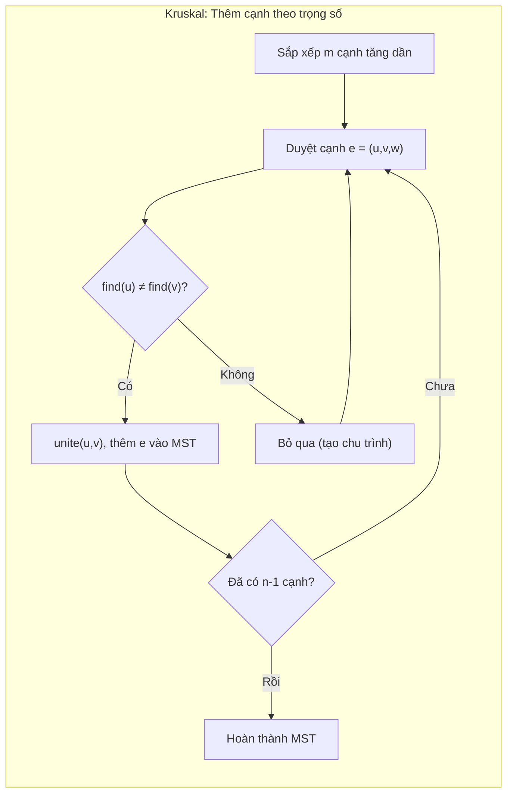
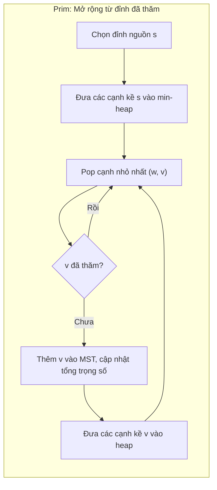
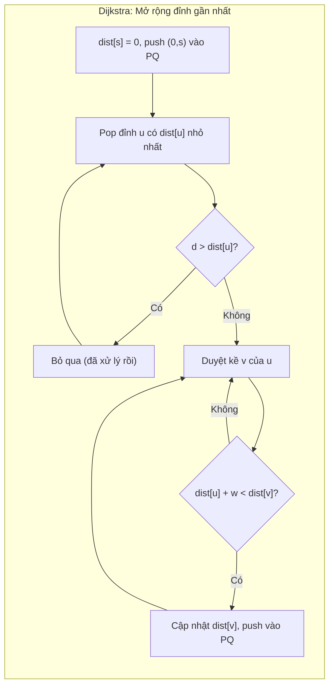
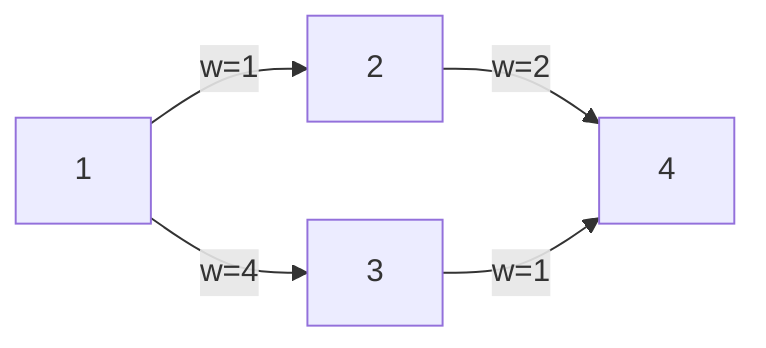
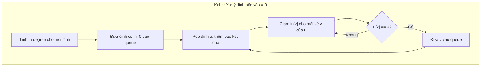
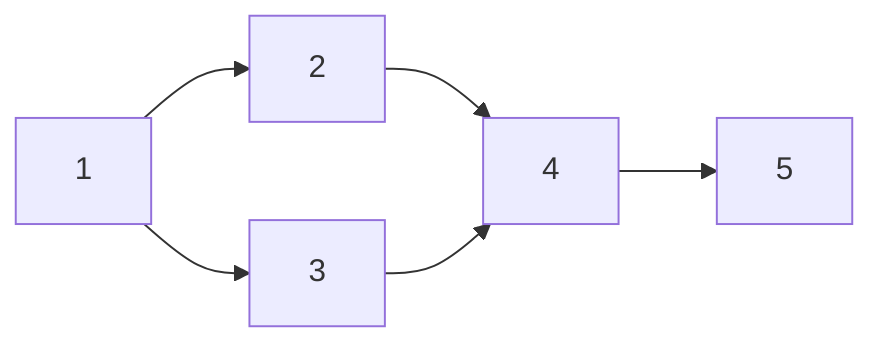

# Bài 13: MST, Dijkstra, Topo Sort - Đồ Thị Nâng Cao

> **Tác giả:** FPTOJ Team<br>
> **Nội dung tham khảo từ:** VNOI Wiki - Cây khung nhỏ nhất, Đường đi ngắn nhất, Sắp xếp Tô-pô

---

## 1. MST - Cây Khung Nhỏ Nhất

### Bản chất vấn đề

Cho đồ thị vô hướng liên thông $G = (V, E)$ với $|V| = n$ đỉnh, $|E| = m$ cạnh, mỗi cạnh có trọng số $w(u,v)$. Tìm cây con $T \subseteq E$ sao cho:

- $T$ bao trùm tất cả $n$ đỉnh (liên thông).
- Tổng trọng số $\sum_{(u,v) \in T} w(u,v)$ là nhỏ nhất.
- $T$ có đúng $n - 1$ cạnh (không chu trình).

Đây là bài toán **Cây khung nhỏ nhất** (Minimum Spanning Tree - MST).

### Tư duy cốt lõi

Có hai thuật toán kinh điển: **Kruskal** (cạnh-centric) và **Prim** (đỉnh-centric).

**Kruskal** - Tham lam trên cạnh:

Sắp xếp tất cả $m$ cạnh theo trọng số tăng dần. Duyệt từng cạnh, nếu thêm cạnh đó không tạo chu trình thì chấp nhận. Dùng DSU (Disjoint Set Union) để kiểm tra chu trình trong $O(\alpha(n))$.



**Prim** - Tham lam trên đỉnh:

Bắt đầu từ đỉnh任意. Mỗi bước, chọn cạnh có trọng số nhỏ nhất nối một đỉnh đã thăm với một đỉnh chưa thăm. Dùng min-heap để trích xuất cạnh nhỏ nhất nhanh.



=== "C++"

    ```cpp
    #include <bits/stdc++.h>
    using namespace std;

    struct Edge {
        int u, v, w;
        bool operator<(const Edge& other) const {
            return w < other.w;
        }
    };

    struct DSU {
        vector<int> parent, sz;
        DSU(int n) {
            parent.resize(n + 1);
            sz.resize(n + 1, 1);
            for (int i = 1; i <= n; i++) parent[i] = i;
        }
        int find(int v) {
            if (v == parent[v]) return v;
            return parent[v] = find(parent[v]);
        }
        bool unite(int a, int b) {
            a = find(a); b = find(b);
            if (a == b) return false;
            if (sz[a] < sz[b]) swap(a, b);
            parent[b] = a;
            sz[a] += sz[b];
            return true;
        }
    };

    long long kruskal(int n, vector<Edge>& edges) {
        sort(edges.begin(), edges.end());
        DSU dsu(n);
        long long mst_weight = 0;
        int edges_used = 0;

        for (auto& e : edges) {
            if (dsu.unite(e.u, e.v)) {
                mst_weight += e.w;
                edges_used++;
                if (edges_used == n - 1) break;
            }
        }
        return (edges_used == n - 1) ? mst_weight : -1;
    }

    long long prim(int n, vector<vector<pair<int,int>>>& adj) {
        vector<bool> visited(n + 1, false);
        priority_queue<pair<int,int>, vector<pair<int,int>>, greater<>> pq;
        pq.push({0, 1});
        long long mst_weight = 0;
        int count = 0;

        while (!pq.empty() && count < n) {
            auto [w, u] = pq.top();
            pq.pop();
            if (visited[u]) continue;
            visited[u] = true;
            mst_weight += w;
            count++;

            for (auto [v, weight] : adj[u]) {
                if (!visited[v])
                    pq.push({weight, v});
            }
        }
        return (count == n) ? mst_weight : -1;
    }
    ```

=== "Python"

    ```python
    import heapq

    class DSU:
        def __init__(self, n):
            self.parent = list(range(n + 1))
            self.sz = [1] * (n + 1)

        def find(self, v):
            if v == self.parent[v]:
                return v
            self.parent[v] = self.find(self.parent[v])
            return self.parent[v]

        def unite(self, a, b):
            a, b = self.find(a), self.find(b)
            if a == b:
                return False
            if self.sz[a] < self.sz[b]:
                a, b = b, a
            self.parent[b] = a
            self.sz[a] += self.sz[b]
            return True

    def kruskal(n, edges):
        edges.sort(key=lambda e: e[2])
        dsu = DSU(n)
        mst_weight = 0
        edges_used = 0

        for u, v, w in edges:
            if dsu.unite(u, v):
                mst_weight += w
                edges_used += 1
                if edges_used == n - 1:
                    break

        return mst_weight if edges_used == n - 1 else -1

    def prim(n, adj):
        visited = [False] * (n + 1)
        pq = [(0, 1)]
        mst_weight = 0
        count = 0

        while pq and count < n:
            w, u = heapq.heappop(pq)
            if visited[u]:
                continue
            visited[u] = True
            mst_weight += w
            count += 1

            for v, weight in adj[u]:
                if not visited[v]:
                    heapq.heappush(pq, (weight, v))

        return mst_weight if count == n else -1
    ```

### Phân tích tính đúng đắn

**Cut Property (Tính chất cắt):** Với mọi tập $S \subset V$ ($S \neq \emptyset, S \neq V$), cạnh có trọng số nhỏ nhất giữa $S$ và $V \setminus S$ nhất định thuộc MST.

**Kruskal đúng** vì: Khi xét cạnh $(u,v)$ nhỏ nhất chưa xét, nếu $u$ và $v$ thuộc hai thành phần liên thông khác nhau (tạo một "cắt"), thì $(u,v)$ là cạnh nhỏ nhất qua cắt đó → thuộc MST theo Cut Property.

**Prim đúng** vì: Tại mỗi bước, tập đỉnh đã thăm tạo một cắt. Cạnh nhỏ nhất nối đỉnh đã thăm với đỉnh chưa thăm chính là cạnh nhỏ nhất qua cắt đó → thuộc MST.

### Đánh giá độ phức tạp

| Thuật toán | Độ phức tạp | Ghi chú |
|-----------|-------------|---------|
| Kruskal | $O(m \log m)$ | Chi phối bởi bước sắp xếp cạnh |
| Prim (heap) | $O((n + m) \log n)$ | Mỗi cạnh push/pop heap tối đa 1 lần |
| Prim (ma trận) | $O(n^2)$ | Tốt hơn khi $m$ lớn (đồ thị dày) |

Kruskal phù hợp khi đồ thị thưa ($m \approx n$). Prim với heap phù hợp khi đồ thị trung bình. Prim với ma trận kề phù hợp khi đồ thị rất dày ($m \approx n^2$).

```matplotlib
import math

n_vals = [100, 500, 1000, 5000, 10000]
labels = ['100', '500', '1K', '5K', '10K']

m_sparse = n_vals
m_dense = [n**2 for n in n_vals]

def kruskal_cost(n, m): return m * math.log2(m) if m > 1 else 1
def prim_heap_cost(n, m): return (n + m) * math.log2(n) if n > 1 else 1
def prim_matrix_cost(n, m): return n**2

fig, axes = plt.subplots(1, 2, figsize=(12, 4.5))

axes[0].plot(labels, [kruskal_cost(n, m) for n, m in zip(n_vals, m_sparse)], 'o-', label='Kruskal O(m log m)', linewidth=2, markersize=6)
axes[0].plot(labels, [prim_heap_cost(n, m) for n, m in zip(n_vals, m_sparse)], 's-', label='Prim + heap O((n+m) log n)', linewidth=2, markersize=6)
axes[0].plot(labels, [prim_matrix_cost(n, m) for n, m in zip(n_vals, m_sparse)], '^-', label='Prim + ma trận O(n²)', linewidth=2, markersize=6)
axes[0].set_title('Đồ thị thưa (m ≈ n)', fontweight='bold')
axes[0].set_xlabel('Số đỉnh n')
axes[0].set_ylabel('Chi phí (log scale)')
axes[0].set_yscale('log')
axes[0].legend(fontsize=8)
axes[0].grid(True, alpha=0.3)

axes[1].plot(labels, [kruskal_cost(n, m) for n, m in zip(n_vals, m_dense)], 'o-', label='Kruskal O(m log m)', linewidth=2, markersize=6)
axes[1].plot(labels, [prim_heap_cost(n, m) for n, m in zip(n_vals, m_dense)], 's-', label='Prim + heap O((n+m) log n)', linewidth=2, markersize=6)
axes[1].plot(labels, [prim_matrix_cost(n, m) for n, m in zip(n_vals, m_dense)], '^-', label='Prim + ma trận O(n²)', linewidth=2, markersize=6)
axes[1].set_title('Đồ thị dày (m ≈ n²)', fontweight='bold')
axes[1].set_xlabel('Số đỉnh n')
axes[1].set_ylabel('Chi phí (log scale)')
axes[1].set_yscale('log')
axes[1].legend(fontsize=8)
axes[1].grid(True, alpha=0.3)

plt.suptitle('So sánh độ phức tạp MST: Kruskal vs Prim theo mật độ đồ thị', fontsize=11, fontweight='bold')
plt.tight_layout()
```

!!! tip "Thử tương tác"
    - [Kruskal's MST](https://algorithm-visualizer.org/greedy/kruskals-minimum-spanning-tree)
    - [Prim's MST](https://algorithm-visualizer.org/greedy/prims-minimum-spanning-tree)


---

## 2. Dijkstra - Đường Đi Ngắn Nhất

### Bản chất vấn đề

Cho đồ thị có hướng (hoặc vô hướng) $G = (V, E)$ với trọng số không âm $w(u,v) \geq 0$, đỉnh nguồn $s$. Tìm đường đi từ $s$ đến mọi đỉnh $v$ sao cho tổng trọng số $d(s,v) = \sum w$ là nhỏ nhất.

Đây là bài toán **Đường đi ngắn nhất nguồn đơn** (Single-Source Shortest Path - SSSP).

### Tư duy cốt lõi

Dijkstra là thuật toán tham lam: luôn mở rộng từ đỉnh có khoảng cách tạm thời nhỏ nhất.

**Bất biến quan trọng:** Khi một đỉnh $u$ được lấy ra từ priority queue, $dist[u]$ đã là giá trị cuối cùng — không thể cải thiện thêm.

**Điều kiện:** Trọng số phải không âm. Nếu có cạnh trọng số âm, dùng Bellman-Ford thay thế.



### Minh họa chạy chi tiết

Xét đồ thị sau với đỉnh nguồn $s = 1$:



Bảng trace từng bước (PQ = priority queue, lưu `(dist, đỉnh)`):

| Bước | Pop | Duyệt cạnh | Cập nhật $dist$ | PQ sau bước |
|------|-----|------------|-----------------|-------------|
| Khởi tạo | - | - | $dist = [\infty, 0, \infty, \infty]$ | $[(0,1)]$ |
| 1 | $(0, 1)$ | $(1,2): dist[1]+1=1$, $(1,3): dist[1]+4=4$ | $dist[2]=1, dist[3]=4$ | $[(1,2), (4,3)]$ |
| 2 | $(1, 2)$ | $(2,4): dist[2]+2=3$ | $dist[4]=3$ | $[(3,4), (4,3)]$ |
| 3 | $(3, 4)$ | Không có kề | - | $[(4,3)]$ |
| 4 | $(4, 3)$ | $(3,4): dist[3]+1=5 > dist[4]=3$ | Không cập nhật | $[]$ |

Kết quả: $dist = [\infty, 0, 1, 4, 3]$. Đường ngắn nhất $1 \to 4$: $1 \to 2 \to 4$, độ dài $= 3$.

**Lưu ý:** Tại bước 4, đỉnh 3 cố gắng cập nhật $dist[4]$ nhưng bị bỏ qua vì $5 > 3$. Đây là lý do Dijkstra chỉ hoạt động đúng với trọng số không âm.

=== "C++"

    ```cpp
    vector<long long> dijkstra(int start, int n, vector<vector<pair<int,int>>>& adj) {
        vector<long long> dist(n + 1, LLONG_MAX);
        priority_queue<pair<long long,int>, vector<pair<long long,int>>, greater<>> pq;

        dist[start] = 0;
        pq.push({0, start});

        while (!pq.empty()) {
            auto [d, u] = pq.top();
            pq.pop();

            if (d > dist[u]) continue;

            for (auto [v, w] : adj[u]) {
                if (dist[u] + w < dist[v]) {
                    dist[v] = dist[u] + w;
                    pq.push({dist[v], v});
                }
            }
        }
        return dist;
    }
    ```

=== "Python"

    ```python
    import heapq

    def dijkstra(start, n, adj):
        dist = [float('inf')] * (n + 1)
        dist[start] = 0
        pq = [(0, start)]

        while pq:
            d, u = heapq.heappop(pq)
            if d > dist[u]:
                continue
            for v, w in adj[u]:
                if dist[u] + w < dist[v]:
                    dist[v] = dist[u] + w
                    heapq.heappush(pq, (dist[v], v))
        return dist
    ```

### Phân tích tính đúng đắn

**Lemma:** Khi đỉnh $u$ được pop ra khỏi PQ với $d = dist[u]$, thì $dist[u]$ đã là khoảng cách ngắn nhất từ $s$ đến $u$.

**Chứng minh (phản chứng):** Giả sử $dist[u]$ chưa tối ưu, tức tồn tại đường đi ngắn hơn qua đỉnh $x$ chưa xử lý. Khi đó $dist[x] < dist[u]$ (vì đường đi qua $x$ ngắn hơn). Nhưng $x$ chưa xử lý nghĩa là $x$ vẫn trong PQ với ưu tiên $\leq dist[x] < dist[u]$, nên $x$ phải được pop trước $u$. Mâu thuẫn.

Suy ra thuật toán luôn pop đỉnh có khoảng cách ngắn nhất trước → đảm bảo tính đúng đắn.

### Đánh giá độ phức tạp

| Thành phần | Độ phức tạp |
|-----------|-------------|
| Mỗi đỉnh | Pop từ heap: $O(\log n)$ |
| Mỗi cạnh | Push vào heap tối đa 1 lần: $O(\log n)$ |
| **Tổng** | $O((n + m) \log n)$ |

Với Fibonacci heap, độ phức tạp cải thiện còn $O(n \log n + m)$, nhưng ít dùng trong thi đấu.

!!! warning "Dijkstra chỉ cho trọng số không âm"
    Nếu đồ thị có cạnh trọng số âm, dùng **Bellman-Ford** ($O(nm)$) hoặc **SPFA** thay thế. Xem [Bài 23: Floyd-Warshall & Bellman-Ford](floyd-warshall-bellman-ford.md).

---

## 3. Sắp Xếp Tô-pô (Topological Sort)

### Bản chất vấn đề

Cho đồ thị có hướng không chu trình (DAG) $G = (V, E)$ với $|V| = n$ đỉnh, $|E| = m$ cạnh. Tìm một hoán vị $\sigma$ của các đỉnh sao cho với mọi cạnh $(u, v) \in E$, ta có $\sigma(u) < \sigma(v)$ — tức mọi cạnh đều hướng từ trái sang phải.

Đây là bài toán **Sắp xếp tô-pô** (Topological Sort). Nếu đồ thị có chu trình, không tồn tại thứ tự tô-pô.

### Tư duy cốt lõi

Phổ biến nhất là thuật toán Kahn dựa trên bậc vào (in-degree):

1. Tính bậc vào $in[v]$ cho mỗi đỉnh $v$.
2. Đỉnh nào có $in[v] = 0$ (không bị phụ thuộc) được đưa vào hàng đợi.
3. Lấy đỉnh $u$ ra, "loại bỏ" $u$ bằng cách giảm $in[v]$ cho mọi đỉnh $v$ kề $u$.
4. Nếu $in[v]$ giảm về $0$, đưa $v$ vào hàng đợi.
5. Lặp cho đến khi hàng đợi rỗng.



### Minh họa chạy chi tiết

Xét DAG sau:



| Bước | Queue | Pop | Kết quả | Cập nhật $in$ |
|------|-------|-----|---------|---------------|
| Khởi tạo | $[1]$ | - | $[]$ | $in = [0, 1, 1, 2, 1]$ |
| 1 | $[2, 3]$ | $1$ | $[1]$ | $in[2] \to 0, in[3] \to 0$ |
| 2 | $[3]$ | $2$ | $[1, 2]$ | $in[4] \to 1$ |
| 3 | $[4]$ | $3$ | $[1, 2, 3]$ | $in[4] \to 0$ |
| 4 | $[5]$ | $4$ | $[1, 2, 3, 4]$ | $in[5] \to 0$ |
| 5 | $[]$ | $5$ | $[1, 2, 3, 4, 5]$ | - |

Kết quả: $[1, 2, 3, 4, 5]$ — mọi cạnh đều hướng từ trái sang phải.

=== "C++"

    ```cpp
    vector<int> topoSort(int n, vector<vector<int>>& adj) {
        vector<int> inDegree(n + 1, 0);
        for (int u = 1; u <= n; u++)
            for (int v : adj[u])
                inDegree[v]++;

        queue<int> q;
        for (int i = 1; i <= n; i++)
            if (inDegree[i] == 0) q.push(i);

        vector<int> result;
        while (!q.empty()) {
            int u = q.front();
            q.pop();
            result.push_back(u);

            for (int v : adj[u]) {
                inDegree[v]--;
                if (inDegree[v] == 0)
                    q.push(v);
            }
        }

        if (result.size() != n) return {};
        return result;
    }
    ```

=== "Python"

    ```python
    from collections import deque

    def topo_sort(n, adj):
        in_degree = [0] * (n + 1)
        for u in range(1, n + 1):
            for v in adj[u]:
                in_degree[v] += 1

        q = deque([i for i in range(1, n + 1) if in_degree[i] == 0])
        result = []

        while q:
            u = q.popleft()
            result.append(u)
            for v in adj[u]:
                in_degree[v] -= 1
                if in_degree[v] == 0:
                    q.append(v)

        return result if len(result) == n else []
    ```

### Phân tích tính đúng đắn

**Tính đúng đắn của Kahn:**

- Mỗi đỉnh được đưa vào queue đúng một lần khi $in[v] = 0$, tức tất cả đỉnh "tiên quyết" của $v$ đã được xử lý.
- Nếu kết quả chứa đủ $n$ đỉnh: mọi đỉnh đều được xử lý, và mọi cạnh $(u,v)$ đều hướng từ trái sang phải vì $u$ luôn được xử lý trước $v$ (do $in[v]$ chỉ giảm về $0$ sau khi $u$ đã pop).
- Nếu kết quả có $< n$ đỉnh: tồn tại chu trình. Khi đó, các đỉnh trong chu trình có $in > 0$ vĩnh viễn vì chúng phụ thuộc lẫn nhau.

### Đánh giá độ phức tạp

| Thành phần | Độ phức tạp |
|-----------|-------------|
| Tính $in$-degree | $O(n + m)$ |
| Duyệt queue | $O(n + m)$ (mỗi đỉnh/enqueue đúng 1 lần) |
| **Tổng** | $O(n + m)$ |

Sắp xếp tô-pô có độ phức tạp tuyến tính — rất hiệu quả.

---

## 4. Tổng hợp & Bẫy hay gặp

### Bảng so sánh

| Thuật toán | Khi nào dùng | Độ phức tạp |
|-----------|---------------|-------------|
| Kruskal | MST, cạnh ít (đồ thị thưa) | $O(m \log m)$ |
| Prim | MST, cạnh nhiều (đồ thị dày) | $O((n+m) \log n)$ |
| Dijkstra | Đường đi ngắn nhất, trọng số $\geq 0$ | $O((n+m) \log n)$ |
| Topo Sort | Sắp xếp thứ tự ưu tiên trên DAG | $O(n + m)$ |

### Bẫy hay gặp

**Bẫy 1: Dijkstra với trọng số âm**

Dijkstra **không** hoạt động đúng khi có trọng số âm. Khi đỉnh $u$ được pop, $dist[u]$ được coi là tối ưu — nhưng trọng số âm có thể tạo đường đi ngắn hơn qua đỉnh chưa xử lý. Dùng Bellman-Ford thay thế.

**Bẫy 2: Topo Sort trên đồ thị có chu trình**

Nếu kết quả có $< n$ đỉnh, đồ thị có chu trình. Quên kiểm tra điều kiện này sẽ dẫn đến kết quả sai mà không biết.

**Bẫy 3: MST trên đồ thị không liên thông**

Nếu số cạnh được chọn $< n - 1$, đồ thị không liên thông và không tồn tại MST. Luôn kiểm tra `edges_used == n - 1` (Kruskal) hoặc `count == n` (Prim).

**Bẫy 4: Quên `visited` trong Prim**

Nếu không kiểm tra `visited[u]` trước khi xử lý, đỉnh sẽ bị xử lý nhiều lần do cùng một đỉnh có thể nằm nhiều lần trong heap với trọng số khác nhau.

**Bẫy 5: Dijkstra — quên bỏ qua đỉnh cũ trong heap**

Điều kiện `if (d > dist[u]) continue` là bắt buộc. Heap có thể chứa nhiều bản ghi cho cùng một đỉnh; chỉ bản ghi có $dist$ nhỏ nhất là hợp lệ.

---

## Bài tập luyện tập

| Bài | Nền tảng | Độ khó | Chủ đề |
|-----|----------|--------|--------|
| [CSES - Road Reparation](https://cses.fi/problemset/task/1675) | CSES | ⭐⭐ | MST |
| [CSES - Road Construction](https://cses.fi/problemset/task/1676) | CSES | ⭐⭐ | DSU + MST |
| [CSES - Shortest Routes I](https://cses.fi/problemset/task/1671) | CSES | ⭐⭐ | Dijkstra |
| [CSES - Shortest Routes II](https://cses.fi/problemset/task/1672) | CSES | ⭐⭐ | Floyd-Warshall |
| [CSES - Course Schedule](https://cses.fi/problemset/task/1679) | CSES | ⭐⭐ | Topo Sort |
| [CSES - Longest Flight Route](https://cses.fi/problemset/task/1680) | CSES | ⭐⭐⭐ | Topo + DP |
| [VNOJ - QBMST](https://oj.vnoi.info/problem/qbmst) | VNOJ | ⭐⭐ | MST cơ bản |
| [VNOJ - DIJKSTRA](https://oj.vnoi.info/problem/dijkstra) | VNOJ | ⭐⭐ | Dijkstra |
| [VNOJ - TOPOSORT](https://oj.vnoi.info/problem/toposort) | VNOJ | ⭐⭐ | Topo sort |

## Bài viết liên quan

- [Bài 8b: DSU](dsu.md)
- [Bài 10: BFS & DFS](bfs-dfs-do-thi.md)
- [Bài 23: Floyd-Warshall & Bellman-Ford](floyd-warshall-bellman-ford.md)

## Tài liệu tham khảo

- [VNOI Wiki - Cây khung nhỏ nhất](https://wiki.vnoi.info/algo/graph-theory/minimum-spanning-tree)
- [VNOI Wiki - Đường đi ngắn nhất](https://wiki.vnoi.info/algo/graph-theory/shortest-path)
- [VNOI Wiki - Sắp xếp Tô-pô](https://wiki.vnoi.info/algo/graph-theory/topological-sort)
- [CP-Algorithms - Prim's Algorithm](https://cp-algorithms.com/graph/mst_prim.html)
- [CP-Algorithms - Kruskal's Algorithm](https://cp-algorithms.com/graph/mst_kruskal.html)
- [CP-Algorithms - Topological Sort](https://cp-algorithms.com/graph/topological-sort.html)

**Bài tiếp theo:** [Hash xâu & Z-algorithm →](hash-xau-z-algorithm.md)
