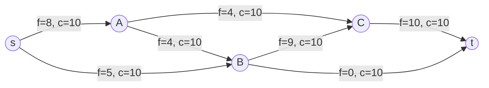
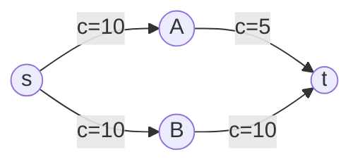
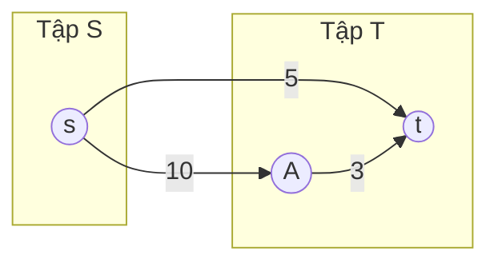
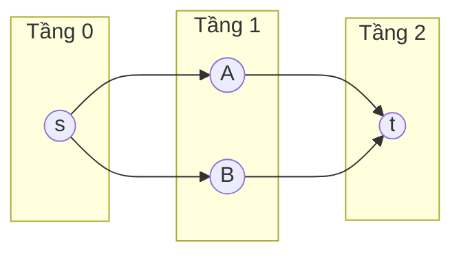
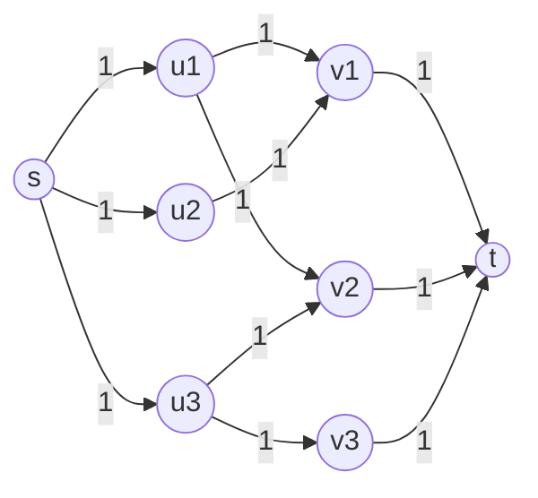

# Bài 41: Network Flow — Luồng Cực Đại

---

## 1. Bài toán luồng cực đại

### Bản chất vấn đề

Cho đồ thị có hướng $G = (V, E)$ với:

- **Nguồn** $s$: đỉnh bắt đầu
- **Bể** $t$: đỉnh kết thúc
- **Dung lượng** $c(u,v)$: lượng tối đa chảy qua cạnh $(u,v)$

Một **luồng hợp lệ** $f$ phải thỏa mãn hai ràng buộc:

1. **Ràng buộc dung lượng:** $0 \le f(u,v) \le c(u,v)$ với mọi cạnh
2. **Bảo toàn luồng:** Với mọi đỉnh $v \notin \{s, t\}$, tổng luồng vào bằng tổng luồng ra:

$$\sum_{u} f(u,v) = \sum_{w} f(v,w)$$

**Mục tiêu:** Tìm giá trị luồng cực đại $|f| = \sum_{v} f(s,v)$.

### Tư duy cốt lõi

Ẩn dụ đơn giản: hình dung một hệ thống ống nước. Nước chảy từ nguồn $s$ qua các ống có giới hạn dung lượng đến bể $t$. Câu hỏi là: tối đa bao nhiêu nước có thể chảy qua hệ thống?

Minh họa một mạng luồng nhỏ:



Trong sơ đồ trên, mỗi cạnh hiển thị $f/c$ (luồng hiện tại / dung lượng tối đa).

---

## 2. Ford-Fulkerson & Đồ thị dư

### Bản chất vấn đề

Ford-Fulkerson là **phương pháp** (framework) tổng quát, không phải một thuật toán cụ thể. Mọi thuật toán luồng cực đại đều dựa trên ý tưởng này.

### Tư duy cốt lõi

**Bước 1:** Bắt đầu với luồng $f = 0$ trên mọi cạnh.

**Bước 2:** Tìm một **đường tăng luồng** (augmenting path) từ $s$ đến $t$ trong **đồ thị dư**.

**Bước 3:** Tăng luồng dọc theo đường đó một lượng bằng **bottleneck** (cạnh nhỏ nhất trên đường đi).

**Bước 4:** Lặp lại cho đến khi không còn đường tăng luồng nào.

#### Đồ thị dư (Residual Graph)

Đồ thị dư là chìa khóa của toàn bộ lý thuyết. Với mỗi cạnh $(u,v)$ có dung lượng $c$ và luồng $f$:

- **Cạnh thuận:** từ $u$ đến $v$ với dung lượng dư $c - f$ (còn đẩy thêm được bao nhiêu)
- **Cạnh ngược:** từ $v$ đến $u$ với dung lượng dư $f$ (có thể "rút lại" bao nhiêu luồng)

**Tại sao cần cạnh ngược?** Khi ta đẩy luồng sai đường, cạnh ngược cho phép "hủy" luồng đó và đẩy lại theo hướng khác. Đây là cơ chế cốt lõi đảm bảo thuật toán luôn tìm được lời giải tối ưu.

#### Ví dụ minh họa

Xem xét mạng luồng ban đầu với 2 đường đi từ $s$ đến $t$:



**Lần 1:** Tìm đường $s \to A \to t$, bottleneck = 5. Đẩy luồng 5.

**Lần 2:** Tìm đường $s \to B \to t$, bottleneck = 10. Đẩy luồng 10.

Tổng luồng = 15 = dung lượng cắt nhỏ nhất $\{s\}$ vs $\{A, B, t\}$.

```matplotlib
plt.figure(figsize=(11, 6))

# Node positions
nodes = {
    's': (0, 3),
    'A': (3, 5),
    'B': (3, 1),
    'C': (6, 3),
    't': (9, 3),
}

# Edges: (from, to, capacity, flow, style)
edges = [
    ('s', 'A', 10, 8, '-'),
    ('s', 'B', 10, 5, '-'),
    ('A', 'C', 10, 4, '-'),
    ('A', 'B', 10, 4, '-'),
    ('B', 'C', 10, 9, '-'),
    ('C', 't', 10, 10, '-'),
    ('B', 't', 10, 0, '-'),
]

# Augmenting path: s -> B -> C -> t
augmenting = [('s', 'B'), ('B', 'C'), ('C', 't')]

# Draw edges
for u, v, cap, flow, style in edges:
    ux, uy = nodes[u]
    vx, vy = nodes[v]

    # Offset for bidirectional edges
    is_aug = (u, v) in augmenting
    color = '#e74c3c' if is_aug else '#34495e'
    lw = 3.5 if is_aug else 2
    alpha = 1.0 if is_aug else 0.7

    # Arrow
    dx, dy = vx - ux, vy - uy
    length = math.sqrt(dx**2 + dy**2)
    # Shorten to not overlap nodes
    shrink = 0.4
    sx_new = ux + dx / length * shrink
    sy_new = uy + dy / length * shrink
    ex_new = vx - dx / length * shrink
    ey_new = vy - dy / length * shrink

    plt.annotate('', xy=(ex_new, ey_new), xytext=(sx_new, sy_new),
                 arrowprops=dict(arrowstyle='->', color=color, lw=lw, alpha=alpha))

    # Label: flow/capacity
    mx = (ux + vx) / 2
    my = (uy + vy) / 2
    # Offset label perpendicular to edge
    offset_x = -dy / length * 0.4
    offset_y = dx / length * 0.4
    label = f'f={flow}, c={cap}'
    plt.text(mx + offset_x, my + offset_y, label, ha='center', va='center',
             fontsize=9, fontweight='bold', color=color,
             bbox=dict(boxstyle='round,pad=0.2', facecolor='white', edgecolor=color, alpha=0.9))

# Draw nodes
for name, (nx, ny) in nodes.items():
    if name == 's':
        color = '#27ae60'
        label_node = 'Nguồn s'
    elif name == 't':
        color = '#c0392b'
        label_node = 'Bể t'
    else:
        color = '#2980b9'
        label_node = name

    plt.plot(nx, ny, 'o', color=color, markersize=30, zorder=5)
    plt.text(nx, ny, name, ha='center', va='center',
             fontsize=14, fontweight='bold', color='white', zorder=6)

# Legend
from matplotlib.lines import Line2D
legend_elements = [
    Line2D([0], [0], marker='o', color='w', markerfacecolor='#27ae60', markersize=14, label='Nguồn (s)'),
    Line2D([0], [0], marker='o', color='w', markerfacecolor='#c0392b', markersize=14, label='Bể (t)'),
    Line2D([0], [0], color='#e74c3c', linewidth=3.5, label='Đường tăng luồng (augmenting path)'),
    Line2D([0], [0], color='#34495e', linewidth=2, label='Cạnh thường'),
]
plt.legend(handles=legend_elements, loc='upper left', fontsize=10)

# Info box
plt.text(9, 5.5, 'Tổng luồng = 15\n(= dung lượng cắt nhỏ nhất)',
         ha='right', va='top', fontsize=11, fontweight='bold',
         bbox=dict(boxstyle='round,pad=0.5', facecolor='#ffeaa7', edgecolor='#fdcb6e'))

plt.title('Mạng luồng: Đường tăng luồng s → B → C → t (bottleneck = 5)', fontsize=13)
plt.xlim(-1.5, 10.5)
plt.ylim(-0.5, 6.5)
plt.axis('off')
plt.tight_layout()
```

### Phân tích tính đúng đắn

**Định lý Max-Flow Min-Cut (Ford-Fulkerson 1956):** Luồng cực đại = Giá trị cắt nhỏ nhất.

**Cắt** $s$-$t$ là cách chia đỉnh thành hai tập $S$ và $T$ sao cho $s \in S$, $t \in T$. Giá trị cắt là tổng dung lượng các cạnh đi từ $S$ sang $T$:

$$c(S, T) = \sum_{u \in S, v \in T} c(u,v)$$

Minh họa cắt nhỏ nhất:



Giá trị cắt = $10 + 5 = 15$. Luồng cực đại không thể vượt quá 15, và ta đã đạt được 15.

**Chứng minh (phác thảo):**

- Luồng $\le$ cắt: Mọi đơn vị luồng từ $s$ đến $t$ phải đi qua ít nhất một cạnh trong cắt. Tổng luồng qua cắt $\le$ tổng dung lượng cắt.
- Luồng = cắt: Khi thuật toán dừng, tồn tại cắt mà luồng = giá trị cắt. Cạnh cắt đầy ($f = c$), các cạnh khác cân bằng.

### Đánh giá độ phức tạp

Nếu dùng DFS để tìm đường tăng, thuật toán có thể chạy vô hạn khi dung lượng là số vô tỉ. Với dung lượng nguyên, độ phức tạp là $O(E \cdot f^*)$ trong đó $f^*$ là luồng cực đại — có thể rất lớn.

---

## 3. Edmonds-Karp (BFS)

### Bản chất vấn đề

Edmonds-Karp là phiên bản cụ thể của Ford-Fulkerson, dùng **BFS** thay vì DFS để tìm đường tăng luồng. Sự thay đổi đơn giản này đảm bảo thuật toán luôn dừng trong thời gian đa thức.

### Tư duy cốt lõi

Thay vì tìm đường tăng bất kỳ, ta luôn tìm đường tăng **ngắn nhất** (ít cạnh nhất) bằng BFS.

**Tại sao ngắn nhất lại tốt?** Khi mỗi bước chỉ tìm đường ngắn nhất, ta có thể chứng minh rằng khoảng cách từ $s$ đến $t$ trong đồ thị dư **không giảm** sau mỗi lần tăng luồng. Điều này giới hạn số lần tăng luồng.

### Phân tích tính đúng đắn

**Bổ đề quan trọng:** Trong Edmonds-Karp, khoảng cách ngắn nhất từ $s$ đến $t$ trong đồ thị dư (gọi là $\delta$) không giảm sau mỗi lần tăng luồng.

**Chứng minh ý tưởng:** Giả sử sau khi tăng luồng, $\delta$ giảm. Xét đường tăng cuối cùng trước khi $\delta$ giảm. Đường đó phải đi qua ít nhất một cạnh "bị đầy" (trở thành cạnh ngược mới). Phân tích các trường hợp cho thấy điều này mâu dẩn.

Hệ quả: Mỗi cạnh chỉ có thể trở thành "critical edge" (cạnh bị đầy trên đường tăng) tối đa $O(V)$ lần. Tổng số lần tăng luồng là $O(VE)$.

### Đánh giá độ phức tạp

- Mỗi lần BFS: $O(E)$
- Số lần tăng luồng: $O(VE)$
- **Tổng:** $O(VE^2)$

### Cài đặt

=== "C++"

    ```cpp
    #include <bits/stdc++.h>
    using namespace std;

    struct Edge {
        int to, rev;
        long long cap, flow;
    };

    class EdmondsKarp {
    public:
        int n;
        vector<vector<Edge>> adj;

        EdmondsKarp(int n) : n(n), adj(n + 1) {}

        void addEdge(int u, int v, long long cap) {
            adj[u].push_back({v, (int)adj[v].size(), cap, 0});
            adj[v].push_back({u, (int)adj[u].size() - 1, 0, 0});
        }

        long long maxFlow(int s, int t) {
            long long total = 0;
            while (true) {
                vector<int> parent(n + 1, -1);
                vector<int> parentEdge(n + 1, -1);
                queue<int> q;
                q.push(s);
                parent[s] = s;

                while (!q.empty() && parent[t] == -1) {
                    int u = q.front(); q.pop();
                    for (int i = 0; i < (int)adj[u].size(); i++) {
                        Edge& e = adj[u][i];
                        if (parent[e.to] == -1 && e.cap - e.flow > 0) {
                            parent[e.to] = u;
                            parentEdge[e.to] = i;
                            q.push(e.to);
                        }
                    }
                }

                if (parent[t] == -1) break;

                long long bottleneck = LLONG_MAX;
                for (int v = t; v != s; v = parent[v]) {
                    int u = parent[v];
                    int idx = parentEdge[v];
                    bottleneck = min(bottleneck, adj[u][idx].cap - adj[u][idx].flow);
                }

                for (int v = t; v != s; v = parent[v]) {
                    int u = parent[v];
                    int idx = parentEdge[v];
                    adj[u][idx].flow += bottleneck;
                    adj[v][adj[u][idx].rev].flow -= bottleneck;
                }

                total += bottleneck;
            }
            return total;
        }
    };

    int main() {
        ios_base::sync_with_stdio(false);
        cin.tie(nullptr);

        int n, m;
        cin >> n >> m;

        EdmondsKarp mf(n);
        for (int i = 0; i < m; i++) {
            int u, v;
            long long cap;
            cin >> u >> v >> cap;
            mf.addEdge(u, v, cap);
        }

        cout << mf.maxFlow(1, n) << "\n";
        return 0;
    }
    ```

=== "Python"

    ```python
    from collections import deque

    class EdmondsKarp:
        def __init__(self, n):
            self.n = n
            self.adj = [[] for _ in range(n + 1)]

        def add_edge(self, u, v, cap):
            forward = [v, cap, 0, len(self.adj[v])]
            backward = [u, 0, 0, len(self.adj[u])]
            self.adj[u].append(forward)
            self.adj[v].append(backward)

        def max_flow(self, s, t):
            total = 0
            while True:
                parent = [-1] * (self.n + 1)
                parent_edge = [-1] * (self.n + 1)
                q = deque([s])
                parent[s] = s

                while q and parent[t] == -1:
                    u = q.popleft()
                    for i, e in enumerate(self.adj[u]):
                        v, cap, flow, rev = e
                        if parent[v] == -1 and cap - flow > 0:
                            parent[v] = u
                            parent_edge[v] = i
                            q.append(v)

                if parent[t] == -1:
                    break

                bottleneck = float('inf')
                v = t
                while v != s:
                    u = parent[v]
                    idx = parent_edge[v]
                    bottleneck = min(bottleneck, self.adj[u][idx][1] - self.adj[u][idx][2])
                    v = u

                v = t
                while v != s:
                    u = parent[v]
                    idx = parent_edge[v]
                    self.adj[u][idx][2] += bottleneck
                    rev_idx = self.adj[u][idx][3]
                    self.adj[v][rev_idx][2] -= bottleneck
                    v = u

                total += bottleneck
            return total

    n, m = map(int, input().split())
    mf = EdmondsKarp(n)
    for _ in range(m):
        u, v, cap = map(int, input().split())
        mf.add_edge(u, v, cap)
    print(mf.max_flow(1, n))
    ```

---

## 4. Dinic's Algorithm

### Bản chất vấn đề

Edmonds-Karp chạy $O(VE^2)$ — mỗi BFS tìm **một** đường tăng. Với đồ thị lớn (hàng chục nghìn đỉnh), ta cần thuật toán nhanh hơn. Dinic cải thiện bằng cách mỗi lần BFS xây dựng toàn bộ **đồ thị tầng**, sau đó dùng DFS đẩy **nhiều** đường tăng cùng lúc.

### Tư duy cốt lõi

Thuật toán gồm 2 giai đoạn lặp lại:

**Giai đoạn 1 — Xây đồ thị tầng (BFS):**

Dùng BFS đánh số "tầng" $level[v]$ cho mỗi đỉnh. Chỉ giữ cạnh $(u,v)$ nào thỏa mãn $level[v] = level[u] + 1$.

**Giai đoạn 2 — Tìm Blocking Flow (DFS):**

Trên đồ thị tầng, dùng DFS tìm nhiều đường tăng cùng lúc cho đến khi không còn đường nào. Kết quả gọi là **blocking flow** — luồng mà không còn đường tăng nào trên đồ thị tầng.



Sau khi blocking flow được tìm, ít nhất một cạnh trên mỗi đường tăng bị đầy. Đồ thị tầng cũ không còn hữu dụng → quay lại giai đoạn 1.

### Phân tích tính đúng đắn

**Bổ đề:** Khoảng cách $level[t]$ từ $s$ đến $t$ trong đồ thị dư **tăng ít nhất 1** sau mỗi giai đoạn.

**Chứng minh:** Khi blocking flow được tìm, mọi đường tăng ngắn nhất trong đồ thị tầng đều bị chặn. Đường tăng mới (nếu có) phải đi qua cạnh ngược mới tạo ra, tức là phải đi qua đỉnh ở tầng cao hơn → $level[t]$ tăng.

Hệ quả: Số giai đoạn (số lần BFS) tối đa là $V - 1$.

**Current Edge Optimization (Con trỏ `ptr`):**

Khi DFS tại đỉnh $u$ duyệt xong cạnh thứ $i$ mà không đẩy được luồng, lần sau không cần duyệt lại cạnh $0..i$. Dùng mảng $ptr[u]$ để nhớ vị trí đã duyệt. Nếu không dùng $ptr$, Dinic có thể chậm đi rất nhiều!

### Đánh giá độ phức tạp

- Số lần BFS: $O(V)$
- Mỗi giai đoạn DFS tổng cộng: $O(VE)$ (mỗi cạnh được duyệt tối đa một lần nhờ $ptr$)
- **Tổng:** $O(V^2 E)$

**Trường hợp đặc biệt — Đồ thị hai phía:** $O(E\sqrt{V})$. Vì mỗi đường tăng trong bipartite graph có độ dài cố định, số giai đoạn chỉ là $O(\sqrt{V})$.

### Cài đặt

=== "C++"

    ```cpp
    #include <bits/stdc++.h>
    using namespace std;

    struct Edge {
        int to, rev;
        long long cap, flow;
    };

    class Dinic {
    public:
        int n;
        vector<vector<Edge>> adj;
        vector<int> level;
        vector<int> ptr;

        Dinic(int n) : n(n), adj(n + 1), level(n + 1), ptr(n + 1) {}

        void addEdge(int u, int v, long long cap, bool directed = true) {
            adj[u].push_back({v, (int)adj[v].size(), cap, 0});
            adj[v].push_back({u, (int)adj[u].size() - 1, directed ? 0 : cap, 0});
        }

        bool bfs(int s, int t) {
            fill(level.begin(), level.end(), -1);
            level[s] = 0;
            queue<int> q;
            q.push(s);

            while (!q.empty()) {
                int u = q.front(); q.pop();
                for (auto& e : adj[u]) {
                    if (level[e.to] == -1 && e.cap - e.flow > 0) {
                        level[e.to] = level[u] + 1;
                        q.push(e.to);
                    }
                }
            }
            return level[t] != -1;
        }

        long long dfs(int u, int t, long long pushed) {
            if (u == t || pushed == 0) return pushed;

            for (int& cid = ptr[u]; cid < (int)adj[u].size(); cid++) {
                Edge& e = adj[u][cid];
                if (level[e.to] != level[u] + 1) continue;
                if (e.cap - e.flow <= 0) continue;

                long long tr = dfs(e.to, t, min(pushed, e.cap - e.flow));
                if (tr == 0) continue;

                e.flow += tr;
                adj[e.to][e.rev].flow -= tr;
                return tr;
            }
            return 0;
        }

        long long maxFlow(int s, int t) {
            long long total = 0;
            while (bfs(s, t)) {
                fill(ptr.begin(), ptr.end(), 0);
                while (long long pushed = dfs(s, t, LLONG_MAX)) {
                    total += pushed;
                }
            }
            return total;
        }

        vector<bool> minCut(int s) {
            vector<bool> visited(n + 1, false);
            queue<int> q;
            q.push(s);
            visited[s] = true;
            while (!q.empty()) {
                int u = q.front(); q.pop();
                for (auto& e : adj[u]) {
                    if (!visited[e.to] && e.cap - e.flow > 0) {
                        visited[e.to] = true;
                        q.push(e.to);
                    }
                }
            }
            return visited;
        }
    };

    int main() {
        ios_base::sync_with_stdio(false);
        cin.tie(nullptr);

        int n, m;
        cin >> n >> m;

        Dinic dinic(n);
        for (int i = 0; i < m; i++) {
            int u, v;
            long long cap;
            cin >> u >> v >> cap;
            dinic.addEdge(u, v, cap);
        }

        cout << dinic.maxFlow(1, n) << "\n";
        return 0;
    }
    ```

=== "Python"

    ```python
    from collections import deque
    import sys
    input = sys.stdin.readline

    class Dinic:
        def __init__(self, n):
            self.n = n
            self.adj = [[] for _ in range(n + 1)]
            self.level = [-1] * (n + 1)
            self.ptr = [0] * (n + 1)

        def add_edge(self, u, v, cap, directed=True):
            forward = [v, cap, 0, len(self.adj[v])]
            backward = [u, 0 if directed else cap, 0, len(self.adj[u])]
            self.adj[u].append(forward)
            self.adj[v].append(backward)

        def bfs(self, s, t):
            self.level = [-1] * (self.n + 1)
            self.level[s] = 0
            q = deque([s])
            while q:
                u = q.popleft()
                for e in self.adj[u]:
                    v, cap, flow, rev = e
                    if self.level[v] == -1 and cap - flow > 0:
                        self.level[v] = self.level[u] + 1
                        q.append(v)
            return self.level[t] != -1

        def dfs(self, u, t, pushed):
            if u == t or pushed == 0:
                return pushed
            while self.ptr[u] < len(self.adj[u]):
                e = self.adj[u][self.ptr[u]]
                v, cap, flow, rev = e
                if self.level[v] != self.level[u] + 1 or cap - flow <= 0:
                    self.ptr[u] += 1
                    continue
                tr = self.dfs(v, t, min(pushed, cap - flow))
                if tr == 0:
                    self.ptr[u] += 1
                    continue
                e[2] += tr
                self.adj[v][rev][2] -= tr
                return tr
            return 0

        def max_flow(self, s, t):
            total = 0
            while self.bfs(s, t):
                self.ptr = [0] * (self.n + 1)
                while True:
                    pushed = self.dfs(s, t, float('inf'))
                    if pushed == 0:
                        break
                    total += pushed
            return total

        def min_cut(self, s):
            visited = [False] * (self.n + 1)
            visited[s] = True
            q = deque([s])
            while q:
                u = q.popleft()
                for e in self.adj[u]:
                    v, cap, flow, rev = e
                    if not visited[v] and cap - flow > 0:
                        visited[v] = True
                        q.append(v)
            return visited

    n, m = map(int, input().split())
    dinic = Dinic(n)
    for _ in range(m):
        u, v, cap = map(int, input().split())
        dinic.add_edge(u, v, cap)
    print(dinic.max_flow(1, n))
    ```

---

## 5. Min-Cost Max-Flow

### Bản chất vấn đề

Giống max-flow, nhưng mỗi cạnh có thêm **chi phí** $cost(u,v)$. Mục tiêu kép:

1. Đẩy luồng cực đại từ $s$ đến $t$
2. Trong số các luồng cực đại, chọn luồng có **tổng chi phí nhỏ nhất**

$$\text{Cost}(f) = \sum_{(u,v) \in E} f(u,v) \cdot cost(u,v)$$

### Tư duy cốt lõi

**Thuật toán Successive Shortest Path:**

1. Bắt đầu với luồng $f = 0$
2. Trong đồ thị dư, mỗi cạnh có cost:
   - Cạnh thuận $(u,v)$: $cost(u,v)$
   - Cạnh ngược $(v,u)$: $-cost(u,v)$ (rút luồng → hoàn tiền)
3. Mỗi bước, tìm đường tăng có **chi phí nhỏ nhất** bằng SPFA hoặc Dijkstra với potential
4. Đẩy luồng dọc theo đường đó
5. Lặp cho đến khi không còn đường tăng

**Dijkstra với Potential (Nâng cao):**

SPFA chạy worst-case $O(VE)$ mỗi lần. Để cải thiện, dùng hàm tiềm năng $h[v]$:

- Lần đầu dùng Bellman-Ford/SPFA để tính $h[v]$
- Các lần sau, trọng số cạnh điều chỉnh thành $cost(u,v) + h[u] - h[v] \ge 0$
- Dùng Dijkstra thay SPFA → $O(F \cdot E \log V)$ thay vì $O(F \cdot VE)$

### Phân tích tính đúng đắn

Mỗi bước tìm đường ngắn nhất trong đồ thị dư. Cạnh ngược có cost âm (hoàn tiền), nhưng nhờ potential function, trọng số điều chỉnh luôn không âm → Dijkstra hoạt động đúng.

Khi không còn đường tăng, luồng hiện tại là luồng cực đại. Vì mỗi bước chọn đường chi phí nhỏ nhất, tổng chi phí được tối thiểu hóa trong số các luồng cực đại.

### Đánh giá độ phức tạp

- **SPFA:** $O(F \cdot VE)$ trong đó $F$ là giá trị luồng cực đại
- **Dijkstra + Potential:** $O(F \cdot E \log V)$

### Cài đặt

=== "C++"

    ```cpp
    #include <bits/stdc++.h>
    using namespace std;

    struct MCFEdge {
        int to, rev;
        long long cap, flow, cost;
    };

    class MinCostMaxFlow {
    public:
        int n;
        vector<vector<MCFEdge>> adj;
        vector<long long> dist, pot;
        vector<int> parent, parentEdge;
        const long long INF = 1e18;

        MinCostMaxFlow(int n) : n(n), adj(n + 1), dist(n + 1), pot(n + 1),
                                parent(n + 1), parentEdge(n + 1) {}

        void addEdge(int u, int v, long long cap, long long cost) {
            adj[u].push_back({v, (int)adj[v].size(), cap, 0, cost});
            adj[v].push_back({u, (int)adj[u].size() - 1, 0, 0, -cost});
        }

        bool spfa(int s, int t, long long& flow, long long& cost, long long maxFlow) {
            fill(dist.begin(), dist.end(), INF);
            vector<bool> inQueue(n + 1, false);
            dist[s] = 0;
            queue<int> q;
            q.push(s);
            inQueue[s] = true;

            while (!q.empty()) {
                int u = q.front(); q.pop();
                inQueue[u] = false;
                for (int i = 0; i < (int)adj[u].size(); i++) {
                    MCFEdge& e = adj[u][i];
                    if (e.cap - e.flow > 0 && dist[u] + e.cost < dist[e.to]) {
                        dist[e.to] = dist[u] + e.cost;
                        parent[e.to] = u;
                        parentEdge[e.to] = i;
                        if (!inQueue[e.to]) {
                            q.push(e.to);
                            inQueue[e.to] = true;
                        }
                    }
                }
            }

            if (dist[t] == INF) return false;

            long long pushFlow = maxFlow - flow;
            for (int v = t; v != s; v = parent[v]) {
                int u = parent[v];
                int idx = parentEdge[v];
                pushFlow = min(pushFlow, adj[u][idx].cap - adj[u][idx].flow);
            }

            for (int v = t; v != s; v = parent[v]) {
                int u = parent[v];
                int idx = parentEdge[v];
                adj[u][idx].flow += pushFlow;
                adj[v][adj[u][idx].rev].flow -= pushFlow;
            }

            flow += pushFlow;
            cost += pushFlow * dist[t];
            return true;
        }

        pair<long long, long long> mcmf(int s, int t, long long maxFlow = INF) {
            long long flow = 0, cost = 0;
            while (spfa(s, t, flow, cost, maxFlow)) {}
            return {flow, cost};
        }
    };

    int main() {
        ios_base::sync_with_stdio(false);
        cin.tie(nullptr);

        int n, m;
        cin >> n >> m;

        MinCostMaxFlow mcmf(n);
        for (int i = 0; i < m; i++) {
            int u, v;
            long long cap, cost;
            cin >> u >> v >> cap >> cost;
            mcmf.addEdge(u, v, cap, cost);
        }

        auto [flow, cost] = mcmf.mcmf(1, n);
        cout << flow << " " << cost << "\n";
        return 0;
    }
    ```

=== "Python"

    ```python
    from collections import deque
    import sys
    input = sys.stdin.readline

    class MinCostMaxFlow:
        def __init__(self, n):
            self.n = n
            self.adj = [[] for _ in range(n + 1)]
            self.INF = 10**18

        def add_edge(self, u, v, cap, cost):
            forward = [v, cap, 0, cost, len(self.adj[v])]
            backward = [u, 0, 0, -cost, len(self.adj[u])]
            self.adj[u].append(forward)
            self.adj[v].append(backward)

        def spfa(self, s, t, flow, max_flow):
            dist = [self.INF] * (self.n + 1)
            parent = [-1] * (self.n + 1)
            parent_edge = [-1] * (self.n + 1)
            in_queue = [False] * (self.n + 1)
            dist[s] = 0
            q = deque([s])
            in_queue[s] = True

            while q:
                u = q.popleft()
                in_queue[u] = False
                for i, e in enumerate(self.adj[u]):
                    v, cap, fl, cost, rev = e
                    if cap - fl > 0 and dist[u] + cost < dist[v]:
                        dist[v] = dist[u] + cost
                        parent[v] = u
                        parent_edge[v] = i
                        if not in_queue[v]:
                            q.append(v)
                            in_queue[v] = True

            if dist[t] == self.INF:
                return 0, 0

            push = max_flow - flow
            v = t
            while v != s:
                u = parent[v]
                idx = parent_edge[v]
                push = min(push, self.adj[u][idx][1] - self.adj[u][idx][2])
                v = u

            v = t
            while v != s:
                u = parent[v]
                idx = parent_edge[v]
                e = self.adj[u][idx]
                e[2] += push
                rev_idx = e[4]
                self.adj[v][rev_idx][2] -= push
                v = u

            return push, push * dist[t]

        def mcmf(self, s, t, max_flow=10**18):
            total_flow = 0
            total_cost = 0
            while True:
                f, c = self.spfa(s, t, total_flow, max_flow)
                if f == 0:
                    break
                total_flow += f
                total_cost += c
            return total_flow, total_cost

    n, m = map(int, input().split())
    mcmf = MinCostMaxFlow(n)
    for _ in range(m):
        u, v, cap, cost = map(int, input().split())
        mcmf.add_edge(u, v, cap, cost)
    flow, cost = mcmf.mcmf(1, n)
    print(flow, cost)
    ```

---

## 6. Ứng dụng

### 6.1 Khớp đôi đồ thị hai phía (Bipartite Matching)

Cho đồ thị hai phía $G = (U, V, E)$. Tìm tập cạnh đối lớn nhất.

**Giả bài toán về max-flow:**

1. Tạo đỉnh nguồn $s$, nối đến mọi đỉnh trong $U$ với dung lượng 1
2. Nối cạnh từ $U$ đến $V$ theo đồ thị gốc với dung lượng 1
3. Nối mọi đỉnh trong $V$ đến bể $t$ với dung lượng 1
4. Chạy max-flow → kết quả = kích thước khớp đôi lớn nhất



Max-flow = 3 → Khớp đôi lớn nhất có 3 cặp.

**Độ phức tạp:** $O(E\sqrt{V})$ nhờ tính chất đồ thị hai phía của Dinic.

### 6.2 Định lý König — Đỉnh bao nhỏ nhất

> **Định lý König:** Trong đồ thị hai phía, kích thước đỉnh bao nhỏ nhất = kích thước khớp đôi lớn nhất.

**Tìm đỉnh bao nhỏ nhất từ max-flow:**

1. Chạy max-flow trên đồ thị hai phía
2. Dùng BFS từ $s$ trong đồ thị dư, đánh dấu đỉnh reachable
3. Đỉnh bao = $(U \setminus \text{reachable}) \cup (V \cap \text{reachable})$

### 6.3 Tập độc lập lớn nhất trong đồ thị hai phía

Tập độc lập lớn nhất = $|V| -$ đỉnh bao nhỏ nhất = $|V| -$ khớp đôi lớn nhất.

### 6.4 Đường đi cạnh không chung (Edge-Disjoint Paths)

Tìm số đường đi từ $s$ đến $t$ sao cho không cạnh nào được dùng quá một lần.

**Giải:** Cho mỗi cạnh dung lượng 1, chạy max-flow. Kết quả = số đường đi cạnh không chung.

### 6.5 Truy vết cắt nhỏ nhất (Min Cut)

Sau khi chạy max-flow, dùng BFS/DFS từ $s$ trong đồ thị dư. Các đỉnh reachable thuộc tập $S$, còn lại thuộc tập $T$. Cạnh cắt là các cạnh từ $S$ sang $T$ trong đồ thị gốc mà đã đầy ($f = c$).

Hàm `minCut()` trong cài đặt Dinic ở mục 4 thực hiện chính xác việc này.

---

## 7. Lưu ý & Cạm bẫy

### 7.1 Quên cạnh ngược trong đồ thị dư

`addEdge(u, v, cap)` phải tạo **cả** cạnh $u \to v$ (dung lượng $cap$) **lẫn** cạnh $v \to u$ (dung lượng 0). Nếu quên cạnh ngược, thuật toán không thể "rút" luồng đã đẩy sai → sai kết quả!

### 7.2 Tràn số nguyên với dung lượng lớn

Dung lượng có thể lên đến $10^9$, tổng luồng có thể lên đến $10^{14}$. Bắt buộc dùng `long long` (int64), không dùng `int`!

### 7.3 MCMF với chu trình âm

Nếu đồ thị có chu trình âm trong chi phí, SPFA sẽ bị kẹt trong vòng lặp vô hạn. Đảm bảo đồ thị không có chu trình âm, hoặc dùng Bellman-Ford lần đầu để phát hiện.

### 7.4 Đồ thị có cạnh song song

Nhiều cạnh cùng chiều giữa hai đỉnh → không vấn đề, chỉ cần thêm tất cả vào danh sách cạnh.

### 7.5 Self-loop

Cạnh từ đỉnh về chính mình → có thể bỏ qua, không ảnh hưởng kết quả.

### 7.6 Đồ thị vô hướng

Cạnh vô hướng $(u,v)$ với dung lượng $c$ tương đương hai cạnh có hướng $(u,v)$ và $(v,u)$ cùng dung lượng $c$. Gọi `addEdge(u, v, cap)` và `addEdge(v, u, cap)`.

---

## 8. Bài tập luyện tập

| Bài | Nền tảng | Độ khó | Chủ đề |
|-----|----------|--------|--------|
| [CSES - Download Speed](https://cses.fi/problemset/task/1694) | CSES | ⭐⭐ | Max flow cơ bản |
| [CSES - Police Chase](https://cses.fi/problemset/task/1695) | CSES | ⭐⭐⭐ | Min cut |
| [CSES - School Dance](https://cses.fi/problemset/task/1696) | CSES | ⭐⭐ | Bipartite matching |
| [SPOJ - FASTFLOW](https://www.spoj.com/problems/FASTFLOW/) | SPOJ | ⭐⭐⭐ | Dinic với dung lượng lớn |
| [SPOJ - MATCHING](https://www.spoj.com/problems/MATCHING/) | SPOJ | ⭐⭐⭐ | Bipartite matching lớn |
| [CF 277E - Binary Tree on Plane](https://codeforces.com/problemset/problem/277/E) | CF | ⭐⭐⭐⭐ | MCMF |
| [LeetCode - Maximum Students Taking Exam](https://leetcode.com/problems/maximum-students-taking-exam/) | LeetCode | ⭐⭐⭐⭐ | Max flow / bitmask |

**Gợi ý giải:**

- **CSES Download Speed:** Bài mẫu max-flow. Cài Dinic hoặc Edmonds-Karp, chạy trực tiếp.
- **CSES Police Chase:** Chạy max-flow, rồi dùng BFS trên đồ thị dư để tìm cắt nhỏ nhất.
- **CSES School Dance:** Giả bài về bipartite matching → max-flow.
- **SPOJ FASTFLOW:** Dung lượng lớn → bắt buộc dùng Dinic (Edmonds-Karp sẽ TLE).
- **SPOJ MATCHING:** Đồ thị hai phía lớn → Dinic chạy $O(E\sqrt{V})$.
- **CF 277E:** Xây đồ thị, gán chi phí cho cạnh, chạy MCMF.

## Tóm tắt

| Thuật toán | Độ phức tạp | Khi nào dùng |
|-----------|-------------|---------------|
| Edmonds-Karp | $O(VE^2)$ | Đồ thị nhỏ, dễ cài |
| **Dinic** | $O(V^2 E)$ | Hầu hết bài max-flow |
| Dinic (bipartite) | $O(E\sqrt{V})$ | Khớp đôi đồ thị hai phía |
| MCMF (SPFA) | $O(F \cdot VE)$ | Luồng chi phí nhỏ nhất |
| MCMF (Dijkstra) | $O(F \cdot E \log V)$ | MCMF đồ thị lớn |

Hãy học thuộc cài đặt Dinic. Đây là thuật toán luồng phổ biến nhất trong competitive programming. Khi gặp bài liên quan đến flow, hãy nghĩ đến việc **mô hình hóa** bài toán thành mạng luồng trước!
