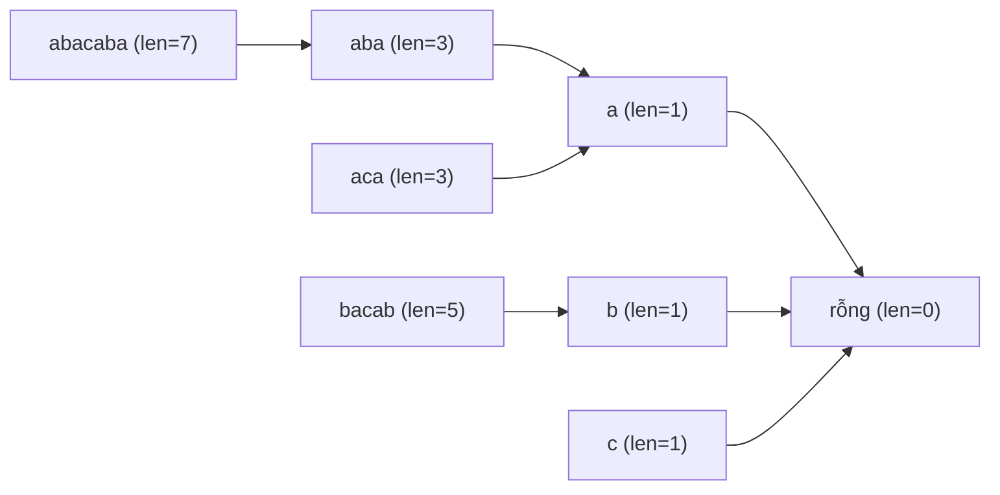

# Palindrome Tree (Eertree) - Cây Xâu Đối Xứng

> **Tác giả:** FPTOJ Team<br>
> **Nội dung tham khảo từ:** CP-Algorithms - Palindrome Tree

---

## 1. Bản chất vấn đề

### Bài toán: Đếm số palindrome con phân biệt

Cho xâu $S$ độ dài $N$. Đếm số **xâu con palindrome phân biệt** trong $S$.

**Cách thường:** Duyệt tất cả $O(N^2)$ xâu con, kiểm tra palindrome $O(N)$ mỗi xâu $\Rightarrow O(N^3)$.

**Palindrome Tree (Eertree):** Xây dựng trong $O(N)$, mỗi palindrome là 1 nút trong cây.

### So sánh

| Phương pháp | Thời gian | Không gian |
|-------------|-----------|------------|
| Duyệt + Manacher | $O(N^2)$ | $O(N)$ |
| Hashing | $O(N^2)$ | $O(N^2)$ |
| **Palindrome Tree** | $O(N)$ | $O(N)$ |

---

## 2. Tư duy cốt lõi

### Cấu trúc cây

Palindrome Tree có 2 gốc:

- **Node $-1$:** Gốc ảo (độ dài $-1$),方便处理 lẻ palindrome.
- **Node $0$:** Gốc cho chẵn palindrome (độ dài $0$).

Mỗi nút đại diện cho 1 palindrome duy nhất. Cạnh $c$ từ node $u$ đến node $v$ nghĩa là: palindrome $v$ = $c$ + palindrome $u$ + $c$.

Mỗi nút lưu:

- `len`: độ dài palindrome
- `link`: suffix link (palindrome đối xứng dài nhất là hậu tố đúng của palindrome hiện tại)
- `next[c]`: palindrome con khi thêm ký tự $c$ vào 2 đầu

### Trace chi tiết

**Xâu:** $S = \text{"abacaba"}$

| Bước | Ký tự | Palindrome mới tạo | Độ dài | Suffix link |
|------|--------|-------------------|--------|-------------|
| 0 | $a$ | $a$ | 1 | → node 0 (rỗng) |
| 1 | $b$ | $b$ | 1 | → node 0 |
| 2 | $a$ | $aba$ | 3 | → node $a$ |
| 3 | $c$ | $c$ | 1 | → node 0 |
| 4 | $a$ | $aca$ | 3 | → node $a$ |
| 5 | $b$ | $bacab$ | 5 | → node $b$ |
| 6 | $a$ | $abacaba$ | 7 | → node $aba$ |

**Tổng palindrome phân biệt:** $\{a, b, c, aba, aca, bacab, abacaba\}$ = **7**.

### Suffix Link

Suffix link của node $u$ là palindrome đối xứng dài nhất **đúng là hậu tố** của palindrome $u$.

Ví dụ: suffix link của $abacaba$ → $aba$ (vì $aba$ là hậu tố đúng của $abacaba$ và là palindrome).



---

## 3. Phân tích tính đúng đắn

### Tại sao mỗi nút là palindrome duy nhất?

Khi thêm ký tự $c$ vào 2 đầu palindrome $P$, ta được palindrome $cPc$. Nếu $cPc$ chưa tồn tại trong cây, tạo nút mới.

Suffix link đảm bảo mỗi palindrome chỉ được tạo đúng 1 lần.

### Tại sao suffix link tạo cây?

Suffix link của palindrome $P$ luôn ngắn hơn $P$ (trừ node gốc). Do đó, suffix link tạo thành cây có gốc là node $0$ (palindrome rỗng).

---

## 4. Đánh giá độ phức tạp

| Thao tác | Thời gian | Không gian |
|----------|-----------|------------|
| Xây Palindrome Tree | $O(N)$ | $O(N \cdot |\Sigma|)$ |
| Đếm palindrome phân biệt | $O(N)$ | $O(1)$ |
| Số palindrome kết thúc tại vị trí $i$ | $O(1)$ mỗi vị trí | $O(1)$ |

$|\Sigma|$ = kích thước bảng chữ cái.

---

## Code minh họa

=== "C++"

    ```cpp
    #include <bits/stdc++.h>
    using namespace std;

    struct PalindromeTree {
        struct Node {
            int len, link;
            int next[26];
            Node() : len(0), link(0) { memset(next, 0, sizeof(next)); }
        };

        string s;
        vector<Node> tree;
        int last, sz;

        PalindromeTree() {
            tree.resize(2);
            tree[0].len = -1; tree[0].link = 0;
            tree[1].len = 0;  tree[1].link = 0;
            last = 1; sz = 2;
        }

        void extend(int pos) {
            int cur = last;
            int c = s[pos] - 'a';

            while (true) {
                int curlen = tree[cur].len;
                if (pos - 1 - curlen >= 0 && s[pos - 1 - curlen] == s[pos])
                    break;
                cur = tree[cur].link;
            }

            if (tree[cur].next[c]) {
                last = tree[cur].next[c];
                return;
            }

            last = sz++;
            tree.push_back(Node());
            tree[last].len = tree[cur].len + 2;
            tree[cur].next[c] = last;

            if (tree[last].len == 1) {
                tree[last].link = 1;
                return;
            }

            cur = tree[cur].link;
            while (true) {
                int curlen = tree[cur].len;
                if (pos - 1 - curlen >= 0 && s[pos - 1 - curlen] == s[pos])
                    break;
                cur = tree[cur].link;
            }
            tree[last].link = tree[cur].next[c];
        }

        int countDistinct() {
            return sz - 2; // trừ 2 node gốc
        }
    };

    int main() {
        string s;
        cin >> s;

        PalindromeTree pt;
        pt.s = s;

        for (int i = 0; i < (int)s.size(); i++) {
            pt.extend(i);
        }

        cout << pt.countDistinct() << "\n";
        return 0;
    }
    ```

=== "Python"

    ```python
    class PalindromeTree:
        def __init__(self):
            self.tree = [{'len': -1, 'link': 0, 'next': {}},
                         {'len': 0, 'link': 0, 'next': {}}]
            self.last = 1
            self.s = ''

        def extend(self, pos):
            c = self.s[pos]
            cur = self.last
            while True:
                curlen = self.tree[cur]['len']
                if pos - 1 - curlen >= 0 and self.s[pos - 1 - curlen] == c:
                    break
                cur = self.tree[cur]['link']

            if c in self.tree[cur]['next']:
                self.last = self.tree[cur]['next'][c]
                return

            new_node = len(self.tree)
            self.tree.append({'len': self.tree[cur]['len'] + 2, 'link': 0, 'next': {}})
            self.tree[cur]['next'][c] = new_node
            self.last = new_node

            if self.tree[new_node]['len'] == 1:
                self.tree[new_node]['link'] = 1
                return

            cur = self.tree[cur]['link']
            while True:
                curlen = self.tree[cur]['len']
                if pos - 1 - curlen >= 0 and self.s[pos - 1 - curlen] == c:
                    break
                cur = self.tree[cur]['link']
            self.tree[new_node]['link'] = self.tree[cur]['next'][c]

        def count_distinct(self):
            return len(self.tree) - 2

    s = input().strip()
    pt = PalindromeTree()
    pt.s = s
    for i in range(len(s)):
        pt.extend(i)
    print(pt.count_distinct())
    ```
