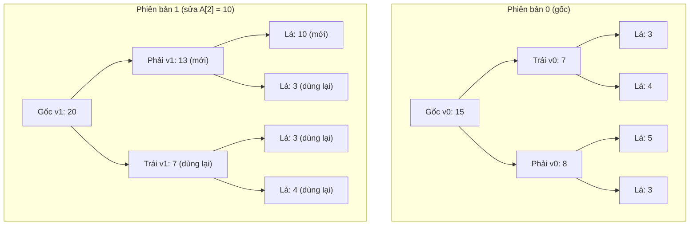

# Persistent Data Structures - Lưu Lịch Sử Thay Đổi

> **Tác giả:** FPTOJ Team<br>
> **Nội dung tham khảo từ:** VNOI Wiki - Persistent Data Structures, CP-Algorithms

---

## 1. Bản chất vấn đề

### Bài toán: Truy vấn tổng đoạn trên phiên bản cũ

Cho mảng $A$ gồm $N$ phần tử, thực hiện $Q$ truy vấn:

- **Type 1:** `update(i, v)` — Gán $A_i = v$.
- **Type 2:** `query(ver, l, r)` — Truy vấn tổng đoạn $[l, r]$ trên **phiên bản thứ `ver`**.

**Vấn đề:** Nếu lưu toàn bộ mảng cho mỗi phiên bản $\Rightarrow O(N \cdot Q)$ bộ nhớ $\Rightarrow$ **tràn bộ nhớ!**

**Giải pháp:** Persistent Segment Tree — chỉ lưu **các nút thay đổi** giữa các phiên bản.

### So sánh

| Cấu trúc | Thời gian cập nhật | Thời gian truy vấn | Không gian |
|----------|-------------------|--------------------|------------| 
| Segment Tree thường | $O(\log N)$ | $O(\log N)$ | $O(N)$ |
| Copy toàn bộ mảng | $O(N)$ | $O(1)$ | $O(N \cdot Q)$ |
| **Persistent Segment Tree** | $O(\log N)$ | $O(\log N)$ | $O(N + Q \log N)$ |

```matplotlib
import numpy as np

N = 1000
Q = np.arange(100, 5001, 100)

fig, ax = plt.subplots(figsize=(10, 5))

space_copy = N * Q
space_persistent = N + Q * np.log2(N)

ax.plot(Q, space_copy / 1e6, label='Copy toàn bộ: O(N·Q)', linewidth=2.5, color='#e74c3c')
ax.plot(Q, space_persistent / 1e6, label='Persistent: O(N + Q·log N)', linewidth=2.5, color='#2ecc71')

ax.set_xlabel('Số truy vấn Q', fontsize=12)
ax.set_ylabel('Không gian (triệu nút)', fontsize=12)
ax.set_title('So sánh không gian: Copy toàn bộ vs Persistent Segment Tree\n(N = 1000)', fontsize=13)
ax.legend(fontsize=11)
ax.grid(True, alpha=0.3)

ax.annotate('Persistent tiết kiệm\nrất nhiều bộ nhớ!',
            xy=(3000, (N + 3000 * np.log2(N)) / 1e6),
            xytext=(1500, (N * 3000) / 1e6 * 0.6),
            fontsize=11, color='#2ecc71', fontweight='bold',
            arrowprops=dict(arrowstyle='->', color='#2ecc71', lw=1.5))

plt.tight_layout()
```

---

## 2. Tư duy cốt lõi

### Ý tưởng: Path Copying

Khi cập nhật 1 phần tử, chỉ có $O(\log N)$ nút trên đường đi từ gốc đến lá bị thay đổi. Thay vì sửa trực tiếp, ta **tạo bản sao** của các nút đó và liên kết với các nút cũ.



Các nút màu "dùng lại" là con trỏ trỏ đến nút cũ — không tốn thêm bộ nhớ!

### Cấu trúc nút

Mỗi nút lưu:

- `left`, `right`: con trỏ đến con trái, con phải
- `sum`: tổng đoạn mà nút quản lý

Khi cập nhật, tạo nút mới cho mỗi nút trên đường đi, các nút còn lại giữ nguyên.

### Trace chi tiết

**Mảng ban đầu:** $A = [3, 4, 5, 3]$ (phiên bản 0)

**Truy vấn:** `update(2, 10)` (phiên bản 1) — sửa $A_2$ từ $5$ thành $10$.

**Cây phiên bản 0:**

| Nút | Đoạn | Tổng | Con trái | Con phải |
|-----|------|------|----------|----------|
| node0 | $[0, 3]$ | $15$ | node1 | node2 |
| node1 | $[0, 1]$ | $7$ | node3 (lá: 3) | node4 (lá: 4) |
| node2 | $[2, 3]$ | $8$ | node5 (lá: 5) | node6 (lá: 3) |

**Cập nhật $A_2 = 10$:**

| Bước | Nút cũ | Nút mới tạo | Giá trị mới |
|------|--------|-------------|-------------|
| 1 | node5 (lá, $A_2$) | node7 | $10$ |
| 2 | node2 (quản lý $[2,3]$) | node8 | $10 + 3 = 13$ |
| 3 | node0 (gốc) | node9 | $7 + 13 = 20$ |

Các nút node1, node3, node4, node6 **không thay đổi** — giữ nguyên con trỏ.

**Cây phiên bản 1:**

| Nút | Đoạn | Tổng | Con trái | Con phải |
|-----|------|------|----------|----------|
| node9 | $[0, 3]$ | $20$ | node1 (cũ) | node8 (mới) |
| node8 | $[2, 3]$ | $13$ | node7 (mới) | node6 (cũ) |
| node7 | $[2, 2]$ | $10$ | — | — |

---

## 3. Phân tích tính đúng đắn

### Tại sao truy vấn trên phiên bản cũ vẫn đúng?

Mỗi phiên bản là 1 cây nhị phân đầy đủ. Gốc của phiên bản $v$ là `root[v]`. Khi truy vấn, duyệt từ `root[v]` xuống lá — tất cả nút trên đường đi đều tồn tại (nút mới hoặc nút cũ được liên kết).

### Tại sao không gian là $O(N + Q \log N)$?

- Xây cây ban đầu: $O(N)$ nút.
- Mỗi lần cập nhật: tạo $O(\log N)$ nút mới.
- $Q$ lần cập nhật: $O(Q \log N)$ nút.
- Tổng: $O(N + Q \log N)$.

---

## 4. Đánh giá độ phức tạp

| Thao tác | Thời gian | Không gian |
|----------|-----------|------------|
| Xây cây phiên bản 0 | $O(N)$ | $O(N)$ |
| Cập nhật (tạo phiên bản mới) | $O(\log N)$ | $O(\log N)$ |
| Truy vấn tổng đoạn | $O(\log N)$ | $O(1)$ |
| Truy vấn phiên bản $k$ | $O(\log N)$ | $O(1)$ |

---

## Code minh họa

### Persistent Segment Tree — Truy vấn tổng đoạn theo phiên bản

=== "C++"

    ```cpp
    #include <bits/stdc++.h>
    using namespace std;

    struct Node {
        int left = -1, right = -1;
        long long sum = 0;
    };

    vector<Node> tree;
    vector<int> roots; // gốc của mỗi phiên bản

    int build(vector<int>& a, int lo, int hi) {
        int id = tree.size();
        tree.push_back(Node());
        if (lo == hi) {
            tree[id].sum = a[lo];
            return id;
        }
        int mid = (lo + hi) / 2;
        tree[id].left = build(a, lo, mid);
        tree[id].right = build(a, mid + 1, hi);
        tree[id].sum = tree[tree[id].left].sum + tree[tree[id].right].sum;
        return id;
    }

    int update(int old, int lo, int hi, int pos, long long val) {
        int id = tree.size();
        tree.push_back(tree[old]); // copy nút cũ
        if (lo == hi) {
            tree[id].sum = val;
            return id;
        }
        int mid = (lo + hi) / 2;
        if (pos <= mid)
            tree[id].left = update(tree[old].left, lo, mid, pos, val);
        else
            tree[id].right = update(tree[old].right, mid + 1, hi, pos, val);
        tree[id].sum = tree[tree[id].left].sum + tree[tree[id].right].sum;
        return id;
    }

    long long query(int id, int lo, int hi, int l, int r) {
        if (r < lo || hi < l) return 0;
        if (l <= lo && hi <= r) return tree[id].sum;
        int mid = (lo + hi) / 2;
        return query(tree[id].left, lo, mid, l, r) +
               query(tree[id].right, mid + 1, hi, l, r);
    }

    int main() {
        ios_base::sync_with_stdio(false);
        cin.tie(NULL);

        int n, q;
        cin >> n >> q;
        vector<int> a(n);
        for (int i = 0; i < n; i++) cin >> a[i];

        roots.push_back(build(a, 0, n - 1));

        while (q--) {
            int type;
            cin >> type;
            if (type == 1) {
                int pos, val;
                cin >> pos >> val;
                pos--;
                int newRoot = update(roots.back(), 0, n - 1, pos, val);
                roots.push_back(newRoot);
            } else {
                int ver, l, r;
                cin >> ver >> l >> r;
                ver--; l--; r--;
                cout << query(roots[ver], 0, n - 1, l, r) << "\n";
            }
        }
        return 0;
    }
    ```

=== "Python"

    ```python
    import sys
    input = sys.stdin.readline
    sys.setrecursionlimit(1 << 25)

    class Node:
        __slots__ = ['left', 'right', 'sum_val']
        def __init__(self, left=-1, right=-1, sum_val=0):
            self.left = left
            self.right = right
            self.sum_val = sum_val

    tree = []
    roots = []

    def build(a, lo, hi):
        node_id = len(tree)
        tree.append(Node())
        if lo == hi:
            tree[node_id].sum_val = a[lo]
            return node_id
        mid = (lo + hi) // 2
        tree[node_id].left = build(a, lo, mid)
        tree[node_id].right = build(a, mid + 1, hi)
        tree[node_id].sum_val = tree[tree[node_id].left].sum_val + tree[tree[node_id].right].sum_val
        return node_id

    def update(old, lo, hi, pos, val):
        node_id = len(tree)
        tree.append(Node(tree[old].left, tree[old].right, tree[old].sum_val))
        if lo == hi:
            tree[node_id].sum_val = val
            return node_id
        mid = (lo + hi) // 2
        if pos <= mid:
            tree[node_id].left = update(tree[old].left, lo, mid, pos, val)
        else:
            tree[node_id].right = update(tree[old].right, mid + 1, hi, pos, val)
        tree[node_id].sum_val = tree[tree[node_id].left].sum_val + tree[tree[node_id].right].sum_val
        return node_id

    def query(node_id, lo, hi, l, r):
        if r < lo or hi < l:
            return 0
        if l <= lo and hi <= r:
            return tree[node_id].sum_val
        mid = (lo + hi) // 2
        return query(tree[node_id].left, lo, mid, l, r) + query(tree[node_id].right, mid + 1, hi, l, r)

    n, q = map(int, input().split())
    a = list(map(int, input().split()))

    roots.append(build(a, 0, n - 1))

    for _ in range(q):
        parts = list(map(int, input().split()))
        if parts[0] == 1:
            pos, val = parts[1] - 1, parts[2]
            new_root = update(roots[-1], 0, n - 1, pos, val)
            roots.append(new_root)
        else:
            ver, l, r = parts[1] - 1, parts[2] - 1, parts[3] - 1
            print(query(roots[ver], 0, n - 1, l, r))
    ```
