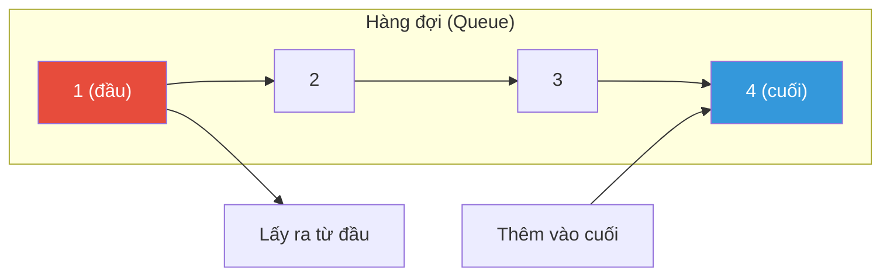
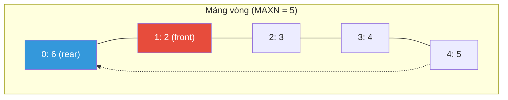
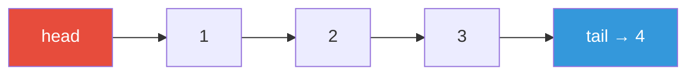
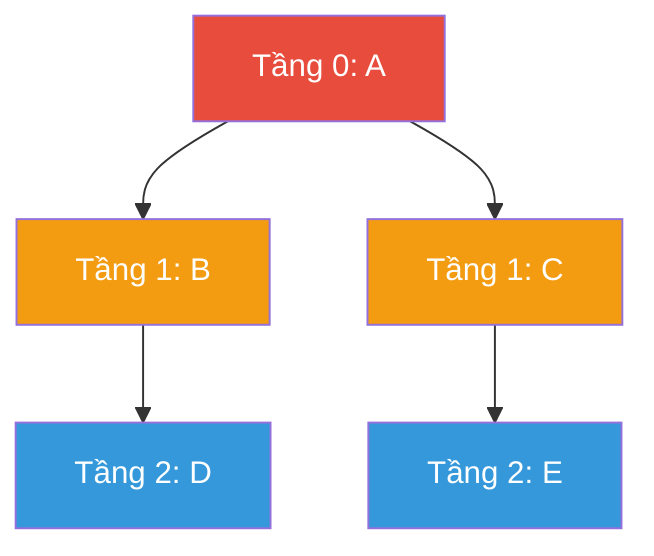
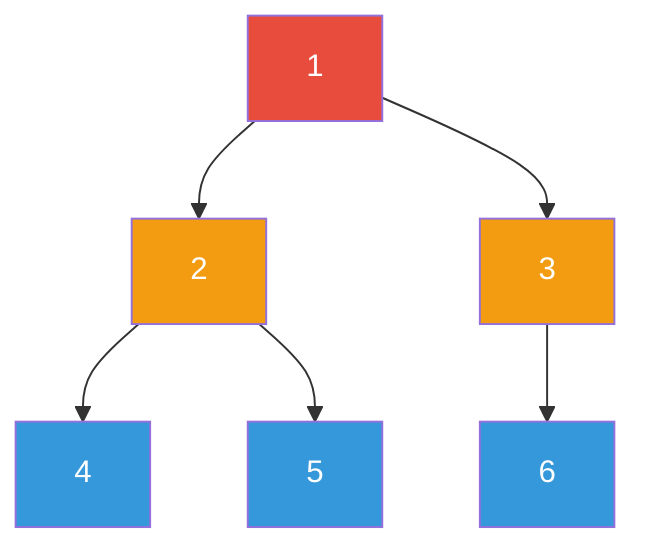

# Bài 34: Queue — Hàng Đợi

> **Tác giả:** Hà Trí Kiên
> **Nội dung tham khảo từ:** GeeksforGeeks, VNOI Wiki, CP-Algorithms

---

## Bản chất vấn đề

### Bài toán cốt lõi

Trong nhiều bài toán, ta cần quản lý một tập hợp phần tử theo nguyên tắc **ai đến trước, phục vụ trước**. Ví dụ: hàng người xếp hàng, các yêu cầu xử lý trong hệ điều hành, các bước duyệt đồ thị theo tầng.

Nếu dùng mảng thường, thao tác xóa phần tử đầu tiên tốn $O(N)$ vì phải dời toàn bộ các phần tử còn lại. Nếu dùng linked list, thao tác này chỉ $O(1)$ nhưng truy cập ngẫu nhiên kém.

**Queue** giải quyết bài toán này bằng cách giới hạn truy cập vào **hai đầu** — thêm vào cuối, xóa từ đầu — đảm bảo tất cả thao tác cơ bản đều $O(1)$.

### Định nghĩa

Queue là cấu trúc dữ liệu hoạt động theo nguyên tắc **FIFO** (First In, First Out): phần tử được thêm vào trước sẽ được lấy ra trước.



### So sánh Stack và Queue

| Tiêu chí | Stack (Ngăn xếp) | Queue (Hàng đợi) |
|----------|-------------------|-------------------|
| Nguyên tắc | LIFO: Vào sau, ra trước | FIFO: Vào trước, ra trước |
| Thêm phần tử | `push` vào đỉnh | `push` vào cuối |
| Lấy phần tử | `pop` từ đỉnh | `pop` từ đầu |
| Ứng dụng | Đệ quy, DFS, toán tử | BFS, lập lịch, mô phỏng |

### Các thao tác cơ bản

| Thao tác | Ý nghĩa | Độ phức tạp |
|----------|----------|-------------|
| `push(x)` | Thêm `x` vào cuối hàng | $O(1)$ |
| `pop()` | Loại bỏ và trả về phần tử đầu hàng | $O(1)$ |
| `front()` | Xem phần tử đầu hàng (không xóa) | $O(1)$ |
| `back()` | Xem phần tử cuối hàng (không xóa) | $O(1)$ |
| `empty()` | Kiểm tra hàng có rỗng không | $O(1)$ |
| `size()` | Trả về số phần tử hiện tại | $O(1)$ |

Tất cả đều $O(1)$ vì queue chỉ cập nhật con trỏ đầu/cuối, không cần dời phần tử.

---

## Tư duy cốt lõi

### Cách 1: Mảng vòng (Circular Array)

**Ý tưởng:** Dùng một mảng cố định với hai con trỏ `front` và `rear`. Khi con trỏ chạm cuối mảng, nó quay vòng về đầu bằng phép toán modulo.

**Vấn đề của mảng thường:**

Khi xóa phần tử đầu, ta phải dời toàn bộ mảng sang trái — $O(N)$.

**Giải pháp:** Giữ nguyên vị trí, chỉ tăng con trỏ `front`. Khi `rear` chạm cuối mảng, quay vòng về vị trí 0.

```
Mảng kích thước MAXN, chỉ số từ 0 đến MAXN-1

front → chỉ vào phần tử đầu tiên trong hàng
rear  → chỉ vào vị trí trống tiếp theo để thêm

Mỗi phần tử: arr[front], arr[front+1], ..., arr[rear-1]

Khi rear = MAXN - 1 và cần thêm:
    rear = (rear + 1) % MAXN = 0  → quay về đầu mảng
```

**Mô hình mảng vòng minh hoạ bằng Mermaid:**



Trạng thái: `front = 1`, `rear = 0` (đã quay vòng). Hàng đợi gồm: `arr[1]=2`, `arr[2]=3`, `arr[3]=4`, `arr[4]=5`, `arr[0]=6`.

**Bảng trace các thao tác:**

| Thao tác | `front` | `rear` | Mảng (chỉ mục có dữ liệu) | Kết quả |
|----------|---------|--------|----------------------------|---------|
| `push(1)` | 0 | 1 | `[1, _, _, _, _]` | — |
| `push(2)` | 0 | 2 | `[1, 2, _, _, _]` | — |
| `push(3)` | 0 | 3 | `[1, 2, 3, _, _]` | — |
| `pop()` | 1 | 3 | `[_, 2, 3, _, _]` | trả về 1 |
| `push(4)` | 1 | 4 | `[_, 2, 3, 4, _]` | — |
| `push(5)` | 1 | 0 | `[_, 2, 3, 4, 5]` | — |
| `push(6)` | 2 | 0 | `[6, 2, 3, 4, 5]` | quay vòng! |

=== "C++"

    ```cpp
    const int MAXN = 100005;

    struct Queue {
        int arr[MAXN];
        int front_idx = 0;
        int rear_idx = 0;
        int cnt = 0;

        void push(int val) {
            if (cnt >= MAXN) return;
            arr[rear_idx] = val;
            rear_idx = (rear_idx + 1) % MAXN;
            cnt++;
        }

        int pop() {
            if (cnt == 0) return -1;
            int val = arr[front_idx];
            front_idx = (front_idx + 1) % MAXN;
            cnt--;
            return val;
        }

        int front() {
            if (cnt == 0) return -1;
            return arr[front_idx];
        }

        int back() {
            if (cnt == 0) return -1;
            return arr[(rear_idx - 1 + MAXN) % MAXN];
        }

        int size() { return cnt; }
        bool empty() { return cnt == 0; }
    };
    ```

=== "Python"

    ```python
    class Queue:
        def __init__(self, capacity=100005):
            self.arr = [0] * capacity
            self.capacity = capacity
            self.front_idx = 0
            self.rear_idx = 0
            self.cnt = 0

        def push(self, val):
            if self.cnt >= self.capacity:
                return
            self.arr[self.rear_idx] = val
            self.rear_idx = (self.rear_idx + 1) % self.capacity
            self.cnt += 1

        def pop(self):
            if self.cnt == 0:
                return -1
            val = self.arr[self.front_idx]
            self.front_idx = (self.front_idx + 1) % self.capacity
            self.cnt -= 1
            return val

        def front(self):
            if self.cnt == 0:
                return -1
            return self.arr[self.front_idx]

        def back(self):
            if self.cnt == 0:
                return -1
            return self.arr[(self.rear_idx - 1 + self.capacity) % self.capacity]

        def size(self):
            return self.cnt

        def empty(self):
            return self.cnt == 0
    ```

### Cách 2: Linked List

**Ý tưởng:** Dùng danh sách liên kết đơn với hai con trỏ `head` (đầu hàng) và `tail` (cuối hàng). Thêm node mới vào `tail`, xóa node từ `head`.



=== "C++"

    ```cpp
    struct Node {
        int data;
        Node* next;
        Node(int val) : data(val), next(nullptr) {}
    };

    struct QueueLL {
        Node* head = nullptr;
        Node* tail = nullptr;
        int cnt = 0;

        void push(int val) {
            Node* newNode = new Node(val);
            if (!tail) {
                head = tail = newNode;
            } else {
                tail->next = newNode;
                tail = newNode;
            }
            cnt++;
        }

        int pop() {
            if (!head) return -1;
            int val = head->data;
            Node* temp = head;
            head = head->next;
            if (!head) tail = nullptr;
            delete temp;
            cnt--;
            return val;
        }

        int front() { return head ? head->data : -1; }
        int size() { return cnt; }
        bool empty() { return cnt == 0; }
    };
    ```

=== "Python"

    ```python
    class Node:
        def __init__(self, val):
            self.data = val
            self.next = None

    class QueueLL:
        def __init__(self):
            self.head = None
            self.tail = None
            self.cnt = 0

        def push(self, val):
            new_node = Node(val)
            if not self.tail:
                self.head = self.tail = new_node
            else:
                self.tail.next = new_node
                self.tail = new_node
            self.cnt += 1

        def pop(self):
            if not self.head:
                return -1
            val = self.head.data
            self.head = self.head.next
            if not self.head:
                self.tail = None
            self.cnt -= 1
            return val

        def front(self):
            return self.head.data if self.head else -1

        def size(self):
            return self.cnt

        def empty(self):
            return self.cnt == 0
    ```

### So sánh hai cách cài đặt

| Tiêu chí | Circular Array | Linked List |
|----------|----------------|-------------|
| Bộ nhớ | Cấp phát tĩnh, liền kề | Cấp phát động, linh hoạt |
| Cache performance | Tốt (bộ nhớ liền kề) | Kém (nhảy địa chỉ) |
| Cài đặt | Cần biết kích thước tối đa | Không cần |
| Thi đấu | Dùng `std::queue` hoặc `deque` | Dùng `std::queue` |

### Cách 3: Thư viện chuẩn

Trong thi đấu, dùng thư viện chuẩn là ưu tiên hàng đầu.

=== "C++"

    ```cpp
    #include <iostream>
    #include <queue>
    using namespace std;

    int main() {
        queue<int> q;

        q.push(1);
        q.push(2);
        q.push(3);

        cout << q.front() << "\n";  // 1
        cout << q.back() << "\n";   // 3

        q.pop();
        cout << q.front() << "\n";  // 2
        cout << q.size() << "\n";   // 2
        cout << q.empty() << "\n";  // 0 (false)

        // Hoán đổi 2 queue — O(1)
        queue<int> q2;
        q.swap(q2);
    }
    ```

=== "Python"

    ```python
    from collections import deque

    q = deque()

    q.append(1)
    q.append(2)
    q.append(3)

    print(q[0])      # 1 (phần tử đầu)
    print(q[-1])     # 3 (phần tử cuối)

    q.popleft()
    print(q[0])      # 2
    print(len(q))    # 2

    if not q:
        print("Queue rỗng!")
    ```

!!! warning "Lưu ý Python"
    Dùng `collections.deque` thay vì `list` cho queue! `list.pop(0)` là $O(N)$ vì phải dời toàn bộ mảng, còn `deque.popleft()` là $O(1)$.

---

## Phân tích tính đúng đắn

### Circular Array — Tại sao modulo đảm bảo đúng?

**Tính chất quan trọng:**

1. **Con trỏ không vượt quá mảng:** `(rear + 1) % MAXN` luôn trả về giá trị trong khoảng $[0, MAXN-1]$, không bao giờ truy cập ngoài mảng.

2. **FIFO được giữ nguyên:** `front` luôn chỉ vào phần tử vào trước nhất. Mỗi lần `pop`, `front` tăng lên — phần tử cũ bị bỏ qua, phần tử mới hơn trở thành đầu hàng.

3. **Quay vòng không mất dữ liệu:** Khi `rear` quay về 0, các ô từ 0 đến `front - 1` đang rỗng (đã bị `pop` trước đó). Dữ liệu hợp lệ nằm liên tục từ `front` đến `rear - 1` (theo thứ tự vòng).

**Bất biến (invariant) của mảng vòng:**

```
cnt = 0        → hàng rỗng, front = rear
0 < cnt < MAXN → hàng có cnt phần tử, nằm trong vùng [front, rear) theo vòng
cnt = MAXN     → hàng đầy
```

**Kiểm tra rỗng:** `cnt == 0` hoặc `front == rear` (nếu không dùng biến đếm).

### Linked List — Tại sao hai con trỏ là đủ?

**Tính chất:**

1. **`head` luôn là phần tử cũ nhất:** Mọi phần tử mới đều thêm vào `tail`, nên `head` không thay đổi cho đến khi bị `pop`.

2. **`tail` luôn là phần tử mới nhất:** Khi `push`, node mới được nối vào `tail->next`, rồi `tail` trỏ sang node mới.

3. **Xử lý hàng rỗng:** Khi `head == nullptr`, hàng rỗng. Khi `pop` phần tử cuối cùng, `tail` cũng phải đặt lại `nullptr`.

### BFS — Tại sao Queue đảm bảo đúng?

**Tính chất cốt lõi của BFS:**

BFS duyệt đồ thị theo **tầng** (khoảng cách từ đỉnh bắt đầu). Queue đảm bảo rằng đỉnh ở tầng $k$ luôn được xử lý trước đỉnh ở tầng $k+1$.



**Tại sao BFS tìm đường đi ngắn nhất trong đồ thị không trọng số?**

Khi một đỉnh $v$ được thăm lần đầu, đó là lúc $v$ nằm ở tầng nhỏ nhất có thể. Mọi đỉnh ở tầng nhỏ hơn đã được thăm trước (vì queue là FIFO). Mọi đỉnh ở tầng bằng hoặc lớn hơn sẽ được thăm sau. Do đó, `dist[v]` tại thời điểm thăm lần đầu chính là đường đi ngắn nhất.

**Quy tắc quan trọng:** Đánh dấu `visited` khi **push** (thêm vào queue), không phải khi **pop** (lấy ra). Nếu đánh dấu khi pop, cùng một đỉnh có thể được thêm vào queue nhiều lần trước khi được xử lý → TLE.

---

## Đánh giá độ phức tạp

### Các thao tác cơ bản

| Thao tác | Circular Array | Linked List | Thư viện chuẩn |
|----------|---------------|-------------|-----------------|
| `push` | $O(1)$ | $O(1)$ | $O(1)$ |
| `pop` | $O(1)$ | $O(1)$ | $O(1)$ |
| `front` | $O(1)$ | $O(1)$ | $O(1)$ |
| `back` | $O(1)$ | $O(1)$ | $O(1)$ |
| `empty` | $O(1)$ | $O(1)$ | $O(1)$ |
| `size` | $O(1)$ | $O(1)$ | $O(1)$ |

### BFS sử dụng Queue

| Bài toán | Độ phức tạp | Ghi chú |
|----------|-------------|---------|
| BFS trên đồ thị | $O(V + E)$ | Mỗi đỉnh và cạnh thăm đúng 1 lần |
| Multi-source BFS | $O(V + E)$ | Không tăng độ phức tạp so với BFS thường |
| Level-order traversal | $O(N)$ | $N$ là số node trong cây |
| Topological Sort (Kahn) | $O(V + E)$ | BFS trên DAG |

### So sánh độ phức tạp không gian

| Cài đặt | Không gian |
|---------|------------|
| Circular Array | $O(MAXN)$ — cấp phát tĩnh |
| Linked List | $O(N)$ — $N$ là số phần tử hiện tại |
| `std::queue` / `deque` | $O(N)$ — cấp phát động |

---

## Ứng dụng: BFS — Duyệt đồ thị theo tầng

BFS là ứng dụng quan trọng nhất của Queue trong lập trình thi đấu.

=== "C++"

    ```cpp
    #include <bits/stdc++.h>
    using namespace std;

    const int MAXN = 100005;
    vector<int> adj[MAXN];
    bool visited[MAXN];
    int dist[MAXN];

    void bfs(int start) {
        queue<int> q;
        q.push(start);
        visited[start] = true;
        dist[start] = 0;

        while (!q.empty()) {
            int v = q.front(); q.pop();

            for (int u : adj[v]) {
                if (!visited[u]) {
                    visited[u] = true;
                    dist[u] = dist[v] + 1;
                    q.push(u);
                }
            }
        }
    }
    ```

=== "Python"

    ```python
    from collections import deque

    def bfs(start, adj, n):
        visited = [False] * (n + 1)
        dist = [0] * (n + 1)

        visited[start] = True
        dist[start] = 0
        q = deque([start])

        while q:
            v = q.popleft()

            for u in adj[v]:
                if not visited[u]:
                    visited[u] = True
                    dist[u] = dist[v] + 1
                    q.append(u)

        return dist
    ```

**Trace BFS trên đồ thị mẫu:**

Đồ thị: `1-2`, `1-3`, `2-4`, `2-5`, `3-4`. BFS từ đỉnh 1.

| Bước | Queue (trước khi xử lý) | Đỉnh xử lý | Thêm vào queue | `dist` |
|------|--------------------------|-------------|----------------|--------|
| 1 | `[1]` | 1 | 2, 3 | `dist[1]=0, dist[2]=1, dist[3]=1` |
| 2 | `[2, 3]` | 2 | 4, 5 | `dist[4]=2, dist[5]=2` |
| 3 | `[3, 4, 5]` | 3 | — (4 đã thăm) | — |
| 4 | `[4, 5]` | 4 | — | — |
| 5 | `[5]` | 5 | — | — |

Thứ tự duyệt: `1 → 2 → 3 → 4 → 5`.

---

## Ứng dụng: Multi-source BFS

Bắt đầu BFS từ **nhiều đỉnh cùng lúc**. Hữu ích khi cần tìm khoảng cách gần nhất đến bất kỳ đỉnh nguồn nào.

=== "C++"

    ```cpp
    void multiSourceBFS(vector<int>& sources) {
        queue<int> q;

        for (int s : sources) {
            visited[s] = true;
            dist[s] = 0;
            q.push(s);
        }

        while (!q.empty()) {
            int v = q.front(); q.pop();
            for (int u : adj[v]) {
                if (!visited[u]) {
                    visited[u] = true;
                    dist[u] = dist[v] + 1;
                    q.push(u);
                }
            }
        }
    }
    ```

=== "Python"

    ```python
    def multi_source_bfs(sources, adj, n):
        visited = [False] * (n + 1)
        dist = [0] * (n + 1)
        q = deque()

        for s in sources:
            visited[s] = True
            dist[s] = 0
            q.append(s)

        while q:
            v = q.popleft()
            for u in adj[v]:
                if not visited[u]:
                    visited[u] = True
                    dist[u] = dist[v] + 1
                    q.append(u)

        return dist
    ```

Độ phức tạp: $O(V + E)$ — không tăng so với BFS đơn nguồn vì mỗi đỉnh vẫn chỉ thăm một lần.

---

## Ứng dụng: Level-order Traversal

Duyệt cây theo tầng, từ trái sang phải.



Kết quả level-order: `1 → 2 → 3 → 4 → 5 → 6`.

=== "C++"

    ```cpp
    struct TreeNode {
        int val;
        TreeNode *left, *right;
        TreeNode(int x) : val(x), left(nullptr), right(nullptr) {}
    };

    vector<vector<int>> levelOrder(TreeNode* root) {
        vector<vector<int>> result;
        if (!root) return result;

        queue<TreeNode*> q;
        q.push(root);

        while (!q.empty()) {
            int levelSize = q.size();
            vector<int> currentLevel;

            for (int i = 0; i < levelSize; i++) {
                TreeNode* node = q.front(); q.pop();
                currentLevel.push_back(node->val);

                if (node->left)  q.push(node->left);
                if (node->right) q.push(node->right);
            }

            result.push_back(currentLevel);
        }
        return result;
    }
    ```

=== "Python"

    ```python
    from collections import deque

    def level_order(root):
        if not root:
            return []

        result = []
        q = deque([root])

        while q:
            level_size = len(q)
            current_level = []

            for _ in range(level_size):
                node = q.popleft()
                current_level.append(node.val)

                if node.left:
                    q.append(node.left)
                if node.right:
                    q.append(node.right)

            result.append(current_level)

        return result
    ```

Độ phức tạp: $O(N)$ — mỗi node thăm đúng một lần.

---

## Ứng dụng: 0-1 BFS

Biến thể của BFS cho đồ thị có trọng số **chỉ 0 hoặc 1**. Dùng `deque` thay vì `queue`:

- Cạnh trọng số 0: thêm vào **đầu** deque (ưu tiên xử lý trước)
- Cạnh trọng số 1: thêm vào **cuối** deque

Độ phức tạp: $O(V + E)$ — nhanh hơn Dijkstra ($O(E \log V)$) cho trường hợp đặc biệt này.

=== "C++"

    ```cpp
    deque<int> dq;
    fill(dist, dist + MAXN, INT_MAX);
    dist[start] = 0;
    dq.push_front(start);

    while (!dq.empty()) {
        int v = dq.front(); dq.pop_front();
        for (auto [u, w] : adj[v]) {
            if (dist[v] + w < dist[u]) {
                dist[u] = dist[v] + w;
                if (w == 0) dq.push_front(u);
                else        dq.push_back(u);
            }
        }
    }
    ```

=== "Python"

    ```python
    from collections import deque

    def zero_one_bfs(start, adj, n):
        dist = [float('inf')] * (n + 1)
        dist[start] = 0
        dq = deque([start])

        while dq:
            v = dq.popleft()
            for u, w in adj[v]:
                if dist[v] + w < dist[u]:
                    dist[u] = dist[v] + w
                    if w == 0:
                        dq.appendleft(u)
                    else:
                        dq.append(u)

        return dist
    ```

---

## Các biến thể khác

| Biến thể | Đặc điểm | Xem chi tiết |
|----------|-----------|--------------|
| Deque (Double-Ended Queue) | Thêm/xóa ở cả hai đầu | [Bài 15: Deque & Sliding Window](deque-sliding-window.md) |
| Priority Queue | Phần tử ưu tiên nhất ra trước | [Bài 8a: Heap](heap.md) |
| Monotonic Queue | Queue giữ thứ tự tăng/giảm dần | [Bài 15: Deque & Sliding Window](deque-sliding-window.md) |

---

## Cạm bẫy thường gặp

### Truy cập khi queue rỗng

=== "C++"

    ```cpp
    // SAI: front() khi queue rỗng → undefined behavior
    cout << q.front();

    // ĐÚNG: Luôn kiểm tra trước
    if (!q.empty()) cout << q.front();
    ```

=== "Python"

    ```python
    # SAI: popleft() khi deque rỗng → IndexError
    q.popleft()

    # ĐÚNG: Kiểm tra trước
    if q:
        val = q.popleft()
    ```

### Dùng `list` thay vì `deque` trong Python

```python
# SAI: list.pop(0) là O(N)
q = []
q.append(1)
q.pop(0)  # O(N) — phải dời toàn bộ mảng

# ĐÚNG: deque.popleft() là O(1)
from collections import deque
q = deque()
q.append(1)
q.popleft()  # O(1)
```

### BFS quên đánh dấu `visited`

```cpp
// SAI: Không đánh visited → duyệt lại nhiều lần → TLE
q.push(start);

// ĐÚNG: Đánh visited TRƯỚC KHI push
visited[start] = true;
q.push(start);
```

!!! warning "Quy tắc vàng"
    Đánh dấu `visited` khi **push**, không phải khi **pop**. Nếu đánh dấu khi pop, cùng một đỉnh có thể được thêm vào queue nhiều lần → TLE.

### Khởi tạo mảng `dist` trước khi BFS

```cpp
// SAI: dist chứa giá trị rác
int dist[MAXN];

// ĐÚNG: Khởi tạo bằng -1 hoặc INF
int dist[MAXN];
memset(dist, -1, sizeof(dist));
```

### Queue không hỗ trợ duyệt

```cpp
// SAI: Không thể duyệt trực tiếp trên std::queue
for (auto x : q) {}  // Không compile

// Nếu cần duyệt: dùng deque hoặc copy ra
deque<int> dq;
```

---

## Bảng tổng hợp ứng dụng

| Ứng dụng | Mô tả | Độ phức tạp | Bài tập ví dụ |
|----------|-------|-------------|----------------|
| BFS | Duyệt đồ thị theo tầng | $O(V + E)$ | [CSES Message Route](https://cses.fi/problemset/task/1667) |
| Multi-source BFS | BFS từ nhiều đỉnh nguồn | $O(V + E)$ | [CSES Monsters](https://cses.fi/problemset/task/1194) |
| Level-order | Duyệt cây theo tầng | $O(N)$ | [LeetCode Binary Tree Level Order](https://leetcode.com/problems/binary-tree-level-order-traversal/) |
| Topological Sort (Kahn) | Sắp xếp topo bằng BFS | $O(V + E)$ | [CSES Course Schedule](https://cses.fi/problemset/task/1679) |
| 0-1 BFS | SPP với trọng số 0/1 | $O(V + E)$ | [CF Shortest Path](https://codeforces.com/problemset/problem/59/E) |
| Sliding Window | Max/min trong cửa sổ trượt | $O(N)$ | [CSES Sliding Window Maximum](https://cses.fi/task/1076) |
| Task Scheduling | Mô phỏng Round-Robin | $O(N)$ | Simulation problems |

---

## Bài tập luyện tập

### Cơ bản

| Bài | Nền tảng | Độ khó | Chủ đề |
|-----|----------|--------|--------|
| [CSES - Message Route](https://cses.fi/problemset/task/1667) | CSES | ⭐⭐ | BFS tìm đường ngắn nhất |
| [CSES - Labyrinth](https://cses.fi/problemset/task/1193) | CSES | ⭐⭐ | BFS trên lưới 2D |
| [VNOJ - Gặm cỏ (VMUNCH)](https://oj.vnoi.info/problem/vmunch) | VNOJ | ⭐⭐ | BFS trên lưới cơ bản |
| [CF - Queue at the School](https://codeforces.com/problemset/problem/266/B) | CF | ⭐ | Mô phỏng queue đơn giản |

### Trung bình

| Bài | Nền tảng | Độ khó | Chủ đề |
|-----|----------|--------|--------|
| [CSES - Building Roads](https://cses.fi/problemset/task/1666) | CSES | ⭐⭐ | BFS tìm thành phần liên thông |
| [CSES - Monsters](https://cses.fi/problemset/task/1194) | CSES | ⭐⭐⭐ | Multi-source BFS |
| [CF - Valid BFS?](https://codeforces.com/problemset/problem/1037/D) | CF | ⭐⭐⭐ | Kiểm tra thứ tự BFS hợp lệ |
| [CF - Shortest Path (0-1 BFS)](https://codeforces.com/problemset/problem/59/E) | CF | ⭐⭐⭐ | 0-1 BFS nâng cao |

### Nâng cao

| Bài | Nền tảng | Độ khó | Chủ đề |
|-----|----------|--------|--------|
| [CSES - Course Schedule](https://cses.fi/problemset/task/1679) | CSES | ⭐⭐⭐ | Topological Sort (Kahn's BFS) |
| [CSES - Game Routes](https://cses.fi/problemset/task/1681) | CSES | ⭐⭐⭐ | BFS + DP trên DAG |
| [VNOJ - Quân tượng (QBBISHOP)](https://oj.vnoi.info/problem/qbbishop) | VNOJ | ⭐⭐⭐⭐ | BFS trên bàn cờ |

---

## Tài liệu tham khảo

- [GeeksforGeeks - Queue](https://www.geeksforgeeks.org/dsa/queue-data-structure/)
- [VNOI Wiki - BFS](https://wiki.vnoi.info/algo/graph-theory/breadth-first-search)
- [YouTube - BFS (takeuforward)](https://www.youtube.com/watch?v=0dCM6BKJS8E)
- [CP-Algorithms - 0-1 BFS](https://cp-algorithms.com/graph/01_bfs.html)

**Bài trước:** [Linked List ←](linked-list.md) | **Bài tiếp theo:** [Hash Table →](hash-table.md)
