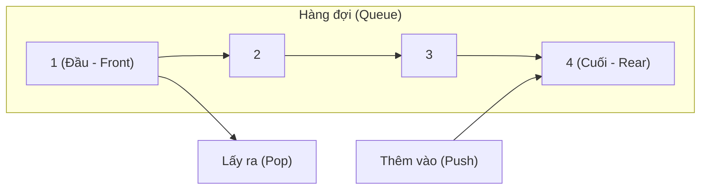
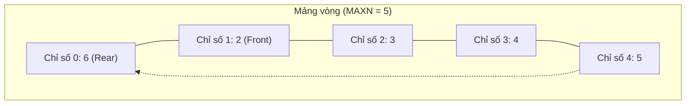
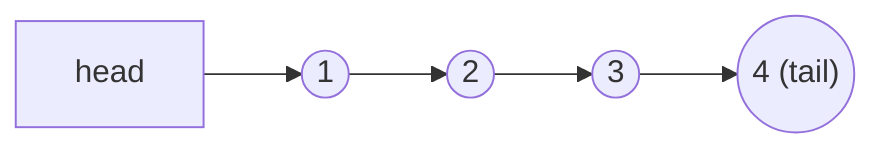

# Bài 34: Queue - Hàng Đợi

> **Tác giả:** FPTOJ Team<br>
> **Nội dung tham khảo từ:** GeeksforGeeks, VNOI Wiki, CP-Algorithms

---

## 1. Bản chất vấn đề

### Hàng đợi và Nguyên lý FIFO
Trong nhiều bài toán lập trình và hệ thống thực tế, ta cần quản lý một tập hợp đối tượng theo nguyên lý **ai đến trước, được phục vụ trước**.
Ví dụ: hàng người xếp hàng chờ thanh toán, các tiến trình đợi CPU xử lý trong hệ điều hành, hay các nút của đồ thị chờ được duyệt theo chiều rộng.
Đây chính là mô hình của cấu trúc dữ liệu **Hàng đợi (Queue)**.

Queue hoạt động theo nguyên tắc **FIFO** (First In, First Out): phần tử được thêm vào trước sẽ là phần tử được lấy ra trước tiên.



### So sánh Stack và Queue

| Tiêu chí | Stack (Ngăn xếp) | Queue (Hàng đợi) |
|:---|:---:|:---:|
| **Nguyên tắc hoạt động** | LIFO: Vào sau, ra trước | FIFO: Vào trước, ra trước |
| **Vị trí thêm phần tử** | Đỉnh ngăn xếp (Top) | Cuối hàng đợi (Rear) |
| **Vị trí lấy phần tử** | Đỉnh ngăn xếp (Top) | Đầu hàng đợi (Front) |
| **Ứng dụng chủ đạo** | Đệ quy, duyệt DFS, tính toán biểu thức | Duyệt BFS, mô phỏng hàng chờ, thuật toán luồng |

### Các thao tác cơ bản và độ phức tạp
Một cấu trúc Queue tiêu chuẩn cần hỗ trợ các thao tác cơ bản sau với độ phức tạp **$O(1)$**:

*   `push(x)`: Thêm phần tử $x$ vào cuối hàng đợi.
*   `pop()`: Loại bỏ phần tử ở đầu hàng đợi.
*   `front()`: Xem giá trị của phần tử ở đầu hàng đợi mà không xóa nó.
*   `back()`: Xem giá trị của phần tử ở cuối hàng đợi mà không xóa nó.
*   `empty()`: Kiểm tra hàng đợi có đang trống hay không.
*   `size()`: Trả về số lượng phần tử hiện có trong hàng đợi.

---

## 2. Tư duy cốt lõi: Các phương pháp cài đặt Queue

Có hai phương pháp chính để tự cài đặt cấu trúc dữ liệu Queue:

### 2.1. Cài đặt bằng Mảng vòng (Circular Array)
Nếu cài đặt Queue bằng một mảng tĩnh thông thường, sau mỗi thao tác `pop()`, ta phải dịch chuyển toàn bộ các phần tử còn lại sang trái một vị trí, tốn thời gian $O(N)$.
Để tối ưu về $O(1)$, ta sử dụng hai chỉ số $front\_idx$ và $rear\_idx$ di chuyển tự do trên mảng. Khi chỉ số chạm cuối mảng, ta áp dụng phép toán modulo để quay vòng chỉ số trở lại vị trí $0$.



*   **Trạng thái cây:** $front\_idx = 1$, $rear\_idx = 0$ (đã quay vòng).
*   **Các phần tử thực tế trong Queue:** $[2, 3, 4, 5, 6]$.

#### Trace chi tiết mảng vòng qua chuỗi thao tác ($MAXN = 5$):

| Thao tác | $front\_idx$ | $rear\_idx$ | Phần tử trong mảng | Trạng thái / Kết quả |
|:---:|:---:|:---:|:---|:---|
| Khởi tạo | $0$ | $0$ | `[_, _, _, _, _]` | Hàng đợi rỗng |
| `push(1)` | $0$ | $1$ | `[1, _, _, _, _]` | — |
| `push(2)` | $0$ | $2$ | `[1, 2, _, _, _]` | — |
| `push(3)` | $0$ | $3$ | `[1, 2, 3, _, _]` | — |
| `pop()` | $1$ | $3$ | `[_, 2, 3, _, _]` | Trả về $1$ |
| `push(4)` | $1$ | $4$ | `[_, 2, 3, 4, _]` | — |
| `push(5)` | $1$ | $0$ | `[_, 2, 3, 4, 5]` | Chỉ số quay vòng về $0$ |
| `push(6)` | $2$ | $0$ | `[6, 2, 3, 4, 5]` | Ghi đè lên vị trí $0$ đã trống |

---

### 2.2. Cài đặt bằng Danh sách liên kết đơn (Linked List)
Ta duy trì hai con trỏ:
*   `head`: Trỏ vào nút đầu tiên của danh sách (vị trí lấy phần tử).
*   `tail`: Trỏ vào nút cuối cùng của danh sách (vị trí thêm phần tử mới).



---

## 3. Mã nguồn Cài đặt Queue hoàn chỉnh

Dưới đây là mã nguồn cài đặt chi tiết của cả hai cách tiếp cận:

### 3.1. Cài đặt bằng Mảng vòng

=== "C++"

    ```cpp
    #include <iostream>

    using namespace std;

    template <typename T, int MAXN = 100005>
    class CircularQueue {
    private:
        T arr[MAXN];
        int front_idx;
        int rear_idx;
        int cnt;

    public:
        CircularQueue() {
            front_idx = 0;
            rear_idx = 0;
            cnt = 0;
        }

        // Thêm phần tử vào cuối - O(1)
        void push(T val) {
            if (cnt >= MAXN) return; // Hàng đợi đầy
            arr[rear_idx] = val;
            rear_idx = (rear_idx + 1) % MAXN;
            cnt++;
        }

        // Loại bỏ phần tử ở đầu - O(1)
        void pop() {
            if (cnt == 0) return; // Hàng đợi rỗng
            front_idx = (front_idx + 1) % MAXN;
            cnt--;
        }

        // Lấy phần tử ở đầu - O(1)
        T front() {
            if (cnt == 0) throw runtime_error("Queue is empty!");
            return arr[front_idx];
        }

        // Lấy phần tử ở cuối - O(1)
        T back() {
            if (cnt == 0) throw runtime_error("Queue is empty!");
            return arr[(rear_idx - 1 + MAXN) % MAXN];
        }

        int size() { return cnt; }
        bool empty() { return cnt == 0; }
    };
    ```

=== "Python"

    ```python
    class CircularQueue:
        def __init__(self, capacity=100005):
            self.arr = [None] * capacity
            self.capacity = capacity
            self.front_idx = 0
            self.rear_idx = 0
            self.cnt = 0

        def push(self, val):
            """Thêm phần tử vào cuối hàng đợi - O(1)"""
            if self.cnt >= self.capacity:
                return False
            self.arr[self.rear_idx] = val
            self.rear_idx = (self.rear_idx + 1) % self.capacity
            self.cnt += 1
            return True

        def pop(self):
            """Xóa phần tử ở đầu hàng đợi - O(1)"""
            if self.cnt == 0:
                return None
            val = self.arr[self.front_idx]
            self.front_idx = (self.front_idx + 1) % self.capacity
            self.cnt -= 1
            return val

        def front(self):
            if self.cnt == 0:
                return None
            return self.arr[self.front_idx]

        def back(self):
            if self.cnt == 0:
                return None
            return self.arr[(self.rear_idx - 1 + self.capacity) % self.capacity]

        def size(self):
            return self.cnt

        def empty(self):
            return self.cnt == 0
    ```

### 3.2. Cài đặt bằng Danh sách liên kết

=== "C++"

    ```cpp
    #include <iostream>

    using namespace std;

    template <typename T>
    class QueueLL {
    private:
        struct Node {
            T data;
            Node* next;
            Node(T val) : data(val), next(nullptr) {}
        };

        Node* head = nullptr;
        Node* tail = nullptr;
        int cnt = 0;

    public:
        ~QueueLL() {
            while (!empty()) {
                pop();
            }
        }

        void push(T val) {
            Node* new_node = new Node(val);
            if (!tail) {
                head = tail = new_node;
            } else {
                tail->next = new_node;
                tail = new_node;
            }
            cnt++;
        }

        void pop() {
            if (!head) return;
            Node* temp = head;
            head = head->next;
            if (!head) {
                tail = nullptr;
            }
            delete temp;
            cnt--;
        }

        T front() {
            if (!head) throw runtime_error("Queue is empty!");
            return head->data;
        }

        int size() { return cnt; }
        bool empty() { return cnt == 0; }
    };
    ```

=== "Python"

    ```python
    class QueueLL:
        class Node:
            def __init__(self, val):
                self.data = val
                self.next = None

        def __init__(self):
            self.head = None
            self.tail = None
            self.cnt = 0

        def push(self, val):
            new_node = self.Node(val)
            if not self.tail:
                self.head = self.tail = new_node
            else:
                self.tail.next = new_node
                self.tail = new_node
            self.cnt += 1

        def pop(self):
            if not self.head:
                return None
            val = self.head.data
            self.head = self.head.next
            if not self.head:
                self.tail = None
            self.cnt -= 1
            return val

        def front(self):
            if not self.head:
                return None
            return self.head.data

        def size(self):
            return self.cnt

        def empty(self):
            return self.cnt == 0
    ```

### 3.3. Sử dụng thư viện chuẩn của ngôn ngữ (priority dùng trong thi đấu)

=== "C++"

    ```cpp
    #include <iostream>
    #include <queue> // Thư viện chứa std::queue

    using namespace std;

    int main() {
        queue<int> q;

        q.push(1); // Thêm phần tử
        q.push(2);

        cout << "Front: " << q.front() << "\n"; // Lấy đầu: 1
        cout << "Back: " << q.back() << "\n";   // Lấy cuối: 2

        q.pop(); // Xóa đầu
        cout << "New Front: " << q.front() << "\n"; // Lấy đầu mới: 2
        cout << "Size: " << q.size() << "\n";       // Kích thước: 1
        return 0;
    }
    ```

=== "Python"

    ```python
    from collections import deque # Sử dụng deque thay vì list cho hàng đợi

    q = deque()
    q.append(1) # Thêm vào cuối
    q.append(2)

    print("Front:", q[0])  # Đầu hàng: 1
    print("Back:", q[-1])  # Cuối hàng: 2

    q.popleft() # Xóa đầu - O(1)
    print("New Front:", q[0]) # Đầu mới: 2
    ```

---

## 4. Chứng minh toán học và Tính đúng đắn của Thuật toán

### 4.1. Chứng minh toán học về tính đúng đắn của mảng vòng (Circular Array)
Trong cài đặt hàng đợi bằng mảng vòng với kích thước $MAXN$, ta cần chứng minh các thuộc tính sau luôn được đảm bảo:

1.  **Giới hạn chỉ số (Index Boundedness):**
    Tại mọi thời điểm, chỉ số $front\_idx$ và $rear\_idx$ luôn nằm trong khoảng hợp lệ $[0, MAXN - 1]$.
    *   *Chứng minh:* Phép toán dịch chuyển chỉ số chỉ sử dụng công thức tăng modulo:
        $$idx_{\text{mới}} = (idx_{\text{cũ}} + 1) \bmod MAXN$$
        Theo tính chất của phép chia lấy dư đối với số nguyên dương $MAXN$, giá trị của $(a \bmod MAXN)$ luôn thuộc tập hợp $\{0, 1, \ldots, MAXN-1\}$. Do đó chỉ số không bao giờ vượt biên mảng.
2.  **Không ghi đè dữ liệu chưa xử lý (No Data Overwriting):**
    Một phần tử mới chỉ được thêm vào khi hàng đợi chưa đầy ($cnt < MAXN$).
    *   *Chứng minh:* Khoảng dữ liệu hợp lệ trên mảng vòng chiếm các ô chỉ số thuộc tập hợp:
        $$I = \{ (front\_idx + k) \bmod MAXN \mid 0 \leq k < cnt \}$$
        Khi $cnt < MAXN$, phần tử mới sẽ được chèn vào vị trí $rear\_idx = (front\_idx + cnt) \bmod MAXN$. Do $cnt < MAXN$, ta có $rear\_idx \notin I$. Như vậy vị trí chèn mới luôn là ô trống, không đè lên bất kỳ phần tử hợp lệ nào có sẵn.
3.  **Bất biến FIFO (FIFO Invariant):**
    Phần tử được đưa vào đầu tiên ($k=0$ trong tập hợp $I$) sẽ là phần tử được lấy ra khi thực hiện `pop()`.
    *   *Chứng minh:* Thao tác `pop()` lấy giá trị tại chỉ số $front\_idx$ (ứng với $k=0$), sau đó dịch chuyển $front\_idx \leftarrow (front\_idx + 1) \bmod MAXN$. Phần tử kế tiếp ($k=1$) trở thành đầu hàng mới ($k=0$ mới). Bất biến FIFO được bảo toàn.

### 4.2. Tại sao BFS sử dụng Queue đảm bảo đường đi ngắn nhất?
Khi duyệt đồ thị không trọng số bằng thuật toán duyệt theo chiều rộng (BFS):
*   **Bất biến của hàng đợi BFS:** Khoảng cách từ đỉnh nguồn $S$ đến các đỉnh trong Queue luôn có tính đơn điệu tăng dần. Cụ thể, nếu Queue chứa các đỉnh $[v_1, v_2, \ldots, v_m]$ thì:
    $$dist[v_1] \leq dist[v_2] \leq \ldots \leq dist[v_m] \leq dist[v_1] + 1$$
*   **Hệ quả:** Khi đỉnh $u$ được ghé thăm lần đầu tiên thông qua cung $(v, u)$, ta có $dist[u] = dist[v] + 1$. Vì các đỉnh được lấy ra theo thứ tự tăng dần của khoảng cách, ta đảm bảo $dist[v]$ là đường đi ngắn nhất từ $S$ đến $v$, dẫn tới $dist[u]$ cũng là đường đi ngắn nhất từ $S$ đến $u$.

---

## 5. Ứng dụng cốt lõi: Thuật toán duyệt theo chiều rộng (BFS)

BFS là ứng dụng quan trọng nhất của Queue trên đồ thị vô hướng/có hướng không trọng số.

### Cài đặt Thuật toán BFS mẫu

=== "C++"

    ```cpp
    #include <vector>
    #include <queue>

    using namespace std;

    const int MAXN = 100005;
    vector<int> adj[MAXN];
    bool visited[MAXN];
    int dist[MAXN];

    void bfs(int start) {
        queue<int> q;
        
        visited[start] = true;
        dist[start] = 0;
        q.push(start);

        while (!q.empty()) {
            int v = q.front();
            q.pop();

            for (int u : adj[v]) {
                if (!visited[u]) {
                    visited[u] = true;
                    dist[u] = dist[v] + 1;
                    q.push(u); // Đánh dấu visited ngay khi push vào Queue
                }
            }
        }
    }
    ```

=== "Python"

    ```python
    from collections import deque

    def bfs(start, adj, n):
        visited = [False] * (n + 1)
        dist = [-1] * (n + 1)

        visited[start] = True
        dist[start] = 0
        q = deque([start])

        while q:
            v = q.popleft()
            for u in adj[v]:
                if not visited[u]:
                    visited[u] = True
                    dist[u] = dist[v] + 1
                    q.append(u)
        return dist
    ```

### Trace chi tiết các bước duyệt BFS trên đồ thị mẫu
Đồ thị gồm các cạnh: `1-2`, `1-3`, `2-4`, `2-5`, `3-4`. Duyệt BFS bắt đầu từ đỉnh $1$:

| Bước | Trạng thái Queue (trước khi pop) | Đỉnh được xử lý ($v$) | Thêm vào Queue | Trạng thái khoảng cách ($dist$) |
|:---:|:---|:---:|:---|:---|
| 1 | `[1]` | $1$ | $2, 3$ | $dist[1]=0, dist[2]=1, dist[3]=1$ |
| 2 | `[2, 3]` | $2$ | $4, 5$ | $dist[4]=2, dist[5]=2$ |
| 3 | `[3, 4, 5]` | $3$ | — | Đỉnh $4$ đã được thăm, không thêm lại |
| 4 | `[4, 5]` | $4$ | — | — |
| 5 | `[5]` | $5$ | — | — |

Thứ tự duyệt đỉnh: $1 \to 2 \to 3 \to 4 \to 5$.

---

## 6. Các lỗi và cạm bẫy thường gặp trong thi đấu

### 6.1. Dùng kiểu dữ liệu `list` thay cho `deque` trong Python
```python
# SAI: pop(0) trên list tốn thời gian O(N) do phải dịch chuyển mảng
q = []
q.append(1)
q.pop(0) 

# ĐÚNG: popleft() trên deque tốn thời gian O(1)
from collections import deque
q = deque()
q.append(1)
q.popleft()
```

### 6.2. Đánh dấu `visited` sai thời điểm trong BFS
*   **Lỗi:** Đánh dấu đỉnh đã duyệt khi lấy đỉnh đó ra khỏi Queue (`pop`).
*   **Hậu quả:** Trong đồ thị mật độ cao, một đỉnh có thể được nối với nhiều đỉnh khác đang cùng nằm trong Queue. Do chưa bị `pop` nên nó chưa được đánh dấu `visited`, dẫn đến việc nó bị chèn lặp lại rất nhiều lần vào Queue, làm bùng nổ bộ nhớ và gây ra lỗi quá thời gian (TLE).
*   **Cách sửa:** Luôn đánh dấu `visited = true` **ngay tại bước thêm vào Queue (`push`)**.

---

## 7. Bài tập luyện tập phân cấp

### 7.1. Cấp độ Cơ bản
*   [CSES - Message Route](https://cses.fi/problemset/task/1667): BFS cơ bản tìm đường đi ngắn nhất và truy vết đường đi.
*   [CSES - Labyrinth](https://cses.fi/problemset/task/1193): BFS trên lưới ô vuông 2D tìm đường đi ngắn nhất.
*   [LeetCode - Binary Tree Level Order Traversal](https://leetcode.com/problems/binary-tree-level-order-traversal/): Duyệt cây nhị phân theo từng tầng.

### 7.2. Cấp độ Trung bình & Nâng cao
*   [CSES - Monsters](https://cses.fi/problemset/task/1194): Multi-source BFS (tìm khoảng cách từ nhiều điểm xuất phát của quái vật đồng thời).
*   [CSES - Course Schedule](https://cses.fi/problemset/task/1679): Thuật toán Kahn tìm thứ tự sắp xếp topo sử dụng Queue.
*   [CSES - Game Routes](https://cses.fi/problemset/task/1681): Sử dụng BFS kết hợp Quy hoạch động đếm số đường đi trên đồ thị có hướng không chu trình (DAG).

---

## Tài liệu tham khảo

*   [GeeksforGeeks - Queue Data Structure](https://www.geeksforgeeks.org/dsa/queue-data-structure/)
*   [VNOI Wiki - Breadth-First Search (BFS)](https://wiki.vnoi.info/algo/graph-theory/breadth-first-search)
*   [CP-Algorithms - 0-1 BFS](https://cp-algorithms.com/graph/01_bfs.html)
