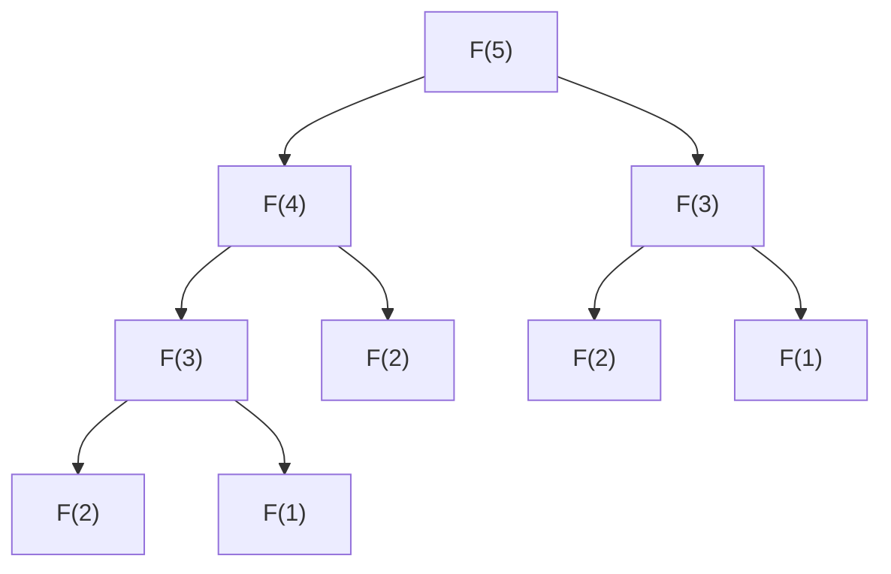

# Bài 12: Quy Hoạch Động (Dynamic Programming) - Từ Nhập Môn Đến Chuyên Sâu

> **Tác giả:** FPTOJ Team<br>
> **Nội dung tham khảo từ:** VNOI Wiki - Quy hoạch động, Topcoder - DP from Novice to Advanced

---

## 1. Bản chất vấn đề

### Định nghĩa Quy hoạch động
**Quy hoạch động (Dynamic Programming - DP)** là phương pháp thiết kế thuật toán nhằm giải quyết các bài toán tối ưu hoặc đếm bằng cách chia nhỏ bài toán lớn thành các bài toán con chồng nhau, giải quyết các bài toán con này một lần duy nhất và lưu trữ kết quả của chúng để tái sử dụng.

### Hai điều kiện cốt lõi để áp dụng Quy hoạch động
Một bài toán chỉ có thể giải quyết bằng Quy hoạch động nếu thỏa mãn hai tính chất sau:

1.  **Bài toán con trùng nhau (Overlapping Subproblems):**
    Quá trình giải quyết bài toán lớn đòi hỏi phải giải đi giải lại cùng một bài toán con nhiều lần. Điều này phân biệt Quy hoạch động với phương pháp *Chia để trị (Divide and Conquer)* (nơi các bài toán con hoàn toàn độc lập, ví dụ như thuật toán sắp xếp nhanh Quick Sort hay sắp xếp trộn Merge Sort).
2.  **Cấu trúc con tối ưu (Optimal Substructure):**
    Lời giải tối ưu của bài toán lớn được xây dựng từ các lời giải tối ưu của các bài toán con nhỏ hơn của nó.

### Sự chồng chéo bài toán con trong đệ quy ngây thơ
Xét hàm Fibonacci: $F(n) = F(n-1) + F(n-2)$. Sơ đồ cây đệ quy dưới đây cho thấy các trạng thái trùng lặp được gọi lại nhiều lần:



Nhận thấy trạng thái $F(3)$ được tính $2$ lần, $F(2)$ được tính $3$ lần. Nếu không lưu kết quả, độ phức tạp thời gian sẽ bùng nổ ở mức lũy thừa **$O(2^N)$**.

```matplotlib
n = np.linspace(1, 30, 100)
naive = 2**n
dp_linear = n
dp_n2 = n**2

plt.figure(figsize=(8, 5))
plt.plot(n, naive, label='Đệ quy naïve $O(2^N)$', color='#e74c3c', linewidth=2)
plt.plot(n, dp_linear, label='DP tuyến tính $O(N)$', color='#2ecc71', linewidth=2)
plt.plot(n, dp_n2, label='DP 2 chiều $O(N^2)$', color='#3498db', linewidth=2)
plt.xlabel('N (kích thước đầu vào)')
plt.ylabel('Số phép tính')
plt.title('So sánh độ phức tạp: Đệ quy naïve vs Quy hoạch động')
plt.yscale('log')
plt.legend(fontsize=10)
plt.grid(True, alpha=0.3)
plt.tight_layout()
```

---

## 2. Tư duy cốt lõi: Đệ quy có nhớ (Top-down) và Khử đệ quy bằng bảng (Bottom-up)

Có hai phương pháp để tiếp cận và giải quyết một bài toán Quy hoạch động:

| Tiêu chí | Top-down (Đệ quy có nhớ - Memoization) | Bottom-up (Khử đệ quy bằng bảng - Tabulation) |
|:---|:---|:---|
| **Hướng tiếp cận** | Đi từ bài toán lớn, phân rã đệ quy xuống các bài toán con và lưu trữ kết quả. | Đi từ bài toán con cơ sở nhỏ nhất, dùng vòng lặp để điền kết quả vào bảng. |
| **Ưu điểm** | Tự nhiên, dễ thiết lập công thức từ hệ thức đệ quy; chỉ tính các trạng thái thực sự cần thiết. | Không tốn bộ nhớ ngăn xếp đệ quy (stack overflow); tốc độ thực thi nhanh hơn do tối ưu cache của CPU. |
| **Nhược điểm** | Chi phí gọi hàm đệ quy lớn; dễ gặp lỗi tràn ngăn xếp với dữ liệu lớn. | Phải tính toán toàn bộ các trạng thái trong bảng, kể cả những trạng thái không đóng góp vào kết quả. |

### Khung sườn 4 bước thiết lập bài toán Quy hoạch động

Để giải quyết một bài toán Quy hoạch động, ta luôn tuân thủ tuần tự 4 bước:

1.  **Định nghĩa trạng thái:** Xác định ý nghĩa của mảng lưu trữ (ví dụ: $dp[i]$ lưu trữ cái gì?).
2.  **Thiết lập công thức truy hồi:** Xác định mối liên hệ giữa trạng thái hiện tại $dp[i]$ và các trạng thái nhỏ hơn đã tính.
3.  **Khởi tạo cơ sở (Base Case):** Gán các giá trị ban đầu cho các bài toán con nhỏ nhất không thể phân rã thêm.
4.  **Xác định đáp án:** Xác định vị trí lưu trữ kết quả cuối cùng cần tìm trong bảng.

---

## 3. Phân tích toán học và Chứng minh tính đúng đắn

### 3.1. Bài toán Cái túi 0/1 (0/1 Knapsack Problem)
Cho $N$ đồ vật, vật thứ $i$ có trọng lượng $w_{i-1}$ và giá trị $v_{i-1}$. Cần chọn các đồ vật bỏ vào túi có tải trọng tối đa $W$ sao cho tổng giá trị thu được lớn nhất.

*   **Định nghĩa trạng thái:** Gọi $dp[i][j]$ là tổng giá trị lớn nhất khi chọn một tập hợp con từ $i$ vật đầu tiên ($0 \leq i \leq N$) với tổng trọng lượng không vượt quá $j$ ($0 \leq j \leq W$).
*   **Công thức truy hồi:**
    $$dp[i][j] = \begin{cases} 
      dp[i-1][j] & \text{nếu } j < w_{i-1} \\ 
      \max\left(dp[i-1][j], \; dp[i-1][j - w_{i-1}] + v_{i-1}\right) & \text{nếu } j \geq w_{i-1} 
    \end{cases}$$

#### Chứng minh tính đúng đắn của công thức Cái túi 0/1:
Ta chứng minh tính đúng đắn của hệ thức truy hồi bằng cách chia trường hợp cho đồ vật thứ $i$:

1.  **Trường hợp 1: Không chọn đồ vật thứ $i$:**
    Nếu đồ vật thứ $i$ không được đưa vào túi (hoặc do trọng lượng $w_{i-1} > j$ không thể chứa được), thì tổng giá trị lớn nhất thu được từ $i$ đồ vật đầu tiên với tải trọng $j$ chính là tổng giá trị lớn nhất thu được từ $i-1$ đồ vật đầu tiên với cùng tải trọng $j$. Do đó:
    $$dp[i][j] = dp[i-1][j]$$
2.  **Trường hợp 2: Chọn đồ vật thứ $i$:**
    Điều kiện cần là tải trọng còn lại của túi phải đủ chứa vật thứ $i$ ($j \geq w_{i-1}$).
    Nếu ta chọn đồ vật thứ $i$, túi sẽ nhận thêm giá trị $v_{i-1}$ và tiêu tốn trọng lượng $w_{i-1}$. Khoảng tải trọng còn lại dành cho $i-1$ vật trước đó là $j - w_{i-1}$. Để tổng giá trị lớn nhất, ta buộc phải chọn tối ưu $i-1$ vật đầu tiên trên khoảng tải trọng $j - w_{i-1}$. Giá trị tối ưu này là $dp[i-1][j - w_{i-1}]$.
    Tổng giá trị thu được trong trường hợp này là:
    $$dp[i-1][j - w_{i-1}] + v_{i-1}$$
3.  **Kết luận:**
    Theo nguyên lý tối ưu, giá trị $dp[i][j]$ là giá trị lớn nhất giữa hai lựa chọn trên. Phép toán này chứng minh tính đúng đắn của hệ thức truy hồi.

---

### 3.2. Thuật toán tìm Dãy con tăng dài nhất (LIS) trong $O(N \log N)$
Cho dãy số $a[0 \ldots N-1]$, tìm độ dài dãy con tăng dài nhất.

*   **Ý tưởng thuật toán:** Ta duy trì một mảng $tail[0 \ldots len-1]$ với ý nghĩa: $tail[k]$ là giá trị phần tử cuối cùng **nhỏ nhất** trong số tất cả các dãy con tăng có độ dài $k+1$ được tạo thành cho đến thời điểm hiện tại.
*   **Thuật toán:** Duyệt qua từng phần tử $x$ của mảng $a$:
    *   Sử dụng tìm kiếm nhị phân để tìm vị trí đầu tiên trong $tail$ có giá trị $\geq x$. Ký hiệu vị trí này là $idx$.
    *   Nếu tìm thấy, ta cập nhật $tail[idx] = x$.
    *   Nếu không tìm thấy (tất cả phần tử trong $tail$ đều $< x$), ta thêm $x$ vào cuối mảng $tail$ (tăng độ dài dãy con tăng dài nhất thêm 1).

#### Chứng minh tính đúng đắn của thuật toán LIS $O(N \log N)$:
Ta chứng minh tính đúng đắn của thuật toán qua hai tính chất bất biến:

1.  **Mảng $tail$ luôn được sắp xếp tăng dần:**
    *   Giả sử ta chèn phần tử $x$ vào vị trí $idx$. Theo cách chọn chỉ số từ tìm kiếm nhị phân (`lower_bound`), ta có $tail[idx-1] < x \leq tail[idx]$.
    *   Sau khi cập nhật $tail[idx] = x$, ta vẫn bảo toàn thứ tự: $tail[idx-1] < tail[idx] = x < tail[idx+1]$ (nếu có). Do đó mảng $tail$ luôn được duy trì ở trạng thái sắp xếp tăng dần, cho phép ta tiếp tục áp dụng tìm kiếm nhị phân ở các bước tiếp theo.
2.  **Tính tối ưu của các giá trị cuối cùng:**
    *   Gọi $tail[k]$ là phần tử kết thúc tối ưu của dãy con tăng dài độ dài $k+1$. Để dễ dàng kéo dài dãy con này khi có một phần tử $x$ mới xuất hiện, giá trị kết thúc $tail[k]$ phải là nhỏ nhất có thể.
    *   Khi xét phần tử $x$:
        *   Nếu $x > tail[k-1]$, ta có thể nối $x$ vào sau dãy con độ dài $k$ kết thúc bằng $tail[k-1]$ để tạo ra dãy con tăng độ dài $k+1$ kết thúc bằng $x$.
        *   Nếu $x$ nhỏ hơn giá trị kết thúc hiện tại của dãy con độ dài $k+1$ cũ ($x < tail[k]$), việc cập nhật $tail[k] = x$ giúp hạ thấp giá trị kết thúc, tăng cơ hội mở rộng cho các phần tử phía sau.
        *   Điều này chứng minh thuật toán luôn cho kết quả tối ưu.

---

## 4. Các dạng toán Quy hoạch động cơ bản

Dưới đây là mã nguồn cài đặt tối ưu cho các lớp bài toán Quy hoạch động kinh điển:

### 4.1. Quy hoạch động tuyến tính 1 chiều (LIS)

=== "C++"

    ```cpp
    #include <vector>
    #include <algorithm>
    #include <iostream>

    using namespace std;

    // Tìm độ dài dãy con tăng dài nhất - O(N log N)
    int longestIncreasingSubsequence(const vector<int>& a) {
        vector<int> tail; // tail[i] lưu phần tử kết thúc nhỏ nhất của dãy con tăng độ dài i+1
        for (int x : a) {
            auto it = lower_bound(tail.begin(), tail.end(), x);
            if (it == tail.end()) {
                tail.push_back(x); // Tạo ra dãy con tăng dài hơn
            } else {
                *it = x; // Cập nhật phần tử kết thúc nhỏ hơn để tối ưu
            }
        }
        return tail.size();
    }
    ```

=== "Python"

    ```python
    import bisect

    def longest_increasing_subsequence(a):
        """Độ dài dãy con tăng dài nhất sử dụng tìm kiếm nhị phân - O(N log N)"""
        tail = []
        for x in a:
            idx = bisect.bisect_left(tail, x)
            if idx == len(tail):
                tail.append(x)
            else:
                tail[idx] = x
        return len(tail)
    ```

---

### 4.2. Quy hoạch động 2 chiều (Cái túi 0/1)

=== "C++"

    ```cpp
    #include <vector>
    #include <algorithm>

    using namespace std;

    // Cái túi 0/1 bản cơ bản - O(N * W) thời gian, O(N * W) bộ nhớ
    int knapsack01(const vector<int>& w, const vector<int>& v, int W) {
        int n = w.size();
        vector<vector<int>> dp(n + 1, vector<int>(W + 1, 0));

        for (int i = 1; i <= n; i++) {
            for (int j = 0; j <= W; j++) {
                dp[i][j] = dp[i - 1][j]; // Không lấy đồ vật thứ i
                if (j >= w[i - 1]) {
                    dp[i][j] = max(dp[i][j], dp[i - 1][j - w[i - 1]] + v[i - 1]);
                }
            }
        }
        return dp[n][W];
    }
    ```

=== "Python"

    ```python
    def knapsack_01(w, v, W):
        """Giải bài toán cái túi 0/1 bằng mảng 2D - O(N * W)"""
        n = len(w)
        dp = [[0] * (W + 1) for _ in range(n + 1)]
        
        for i in range(1, n + 1):
            for j in range(W + 1):
                dp[i][j] = dp[i - 1][j]
                if j >= w[i - 1]:
                    dp[i][j] = max(dp[i][j], dp[i - 1][j - w[i - 1]] + v[i - 1])
        return dp[n][W]
    ```

---

### 4.3. Tối ưu hóa bộ nhớ cho bài toán Cái túi 0/1 (Không gian $O(W)$)

Ta nhận thấy để tính dòng hiện tại $dp[i][j]$, ta chỉ cần các kết quả của dòng trước đó là $dp[i-1]$. Do đó, ta có thể nén mảng xuống thành mảng $1$ chiều kích thước $W+1$ bằng cách duyệt ngược giá trị tải trọng từ $W$ về $0$.

=== "C++"

    ```cpp
    #include <vector>
    #include <algorithm>

    using namespace std;

    // Tối ưu hóa không gian xuống O(W) bộ nhớ
    int knapsackOptimizedSpace(const vector<int>& w, const vector<int>& v, int W) {
        int n = w.size();
        vector<int> dp(W + 1, 0);

        for (int i = 0; i < n; i++) {
            // Duyệt NGƯỢC để tránh việc một đồ vật được chọn lặp lại nhiều lần
            for (int j = W; j >= w[i]; j--) {
                dp[j] = max(dp[j], dp[j - w[i]] + v[i]);
            }
        }
        return dp[W];
    }
    ```

=== "Python"

    ```python
    def knapsack_optimized_space(w, v, W):
        """Tối ưu không gian bài toán cái túi 0/1 xuống O(W)"""
        dp = [0] * (W + 1)
        for i in range(len(w)):
            # Duyệt ngược từ W xuống trọng lượng của vật thứ i
            for j in range(W, w[i] - 1, -1):
                dp[j] = max(dp[j], dp[j - w[i]] + v[i])
        return dp[W]
    ```

---

### 4.4. Quy hoạch động trên xâu (Xâu con chung dài nhất - LCS)

=== "C++"

    ```cpp
    #include <string>
    #include <vector>
    #include <algorithm>

    using namespace std;

    // Độ dài xâu con chung dài nhất - O(N * M)
    int longestCommonSubsequence(string a, string b) {
        int n = a.size();
        int m = b.size();
        vector<vector<int>> dp(n + 1, vector<int>(m + 1, 0));

        for (int i = 1; i <= n; i++) {
            for (int j = 1; j <= m; j++) {
                if (a[i - 1] == b[j - 1]) {
                    dp[i][j] = dp[i - 1][j - 1] + 1;
                } else {
                    dp[i][j] = max(dp[i - 1][j], dp[i][j - 1]);
                }
            }
        }
        return dp[n][m];
    }
    ```

=== "Python"

    ```python
    def longest_common_subsequence(a, b):
        """Độ dài xâu con chung dài nhất - O(N * M)"""
        n, m = len(a), len(b)
        dp = [[0] * (m + 1) for _ in range(n + 1)]
        
        for i in range(1, n + 1):
            for j in range(1, m + 1):
                if a[i - 1] == b[j - 1]:
                    dp[i][j] = dp[i - 1][j - 1] + 1
                else:
                    dp[i][j] = max(dp[i - 1][j], dp[i][j - 1])
        return dp[n][m]
    ```

---

### 4.5. Quy hoạch động trên trạng thái nén (Bitmask DP)

=== "C++"

    ```cpp
    #include <vector>
    #include <algorithm>

    using namespace std;

    const int INF = 1e9;

    // Phân công N người vào N công việc sao cho tổng chi phí tối thiểu - O(N * 2^N)
    int assignmentProblem(const vector<vector<int>>& cost) {
        int n = cost.size();
        // dp[mask] lưu chi phí nhỏ nhất khi đã hoàn thành các công việc biểu thị bởi mask
        vector<int> dp(1 << n, INF);
        dp[0] = 0;

        for (int mask = 0; mask < (1 << n); mask++) {
            // Số bit 1 trong mask tương ứng với số người đã được phân công việc
            int person = 0;
            for (int i = 0; i < n; i++) {
                if ((mask >> i) & 1) person++;
            }

            if (person == n) continue;

            for (int job = 0; job < n; job++) {
                // Nếu công việc job chưa được thực hiện
                if (!((mask >> job) & 1)) {
                    int next_mask = mask | (1 << job);
                    dp[next_mask] = min(dp[next_mask], dp[mask] + cost[person][job]);
                }
            }
        }
        return dp[(1 << n) - 1];
    }
    ```

=== "Python"

    ```python
    def assignment_problem(cost):
        """Phân công công việc tối ưu sử dụng Bitmask DP - O(N * 2^N)"""
        n = len(cost)
        INF = float('inf')
        dp = [INF] * (1 << n)
        dp[0] = 0

        for mask in range(1 << n):
            # person là số lượng công việc đã được phân phối
            person = bin(mask).count('1')
            if person == n:
                continue
                
            for job in range(n):
                # Nếu công việc job chưa được phân phối
                if not (mask & (1 << job)):
                    next_mask = mask | (1 << job)
                    dp[next_mask] = min(dp[next_mask], dp[mask] + cost[person][job])
        return dp[(1 << n) - 1]
    ```

---

## 5. Các cạm bẫy kinh điển và Biện pháp phòng ngừa

### 5.1. Sai thứ tự duyệt trong Quy hoạch động tối ưu bộ nhớ
Khi nén không gian trạng thái của bài toán Cái túi $0/1$ từ $2$ chiều về $1$ chiều, bắt buộc ta phải duyệt ngược chỉ số tải trọng từ $W$ về trọng lượng vật.

```cpp
// SAI: Duyệt xuôi làm vật được chọn lặp nhiều lần (Unbounded Knapsack)
for (int j = w[i]; j <= W; j++) {
    dp[j] = max(dp[j], dp[j - w[i]] + v[i]);
}

// ĐÚNG: Duyệt ngược bảo toàn tính chất chỉ chọn tối đa 1 lần (0/1 Knapsack)
for (int j = W; j >= w[i]; j--) {
    dp[j] = max(dp[j], dp[j - w[i]] + v[i]);
}
```

---

### 5.2. Tràn số khi tính toán giá trị lớn
Trong các bài toán Quy hoạch động đếm số cách thỏa mãn điều kiện, giá trị có thể tăng cực kỳ nhanh và vượt quá giới hạn kiểu `int` ($2 \cdot 10^9$).
*   **Giải pháp:** Luôn sử dụng kiểu dữ liệu `long long` trong C++ và áp dụng phép chia dư (modulo) tại từng bước cộng dồn trạng thái.
*   **Công thức modulo phép trừ:**
    $$dp[i] = (dp[i-1] - dp[i-2] + MOD) \bmod MOD$$
    *(Cộng thêm số chia dư $MOD$ trước khi lấy dư để tránh kết quả ra số âm).*

---

### 5.3. Xác định không chính xác thứ tự duyệt trạng thái Bitmask
Trong Bitmask DP, trạng thái $next\_mask$ luôn được tính toán dựa trên trạng thái $mask$ có số bit $1$ ít hơn.
*   **Giải pháp:** Luôn duyệt chỉ số $mask$ theo chiều xuôi từ $0$ đến $2^N - 1$. Thứ tự duyệt này đảm bảo rằng các trạng thái con $mask$ nhỏ hơn luôn được tính toán hoàn chỉnh trước khi dùng để tính $next\_mask$ lớn hơn.

---

## 6. Luyện tập phân cấp

### 6.1. Cấp độ Cơ bản
*   [CSES - Dice Combinations](https://cses.fi/problemset/task/1633): Bài toán cơ bản ứng dụng công thức đệ quy tuyến tính.
*   [CSES - Minimizing Coins](https://cses.fi/problemset/task/1634): Bài toán đổi tiền xu tối thiểu (tương tự Knapsack).
*   [VNOJ - LIS](https://oj.vnoi.info/problem/lis): Tìm dãy con tăng dài nhất.

### 6.2. Cấp độ Trung bình & Nâng cao
*   [VNOJ - Knapsack 2](https://oj.vnoi.info/problem/atcoder_dp_e): Bài toán Cái túi nhưng thay đổi cách định nghĩa trạng thái do tải trọng túi $W$ quá lớn ($10^9$), ta chuyển sang tối ưu theo tổng giá trị các vật.
*   [CSES - Edit Distance](https://cses.fi/problemset/task/1639): Tính khoảng cách biên tập tối thiểu giữa hai xâu.

---

## Tài liệu tham khảo

*   [CP-Algorithms - Introduction to Dynamic Programming](https://cp-algorithms.com/dynamic_programming/intro-to-dp.html)
*   [VNOI Wiki - Quy hoạch động cơ bản](https://wiki.vnoi.info/algo/dp/basic-dynamic-programming-1)
*   [Topcoder - Dynamic Programming: From Novice to Advanced](https://www.topcoder.com/thrive/articles/Dynamic%20Programming:%20From%20Novice%20to%20Advanced)
