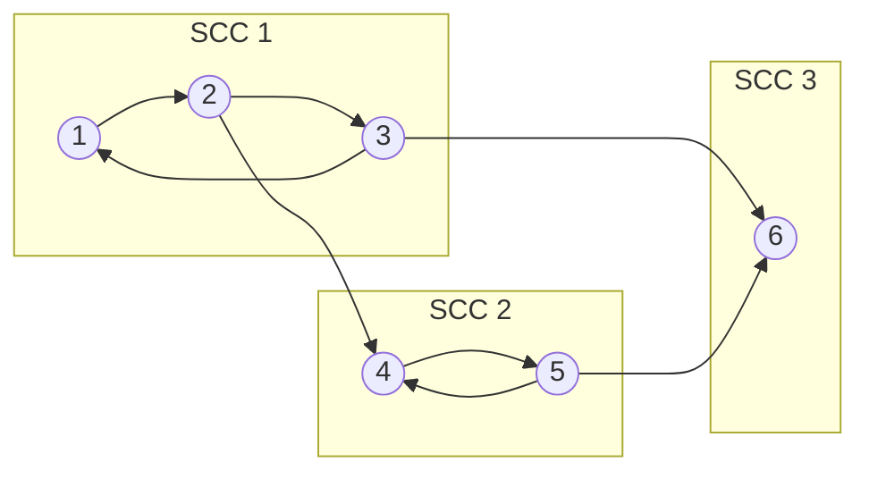
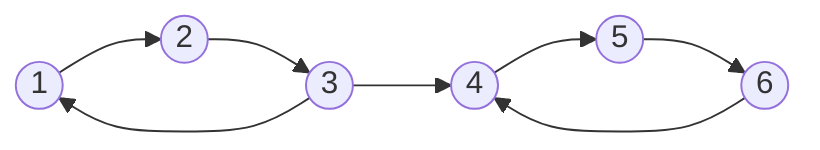
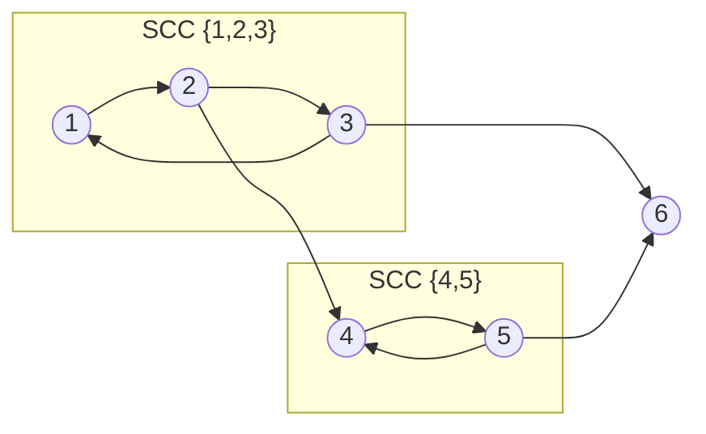
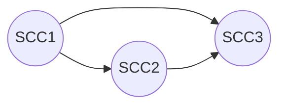
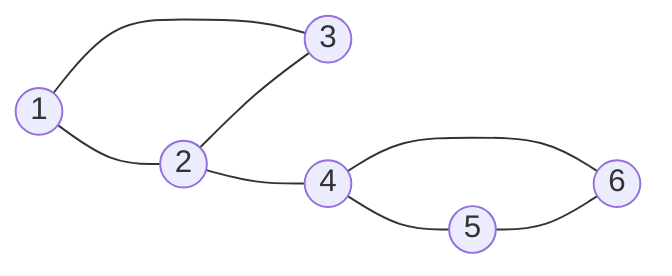
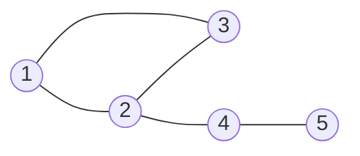

# Bài 40: SCC & Cầu & Khớp - Thành phần liên thông mạnh!

> **Tác giả:** FPTOJ Wiki<br>
> **Nội dung tham khảo từ:** VNOI Wiki - Cây DFS, CP-Algorithms

---

## Bạn sẽ học được gì?

- Thuật toán Tarjan tìm Thành phần liên thông mạnh (SCC) trong đồ thị có hướng
- Thuật toán Kosaraju - phương pháp thay thế để tìm SCC
- Xây dựng đồ thị co (condensation graph) từ các SCC
- Tìm cầu (bridges) trong đồ thị vô hướng
- Tìm khớp (articulation points) trong đồ thị vô hướng
- Ứng dụng thực tế: 2-edge-connected components, biconnected components

---

## 1. SCC - Thành phần liên thông mạnh là gì?

### Ẩn dụ: Mạng đường một chiều

Bạn đang ở thành phố A, muốn đi đến thành phố B **và quay về** A. Nếu có đường đi cả hai chiều → A và B thuộc cùng một "vùng liên thông mạnh". Nếu chỉ đi được một chiều → không thuộc cùng SCC.

**SCC (Strongly Connected Component)** trong đồ thị có hướng là tập con lớn nhất các đỉnh sao cho từ **bất kỳ đỉnh nào** trong tập, ta đều đi được đến **bất kỳ đỉnh nào** còn lại.



Trong đồ thị trên:
- **SCC 1:** {1, 2, 3} — đi được từ bất kỳ đỉnh nào đến bất kỳ đỉnh nào trong tập
- **SCC 2:** {4, 5} — 4 → 5 → 4
- **SCC 3:** {6} — đỉnh cô lập (không có chu trình đi qua)

### Tại sao SCC quan trọng?

- **Nén đồ thị:** Biến đồ thị có hướng phức tạp thành DAG (đồ thị không chu trình) — dễ xử lý hơn
- **Tìm đường đi:** Kiểm tra 2 đỉnh có thể đi lẫn nhau không
- **Phân tích mạng:** Xác định nhóm node phụ thuộc lẫn nhau

---

## 2. Thuật toán Tarjan tìm SCC

### Ý tưởng cốt lõi

Dùng DFS, gán cho mỗi đỉnh 2 giá trị:

- **num[u]**: thứ tự DFS (thời điểm thăm u)
- **low[u]**: giá trị num nhỏ nhất mà từ u có thể **đi tới được** (qua cây DFS hoặc cạnh ngược)

Nếu `low[u] == num[u]` → u là **gốc** của một SCC. Tất cả đỉnh trong stack từ u trở lên tạo thành 1 SCC.

### Các biến cần dùng

| Biến | Ý nghĩa |
|------|----------|
| `num[u]` | Thứ tự DFS của đỉnh u (0 = chưa thăm) |
| `low[u]` | Giá trị num nhỏ nhất mà u chạm tới được |
| `stack` | Stack chứa các đỉnh đang trong quá trình tìm SCC |
| `onStack[u]` | Đỉnh u có đang nằm trong stack không |
| `cnt` | Bộ đếm thứ tự DFS |

### Minh họa từng bước

Cho đồ thị có 6 đỉnh:



```
DFS từ đỉnh 1:

Bước 1: Thăm 1 → num[1]=1, low[1]=1, stack=[1]
Bước 2: Thăm 2 → num[2]=2, low[2]=2, stack=[1,2]
Bước 3: Thăm 3 → num[3]=3, low[3]=3, stack=[1,2,3]
  → Xét cạnh 3→1: 1 đang trong stack → low[3] = min(3, num[1]) = 1
  → Xét cạnh 3→4: 4 chưa thăm
Bước 4: Thăm 4 → num[4]=4, low[4]=4, stack=[1,2,3,4]
Bước 5: Thăm 5 → num[5]=5, low[5]=5, stack=[1,2,3,4,5]
Bước 6: Thăm 6 → num[6]=6, low[6]=6, stack=[1,2,3,4,5,6]
  → Xét cạnh 6→4: 4 đang trong stack → low[6] = min(6, num[4]) = 4

Quay lui từ 6: không còn cạnh, kết thúc dfs(6)
Quay lui từ 5: low[5] = min(5, low[6]) = min(5, 4) = 4
Quay lui từ 4: low[4] = 4 == num[4] = 4 → GỐC SCC!
  → Pop stack: 6, 5, 4 → SCC = {4, 5, 6}

Quay lui từ 3: low[3]=1 ≠ num[3]=3 → không phải gốc SCC
Quay lui từ 2: low[2] = min(2, low[3]) = min(2, 1) = 1 ≠ num[2]=2
Quay lui từ 1: low[1] = min(1, low[2]) = min(1, 1) = 1 == num[1] = 1 → GỐC SCC!
  → Pop stack: 3, 2, 1 → SCC = {1, 2, 3}
```

Kết quả: 2 SCC → {1, 2, 3}, {4, 5, 6}.

### Code hoàn chỉnh

=== "C++"

    ```cpp
    #include <bits/stdc++.h>
    using namespace std;

    const int MAXN = 100005;

    vector<int> adj[MAXN];
    int num[MAXN], low[MAXN], cnt;
    stack<int> st;
    bool onStack[MAXN];
    vector<vector<int>> sccs;

    void dfs(int u) {
        num[u] = low[u] = ++cnt;
        st.push(u);
        onStack[u] = true;

        for (int v : adj[u]) {
            if (num[v] == 0) {
                // Cạnh cây (tree edge)
                dfs(v);
                low[u] = min(low[u], low[v]);
            } else if (onStack[v]) {
                // Cạnh ngược (back edge) — v đang trong stack
                low[u] = min(low[u], num[v]);
            }
        }

        // u là gốc của SCC
        if (low[u] == num[u]) {
            vector<int> scc;
            while (true) {
                int v = st.top();
                st.pop();
                onStack[v] = false;
                scc.push_back(v);
                if (v == u) break;
            }
            sccs.push_back(scc);
        }
    }

    int main() {
        ios::sync_with_stdio(false);
        cin.tie(0);

        int n, m;
        cin >> n >> m;

        for (int i = 0; i < m; i++) {
            int u, v;
            cin >> u >> v;
            adj[u].push_back(v);
        }

        for (int i = 1; i <= n; i++) {
            if (num[i] == 0) dfs(i);
        }

        cout << sccs.size() << "\n";
        // In ra từng SCC (nếu cần đánh số từ 1)
        vector<int> sccId(n + 1);
        for (int i = 0; i < (int)sccs.size(); i++) {
            for (int v : sccs[i]) {
                sccId[v] = i + 1;
            }
        }
        for (int i = 1; i <= n; i++) {
            cout << sccId[i] << " \n"[i == n];
        }
    }
    ```

=== "Python"

    ```python
    import sys
    sys.setrecursionlimit(300000)
    input = sys.stdin.readline

    def tarjan_scc(n, adj):
        num = [0] * (n + 1)
        low = [0] * (n + 1)
        on_stack = [False] * (n + 1)
        stack = []
        sccs = []
        cnt = [0]

        def dfs(u):
            cnt[0] += 1
            num[u] = low[u] = cnt[0]
            stack.append(u)
            on_stack[u] = True

            for v in adj[u]:
                if num[v] == 0:
                    dfs(v)
                    low[u] = min(low[u], low[v])
                elif on_stack[v]:
                    low[u] = min(low[u], num[v])

            # u là gốc của SCC
            if low[u] == num[u]:
                scc = []
                while True:
                    v = stack.pop()
                    on_stack[v] = False
                    scc.append(v)
                    if v == u:
                        break
                sccs.append(scc)

        for i in range(1, n + 1):
            if num[i] == 0:
                dfs(i)

        return sccs

    n, m = map(int, input().split())
    adj = [[] for _ in range(n + 1)]
    for _ in range(m):
        u, v = map(int, input().split())
        adj[u].append(v)

    sccs = tarjan_scc(n, adj)
    print(len(sccs))

    scc_id = [0] * (n + 1)
    for i, scc in enumerate(sccs):
        for v in scc:
            scc_id[v] = i + 1

    print(*scc_id[1:])
    ```

### Độ phức tạp

- **Thời gian:** O(V + E) — mỗi đỉnh và cạnh thăm đúng 1 lần
- **Bộ nhớ:** O(V) — stack và mảng num[], low[]

---

## 3. Thuật toán Kosaraju — Phương pháp 2 lượt DFS

### Ý tưởng

1. **Lượt 1:** DFS trên đồ thị gốc, ghi lại thứ tự **hoàn thành** (thêm đỉnh vào stack khi DFS xong)
2. **Lượt 2:** Đảo ngược tất cả cạnh. Duyệt DFS theo thứ tự từ stack (đỉnh hoàn thành muộn nhất trước). Mỗi DFS tạo thành 1 SCC.

### Tại sao hoạt động?

Đỉnh hoàn thành muộn nhất trong DFS lượt 1 thuộc SCC "gốc" (không bị SCC khác "hút"). Khi đảo cạnh, DFS từ đỉnh này chỉ thăm được đúng các đỉnh trong cùng SCC.

### Code hoàn chỉnh

=== "C++"

    ```cpp
    #include <bits/stdc++.h>
    using namespace std;

    const int MAXN = 100005;

    vector<int> adj[MAXN], rev[MAXN];
    bool visited[MAXN];
    vector<int> order;
    vector<vector<int>> sccs;

    void dfs1(int u) {
        visited[u] = true;
        for (int v : adj[u])
            if (!visited[v])
                dfs1(v);
        order.push_back(u);
    }

    void dfs2(int u, vector<int>& scc) {
        visited[u] = true;
        scc.push_back(u);
        for (int v : rev[u])
            if (!visited[v])
                dfs2(v, scc);
    }

    int main() {
        ios::sync_with_stdio(false);
        cin.tie(0);

        int n, m;
        cin >> n >> m;

        for (int i = 0; i < m; i++) {
            int u, v;
            cin >> u >> v;
            adj[u].push_back(v);
            rev[v].push_back(u);
        }

        // Lượt 1: DFS trên đồ thị gốc
        for (int i = 1; i <= n; i++)
            if (!visited[i])
                dfs1(i);

        // Lượt 2: DFS trên đồ thị đảo theo thứ tự hoàn thành
        memset(visited, false, sizeof(visited));
        reverse(order.begin(), order.end());

        for (int u : order) {
            if (!visited[u]) {
                vector<int> scc;
                dfs2(u, scc);
                sccs.push_back(scc);
            }
        }

        cout << sccs.size() << "\n";
        vector<int> sccId(n + 1);
        for (int i = 0; i < (int)sccs.size(); i++)
            for (int v : sccs[i])
                sccId[v] = i + 1;
        for (int i = 1; i <= n; i++)
            cout << sccId[i] << " \n"[i == n];
    }
    ```

=== "Python"

    ```python
    import sys
    sys.setrecursionlimit(300000)
    input = sys.stdin.readline

    def kosaraju_scc(n, adj):
        rev = [[] for _ in range(n + 1)]
        for u in range(1, n + 1):
            for v in adj[u]:
                rev[v].append(u)

        visited = [False] * (n + 1)
        order = []

        def dfs1(u):
            visited[u] = True
            for v in adj[u]:
                if not visited[v]:
                    dfs1(v)
            order.append(u)

        # Lượt 1
        for i in range(1, n + 1):
            if not visited[i]:
                dfs1(i)

        # Lượt 2
        visited = [False] * (n + 1)
        sccs = []

        def dfs2(u, scc):
            visited[u] = True
            scc.append(u)
            for v in rev[u]:
                if not visited[v]:
                    dfs2(v, scc)

        for u in reversed(order):
            if not visited[u]:
                scc = []
                dfs2(u, scc)
                sccs.append(scc)

        return sccs

    n, m = map(int, input().split())
    adj = [[] for _ in range(n + 1)]
    for _ in range(m):
        u, v = map(int, input().split())
        adj[u].append(v)

    sccs = kosaraju_scc(n, adj)
    print(len(sccs))

    scc_id = [0] * (n + 1)
    for i, scc in enumerate(sccs):
        for v in scc:
            scc_id[v] = i + 1
    print(*scc_id[1:])
    ```

### So sánh Tarjan vs Kosaraju

| | Tarjan | Kosaraju |
|--|--------|----------|
| Số lượt DFS | **1 lượt** | 2 lượt |
| Đồ thị đảo | Không cần | **Cần xây dựng** |
| Bộ nhớ thêm | Stack | Stack + đồ thị đảo |
| Code | Phức tạp hơn | Đơn giản hơn |
| Độ phức tạp | O(V + E) | O(V + E) |

→ **Tarjan** phổ biến hơn trong thi đấu vì chỉ cần 1 DFS và không cần xây đồ thị đảo.

---

## 4. Đồ thị co (Condensation Graph)

### Định nghĩa

Nén mỗi SCC thành 1 đỉnh "siêu". Kết quả là **DAG** (đồ thị có hướng không chu trình).



Sau khi nén:



### Tính chất quan trọng

1. **Luôn là DAG** — không thể có chu trình vì nếu có, các SCC sẽ gộp lại thành 1
2. **Sắp xếp tô-pô** — SCC nào hoàn thành DFS muộn nhất sẽ đứng đầu topological order
3. **Ứng dụng:** DP trên DAG, tìm đường đi trong đồ thị có hướng

### Xây dựng đồ thị co

=== "C++"

    ```cpp
    // Sau khi có sccId[] (mỗi đỉnh thuộc SCC nào)
    vector<int> condAdj[MAXN];  // Đồ thị co
    set<pair<int,int>> edges;   // Trùng cạnh

    for (int u = 1; u <= n; u++) {
        for (int v : adj[u]) {
            int su = sccId[u], sv = sccId[v];
            if (su != sv && edges.count({su, sv}) == 0) {
                condAdj[su].push_back(sv);
                edges.insert({su, sv});
            }
        }
    }
    ```

=== "Python"

    ```python
    # Sau khi có scc_id[] (mỗi đỉnh thuộc SCC nào)
    def build_condensation(n, adj, scc_id):
        num_scc = max(scc_id[1:])
        cond_adj = [[] for _ in range(num_scc + 1)]
        seen = set()

        for u in range(1, n + 1):
            for v in adj[u]:
                su, sv = scc_id[u], scc_id[v]
                if su != sv and (su, sv) not in seen:
                    cond_adj[su].append(sv)
                    seen.add((su, sv))

        return cond_adj
    ```

---

## 5. Cầu (Bridges) trong đồ thị vô hướng

### Ẩn dụ: Cây cầu huyết mạch

Một hòn đảo nối với đất liền bằng duy nhất một cây cầu. Nếu cầu sập → đảo bị cô lập! **Cầu** là cạnh mà khi xóa nó, số thành phần liên thông **tăng lên**.

### Định nghĩa

**Cầu (Bridge)** là cạnh (u, v) mà sau khi xóa, đỉnh u và v không còn liên thông với nhau.



Trong đồ thị trên:
- Cạnh (B, D) = **cầu** — xóa nó thì {1,2,3} tách rời {4,5,6}
- Các cạnh trong {1,2,3} và {4,5,6} **không phải cầu** vì vẫn có đường đi khác

### Thuật toán

Dùng DFS tree + mảng `low[]`:

**Cạnh (u, v) là cầu** khi và chỉ khi `v` là con của `u` trong cây DFS và `low[v] > num[u]`.

Nghĩa là: từ v (và các con của v), **không có đường nào quay lại** u hoặc tổ tiên của u → xóa (u, v) sẽ tách v ra khỏi u.

### Code hoàn chỉnh

=== "C++"

    ```cpp
    #include <bits/stdc++.h>
    using namespace std;

    const int MAXN = 100005;

    vector<int> adj[MAXN];
    int num[MAXN], low[MAXN], cnt;
    vector<pair<int,int>> bridges;

    void dfs(int u, int parent) {
        num[u] = low[u] = ++cnt;

        for (int v : adj[u]) {
            if (v == parent) continue;  // Bỏ cạnh ngược về cha

            if (num[v] == 0) {
                // Cạnh cây (tree edge)
                dfs(v, u);
                low[u] = min(low[u], low[v]);

                // Kiểm tra cầu
                if (low[v] > num[u]) {
                    bridges.push_back({u, v});
                }
            } else {
                // Cạnh ngược (back edge)
                low[u] = min(low[u], num[v]);
            }
        }
    }

    int main() {
        ios::sync_with_stdio(false);
        cin.tie(0);

        int n, m;
        cin >> n >> m;

        for (int i = 0; i < m; i++) {
            int u, v;
            cin >> u >> v;
            adj[u].push_back(v);
            adj[v].push_back(u);
        }

        for (int i = 1; i <= n; i++)
            if (num[i] == 0)
                dfs(i, -1);

        cout << bridges.size() << "\n";
        for (auto [u, v] : bridges) {
            cout << u << " " << v << "\n";
        }
    }
    ```

=== "Python"

    ```python
    import sys
    sys.setrecursionlimit(300000)
    input = sys.stdin.readline

    def find_bridges(n, adj):
        num = [0] * (n + 1)
        low = [0] * (n + 1)
        bridges = []
        cnt = [0]

        def dfs(u, parent):
            cnt[0] += 1
            num[u] = low[u] = cnt[0]

            for v in adj[u]:
                if v == parent:
                    continue
                if num[v] == 0:
                    dfs(v, u)
                    low[u] = min(low[u], low[v])
                    if low[v] > num[u]:
                        bridges.append((u, v))
                else:
                    low[u] = min(low[u], num[v])

        for i in range(1, n + 1):
            if num[i] == 0:
                dfs(i, -1)

        return bridges

    n, m = map(int, input().split())
    adj = [[] for _ in range(n + 1)]
    for _ in range(m):
        u, v = map(int, input().split())
        adj[u].append(v)
        adj[v].append(u)

    bridges = find_bridges(n, adj)
    print(len(bridges))
    for u, v in bridges:
        print(u, v)
    ```

### Điều kiện nhận cầu

| Điều kiện | Ý nghĩa |
|-----------|----------|
| `low[v] > num[u]` | **Là cầu** — từ v không có đường quay lại u hay tổ tiên u |
| `low[v] == num[u]` | Không phải cầu — v có đường quay lại u |
| `low[v] < num[u]` | Không phải cầu — v có đường quay lại tổ tiên của u |

---

## 6. Khớp (Articulation Points) trong đồ thị vô hướng

### Ẩn dụ: Trung tâm giao thông

Thành phố có nhiều ngã tư. Nếu một ngã tư bị phong tỏa mà giao thông bị chia cắt → ngã tư đó là **khớp** (đỉnh trụ).

### Định nghĩa

**Khớp (Articulation Point / Cut Vertex)** là đỉnh mà khi xóa nó (và các cạnh liên quan), số thành phần liên thông **tăng lên**.

### Hai trường hợp

**Trường hợp 1: Đỉnh gốc của cây DFS**

Nếu gốc có **≥ 2 con** trong cây DFS → là khớp. Vì 2 nhánh con không có đường nào nối nhau ngoài qua gốc.

**Trường hợp 2: Đỉnh không phải gốc**

Đỉnh u là khớp khi tồn tại con v trong cây DFS sao cho `low[v] >= num[u]`. Nghĩa là từ v không có đường nào quay về **tổ tiên** của u → xóa u sẽ tách v ra.



- **Đỉnh 2 là khớp:** xóa 2 → {1,3} tách khỏi {4,5}
- **Đỉnh 4 là khớp:** xóa 4 → {5} bị cô lập
- **Đỉnh 1, 3, 5 không phải khớp**

### Code hoàn chỉnh

=== "C++"

    ```cpp
    #include <bits/stdc++.h>
    using namespace std;

    const int MAXN = 100005;

    vector<int> adj[MAXN];
    int num[MAXN], low[MAXN], cnt;
    bool isArt[MAXN];

    void dfs(int u, int parent) {
        num[u] = low[u] = ++cnt;
        int childCount = 0;

        for (int v : adj[u]) {
            if (v == parent) continue;

            if (num[v] == 0) {
                childCount++;

                dfs(v, u);
                low[u] = min(low[u], low[v]);

                // Trường hợp 2: u không phải gốc
                if (parent != -1 && low[v] >= num[u]) {
                    isArt[u] = true;
                }
            } else {
                low[u] = min(low[u], num[v]);
            }
        }

        // Trường hợp 1: u là gốc và có ≥ 2 con
        if (parent == -1 && childCount >= 2) {
            isArt[u] = true;
        }
    }

    int main() {
        ios::sync_with_stdio(false);
        cin.tie(0);

        int n, m;
        cin >> n >> m;

        for (int i = 0; i < m; i++) {
            int u, v;
            cin >> u >> v;
            adj[u].push_back(v);
            adj[v].push_back(u);
        }

        for (int i = 1; i <= n; i++) {
            if (num[i] == 0) {
                dfs(i, -1);
            }
        }

        vector<int> result;
        for (int i = 1; i <= n; i++)
            if (isArt[i]) result.push_back(i);

        cout << result.size() << "\n";
        for (int v : result) cout << v << " ";
    }
    ```

=== "Python"

    ```python
    import sys
    sys.setrecursionlimit(300000)
    input = sys.stdin.readline

    def find_articulation_points(n, adj):
        num = [0] * (n + 1)
        low = [0] * (n + 1)
        is_art = [False] * (n + 1)
        cnt = [0]

        def dfs(u, parent):
            cnt[0] += 1
            num[u] = low[u] = cnt[0]
            child_count = 0

            for v in adj[u]:
                if v == parent:
                    continue
                if num[v] == 0:
                    child_count += 1
                    dfs(v, u)
                    low[u] = min(low[u], low[v])

                    # Trường hợp 2: u không phải gốc
                    if parent != -1 and low[v] >= num[u]:
                        is_art[u] = True
                else:
                    low[u] = min(low[u], num[v])

            # Trường hợp 1: u là gốc và có ≥ 2 con
            if parent == -1 and child_count >= 2:
                is_art[u] = True

        for i in range(1, n + 1):
            if num[i] == 0:
                dfs(i, -1)

        return [i for i in range(1, n + 1) if is_art[i]]

    n, m = map(int, input().split())
    adj = [[] for _ in range(n + 1)]
    for _ in range(m):
        u, v = map(int, input().split())
        adj[u].append(v)
        adj[v].append(u)

    arts = find_articulation_points(n, adj)
    print(len(arts))
    print(*arts)
    ```

### So sánh Cầu vs Khớp

| | Cầu (Bridge) | Khớp (Articulation Point) |
|--|--------------|---------------------------|
| Là gì? | Cạnh | Đỉnh |
| Điều kiện | `low[v] > num[u]` | `low[v] >= num[u]` (hoặc gốc ≥ 2 con) |
| Xóa → | Tách 2 nhóm đỉnh | Tách 2+ nhóm đỉnh |
| Cạnh/đỉnh đặc biệt | Cạnh cầu luôn nối 2 SCC | Khớp có thể thuộc nhiều khối |

---

## 7. Ứng dụng

### 7.1. 2-Edge-Connected Components (2ECC)

Tập đỉnh mà giữa bất kỳ 2 đỉnh nào, tồn tại **≥ 2 đường đi cạnh-disjoint** (không chia sẻ cạnh).

→ Tương đương: trong 2ECC, **không có cầu** nào.

Cách tìm: Xóa tất cả cầu, mỗi thành phần liên thông còn lại là 1 block 2ECC.

=== "C++"

    ```cpp
    // DSU gộp các đỉnh không bị tách bởi cầu
    // Sau khi tìm cầu, duyệt lại DFS bỏ qua cầu
    int comp[MAXN];  // comp[u] = id của 2ECC chứa u

    void dfs2ecc(int u, int id, int parent) {
        comp[u] = id;
        for (int v : adj[u]) {
            if (v == parent || comp[v] != 0) continue;
            // Kiểm tra (u,v) có phải cầu không
            if (isBridge(u, v)) continue;
            dfs2ecc(v, id, u);
        }
    }
    ```

### 7.2. 2-Vertex-Connected Components (Biconnected Components)

Tập đỉnh mà giữa bất kỳ 2 đỉnh nào, tồn tại **≥ 2 đường đi vertex-disjoint** (không chia sẻ đỉnh ngoài 2 đỉnh đầu).

→ Tương đương: trong biconnected component, **không có khớp** nào.

Cách tìm: Dùng DFS + stack cạnh. Khi phát hiện khớp, pop stack cho đến khi lấy được tất cả cạnh trong block.

### 7.3. Tìm cầu trong mạng

Ứng dụng thực tế: xác định kết nối quan trọng trong mạng máy tính. Nếu một đường truyền (cầu) bị đứt → mạng bị chia cắt.

### 7.4. Orient edges to make graph strongly connected

Cho đồ thị vô hướng liên thông. Có thể hướng hóa các cạnh sao cho đồ thị có hướng trở thành liên thông mạnh **khi và chỉ khi** đồ thị **không có cầu**.

---

## 8. Lưu ý / Cạm bẫy hay gặp

### Bẫy 1: Quên khởi tạo `low[u] = num[u]`

```cpp
// SAI: quên gán low[u] = num[u]
dfs(u) {
    num[u] = low[u] = ++cnt;  // ← PHẢI CÓ cả low[u]
}

// Nếu chỉ gán num[u] mà không gán low[u]:
// low[u] = 0 → thuật toán sai hoàn toàn
```

### Bẫy 2: Không xử lý đồ thị không liên thông

```cpp
// SAI: chỉ gọi DFS từ đỉnh 1
dfs(1);

// ĐÚNG: gọi từ mọi đỉnh chưa thăm
for (int i = 1; i <= n; i++)
    if (num[i] == 0)
        dfs(i, -1);
```

### Bẫy 3: Nhầm directed vs undirected SCC

- **Đồ thị có hướng:** SCC là tập đỉnh đi được lẫn nhau (dùng Tarjan/Kosaraju)
- **Đồ thị vô hướng:** Khái niệm SCC không áp dụng (mọi đỉnh trong thành phần liên thông đều đi được lẫn nhau khi xem như đồ thị có hướng). Dùng connected component thay vì Tarjan!

### Bẫy 4: Cạnh trùng trong đồ thị vô hướng

```cpp
// SAI: chỉ bỏ qua parent
if (v == parent) continue;

// Nếu có cạnh trùng (u,v) xuất hiện 2 lần → cần xử lý đúng
// Cách an toàn: dùng visited edge hoặc đếm số lần gặp parent
```

### Bẫy 5: `low[v] >= num[u]` vs `low[v] > num[u]`

- `low[v] > num[u]` → **cầu** (cạnh)
- `low[v] >= num[u]` → **khớp** (đỉnh, với u không phải gốc)

```cpp
// Dùng nhầm điều kiện → kết quả sai
// Cầu: > (strictly greater)
// Khớp: >= (greater or equal)
```

### Bẫy 6: Gốc DFS có 1 con nhưng vẫn xét là khớp

```cpp
// Gốc chỉ là khớp khi có ≥ 2 con trong DFS tree
if (parent == -1 && childCount >= 2)  // ← Phải kiểm tra cả 2 điều kiện
    isArt[u] = true;
```

### Mẹo thi cử

| Bài toán | Thuật toán |
|----------|-----------|
| Tìm SCC | Tarjan hoặc Kosaraju |
| Đồ thị co (DAG từ SCC) | Tarjan + xây condensation |
| Tìm cầu | DFS + low[v] > num[u] |
| Tìm khớp | DFS + low[v] >= num[u] hoặc gốc ≥ 2 con |
| 2-edge-connected components | Xóa cầu → DFS/BFS |
| Biconnected components | DFS + stack cạnh |

---

## 9. Bài tập luyện tập

| Bài | Nền tảng | Độ khó | Chủ đề |
|-----|----------|--------|--------|
| [CSES - Planets and Kingdoms](https://cses.fi/problemset/task/1683) | CSES | ⭐⭐ | SCC cơ bản |
| [CSES - Coin Collector](https://cses.fi/problemset/task/1686) | CSES | ⭐⭐⭐ | SCC + DP trên DAG |
| [CSES - Road Construction](https://cses.fi/problemset/task/1676) | CSES | ⭐⭐ | Bridges |
| [CF 118E - Bertown roads](https://codeforces.com/problemset/problem/118/E) | CF | ⭐⭐⭐ | Bridges + hướng hóa cạnh |
| [VNOJ - NKPOLICE](https://oj.vnoi.info/problem/nkpolice) | VNOJ | ⭐⭐⭐ | Articulation points |
| [CSES - Giant Pizza](https://cses.fi/problemset/task/1684) | CSES | ⭐⭐⭐ | 2-SAT + SCC |
| [SPOJ - BOTTOM](https://www.spoj.com/problems/BOTTOM/) | SPOJ | ⭐⭐ | SCC (tìm sink components) |
| [VNOJ - QTGRAPH](https://oj.vnoi.info/problem/qtgraph) | VNOJ | ⭐⭐ | SCC + topo sort |
| [CF 999E - Reachability from the Capital](https://codeforces.com/problemset/problem/999/E) | CF | ⭐⭐⭐ | SCC + greedy |
| [CSES - New Flight Routes](https://cses.fi/problemset/task/1685) | CSES | ⭐⭐⭐ | SCC + nối đỉnh |

---

## Bài viết liên quan

- [Bài 10: BFS & DFS - Duyệt đồ thị](bfs-dfs-do-thi.md)
- [Bài 13: MST, Dijkstra, Topo Sort](mst-dijkstra-topo-sort.md)
- [Bài 8b: DSU - Disjoint Set Union](dsu.md)

---

## Tài liệu tham khảo

- [CP-Algorithms - Finding Bridges](https://cp-algorithms.com/graph/bridge-searching.html)
- [CP-Algorithms - Finding Articulation Points](https://cp-algorithms.com/graph/cutpoints.html)
- [CP-Algorithms - Strongly Connected Components (Tarjan)](https://cp-algorithms.com/graph/strongly-connected-components.html)
- [CP-Algorithms - Finding Bridges Online](https://cp-algorithms.com/graph/bridge-searching-online.html)
- [VNOI Wiki - Cây DFS và ứng dụng](https://wiki.vnoi.info/algo/graph-theory/Depth-First-Search-Tree)
- [VNOI Wiki - Bridge & Articulation Point](https://wiki.vnoi.info/algo/graph-theory/bridge-and-articulation-point)
- [USACO Guide - BCCs](https://usaco.gold/adv/BCC-2CC)
- [YouTube - Bridges and Articulation Points (Tushar Roy)](https://www.youtube.com/watch?v=2kRElkFdgG0)

**Bài tiếp theo:** [Bài 41: Network Flow](network-flow.md)
