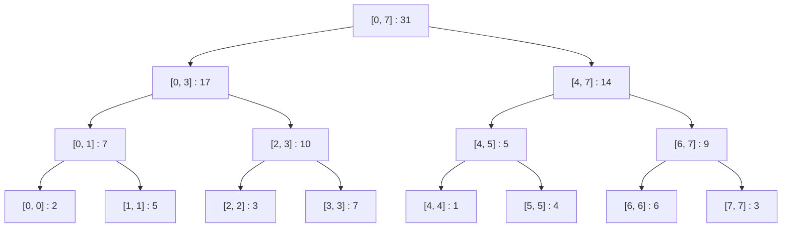
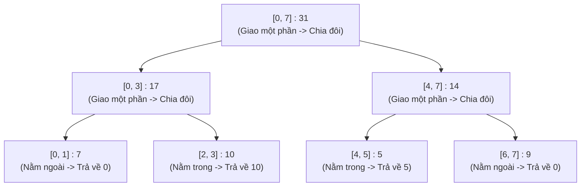
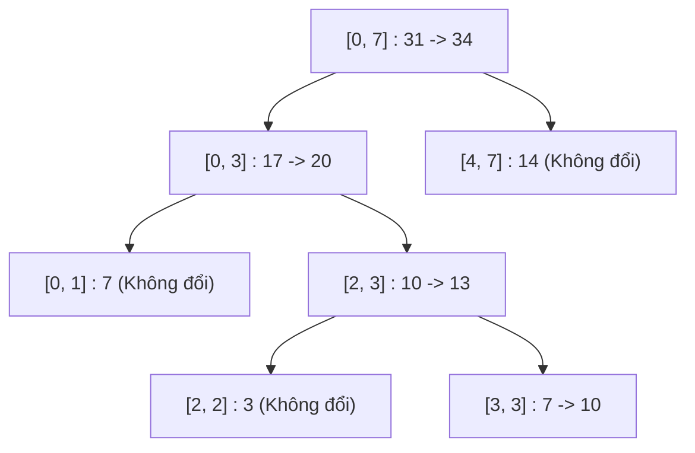
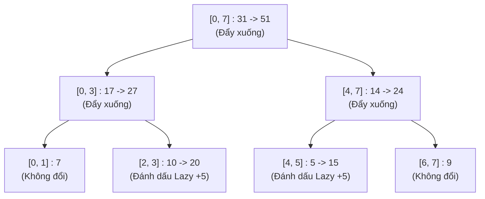
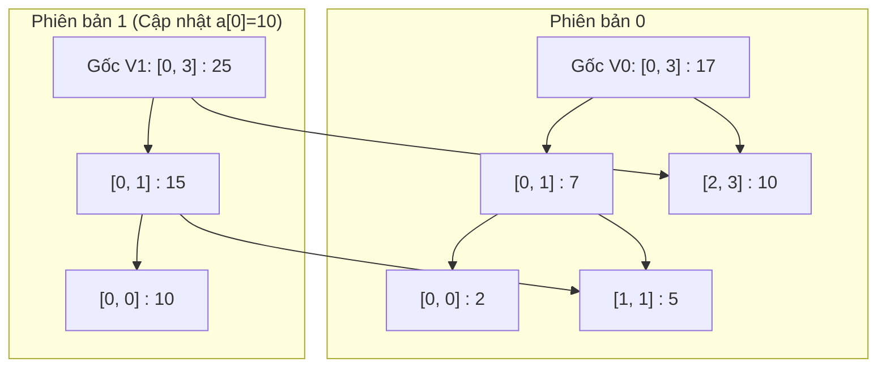

# Bài 8c: Segment Tree (Cây Phân Đoạn) - Truy Vấn Đoạn

> **Tác giả:** FPTOJ Team<br>
> **Nội dung tham khảo từ:** VNOI Wiki - Cây Phân Đoạn, CP-Algorithms

---

## 1. Bản chất vấn đề

### Bài toán thực tế
Giả sử ta quản lý một lớp học gồm $N$ học sinh, mỗi học sinh có một điểm số tương ứng. Ta cần thực hiện liên tục hai loại yêu cầu sau:

1. **Truy vấn tổng:** Tính tổng điểm của các học sinh từ số $L$ đến số $R$.
2. **Cập nhật điểm:** Thay đổi điểm số của học sinh tại vị trí $pos$ thành giá trị mới $val$.

### So sánh các hướng tiếp cận

Nếu sử dụng các cấu trúc dữ liệu thông thường:

*   **Mảng tĩnh (Array):** 
    *   Mỗi thao tác cập nhật điểm chỉ tốn $O(1)$.
    *   Tuy nhiên, để tính tổng điểm đoạn $[L, R]$, ta cần duyệt qua các phần tử từ $L$ đến $R$, tốn $O(N)$ trong trường hợp xấu nhất. Với $Q$ câu hỏi, tổng thời gian sẽ là $O(Q \times N)$, gây ra hiện tượng quá thời gian giới hạn (TLE) khi $N, Q \approx 10^5$.
*   **Mảng cộng dồn (Prefix Sum):**
    *   Cho phép tính tổng đoạn trong $O(1)$ bằng công thức $S[R] - S[L-1]$.
    *   Tuy nhiên, khi có một phần tử tại vị trí $pos$ thay đổi, ta buộc phải cập nhật lại toàn bộ mảng cộng dồn từ vị trí $pos$ đến cuối mảng, tốn $O(N)$. Với nhiều thao tác cập nhật, độ phức tạp vẫn là $O(Q \times N)$.

**Segment Tree** (Cây phân đoạn) ra đời để cân bằng cả hai thao tác trên: mỗi thao tác truy vấn đoạn hoặc cập nhật điểm đều chỉ mất thời gian **$O(\log N)$**, sử dụng không gian bộ nhớ là $O(N)$ (cụ thể là cấp phát mảng kích thước $4N$).

```matplotlib
import math

N_vals = [100, 1000, 10000, 100000, 1000000]
labels = ['100', '1K', '10K', '100K', '1M']

arr_query = [n for n in N_vals]
arr_update = [1] * len(N_vals)
prefix_query = [1] * len(N_vals)
prefix_update = N_vals[:]
segtree_ops = [math.log2(n) for n in N_vals]

fig, axes = plt.subplots(1, 2, figsize=(12, 4.5))

axes[0].plot(labels, arr_query, 'o-', label='Mảng thường O(N)', linewidth=2, markersize=6)
axes[0].plot(labels, prefix_query, 's--', label='Prefix Sum O(1)', linewidth=2, markersize=6)
axes[0].plot(labels, segtree_ops, '^-', label='Segment Tree O(log N)', linewidth=2.5, markersize=6)
axes[0].set_title('Thời gian Truy vấn đoạn [L, R]', fontweight='bold')
axes[0].set_xlabel('Kích thước N')
axes[0].set_ylabel('Số bước (log scale)')
axes[0].set_yscale('log')
axes[0].legend(fontsize=8)
axes[0].grid(True, alpha=0.3)

axes[1].plot(labels, arr_update, 'o--', label='Mảng thường O(1)', linewidth=2, markersize=6)
axes[1].plot(labels, prefix_update, 's-', label='Prefix Sum O(N)', linewidth=2, markersize=6)
axes[1].plot(labels, segtree_ops, '^-', label='Segment Tree O(log N)', linewidth=2.5, markersize=6)
axes[1].set_title('Thời gian Cập nhật một phần tử', fontweight='bold')
axes[1].set_xlabel('Kích thước N')
axes[1].set_ylabel('Số bước (log scale)')
axes[1].set_yscale('log')
axes[1].legend(fontsize=8)
axes[1].grid(True, alpha=0.3)

plt.suptitle('Segment Tree cân bằng cả hai thao tác về O(log N)', fontsize=12, fontweight='bold')
plt.tight_layout()
```

---


## 2. Tư duy cốt lõi: Chia để trị trên cây nhị phân

Ý tưởng chủ đạo của Segment Tree là **tính toán trước và lưu trữ kết quả của các đoạn con** trong mảng gốc, sau đó kết hợp các kết quả này lại khi có yêu cầu truy vấn.

Với mảng gốc $a$ có kích thước $N$:
*   Nút gốc của cây quản lý toàn bộ mảng, tương ứng với đoạn $[0, N-1]$.
*   Tại mỗi nút quản lý đoạn $[start, end]$ (với $start < end$), ta chia đôi đoạn này thành hai nửa:
    *   Con trái quản lý nửa đầu: $[start, mid]$
    *   Con phải quản lý nửa sau: $[mid+1, end]$
    *   Với $mid = \lfloor \frac{start + end}{2} \rfloor$.
*   Quá trình chia đôi này diễn ra liên tục cho đến khi $start = end$. Lúc này, đoạn chỉ còn lại $1$ phần tử duy nhất, tương ứng với một nút lá trên cây quản lý phần tử $a[start]$.

Ví dụ với mảng $a = [2, 5, 3, 7, 1, 4, 6, 3]$ gồm $8$ phần tử:



---

## 3. Cấu trúc cây và Biểu diễn mảng

Segment Tree là một **cây nhị phân đầy đủ** (mọi nút trong đều có đúng $2$ con). Ta có thể biểu diễn cấu trúc cây này dưới dạng một mảng tĩnh $tree$ một chiều (1-indexed):

*   Nút gốc nằm ở chỉ số $1$ ($tree[1]$).
*   Nếu nút cha nằm ở chỉ số $i$, thì:
    *   Nút con trái nằm ở chỉ số $2i$.
    *   Nút con phải nằm ở chỉ số $2i + 1$.
*   If mảng gốc có kích thước $N$, ta sẽ sử dụng mảng $tree$ có kích thước tối đa là $4N$ phần tử để lưu trữ toàn bộ các nút của cây.

### Chứng minh toán học về kích thước mảng $4N$
Một câu hỏi phổ biến là tại sao chúng ta cần cấp phát mảng có kích thước $4N$ để lưu trữ Segment Tree của mảng có $N$ phần tử. Dưới đây là chứng minh toán học chi tiết:

1.  **Trường hợp lý tưởng ($N$ là lũy thừa của $2$):**
    Nếu $N = 2^h$ với $h \in \mathbb{N}$, Segment Tree sẽ là một cây nhị phân đầy đủ hoàn hảo (perfect binary tree) có chiều cao $h$.
    *   Số nút lá ở tầng cuối cùng là $N = 2^h$.
    *   Số nút trong là $N - 1 = 2^h - 1$.
    *   Tổng số nút trên cây là $2N - 1 = 2^{h+1} - 1$.
    Nếu sử dụng chỉ số mảng bắt đầu từ $1$, chỉ số của nút lớn nhất là $2N - 1$. Trong trường hợp này, kích thước mảng chỉ cần $2N$ là đủ.

2.  **Trường hợp tổng quát ($N$ không phải là lũy thừa của $2$):**
    Gọi $h$ là chiều cao nhỏ nhất của cây sao cho $2^h \geq N$. Theo định nghĩa, ta có:
    $$2^{h-1} < N \leq 2^h$$
    Khi đó, ta dựng một cây nhị phân đầy đủ hoàn hảo có chiều cao $h$ để bao phủ toàn bộ $N$ phần tử. Cây này sẽ có số lá là $2^h$.
    Các phần tử thực tế của mảng sẽ được điền vào các lá bên trái, còn các lá dư thừa ở bên phải sẽ được gán giá trị mặc định ($0$ đối với phép tính tổng).
    *   Chỉ số lớn nhất của nút lá trên cây nhị phân đầy đủ hoàn hảo này nằm ở tầng $h$, tương ứng với chỉ số lớn nhất là:
        $$2^{h+1} - 1$$
    *   Từ bất đẳng thức $N > 2^{h-1}$, nhân cả hai vế với $4$, ta được:
        $$4N > 4 \cdot 2^{h-1} = 2 \cdot 2^h = 2^{h+1}$$
    *   Do đó:
        $$\text{Chỉ số lớn nhất} = 2^{h+1} - 1 < 2^{h+1} < 4N$$

Như vậy, chỉ số lớn nhất của bất kỳ nút nào trên cây Segment Tree luôn nhỏ hơn $4N$. Việc cấp phát mảng kích thước $4N$ đảm bảo an toàn tuyệt đối và tránh lỗi vượt quá chỉ số mảng (out of bounds) trong mọi trường hợp.

---

## 4. Thao tác Truy vấn tổng đoạn $[L, R]$

Để tính tổng các phần tử trong khoảng $[L, R]$, ta thực hiện duyệt đệ quy từ nút gốc đi xuống. Tại mỗi nút quản lý đoạn $[start, end]$, có $3$ trường hợp xảy ra:

1.  **Đoạn quản lý nằm ngoài hoàn toàn đoạn truy vấn:**
    $$end < L \quad \text{hoặc} \quad R < start$$
    Trường hợp này, nút hiện tại không đóng góp gì vào tổng cần tìm. Ta lập tức trả về giá trị trung hòa (đối với phép cộng là $0$, đối với phép tìm cực tiểu là $+\infty$).
2.  **Đoạn quản lý nằm trong hoàn toàn đoạn truy vấn:**
    $$L \leq start \quad \text{và} \quad end \leq R$$
    Trường hợp này, toàn bộ các phần tử thuộc đoạn $[start, end]$ đều thuộc đoạn truy vấn. Ta trả về ngay giá trị $tree[node]$ mà không cần đi sâu xuống các con.
3.  **Đoạn quản lý giao một phần với đoạn truy vấn:**
    Ta chia đôi đoạn quản lý hiện tại bằng cách tính $mid = \lfloor \frac{start + end}{2} \rfloor$, sau đó gọi đệ quy tìm kiếm trên con trái (đoạn $[start, mid]$) và con phải (đoạn $[mid+1, end]$). Kết quả trả về là tổng của cả hai lượt đệ quy này.

### Chứng minh độ phức tạp truy vấn $O(\log N)$
Khi thực hiện truy vấn tổng đoạn trong khoảng $[L, R]$, thuật toán duyệt cây từ gốc xuống theo đệ quy. Chúng ta cần chứng minh rằng tại mỗi tầng (level) của cây, số lượng nút được duyệt qua không vượt quá $4$.

Độ phức tạp thời gian phụ thuộc vào số lượng **nút giao một phần**, vì chỉ các nút này mới sinh ra các lượt gọi đệ quy xuống tầng tiếp theo.
1.  Xét một tầng bất kỳ của cây Segment Tree. Các đoạn quản lý của các nút cùng một tầng là các đoạn rời nhau (disjoint) và phủ liên tiếp nhau.
2.  Vì đoạn truy vấn $[L, R]$ là một đoạn liên tục, nó chỉ có tối đa hai điểm biên là điểm đầu $L$ và điểm cuối $R$.
3.  Một nút quản lý $[start, end]$ giao một phần với $[L, R]$ khi và chỉ khi đoạn đó chứa điểm biên $L$ hoặc điểm biên $R$ (nhưng không bao phủ hoàn toàn $[L, R]$).
4.  Do các đoạn ở cùng một tầng rời nhau, tại mỗi tầng chỉ có tối đa $1$ nút chứa $L$ và tối đa $1$ nút chứa $R$.
5.  Như vậy, ở mỗi tầng, số lượng nút giao một phần tối đa là $2$.
6.  Từ mỗi nút giao một phần ở tầng $d$, chúng ta gọi đệ quy xuống tối đa $2$ con ở tầng $d+1$. Do đó, số lượng nút được ghé thăm ở tầng $d+1 tối đa là $2 \times 2 = 4$.
7.  Vì chiều cao của cây Segment Tree là $h = \lceil \log_2 N \rceil$, tổng số nút được ghé thăm trên toàn bộ cây là:
    $$\text{Số nút ghé thăm} \leq 4h = O(\log N)$$
Do đó, độ phức tạp thời gian của hàm truy vấn luôn là $O(\log N)$.

### Minh họa Truy vấn đoạn $[2, 5]$ trên mảng $[2, 5, 3, 7, 1, 4, 6, 3]$

Sơ đồ dưới đây biểu thị trạng thái duyệt của hàm truy vấn:



#### Trace chi tiết từng bước đệ quy của hàm `query(node, start, end, L, R)` với $L = 2, R = 5$:

| Bước | Lời gọi hàm | Trạng thái đoạn so với $[2, 5]$ | Kết quả trả về |
|:---:|:---|:---|:---|
| 1 | `query(node=1, 0, 7, 2, 5)` | Giao một phần ($0 < 2$ và $7 > 5$) | `query(2, 0, 3, 2, 5)` + `query(3, 4, 7, 2, 5)` = $10 + 5 = 15$ |
| 2a | `query(node=2, 0, 3, 2, 5)` | Giao một phần ($0 < 2$) | `query(4, 0, 1, 2, 5)` + `query(5, 2, 3, 2, 5)` = $0 + 10 = 10$ |
| 3a | `query(node=4, 0, 1, 2, 5)` | Nằm ngoài hoàn toàn ($1 < 2$) | $0$ |
| 3b | `query(node=5, 2, 3, 2, 5)` | Nằm trong hoàn toàn ($2 \geq 2$ và $3 \leq 5$) | $tree[5] = 10$ |
| 2b | `query(node=3, 4, 7, 2, 5)` | Giao một phần ($7 > 5$) | `query(6, 4, 5, 2, 5)` + `query(7, 6, 7, 2, 5)` = $5 + 0 = 5$ |
| 3c | `query(node=6, 4, 5, 2, 5)` | Nằm trong hoàn toàn ($4 \geq 2$ và $5 \leq 5$) | $tree[6] = 5$ |
| 3d | `query(node=7, 6, 7, 2, 5)` | Nằm ngoài hoàn toàn ($6 > 5$) | $0$ |

---

## 5. Thao tác Cập nhật điểm $a[pos] = val$

Khi điểm số tại vị trí $pos$ thay đổi, ta cần cập nhật lại giá trị lưu trữ của toàn bộ các nút trên cây có chứa vị trí $pos$ này (tổng cộng $O(\log N)$ nút trên đường đi từ lá lên gốc).

### Minh họa cập nhật $a[3] = 10$ (thay đổi giá trị tại $pos = 3$ từ $7$ thành $10$)

Đường đi của quá trình cập nhật dọc theo cây được làm nổi bật như sau:



---

## 6. Cài đặt Cây Segment Tree cơ bản

Dưới đây là mã nguồn cài đặt đầy đủ của Segment Tree hỗ trợ cập nhật điểm và truy vấn tổng đoạn:

=== "C++"

    ```cpp
    #include <iostream>
    #include <vector>

    using namespace std;

    class SegmentTree {
    private:
        int n;
        vector<long long> tree;

        // Xây dựng cây phân đoạn - O(N)
        void build(int node, int start, int end, const vector<int>& a) {
            if (start == end) {
                tree[node] = a[start];
                return;
            }
            int mid = (start + end) / 2;
            build(2 * node, start, mid, a);
            build(2 * node + 1, mid + 1, end, a);
            tree[node] = tree[2 * node] + tree[2 * node + 1];
        }

        // Truy vấn tổng đoạn [l, r] - O(log N)
        long long query(int node, int start, int end, int l, int r) {
            if (r < start || end < l) {
                return 0; // Trả về giá trị trung hòa của phép cộng
            }
            if (l <= start && end <= r) {
                return tree[node]; // Nằm hoàn toàn trong đoạn truy vấn
            }
            int mid = (start + end) / 2;
            long long left_sum = query(2 * node, start, mid, l, r);
            long long right_sum = query(2 * node + 1, mid + 1, end, l, r);
            return left_sum + right_sum;
        }

        // Cập nhật điểm: a[pos] = val - O(log N)
        void update(int node, int start, int end, int pos, long long val) {
            if (start == end) {
                tree[node] = val;
                return;
            }
            int mid = (start + end) / 2;
            if (pos <= mid) {
                update(2 * node, start, mid, pos, val);
            } else {
                update(2 * node + 1, mid + 1, end, pos, val);
            }
            tree[node] = tree[2 * node] + tree[2 * node + 1];
        }

    public:
        SegmentTree(const vector<int>& a) {
            n = a.size();
            tree.assign(4 * n, 0);
            build(1, 0, n - 1, a);
        }

        long long query(int l, int r) {
            return query(1, 0, n - 1, l, r);
        }

        void update(int pos, long long val) {
            update(1, 0, n - 1, pos, val);
        }
    };

    int main() {
        ios_base::sync_with_stdio(false);
        cin.tie(NULL);

        int n, q;
        if (!(cin >> n >> q)) return 0;

        vector<int> a(n);
        for (int i = 0; i < n; i++) {
            cin >> a[i];
        }

        SegmentTree st(a);

        while (q--) {
            int type;
            cin >> type;
            if (type == 1) {
                int pos;
                long long val;
                cin >> pos >> val;
                st.update(pos - 1, val); // Chuyển đổi sang 0-indexed
            } else if (type == 2) {
                int l, r;
                cin >> l >> r;
                cout << st.query(l - 1, r - 1) << "\n";
            }
        }
        return 0;
    }
    ```

=== "Python"

    ```python
    import sys

    class SegmentTree:
        def __init__(self, a):
            self.n = len(a)
            self.tree = [0] * (4 * self.n)
            self._build(1, 0, self.n - 1, a)

        def _build(self, node, start, end, a):
            """Khởi tạo cây phân đoạn - O(N)"""
            if start == end:
                self.tree[node] = a[start]
                return
            mid = (start + end) // 2
            self._build(2 * node, start, mid, a)
            self._build(2 * node + 1, mid + 1, end, a)
            self.tree[node] = self.tree[2 * node] + self.tree[2 * node + 1]

        def query(self, node, start, end, l, r):
            """Truy vấn tổng đoạn [l, r] - O(log N)"""
            if r < start or end < l:
                return 0
            if l <= start and end <= r:
                return self.tree[node]
            mid = (start + end) // 2
            left_sum = self.query(2 * node, start, mid, l, r)
            right_sum = self.query(2 * node + 1, mid + 1, end, l, r)
            return left_sum + right_sum

        def update(self, node, start, end, pos, val):
            """Cập nhật phần tử: a[pos] = val - O(log N)"""
            if start == end:
                self.tree[node] = val
                return
            mid = (start + end) // 2
            if pos <= mid:
                self.update(2 * node, start, mid, pos, val)
            else:
                self.update(2 * node + 1, start, mid, pos, val) # Sửa lỗi chỉ số so với bản cũ
            self.tree[node] = self.tree[2 * node] + self.tree[2 * node + 1]


    def main():
        input = sys.stdin.read
        data = input().split()
        if not data:
            return
        
        n = int(data[0])
        q = int(data[1])
        
        a = [int(x) for x in data[2:2+n]]
        st = SegmentTree(a)
        
        idx = 2 + n
        out = []
        for _ in range(q):
            type_q = int(data[idx])
            if type_q == 1:
                pos = int(data[idx+1])
                val = int(data[idx+2])
                st.update(1, 0, n - 1, pos - 1, val)
                idx += 3
            else:
                l = int(data[idx+1])
                r = int(data[idx+2])
                res = st.query(1, 0, n - 1, l - 1, r - 1)
                out.append(str(res))
                idx += 3
                
        print("\n".join(out))

    if __name__ == "__main__":
        main()
    ```

---

## 7. Biến thể: Segment Tree áp dụng cho Min/Max

Segment Tree cực kỳ linh hoạt nhờ khả năng thay đổi phép toán gộp. Nếu bài toán yêu cầu tìm giá trị nhỏ nhất (hoặc lớn nhất) trong đoạn thay vì tính tổng:

*   **Phép gộp:** Thay phép tính cộng `+` thành phép lấy cực trị `min()` hoặc `max()`.
    $$tree[node] = \min(tree[2 \cdot node], tree[2 \cdot node + 1])$$
*   **Giá trị trung hòa:** Thay giá trị trung hòa $0$ của tổng bằng $+\infty$ đối với phép tìm min, hoặc $-\infty$ đối với phép tìm max.
    ```cpp
    if (r < start || end < l) return INT_MAX; // Cho truy vấn tìm Min
    ```

---

## 8. Kỹ thuật Lazy Propagation (Trì hoãn Cập nhật đoạn)

### Bài toán thực tế
Giả sử ta cần thực hiện yêu cầu sau: "Cộng thêm giá trị $val$ vào toàn bộ các phần tử từ vị trí $L$ đến vị trí $R$". 

Nếu cập nhật điểm thông thường, ta phải thực hiện cập nhật $(R - L + 1)$ lần, tốn $O(N \log N)$ thời gian cho mỗi truy vấn. Để giải quyết, ta sử dụng kỹ thuật **Lazy Propagation** (Lan truyền trễ) giúp đưa thao tác cập nhật đoạn về độ phức tạp **$O(\log N)$**.

### Ý tưởng cốt lõi: "Sự lười biếng thông minh"
Khi thực hiện cập nhật cộng thêm $val$ trên đoạn $[L, R]$:
*   Nếu đoạn quản lý của nút $[start, end]$ nằm hoàn toàn trong $[L, R]$, ta **cập nhật ngay giá trị của nút này** và ghi lại một **nhãn lười (lazy tag)** tại nút đó với nội dung: *"Các nút con của nút này sẽ cần cộng thêm $val$ khi được duyệt tới"*. Ta không lập tức cập nhật các nút con.
*   Khi có bất kỳ thao tác truy vấn hay cập nhật nào khác đi qua nút hiện tại, ta thực hiện thao tác **đẩy xuống (pushDown)**: lan truyền giá trị nhãn lười từ cha xuống hai con, cập nhật giá trị của hai con rồi xóa nhãn lười tại nút cha.

### Phân tích toán học về tính đúng đắn của phép đẩy trễ
Với một nút quản lý đoạn $[start, end]$ có độ dài đoạn là $length = end - start + 1$:
*   Nếu tất cả các phần tử trong đoạn được cộng thêm một lượng $V$, thì giá trị tổng lưu tại nút đó sẽ tăng thêm một lượng là:
    $$\Delta = V \times (end - start + 1)$$
*   Phép toán này đảm bảo tính phân phối của phép nhân đối với phép cộng:
    $$\sum_{i=start}^{end} (a[i] + V) = \left( \sum_{i=start}^{end} a[i] \right) + V \times (end - start + 1)$$
*   Khi đẩy nhãn lười $V$ xuống các con, con trái quản lý đoạn $[start, mid]$ và con phải quản lý đoạn $[mid+1, end]$ sẽ lần lượt nhận giá trị nhãn lười cộng dồn $lazy[2i] \leftarrow lazy[2i] + V$ và $lazy[2i+1] \leftarrow lazy[2i+1] + V$.

### Minh họa Lan truyền trễ khi cộng $5$ vào đoạn $[2, 5]$

Sơ đồ dưới đây minh họa các nút nhận giá trị và các nút được đánh dấu nhãn lười:



### Cài đặt Lazy Propagation

=== "C++"

    ```cpp
    #include <iostream>
    #include <vector>

    using namespace std;

    class LazySegmentTree {
    private:
        int n;
        vector<long long> tree;
        vector<long long> lazy;

        // Đẩy giá trị lười từ nút cha xuống 2 con
        void pushDown(int node, int start, int end) {
            if (lazy[node] == 0) return;

            // Cập nhật giá trị nút hiện tại
            tree[node] += lazy[node] * (end - start + 1);

            // Nếu chưa phải là nút lá, lan truyền nhãn lười xuống 2 con
            if (start != end) {
                lazy[2 * node] += lazy[node];
                lazy[2 * node + 1] += lazy[node];
            }

            // Xóa nhãn lười của nút hiện tại
            lazy[node] = 0;
        }

        // Cập nhật đoạn: cộng val vào các phần tử trong đoạn [l, r] - O(log N)
        void rangeUpdate(int node, int start, int end, int l, int r, long long val) {
            pushDown(node, start, end); // Đảm bảo nút hiện tại được cập nhật mới nhất

            if (r < start || end < l) return;

            if (l <= start && end <= r) {
                lazy[node] += val;
                pushDown(node, start, end);
                return;
            }

            int mid = (start + end) / 2;
            rangeUpdate(2 * node, start, mid, l, r, val);
            rangeUpdate(2 * node + 1, mid + 1, end, l, r, val);
            tree[node] = tree[2 * node] + tree[2 * node + 1];
        }

        // Truy vấn tổng đoạn [l, r] - O(log N)
        long long query(int node, int start, int end, int l, int r) {
            pushDown(node, start, end); // Đẩy nhãn lười trước khi đọc giá trị

            if (r < start || end < l) return 0;

            if (l <= start && end <= r) {
                return tree[node];
            }

            int mid = (start + end) / 2;
            long long left_sum = query(2 * node, start, mid, l, r);
            long long right_sum = query(2 * node + 1, mid + 1, end, l, r);
            return left_sum + right_sum;
        }

    public:
        LazySegmentTree(int size) {
            n = size;
            tree.assign(4 * n, 0);
            lazy.assign(4 * n, 0);
        }

        void rangeUpdate(int l, int r, long long val) {
            rangeUpdate(1, 0, n - 1, l, r, val);
        }

        long long query(int l, int r) {
            return query(1, 0, n - 1, l, r);
        }
    };
    ```

=== "Python"

    ```python
    class LazySegmentTree:
        def __init__(self, n):
            self.n = n
            self.tree = [0] * (4 * n)
            self.lazy = [0] * (4 * n)

        def _push_down(self, node, start, end):
            if self.lazy[node] == 0:
                return
            
            # Cập nhật giá trị nút hiện tại
            self.tree[node] += self.lazy[node] * (end - start + 1)
            
            # Đẩy nhãn lười xuống hai con nếu chưa phải là nút lá
            if start != end:
                self.lazy[2 * node] += self.lazy[node]
                self.lazy[2 * node + 1] += self.lazy[node]
            
            self.lazy[node] = 0

        def range_update(self, node, start, end, l, r, val):
            """Cập nhật cộng thêm val cho tất cả các phần tử trong khoảng [l, r] - O(log N)"""
            self._push_down(node, start, end)
            
            if r < start or end < l:
                return
            
            if l <= start and end <= r:
                self.lazy[node] += val
                self._push_down(node, start, end)
                return
            
            mid = (start + end) // 2
            self.range_update(2 * node, start, mid, l, r, val)
            self.range_update(2 * node + 1, mid + 1, end, l, r, val)
            self.tree[node] = self.tree[2 * node] + self.tree[2 * node + 1]

        def query(self, node, start, end, l, r):
            """Truy vấn tổng đoạn [l, r] - O(log N)"""
            self._push_down(node, start, end)
            
            if r < start or end < l:
                return 0
            
            if l <= start and end <= r:
                return self.tree[node]
            
            mid = (start + end) // 2
            left_sum = self.query(2 * node, start, mid, l, r)
            right_sum = self.query(2 * node + 1, mid + 1, end, l, r)
            return left_sum + right_sum
    ```

---

## 9. Cấu trúc Cây Phân Đoạn Bền Vững (Persistent Segment Tree)

### Bài toán thực tế
Ta cần thực hiện cập nhật mảng gốc và trả lời các truy vấn đoạn giống như Segment Tree cơ bản, nhưng cần hỗ trợ **truy vấn trên các phiên bản lịch sử** khác nhau của mảng. 

### Ý tưởng cốt lõi: Sao chép đường đi
Thay vì tạo mới một Segment Tree hoàn toàn mới cho mỗi phiên bản (tốn $O(N)$ bộ nhớ và thời gian), ta nhận thấy một thao tác cập nhật điểm chỉ làm thay đổi tối đa $O(\log N)$ nút trên đường đi từ gốc đến lá. 

*   Đối với mỗi thao tác cập nhật, ta **tạo ra các nút mới** dọc theo đường đi từ gốc đến lá để ghi nhận thông tin mới.
*   Các nhánh không nằm trên đường đi này sẽ được trỏ trực tiếp (chia sẻ) sang các nút tương ứng của cây phiên bản trước đó.
*   Do đó, mỗi lần cập nhật ta chỉ tạo thêm $O(\log N)$ nút mới. Bộ nhớ tăng thêm cho mỗi phiên bản chỉ là $O(\log N)$.

### Sơ đồ cấu trúc chia sẻ nút giữa Phiên bản 0 và Phiên bản 1 (cập nhật $a[0] = 10$)



### Cài đặt Persistent Segment Tree

=== "C++"

    ```cpp
    #include <iostream>
    #include <vector>

    using namespace std;

    struct Node {
        long long val;
        int left, right; // Chỉ số đến các nút con trái và phải
    };

    class PersistentSegmentTree {
    private:
        int n;
        vector<Node> tree;
        vector<int> roots; // Lưu trữ chỉ số nút gốc của từng phiên bản

        int build(int start, int end, const vector<int>& a) {
            int node_id = tree.size();
            tree.push_back({0, -1, -1});

            if (start == end) {
                tree[node_id].val = a[start];
                return node_id;
            }

            int mid = (start + end) / 2;
            int l_child = build(start, mid, a);
            int r_child = build(mid + 1, end, a);
            
            tree[node_id].left = l_child;
            tree[node_id].right = r_child;
            tree[node_id].val = tree[l_child].val + tree[r_child].val;
            return node_id;
        }

        // Cập nhật điểm, trả về chỉ số nút gốc mới
        int update(int prev_node_id, int start, int end, int pos, long long val) {
            int node_id = tree.size();
            // Sao chép nội dung từ nút của phiên bản cũ
            tree.push_back(tree[prev_node_id]);

            if (start == end) {
                tree[node_id].val = val;
                return node_id;
            }

            int mid = (start + end) / 2;
            if (pos <= mid) {
                tree[node_id].left = update(tree[prev_node_id].left, start, mid, pos, val);
            } else {
                tree[node_id].right = update(tree[prev_node_id].right, mid + 1, end, pos, val);
            }
            
            int l = tree[node_id].left;
            int r = tree[node_id].right;
            tree[node_id].val = tree[l].val + tree[r].val;
            return node_id;
        }

        long long query(int node_id, int start, int end, int l, int r) {
            if (r < start || end < l) return 0;
            if (l <= start && end <= r) return tree[node_id].val;
            
            int mid = (start + end) / 2;
            return query(tree[node_id].left, start, mid, l, r) +
                   query(tree[node_id].right, mid + 1, end, l, r);
        }

    public:
        PersistentSegmentTree(const vector<int>& a) {
            n = a.size();
            roots.push_back(build(0, n - 1, a));
        }

        // Tạo phiên bản mới bằng cách thay đổi giá trị tại vị trí pos
        void updateNewVersion(int prev_version, int pos, long long val) {
            int new_root = update(roots[prev_version], 0, n - 1, pos, val);
            roots.push_back(new_root);
        }

        // Truy vấn tổng đoạn trên phiên bản được chỉ định
        long long queryVersion(int version, int l, int r) {
            return query(roots[version], 0, n - 1, l, r);
        }

        int getNumVersions() const {
            return roots.size();
        }
    };
    ```

=== "Python"

    ```python
    class PersistentSegmentTree:
        class Node:
            def __init__(self, val=0, left=-1, right=-1):
                self.val = val
                self.left = left
                self.right = right

        def __init__(self, a):
            self.n = len(a)
            self.tree = []
            self.roots = []
            self.roots.append(self._build(0, self.n - 1, a))

        def _build(self, start, end, a):
            node_id = len(self.tree)
            self.tree.append(self.Node())
            if start == end:
                self.tree[node_id].val = a[start]
                return node_id
            
            mid = (start + end) // 2
            left_child = self._build(start, mid, a)
            right_child = self._build(mid + 1, end, a)
            
            self.tree[node_id].left = left_child
            self.tree[node_id].right = right_child
            self.tree[node_id].val = self.tree[left_child].val + self.tree[right_child].val
            return node_id

        def _update(self, prev_node_id, start, end, pos, val):
            node_id = len(self.tree)
            old_node = self.tree[prev_node_id]
            # Tạo bản sao của nút cũ
            self.tree.append(self.Node(old_node.val, old_node.left, old_node.right))
            
            if start == end:
                self.tree[node_id].val = val
                return node_id
            
            mid = (start + end) // 2
            if pos <= mid:
                self.tree[node_id].left = self._update(old_node.left, start, mid, pos, val)
            else:
                self.tree[node_id].right = self._update(old_node.right, mid + 1, end, pos, val)
            
            l = self.tree[node_id].left
            r = self.tree[node_id].right
            self.tree[node_id].val = self.tree[l].val + self.tree[r].val
            return node_id

        def update_new_version(self, prev_version, pos, val):
            """Tạo phiên bản mới từ phiên bản cũ và lưu lại gốc mới"""
            new_root = self._update(self.roots[prev_version], 0, self.n - 1, pos, val)
            self.roots.append(new_root)

        def _query(self, node_id, start, end, l, r):
            if r < start or end < l:
                return 0
            if l <= start and end <= r:
                return self.tree[node_id].val
            
            mid = (start + end) // 2
            return (self._query(self.tree[node_id].left, start, mid, l, r) +
                    self._query(self.tree[node_id].right, mid + 1, end, l, r))

        def query_version(self, version, l, r):
            """Truy vấn tổng trên một phiên bản xác định"""
            return self._query(self.roots[version], 0, self.n - 1, l, r)
    ```

---

## 10. Segment Tree 2 Chiều (2D Segment Tree)

### Bài toán thực tế
Cho một ma trận kích thước $N \times M$. Ta cần thực hiện:
*   Truy vấn tổng các phần tử trong hình chữ nhật con giới hạn bởi góc trái trên $(x_1, y_1)$ và góc phải dưới $(x_2, y_2)$.
*   Cập nhật phần tử tại một điểm $(x, y) = val$.

### Ý tưởng cốt lõi: "Cây lồng cây"
Ta xây dựng một Segment Tree theo chiều dọc (quản lý các hàng từ $0$ đến $N-1$). Tại mỗi nút của cây dọc này, thay vì lưu một giá trị số, ta lưu trữ **một cây Segment Tree theo chiều ngang** quản lý các cột từ $0$ đến $M-1$.

*   Để cập nhật điểm $(x, y) = val$, ta duyệt tìm các nút quản lý hàng $x$ trên Segment Tree hàng, tại mỗi nút đi qua ta tiến hành cập nhật giá trị cột $y$ tương ứng trong cây con cột.
*   Độ phức tạp cho mỗi lần cập nhật hoặc truy vấn là $O(\log N \times \log M)$.

---

## 11. Tóm tắt Độ phức tạp

Dưới đây là bảng tổng kết độ phức tạp về thời gian và không gian của các biến thể Segment Tree:

| Cấu trúc dữ liệu | Cập nhật điểm | Cập nhật đoạn | Truy vấn đoạn | Không gian bộ nhớ |
|:---|:---:|:---:|:---:|:---:|
| **Segment Tree Cơ bản** | $O(\log N)$ | $O(N \log N)$ | $O(\log N)$ | $O(N)$ (cần mảng $4N$) |
| **Lazy Segment Tree** | $O(\log N)$ | $O(\log N)$ | $O(\log N)$ | $O(N)$ (cần $2$ mảng $4N$) |
| **Persistent Segment Tree** | $O(\log N)$ | — | $O(\log N)$ | $O(N + Q \log N)$ |
| **2D Segment Tree** | $O(\log N \log M)$ | — | $O(\log N \log M)$ | $O(N \times M)$ (cần mảng $16NM$) |

---

## 12. Khi nào dùng Segment Tree so với Fenwick Tree (BIT)?

Cả hai cấu trúc dữ liệu đều có độ phức tạp thời gian cực kỳ tối ưu, tuy nhiên ta cần cân nhắc sử dụng tùy theo yêu cầu cụ thể:

*   **Nên dùng Fenwick Tree (BIT) khi:**
    *   Bài toán chỉ yêu cầu tính tổng/tích đoạn (các phép toán có tính chất nghịch đảo).
    *   Yêu cầu tiết kiệm bộ nhớ tối đa ($O(N)$ tuyệt đối).
    *   Cần tốc độ thực thi nhanh và code ngắn gọn dễ cài đặt.
*   **Nên dùng Segment Tree khi:**
    *   Phép toán cần gộp không có tính chất nghịch đảo (ví dụ: tìm giá trị nhỏ nhất/lớn nhất đoạn, tìm ước chung lớn nhất đoạn).
    *   Yêu cầu cập nhật một khoảng đoạn giá trị (Lazy Propagation).
    *   Yêu cầu lưu trữ các phiên bản lịch sử của dữ liệu (Persistent Segment Tree).

---

## 13. Bài tập luyện tập

| Tên bài tập | Nền tảng | Độ khó | Hướng dẫn sơ lược |
|:---|:---:|:---:|:---|
| [CSES - Dynamic Range Sum Queries](https://cses.fi/problemset/task/1648) | CSES | ⭐⭐ | Cây Segment Tree cơ bản tính tổng |
| [CSES - Dynamic Range Min Queries](https://cses.fi/problemset/task/1649) | CSES | ⭐⭐ | Thay phép gộp thành lấy giá trị nhỏ nhất |
| [CSES - Range Update Queries](https://cses.fi/problemset/task/1651) | CSES | ⭐⭐⭐ | Sử dụng Lazy Propagation cập nhật đoạn |
| [CSES - Distinct Values Queries](https://cses.fi/problemset/task/1734) | CSES | ⭐⭐⭐ | Kết hợp Offline Query và Segment Tree |
| [SPOJ - MKTHNUM](https://www.spoj.com/problems/MKTHNUM/) | SPOJ | ⭐⭐⭐⭐ | Áp dụng Persistent Segment Tree để tìm số nhỏ thứ K |

---

## 14. Tài liệu tham khảo

*   [CP-Algorithms - Segment Tree](https://cp-algorithms.com/data_structures/segment_tree.html)
*   [VNOI Wiki - Cây Phân Đoạn](https://wiki.vnoi.info/algo/data-structures/segment-tree-basic)
*   [Codeforces - Efficient Segment Trees](https://codeforces.com/blog/entry/18051)
*   [YouTube - Segment Tree Playlist (takeuforward)](https://www.youtube.com/playlist?list=PLtfqa971vD5GTQjH9U0H6kiq9cQlFFa5k)

**Bài liên quan:**
*   [Bài 8a: Heap (Hàng đợi ưu tiên)](heap.md)
*   [Bài 8b: DSU (Gộp tập hợp)](dsu.md)
*   [Bài 8d: Fenwick Tree (Cây chỉ số nhị phân)](fenwick-tree.md)
