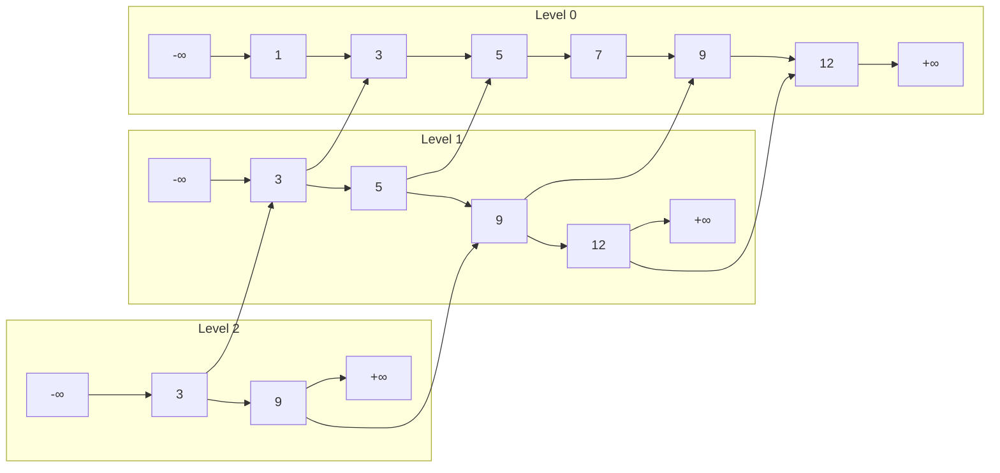

# Skip List - Cấu Trúc Dữ Liệu Probabilistic

> **Tác giả:** FPTOJ Team<br>
> **Nội dung tham khảo từ:** CP-Algorithms - Skip List

---

## 1. Bản chất vấn đề

### Bài toán: Tìm kiếm, chèn, xóa trên danh sách liên kết

Danh sách liên kết (Linked List) có thao tác chèn/xóa $O(1)$ nhưng tìm kiếm $O(N)$. Cần cấu trúc:

- Tìm kiếm: $O(\log N)$
- Chèn / Xóa: $O(\log N)$
- Không cần cây cân bằng phức tạp

**Skip List** là giải pháp — sử dụng xác suất thay vì phép quay cây.

### So sánh

| Cấu trúc | Tìm kiếm (TB) | Chèn / Xóa | Cài đặt |
|----------|--------------|-------------|---------|
| Linked List | $O(N)$ | $O(1)$ | Đơn giản |
| BST cân bằng | $O(\log N)$ | $O(\log N)$ | Phức tạp |
| **Skip List** | $O(\log N)$ | $O(\log N)$ | Trung bình |

---

## 2. Tư duy cốt lõi

### Ý tưởng: Nhiều tầng danh sách

Skip List gồm nhiều **tầng** (level), mỗi tầng là 1 danh sách liên kết đã sắp xếp.

- **Tầng 0:** Chứa **tất cả** phần tử (danh sách đầy đủ).
- **Tầng 1:** Chứa ~$N/2$ phần tử (bỏ qua 1 nửa).
- **Tầng 2:** Chứa ~$N/4$ phần tử (bỏ qua 3/4).
- **Tầng $k$:** Chứa ~$N/2^k$ phần tử.

Tìm kiếm bắt đầu từ tầng cao nhất, nhảy sang phải cho đến khi vượt quá giá trị cần tìm → đi xuống tầng thấp hơn.

### Minh họa cấu trúc



### Trace: Tìm kiếm số 7

| Bước | Tầng | Vị trí hiện tại | So sánh | Hành động |
|------|-------|----------------|---------|-----------|
| 1 | 2 | $-\infty$ | $-\infty < 7$ | Sang phải: node 3 |
| 2 | 2 | $3$ | $3 < 7$ | Sang phải: node 9 |
| 3 | 2 | $9$ | $9 > 7$ | Xuống tầng 1 |
| 4 | 1 | $3$ | $3 < 7$ | Sang phải: node 5 |
| 5 | 1 | $5$ | $5 < 7$ | Sang phải: node 9 |
| 6 | 1 | $9$ | $9 > 7$ | Xuống tầng 0 |
| 7 | 0 | $5$ | $5 < 7$ | Sang phải: node 7 |
| 8 | 0 | $7$ | $7 = 7$ | **Tìm thấy!** |

Số bước: **8** thay vì **4** (duyệt tuyến tính từ đầu: $1 \to 3 \to 5 \to 7$). Với $N$ nhỏ, Skip List chưa có ưu thế. Nhưng với $N = 10^6$, tuyến tính cần $10^6$ bước trong khi Skip List chỉ cần $\sim 40$ bước.

### Xác suất nâng tầng

Khi chèn phần tử mới, tung đồng xu:

- **Head (50%):** Nâng lên tầng tiếp theo.
- **Tail (50%):** Dừng lại.

Với xác suất $p = 1/2$:

| Tầng | Kỳ vọng số phần tử |
|------|---------------------|
| 0 | $N$ |
| 1 | $N/2$ |
| 2 | $N/4$ |
| $k$ | $N/2^k$ |

Chiều cao tối đa kỳ vọng: $\log_2 N$.

---

## 3. Phân tích tính đúng đắn

### Tại sao Skip List cho kết quả đúng?

Mỗi tầng là danh sách con (subsequence) của tầng bên dưới, **giữ nguyên thứ tự**. Khi tìm kiếm:

- Ở tầng cao, nhảy qua nhiều phần tử → bỏ nhanh các phần tử không cần thiết.
- Khi không thể nhảy thêm → đi xuống tầng chi tiết hơn.
- Ở tầng 0, tìm thấy chính xác vị trí.

### Kỳ vọng độ phức tạp

Với xác suất $p = 1/2$, số bước tìm kiếm kỳ vọng:

$$E[\text{steps}] = \frac{1}{p} \cdot \log_{1/p} N = 2 \log_2 N$$

---

## 4. Đánh giá độ phức tạp

| Thao tác | Trung bình (Kỳ vọng) | Worst case |
|----------|----------------------|------------|
| Tìm kiếm | $O(\log N)$ | $O(N)$ |
| Chèn | $O(\log N)$ | $O(N)$ |
| Xóa | $O(\log N)$ | $O(N)$ |
| Không gian | $O(N)$ | $O(N \log N)$ |

Worst case $O(N)$ xảy ra khi tất cả phần tử cùng tầng (rất hiếm, xác suất $\approx 0$).

---

## Code minh họa

### Skip List cơ bản — Tìm kiếm và chèn

=== "C++"

    ```cpp
    #include <bits/stdc++.h>
    using namespace std;

    struct Node {
        int val, level;
        vector<Node*> next;
        Node(int v, int l) : val(v), level(l), next(l + 1, nullptr) {}
    };

    struct SkipList {
        Node* head;
        int maxLevel;
        mt19937 rng;

        SkipList(int n) {
            maxLevel = __lg(n) + 1;
            head = new Node(INT_MIN, maxLevel);
            rng = mt19937(chrono::steady_clock::now().time_since_epoch().count());
        }

        int randomLevel() {
            int lvl = 0;
            while ((rng() & 1) && lvl < maxLevel) lvl++;
            return lvl;
        }

        bool search(int target) {
            Node* cur = head;
            for (int i = maxLevel; i >= 0; i--) {
                while (cur->next[i] && cur->next[i]->val < target)
                    cur = cur->next[i];
            }
            cur = cur->next[0];
            return cur && cur->val == target;
        }

        void insert(int val) {
            vector<Node*> update(maxLevel + 1, head);
            Node* cur = head;

            for (int i = maxLevel; i >= 0; i--) {
                while (cur->next[i] && cur->next[i]->val < val)
                    cur = cur->next[i];
                update[i] = cur;
            }

            int newLevel = randomLevel();
            Node* newNode = new Node(val, newLevel);

            for (int i = 0; i <= newLevel; i++) {
                newNode->next[i] = update[i]->next[i];
                update[i]->next[i] = newNode;
            }
        }
    };

    int main() {
        int n, q;
        cin >> n >> q;

        SkipList sl(n);
        for (int i = 0; i < n; i++) {
            int x;
            cin >> x;
            sl.insert(x);
        }

        while (q--) {
            int type, val;
            cin >> type >> val;
            if (type == 1) {
                sl.insert(val);
            } else {
                cout << (sl.search(val) ? "YES" : "NO") << "\n";
            }
        }
        return 0;
    }
    ```

=== "Python"

    ```python
    import random
    import sys
    input = sys.stdin.readline

    class Node:
        __slots__ = ['val', 'next']
        def __init__(self, val, level):
            self.val = val
            self.next = [None] * (level + 1)

    class SkipList:
        def __init__(self, n):
            self.max_level = n.bit_length()
            self.head = Node(float('-inf'), self.max_level)

        def random_level(self):
            lvl = 0
            while random.random() < 0.5 and lvl < self.max_level:
                lvl += 1
            return lvl

        def search(self, target):
            cur = self.head
            for i in range(self.max_level, -1, -1):
                while cur.next[i] and cur.next[i].val < target:
                    cur = cur.next[i]
            cur = cur.next[0]
            return cur is not None and cur.val == target

        def insert(self, val):
            update = [self.head] * (self.max_level + 1)
            cur = self.head

            for i in range(self.max_level, -1, -1):
                while cur.next[i] and cur.next[i].val < val:
                    cur = cur.next[i]
                update[i] = cur

            new_level = self.random_level()
            new_node = Node(val, new_level)

            for i in range(new_level + 1):
                new_node.next[i] = update[i].next[i]
                update[i].next[i] = new_node

    n, q = map(int, input().split())
    sl = SkipList(n)

    for x in map(int, input().split()):
        sl.insert(x)

    for _ in range(q):
        parts = list(map(int, input().split()))
        if parts[0] == 1:
            sl.insert(parts[1])
        else:
            print("YES" if sl.search(parts[1]) else "NO")
    ```
