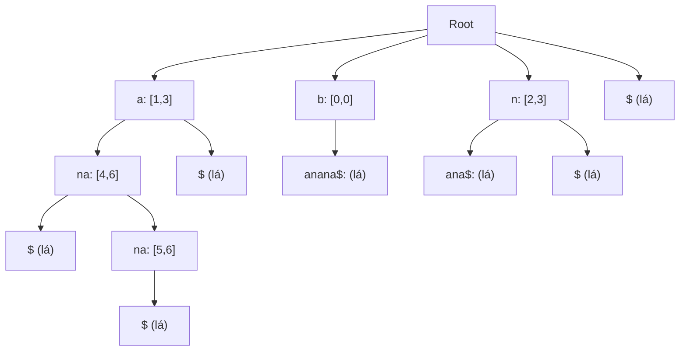

# Suffix Tree - Cây Hậu Tố

> **Tác giả:** FPTOJ Team<br>
> **Nội dung tham khảo từ:** CP-Algorithms - Suffix Tree

!!! warning "Lưu ý"
    Bài viết này giải thích **khái niệm** Suffix Tree và so sánh với Suffix Array. Code minh họa bên dưới xây dựng **Suffix Array** (với LCP bằng Kasai's algorithm), không phải Suffix Tree đầy đủ. Giải thuật Ukkonen để xây dựng Suffix Tree thực sự rất phức tạp và nằm ngoài phạm vi bài viết.

---

## 1. Bản chất vấn đề

### Định nghĩa

Suffix Tree của xâu $S$ là cây có hướng trong đó mỗi cạnh được gán nhãn bằng 1 xâu con của $S$, và mỗi hậu tố của $S$ tương ứng với 1 đường đi từ gốc đến lá (hoặc nút trong).

### So sánh

| Cấu trúc | Xây dựng | Không gian | Ứng dụng |
|----------|----------|------------|----------|
| Suffix Array | $O(N \log N)$ | $O(N)$ | Nhiều bài toán xâu |
| **Suffix Tree** | $O(N)$ | $O(N)$ | Ukkonen's algorithm |
| Trie | $O(N \cdot |\Sigma|)$ | $O(N \cdot |\Sigma|)$ | Tiền tố |

### Ứng dụng

| Bài toán | Thời gian với Suffix Tree |
|----------|--------------------------|
| Tìm xâu con | $O(M)$ ($M$ = độ dài pattern) |
| Xâu con chung dài nhất (LCS) | $O(N)$ |
| Đếm xâu con phân biệt | $O(N)$ |
| Xâu lặp lại dài nhất | $O(N)$ |

---

## 2. Tư duy cốt lõi

### Ukkonen's Algorithm

Xây Suffix Tree online, từng ký tự một. Mỗi bước thêm $S[i]$ vào cây.

**Kỹ thuật:**

- **Suffix Link:** Giống Palindrome Tree, giúp nhảy nhanh.
- **Rule 2 (Showstopper):** Khi cần tạo nút mới.
- **Implicit Suffix Tree:** Chỉ lưu các suffix đang hoạt động.

### Cấu trúc Suffix Tree cho xâu "banana\$"



---

## 3. Đánh giá độ phức tạp

| Thao tác | Thời gian | Không gian |
|----------|-----------|------------|
| Xây Suffix Tree (Ukkonen) | $O(N)$ | $O(N)$ |
| Tìm pattern | $O(M)$ | $O(1)$ |

---

## Code minh họa

### Suffix Tree đơn giản (không tối ưu — mục đích học tập)

=== "C++"

    ```cpp
    #include <bits/stdc++.h>
    using namespace std;

    // Suffix Tree đơn giản — dùng Suffix Array + LCP
    // Suffix Tree đầy đủ cần Ukkonen's algorithm (quá phức tạp cho ví dụ ngắn)

    struct SuffixArray {
        string s;
        vector<int> sa, lcp, rank_arr;

        SuffixArray(string _s) : s(_s) {
            int n = s.size();
            sa.resize(n);
            lcp.resize(n);
            rank_arr.resize(n);

            // Tạo suffix array (O(n log^2 n))
            vector<pair<pair<int,int>, int>> tmp(n);
            for (int i = 0; i < n; i++) {
                rank_arr[i] = s[i];
                tmp[i] = {{s[i], 0}, i};
            }
            sort(tmp.begin(), tmp.end());
            for (int i = 0; i < n; i++) sa[i] = tmp[i].second;

            for (int k = 1; k < n; k <<= 1) {
                for (int i = 0; i < n; i++)
                    tmp[i] = {{rank_arr[i], i + k < n ? rank_arr[i + k] : -1}, i};
                sort(tmp.begin(), tmp.end());
                rank_arr[tmp[0].second] = 0;
                for (int i = 1; i < n; i++)
                    rank_arr[tmp[i].second] = rank_arr[tmp[i-1].second] +
                        (tmp[i].first != tmp[i-1].first ? 1 : 0);
                for (int i = 0; i < n; i++) sa[i] = tmp[i].second;
            }

            // LCP (Kasai)
            int k = 0;
            for (int i = 0; i < n; i++) {
                if (rank_arr[i] == 0) { k = 0; continue; }
                int j = sa[rank_arr[i] - 1];
                while (i + k < n && j + k < n && s[i + k] == s[j + k]) k++;
                lcp[rank_arr[i]] = k;
                if (k > 0) k--;
            }
        }
    };

    int main() {
        string s;
        cin >> s;
        SuffixArray sa(s);

        cout << "Suffix Array:\n";
        for (int i = 0; i < (int)s.size(); i++) {
            cout << sa.sa[i] << ": " << s.substr(sa.sa[i]) << "\n";
        }
        return 0;
    }
    ```

=== "Python"

    ```python
    class SuffixArray:
        def __init__(self, s):
            self.s = s
            n = len(s)
            sa = list(range(n))
            rank_arr = [ord(c) for c in s]
            tmp = [0] * n

            k = 1
            while k < n:
                sa.sort(key=lambda i: (rank_arr[i], rank_arr[i + k] if i + k < n else -1))
                tmp[sa[0]] = 0
                for i in range(1, n):
                    tmp[sa[i]] = tmp[sa[i-1]] + (
                        (rank_arr[sa[i]], rank_arr[sa[i] + k] if sa[i] + k < n else -1) !=
                        (rank_arr[sa[i-1]], rank_arr[sa[i-1] + k] if sa[i-1] + k < n else -1)
                    )
                rank_arr = tmp[:]
                k <<= 1

            self.sa = sa
            self.rank_arr = rank_arr

    s = input().strip()
    sa = SuffixArray(s)
    print("Suffix Array:")
    for i in sa.sa:
        print(f"{i}: {s[i:]}")
    ```
