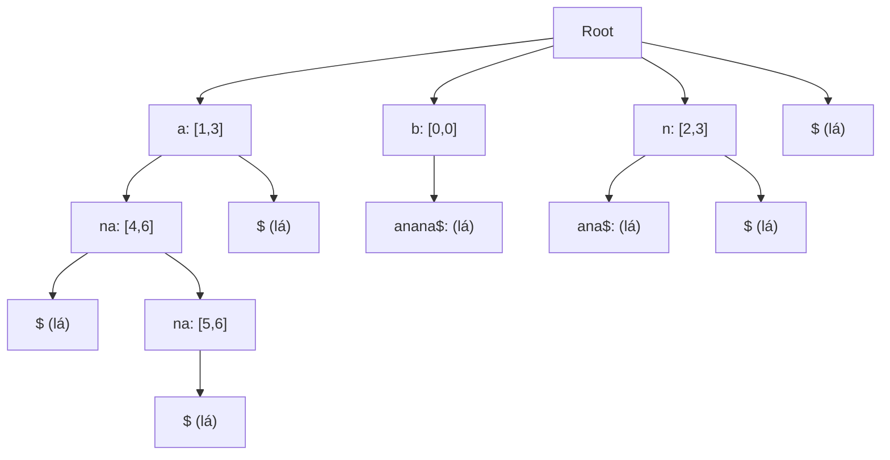

# Suffix Tree - Cây Hậu Tố

> **Tác giả:** FPTOJ Team<br>
> **Nội dung tham khảo từ:** CP-Algorithms - Suffix Tree

!!! warning "Lưu ý"
    Bài viết này giải thích **khái niệm** Suffix Tree và so sánh với Suffix Array. Code minh họa bên dưới xây dựng **Suffix Array** (với LCP bằng Kasai's algorithm), không phải Suffix Tree đầy đủ. Giải thuật Ukkonen để xây dựng Suffix Tree thực sự rất phức tạp và nằm ngoài phạm vi bài viết.

---

## 1. Bản chất vấn đề

### Định nghĩa

Suffix Tree của xâu $S$ là cây có hướng trong đó mỗi cạnh được gán nhãn bằng 1 xâu con của $S$, và mỗi hậu tố của $S$ tương ứng với 1 đường đi từ gốc đến lá (hoặc nút trong).

### So sánh

| Cấu trúc | Xây dựng | Không gian | Ứng dụng |
|----------|----------|------------|----------|
| Suffix Array | $O(N \log N)$ | $O(N)$ | Nhiều bài toán xâu |
| **Suffix Tree** | $O(N)$ | $O(N)$ | Ukkonen's algorithm |
| Trie | $O(N \cdot |\Sigma|)$ | $O(N \cdot |\Sigma|)$ | Tiền tố |

### Ứng dụng

| Bài toán | Thời gian với Suffix Tree | Thời gian với Suffix Array |
|----------|--------------------------|---------------------------|
| Tìm xâu con | $O(M)$ ($M$ = độ dài pattern) | $O(M \log N)$ (tìm kiếm nhị phân) |
| Xâu con chung dài nhất (LCS) | $O(N)$ | $O(N)$ (với LCP + RMQ) |
| Đếm xâu con phân biệt | $O(N)$ | $O(N)$ (công thức: $\frac{N(N+1)}{2} - \sum LCP[i]$) |
| Xâu lặp lại dài nhất | $O(N)$ | $O(N)$ (max LCP) |

### Ví dụ cụ thể với xâu "banana"

Các hậu tố của "banana\$" ($\$$ là ký tự kết thúc):

| Chỉ số | Hậu tố | Thứ tự từ điển (SA) |
|--------|--------|---------------------|
| 0 | banana\$ | 6: \$ |
| 1 | anana\$ | 5: a\$ |
| 2 | nana\$ | 3: ana\$ |
| 3 | ana\$ | 1: anana\$ |
| 4 | na\$ | 0: banana\$ |
| 5 | a\$ | 4: na\$ |
| 6 | \$ | 2: nana\$ |

Suffix Tree cho "banana" gộp các cạnh có nhánh đơn thành một cạnh duy nhất (ví dụ: "ana" thay vì "a" → "n" → "a"). Điều này giúp giảm bộ nhớ từ $O(N^2)$ xuống $O(N)$.

---

## 2. Tư duy cốt lõi

### Ukkonen's Algorithm

Xây Suffix Tree online, từng ký tự một. Mỗi bước thêm $S[i]$ vào cây.

**Kỹ thuật:**

- **Suffix Link:** Giống Palindrome Tree, giúp nhảy nhanh.
- **Rule 2 (Showstopper):** Khi cần tạo nút mới.
- **Implicit Suffix Tree:** Chỉ lưu các suffix đang hoạt động.

### Cấu trúc Suffix Tree cho xâu "banana\$"


```mermaid
graph TD
    R["Root"] --> A1["a: [1,3]"]
    R --> B["b: [0,0]"]
    R --> N1["n: [2,3]"]
    R --> D["$ (lá)"]
    A1 --> N2["na: [4,6]"]
    A1 --> D2["$ (lá)"]
    B --> A2["anana$: (lá)"]
    N2 --> D3["$ (lá)"]
    N2 --> N3["na: [5,6]"]
    N3 --> D4["$ (lá)"]
    N1 --> A3["ana$: (lá)"]
    N1 --> D5["$ (lá)"]
```

---

## 3. Đánh giá độ phức tạp

| Thao tác | Thời gian | Không gian |
|----------|-----------|------------|
| Xây Suffix Tree (Ukkonen) | $O(N)$ | $O(N)$ |
| Tìm pattern | $O(M)$ | $O(1)$ |

---

## Code minh họa

### Suffix Tree đơn giản (không tối ưu — mục đích học tập)

=== "C++"

    ```cpp
    #include <bits/stdc++.h>
    using namespace std;

    // Code này minh họa Suffix Array + LCP (Kasai) — nền tảng để hiểu Suffix Tree
    // Suffix Tree đầy đủ cần Ukkonen's algorithm (quá phức tạp cho ví dụ ngắn)

    struct SuffixArray {
        string s;                   // Xâu gốc
        vector<int> sa;             // Suffix Array: chỉ số các hậu tố theo thứ tự từ điển
        vector<int> lcp;            // LCP[i] = độ dài tiền tố chung giữa SA[i-1] và SA[i]
        vector<int> rank_arr;       // rank_arr[i] = thứ tự của hậu tố bắt đầu tại i

        SuffixArray(string _s) : s(_s) {
            int n = s.size();
            sa.resize(n);
            lcp.resize(n);
            rank_arr.resize(n);

            // Xây Suffix Array bằng sorting với key là cặp (rank hiện tại, rank tương lai)
            vector<pair<pair<int,int>, int>> tmp(n);
            for (int i = 0; i < n; i++) {
                rank_arr[i] = s[i];                  // Khởi tạo rank bằng mã ASCII ký tự
                tmp[i] = {{s[i], 0}, i};             // (rank, rank tiếp theo, chỉ số)
            }
            sort(tmp.begin(), tmp.end());             // Sắp xếp theo ký tự đầu tiên
            for (int i = 0; i < n; i++) sa[i] = tmp[i].second;

            for (int k = 1; k < n; k <<= 1) {         // Lặp: k = 1, 2, 4, 8, ...
                for (int i = 0; i < n; i++)
                    tmp[i] = {{rank_arr[i], i + k < n ? rank_arr[i + k] : -1}, i};
                sort(tmp.begin(), tmp.end());         // Sắp xếp theo cặp rank (2^k ký tự)
                rank_arr[tmp[0].second] = 0;
                for (int i = 1; i < n; i++)
                    rank_arr[tmp[i].second] = rank_arr[tmp[i-1].second] +
                        (tmp[i].first != tmp[i-1].first ? 1 : 0);
                for (int i = 0; i < n; i++) sa[i] = tmp[i].second;
            }

            // Thuật toán Kasai: xây mảng LCP từ Suffix Array
            int k = 0;
            for (int i = 0; i < n; i++) {
                if (rank_arr[i] == 0) { k = 0; continue; }  // Hậu tố đầu tiên: LCP = 0
                int j = sa[rank_arr[i] - 1];                 // Hậu tố liền trước trong SA
                while (i + k < n && j + k < n && s[i + k] == s[j + k]) k++; // So khớp
                lcp[rank_arr[i]] = k;                        // Lưu độ dài LCP
                if (k > 0) k--;                              // Tính chất: LCP[i-1] - 1 ≤ LCP[i]
            }
        }
    };

    int main() {
        string s;
        cin >> s;                          // Nhập xâu (ví dụ: "banana")
        SuffixArray sa(s);

        cout << "Suffix Array:\n";
        for (int i = 0; i < (int)s.size(); i++) {
            cout << sa.sa[i] << ": " << s.substr(sa.sa[i]) << "\n"; // In hậu tố theo thứ tự
        }
        return 0;
    }
    ```

=== "Python"

    ```python
    class SuffixArray:
        def __init__(self, s):
            self.s = s
            n = len(s)
            sa = list(range(n))                 # Khởi tạo mảng chỉ số [0, 1, ..., n-1]
            rank_arr = [ord(c) for c in s]      # Rank khởi tạo = mã ASCII
            tmp = [0] * n                       # Mảng tạm để lưu rank mới

            k = 1
            while k < n:                        # Xây Suffix Array bằng sorting từng bước
                # Sắp xếp hậu tố theo (rank hiện tại, rank tại vị trí i+k)
                sa.sort(key=lambda i: (rank_arr[i], rank_arr[i + k] if i + k < n else -1))
                # Gán rank mới dựa trên thứ tự sau khi sort
                tmp[sa[0]] = 0
                for i in range(1, n):
                    # Nếu cặp rank khác hậu tố trước → rank mới tăng lên 1
                    tmp[sa[i]] = tmp[sa[i-1]] + (
                        (rank_arr[sa[i]], rank_arr[sa[i] + k] if sa[i] + k < n else -1) !=
                        (rank_arr[sa[i-1]], rank_arr[sa[i-1] + k] if sa[i-1] + k < n else -1)
                    )
                rank_arr = tmp[:]               # Cập nhật rank cho bước tiếp theo
                k <<= 1                         # Nhân đôi k: 1 → 2 → 4 → ...

            self.sa = sa                        # Suffix Array kết quả
            self.rank_arr = rank_arr             # Mảng rank cuối cùng

    s = input().strip()
    sa = SuffixArray(s)
    print("Suffix Array:")
    for i in sa.sa:                             # In các hậu tố theo thứ tự từ điển
        print(f"{i}: {s[i:]}")
    ```

---

## Bài tập luyện tập

| Mã bài | Tên bài tập | Độ khó | Chủ đề |
|---|---|---|---|
| [`str-subcnt`](https://fptoj.com/problem/str-subcnt) | Đếm xâu con phân biệt (Suffix Tree) | ⭐⭐⭐ | Ứng dụng cơ bản của Suffix Tree |
| [`str-match`](https://fptoj.com/problem/str-match) | Đếm xuất hiện mẫu (Suffix Tree) | ⭐⭐⭐ | Tìm pattern trong văn bản |
| [`str-firstc`](https://fptoj.com/problem/str-firstc) | Xâu con phân biệt bắt đầu bằng ký tự | ⭐⭐ | Đếm theo ký tự đầu |
| [`str-fc`](https://fptoj.com/problem/str-fc) | Ký tự đầu tiên xuất hiện duy nhất | ⭐⭐ | Bài tập cơ bản |
| [`str-xor`](https://fptoj.com/problem/str-xor) | LCP xoay vòng (Suffix Tree) | ⭐⭐⭐ | LCP giữa hai hậu tố |
| [`stra-dist`](https://fptoj.com/problem/stra-dist) | Đếm xâu con phân biệt (Suffix Array) | ⭐⭐⭐⭐ | Công thức kinh điển |
| [`stra-lcp`](https://fptoj.com/problem/stra-lcp) | LCP và truy vấn trên Suffix Array | ⭐⭐⭐⭐ | SA + LCP + RMQ |
| [`stra-lcs`](https://fptoj.com/problem/stra-lcs) | Xâu con chung dài nhất (Suffix Array) | ⭐⭐⭐⭐ | Kết hợp hai xâu |
| [`saf-salc`](https://fptoj.com/problem/saf-salc) | In Suffix Array và LCP | ⭐⭐ | Bài tập cơ bản |

## Tài liệu tham khảo

- [CP-Algorithms - Suffix Tree](https://cp-algorithms.com/string/suffix-tree.html)
- [Wikipedia - Suffix Tree](https://en.wikipedia.org/wiki/Suffix_tree)
