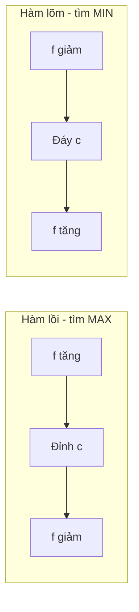
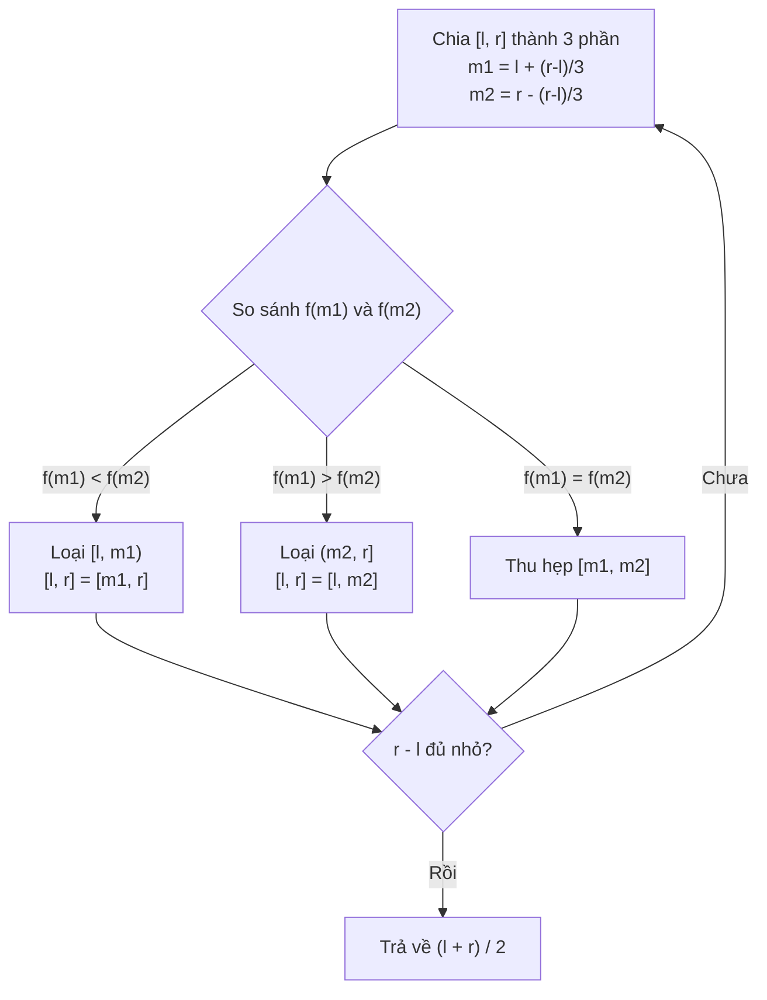

# Bài 55: Ternary Search - Tìm kiếm tam phân

> **Tác giả:** FPTOJ Wiki
> **Nội dung tham khảo từ:** CP-Algorithms, e-maxx

---

## Bản chất vấn đề

### Phát biểu bài toán

Cho một hàm số $f(x)$ xác định trên đoạn $[l, r]$. Tìm giá trị $x^*$ sao cho $f(x^*)$ đạt giá trị lớn nhất (hoặc nhỏ nhất).

**Điều kiện tiên quyết:** Hàm $f$ phải là **hàm unimodal** (đơn đỉnh), tức là tồn tại đúng một điểm cực trị duy nhất trên $[l, r]$.

### Hàm unimodal là gì?

Một hàm $f(x)$ trên đoạn $[l, r]$ được gọi là **unimodal** nếu tồn tại đúng một điểm $c \in [l, r]$ sao cho:

- **Trường hợp tìm MAX:** $f$ tăng liên tục trên $[l, c]$ và giảm liên tục trên $[c, r]$. Điểm $c$ là đỉnh (global maximum).
- **Trường hợp tìm MIN:** $f$ giảm liên tục trên $[l, c]$ và tăng liên tục trên $[c, r]$. Điểm $c$ là đáy (global minimum).



### Tại sao Binary Search không giải được?

| Tiêu chí | Binary Search | Ternary Search |
|-----------|--------------|----------------|
| Yêu cầu hàm | Monotonic (đơn điệu) | Unimodal (đơn đỉnh) |
| Mục tiêu | Tìm vị trí trong mảng đã sắp xếp | Tìm max/min của hàm |
| Số điểm so sánh mỗi bước | 1 | 2 |
| Số phần bị loại mỗi bước | $\frac{1}{2}$ | $\frac{1}{3}$ |

Hàm monotonic luôn tăng hoặc luôn giảm, trong khi hàm unimodal tăng rồi giảm (hoặc ngược lại). Binary Search chỉ hoạt động trên hàm monotonic, nên không thể tìm đỉnh của hàm unimodal.

### Ví dụ trực quan

Hàm $f(x) = -(x - 3)^2 + 10$ là unimodal với đỉnh tại $x = 3$, $f(3) = 10$.

| $x$ | 0 | 1 | 2 | 3 | 4 | 5 | 6 |
|-----|---|---|---|---|---|---|---|
| $f(x)$ | 1 | 6 | 9 | 10 | 9 | 6 | 1 |

Hàm tăng từ $x = 0$ đến $x = 3$, sau đó giảm. Đỉnh duy nhất tại $x = 3$.

---

## Tư duy cốt lõi

### Ý tưởng chính

Chia đoạn $[l, r]$ thành 3 phần bằng hai điểm $m_1$ và $m_2$:

$$m_1 = l + \frac{r - l}{3}, \quad m_2 = r - \frac{r - l}{3}$$

So sánh $f(m_1)$ và $f(m_2)$ để loại bỏ $\frac{1}{3}$ phạm vi tìm kiếm:

- Nếu $f(m_1) < f(m_2)$: đỉnh **không thể** nằm trong đoạn $[l, m_1)$, thu hẹp về $[m_1, r]$.
- Nếu $f(m_1) > f(m_2)$: đỉnh **không thể** nằm trong đoạn $(m_2, r]$, thu hẹp về $[l, m_2]$.
- Nếu $f(m_1) = f(m_2)$: đỉnh nằm trong $[m_1, m_2]$.



### Bước lặp chi tiết

Mỗi lần lặp, ta gọi $f$ đúng **2 lần** (tại $m_1$ và $m_2$). Sau $k$ lần lặp, độ dài đoạn còn lại là:

$$\text{length}_k = \left(\frac{2}{3}\right)^k \cdot (r - l)$$

Với miền giá trị $[0, 10^9]$, sau 200 lần lặp độ dài còn lại xấp xỉ $10^{-35}$, đủ cho độ chính xác double.

### Ternary Search trên số nguyên

Khi $x$ chỉ nhận giá trị nguyên, việc chia đôi liên tục có thể dẫn đến vòng lặp vô hạn khi $m_1 = m_2$. Giải pháp: dừng sớm khi $r - l \leq 3$ và brute force đoạn còn lại.

**Lý do dừng tại 3:** Khi $r - l \leq 3$, đoạn có tối đa 4 phần tử. Brute force 4 phần tử mất $O(1)$, không ảnh hưởng độ phức tạp.

### Code: Ternary Search trên số thực

=== "C++"

    ```cpp
    #include <bits/stdc++.h>
    using namespace std;

    double f(double x) {
        return -(x - 3.0) * (x - 3.0) + 10.0;
    }

    int main() {
        double l = 0.0, r = 10.0;
        for (int iter = 0; iter < 200; iter++) {
            double m1 = l + (r - l) / 3.0;
            double m2 = r - (r - l) / 3.0;
            if (f(m1) < f(m2)) {
                l = m1;
            } else {
                r = m2;
            }
        }
        double x = (l + r) / 2.0;
        printf("MAX tai x = %.6f, f(x) = %.6f\n", x, f(x));
        return 0;
    }
    ```

=== "Python"

    ```python
    def f(x):
        return -(x - 3.0) ** 2 + 10.0

    l, r = 0.0, 10.0
    for _ in range(200):
        m1 = l + (r - l) / 3.0
        m2 = r - (r - l) / 3.0
        if f(m1) < f(m2):
            l = m1
        else:
            r = m2

    x = (l + r) / 2.0
    print(f"MAX tai x = {x:.6f}, f(x) = {f(x):.6f}")
    ```

### Code: Ternary Search trên số nguyên

=== "C++"

    ```cpp
    #include <bits/stdc++.h>
    using namespace std;

    int f(int x) {
        return -(x - 5) * (x - 5) + 20;
    }

    int main() {
        int l = 0, r = 100;
        while (r - l > 3) {
            int m1 = l + (r - l) / 3;
            int m2 = r - (r - l) / 3;
            if (f(m1) < f(m2)) {
                l = m1;
            } else {
                r = m2;
            }
        }
        int best = l;
        for (int i = l + 1; i <= r; i++) {
            if (f(i) > f(best)) best = i;
        }
        printf("MAX tai x = %d, f(x) = %d\n", best, f(best));
        return 0;
    }
    ```

=== "Python"

    ```python
    def f(x):
        return -(x - 5) ** 2 + 20

    l, r = 0, 100
    while r - l > 3:
        m1 = l + (r - l) // 3
        m2 = r - (r - l) // 3
        if f(m1) < f(m2):
            l = m1
        else:
            r = m2

    best = l
    for i in range(l + 1, r + 1):
        if f(i) > f(best):
            best = i
    print(f"MAX tai x = {best}, f(x) = {f(best)}")
    ```

### Code: Ternary Search tìm MIN (hàm lõm)

Khi hàm $f$ là lõm (giảm rồi tăng), ta đảo điều kiện so sánh để tìm đáy.

=== "C++"

    ```cpp
    #include <bits/stdc++.h>
    using namespace std;

    int n;
    vector<double> a;

    double f(double p) {
        double sum = 0;
        for (int i = 0; i < n; i++) sum += abs(a[i] - p);
        return sum;
    }

    int main() {
        cin >> n;
        a.resize(n);
        for (int i = 0; i < n; i++) cin >> a[i];

        double l = *min_element(a.begin(), a.end());
        double r = *max_element(a.begin(), a.end());

        for (int iter = 0; iter < 200; iter++) {
            double m1 = l + (r - l) / 3.0;
            double m2 = r - (r - l) / 3.0;
            if (f(m1) > f(m2)) {
                l = m1;
            } else {
                r = m2;
            }
        }
        double p = (l + r) / 2.0;
        printf("Diem toi uu: %.6f, tong khoang cach: %.6f\n", p, f(p));
        return 0;
    }
    ```

=== "Python"

    ```python
    def solve():
        n = int(input())
        a = list(map(float, input().split()))

        def f(p):
            return sum(abs(x - p) for x in a)

        l, r = min(a), max(a)
        for _ in range(200):
            m1 = l + (r - l) / 3.0
            m2 = r - (r - l) / 3.0
            if f(m1) > f(m2):
                l = m1
            else:
                r = m2

        p = (l + r) / 2.0
        print(f"Diem toi uu: {p:.6f}, tong khoang cach: {f(p):.6f}")

    solve()
    ```

### Code: Ternary Search 2D

Khi hàm $f(x, y)$ là unimodal trong cả hai biến, lồng 2 vòng Ternary Search: vòng ngoài tìm $x$, vòng trong tìm $y$ tốt nhất cho mỗi $x$.

=== "C++"

    ```cpp
    #include <bits/stdc++.h>
    using namespace std;

    double f(double x, double y) {
        return -(x - 2) * (x - 2) - (y - 3) * (y - 3) + 10;
    }

    double search_y(double x, double ly, double ry) {
        for (int iter = 0; iter < 200; iter++) {
            double m1 = ly + (ry - ly) / 3.0;
            double m2 = ry - (ry - ly) / 3.0;
            if (f(x, m1) < f(x, m2)) ly = m1;
            else ry = m2;
        }
        return (ly + ry) / 2.0;
    }

    int main() {
        double lx = -10, rx = 10, ly = -10, ry = 10;
        for (int iter = 0; iter < 200; iter++) {
            double x1 = lx + (rx - lx) / 3.0;
            double x2 = rx - (rx - lx) / 3.0;
            double y1 = search_y(x1, ly, ry);
            double y2 = search_y(x2, ly, ry);
            if (f(x1, y1) < f(x2, y2)) lx = x1;
            else rx = x2;
        }
        double best_x = (lx + rx) / 2.0;
        double best_y = search_y(best_x, ly, ry);
        printf("MAX tai (%.6f, %.6f), f = %.6f\n", best_x, best_y, f(best_x, best_y));
        return 0;
    }
    ```

=== "Python"

    ```python
    def f(x, y):
        return -(x - 2) ** 2 - (y - 3) ** 2 + 10

    def search_y(x, ly, ry):
        for _ in range(200):
            m1 = ly + (ry - ly) / 3.0
            m2 = ry - (ry - ly) / 3.0
            if f(x, m1) < f(x, m2):
                ly = m1
            else:
                ry = m2
        return (ly + ry) / 2.0

    lx, rx, ly, ry = -10, 10, -10, 10
    for _ in range(200):
        x1 = lx + (rx - lx) / 3.0
        x2 = rx - (rx - lx) / 3.0
        y1 = search_y(x1, ly, ry)
        y2 = search_y(x2, ly, ry)
        if f(x1, y1) < f(x2, y2):
            lx = x1
        else:
            rx = x2

    best_x = (lx + rx) / 2.0
    best_y = search_y(best_x, ly, ry)
    print(f"MAX tai ({best_x:.6f}, {best_y:.6f}), f = {f(best_x, best_y):.6f}")
    ```

---

## Phân tích tính đúng đắn

### Chứng minh thuật toán luôn hội tụ

**Định lý:** Nếu $f$ là unimodal trên $[l, r]$ với đỉnh tại $c$, thì sau mỗi bước lặp, đỉnh $c$ luôn nằm trong đoạn $[l, r]$ mới.

**Chứng minh cho trường hợp tìm MAX:**

Xét một bước lặp với $m_1 < m_2$. Vì $f$ unimodal với đỉnh $c$:

- Nếu $f(m_1) < f(m_2)$: đỉnh $c$ phải nằm bên phải $m_1$ (vì $f$ còn đang tăng). Vậy $c \in [m_1, r]$. Gán $l = m_1$ là đúng.
- Nếu $f(m_1) > f(m_2)$: đỉnh $c$ phải nằm bên trái $m_2$ (vì $f$ đã giảm). Vậy $c \in [l, m_2]$. Gán $r = m_2$ là đúng.
- Nếu $f(m_1) = f(m_2)$: đỉnh $c \in [m_1, m_2]$ (vì $f$ tăng đến $c$ rồi giảm).

Trong mọi trường hợp, đỉnh $c$ luôn nằm trong đoạn mới. $\blacksquare$

### Tại sao cần brute force cho số nguyên?

Khi $r - l \leq 3$ với số nguyên, đoạn có thể chứa 4 giá trị $\{l, l+1, l+2, l+3\}$. Nếu chỉ dùng công thức chia 3, có thể $m_1 = m_2$ dẫn đến vòng lặp vô hạn.

**Ví dụ:** $[4, 5]$, $m_1 = 4 + (5-4)/3 = 4$, $m_2 = 5 - (5-4)/3 = 4$. Cả hai bằng 4, không thu hẹp được.

Brute force 4 phần tử đảm bảo không bỏ sót đỉnh.

### Kiểm tra hàm có unimodal không

Điều kiện cần để áp dụng Ternary Search:

| Kiểm tra | Cách thực hiện |
|----------|----------------|
| Hàm liên tục | Đảm bảo $f$ không có điểm gián đoạn |
| Đạo hàm đổi dấu đúng 1 lần | $f'(x) > 0$ rồi $f'(x) < 0$ (hoặc ngược lại) |
| Không có nhiều cực trị local | Số nghiệm $f'(x) = 0$ đúng bằng 1 |

Nếu hàm có nhiều đỉnh, Ternary Search có thể hội tụ vào một cực trị local mà bỏ qua global optimum.

### Ví dụ minh họa: Tìm MAX trên $[0, 10]$

Cho $f(x) = -x^2 + 6x + 5$, đỉnh tại $x = 3$, $f(3) = 14$.

| Bước | $l$ | $r$ | $m_1$ | $m_2$ | $f(m_1)$ | $f(m_2)$ | So sánh | Đoạn mới |
|------|-----|-----|-------|-------|----------|----------|---------|----------|
| 1 | 0 | 10 | 3.33 | 6.67 | 13.89 | 0.53 | $f(m_1) > f(m_2)$ | $[0, 6.67]$ |
| 2 | 0 | 6.67 | 2.22 | 4.45 | 13.39 | 11.90 | $f(m_1) > f(m_2)$ | $[0, 4.45]$ |
| 3 | 0 | 4.45 | 1.48 | 2.97 | 11.69 | 14.00 | $f(m_1) < f(m_2)$ | $[1.48, 4.45]$ |
| 4 | 1.48 | 4.45 | 2.47 | 3.46 | 13.62 | 13.85 | $f(m_1) < f(m_2)$ | $[2.47, 4.45]$ |

Sau mỗi bước, đoạn chứa đỉnh thu hẹp lại. Sau đủ nhiều bước, $(l + r) / 2$ hội tụ về $x = 3$.

---

## Đánh giá độ phức tạp

### Độ phức tạp thời gian

**Ternary Search trên số thực:**

Mỗi bước gọi $f$ đúng 2 lần, thu hẹp đoạn còn $\frac{2}{3}$.

Sau $k$ bước, độ dài đoạn: $(r - l) \cdot \left(\frac{2}{3}\right)^k$.

Để đạt độ chính xác $\varepsilon$, cần:

$$\left(\frac{2}{3}\right)^k \cdot (r - l) \leq \varepsilon \implies k \geq \frac{\ln \frac{r - l}{\varepsilon}}{\ln \frac{3}{2}} = O\left(\log_{3/2} \frac{r - l}{\varepsilon}\right)$$

Với double precision ($\varepsilon \approx 10^{-15}$), $k = 200$ là đủ.

| Yếu tố | Giá trị |
|---------|---------|
| Số lần lặp | $O(\log_{1.5}(r - l))$ cho liên tục, $O(\log_{1.5} N)$ cho nguyên |
| Mỗi lần lặp | $O(T_f)$, trong đó $T_f$ là thời gian tính $f$ |
| **Tổng** | $O(T_f \cdot \log_{1.5} N)$ |

**Ternary Search trên số nguyên:**

Vòng while chạy $O(\log_{1.5} N)$ lần, mỗi lần $O(T_f)$. Brute force đoạn cuối $O(1)$ (tối đa 4 phần tử).

Tổng: $O(T_f \cdot \log_{1.5} N)$.

**Ternary Search 2D:**

Vòng ngoài $O(\log_{1.5} R_x)$ lần, mỗi lần gọi vòng trong $O(\log_{1.5} R_y)$ lần, mỗi lần gọi $f$.

Tổng: $O(T_f \cdot \log_{1.5} R_x \cdot \log_{1.5} R_y)$.

### So sánh với Binary Search

| Thuật toán | Số lần lặp | Gọi $f$ mỗi bước | Tổng gọi $f$ |
|-----------|-----------|------------------|--------------|
| Binary Search | $\log_2 N$ | 1 | $\log_2 N$ |
| Ternary Search | $\log_{1.5} N \approx 1.585 \cdot \log_2 N$ | 2 | $\approx 3.17 \cdot \log_2 N$ |

Ternary Search gọi $f$ nhiều hơn gấp ~3 lần so với Binary Search. Tuy nhiên, khi $T_f = O(1)$, cả hai đều rất nhanh.

### Độ phức tạp không gian

$O(1)$ - chỉ sử dụng các biến `l`, `r`, `m1`, `m2`.

### Khi nào nên dùng Ternary Search?

| Tình huống | Khuyến nghị |
|-----------|------------|
| Hàm monotonic | Dùng Binary Search |
| Hàm unimodal, $T_f = O(1)$ | Dùng Ternary Search |
| Hàm unimodal, $T_f$ lớn | Cân nhắc Golden Section Search (gọi $f$ 1 lần/bước) |
| Hàm không xác định tính chất | Không dùng được Ternary Search |

---

## Các lỗi thường gặp

### Nhầm unimodal với monotonic

Hàm monotonic (ví dụ $f(x) = 2x + 3$) luôn tăng hoặc luôn giảm. Dùng Binary Search, không phải Ternary Search.

Hàm unimodal (ví dụ $f(x) = -x^2 + 4x$) tăng rồi giảm. Dùng Ternary Search.

### Integer overflow khi tính $m_1$, $m_2$

```cpp
// SAI: (r - l) có thể tràn nếu l, r là long long
long long m1 = l + (r - l) / 3;

// ĐÚNG: dùng hằng số đúng kiểu
long long m1 = l + (r - l) / 3LL;
long long m2 = r - (r - l) / 3LL;
```

### Dừng quá sớm với floating point

```cpp
// SAI: so sánh với epsilon có thể không dừng
while (r - l > 1e-9) { ... }

// ĐÚNG: lặp số lần cố định
for (int iter = 0; iter < 200; iter++) { ... }
```

Với double (15-16 chữ số thập phân), 200 lần lặp đủ vì $(2/3)^{200} \approx 10^{-35}$.

### Quên brute force với số nguyên

```cpp
// SAI: không brute force khi r - l <= 3
while (r - l > 3) {
    // ternary search
}
// Có thể bỏ sót!

// ĐÚNG: brute force đoạn còn lại
while (r - l > 3) {
    // ternary search
}
int best = l;
for (int i = l + 1; i <= r; i++) {
    if (f(i) > f(best)) best = i;
}
```

### Hàm không thực sự unimodal

Nếu hàm có nhiều đỉnh, Ternary Search có thể hội tụ vào cực trị local mà bỏ qua global optimum. Phải kiểm tra tính unimodal trước khi áp dụng.

---

## Bài tập luyện tập

| # | Tên bài | Nguồn | Độ khó | Ghi chú |
|---|---------|-------|--------|---------|
| 1 | [Devu and his Brother](https://codeforces.com/contest/439/problem/D) | CF | ★★★ | Ternary search cơ bản |
| 2 | [Maximize!](https://codeforces.com/contest/939/problem/E) | CF | ★★★ | Ternary trên mảng sorted |
| 3 | [Block Towers](https://codeforces.com/contest/626/problem/E) | CF | ★★★ | Ternary search kinh điển |
| 4 | [Weakness and Poorness](https://codeforces.com/contest/578/problem/C) | CF | ★★★★ | Ternary trên giá trị thực |
| 5 | [Restorer Distance](https://codeforces.com/contest/1355/problem/E) | CF | ★★★★ | Ternary trên answer space |
| 6 | [Searching Local Minimum](https://codeforces.com/contest/1479/problem/A) | CF | ★★★★ | Interactive, ternary-like |
| 7 | [Nature Reserve](https://codeforces.com/contest/1059/problem/D) | CF | ★★★★ | Ternary trên giá trị thực |
| 8 | [Moore's Law](https://atcoder.jp/contests/arc054/tasks/arc054_b) | AtCoder | ★★★ | Ternary trên hàm liên tục |
| 9 | [Stick Lengths](https://cses.fi/problemset/task/1074) | CSES | ★★☆ | Tìm giá trị tối thiểu |
| 10 | [Array Division](https://cses.fi/problemset/task/1085) | CSES | ★★★ | Binary search on answer |

### Gợi ý cách tiếp cận

**Bài 1-3:** Áp dụng trực tiếp Ternary Search trên hàm unimodal. Bắt đầu với floating point, sau đó thử integer.

**Bài 4-5:** Cần nhận ra hàm mục tiêu là unimodal. Đôi khi cần biến đổi bài toán trước khi áp dụng.

**Bài 6-8:** Ternary Search trên miền nghiệm hoặc hàm liên tục. Kết hợp với binary search hoặc geometry.

---

## Tài liệu tham khảo

- [CP-Algorithms - Ternary Search](https://cp-algorithms.com/num_methods/ternary_search.html)
- [e-maxx - Ternary Search](https://e-maxx.ru/algo/ternary_search)
- [Codeforces EDU - Binary Search](https://codeforces.com/edu/course/2/lesson/6)

---

*Bài viết này là một phần của FPTOJ Wiki - Dự án xây dựng kho tài liệu lập trình thi đấu tiếng Việt.*
