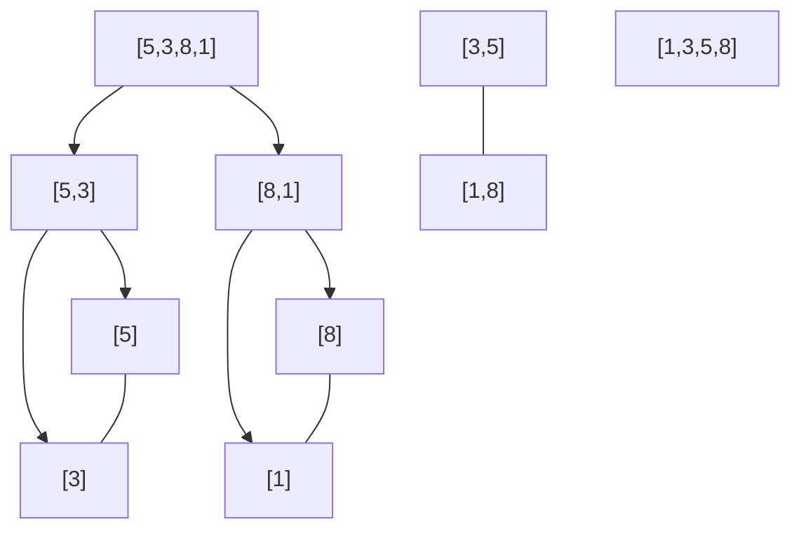
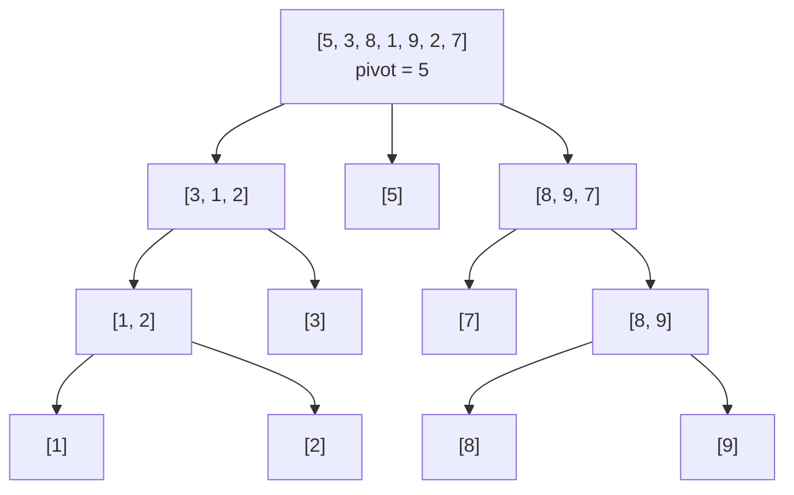

# Bài 2: Thuật Toán Sắp Xếp - Ai Là Vua Tốc Độ?

> **Tác giả:** FPTOJ Team<br>
> **Nội dung tham khảo từ:** VNOI Wiki - Thuật toán sắp xếp

## 1. Chuyện gì đang xảy ra?

### Bài toán: Xếp hạng điểm thi

Giả sử trường bạn tổ chức kỳ thi, có **N** học sinh tham gia. Giáo viên cần xếp hạng từ điểm cao nhất đến thấp nhất.

- Nếu N = 10 → Dùng tay cũng sắp xếp được.
- Nếu N = 1.000 → Mất cả buổi!
- Nếu N = 1.000.000 → Không thể làm tay, cần **thuật toán**!

Vậy có những cách nào để sắp xếp? Và cách nào nhanh nhất? Đó chính là nội dung bài này!

---

## 2. Toán học bổ trợ: Giải ngố cấp tốc

### Swap (Đổi chỗ) là gì?

Swap = đổi chỗ 2 phần tử. Ví dụ: đổi chỗ $a[3]$ và $a[7]$.

=== "C++"

    ```cpp
    // Cách 1: dùng biến tạm
    int temp = a[3];
    a[3] = a[7];
    a[7] = temp;

    // Cách 2: dùng hàm có sẵn (C++)
    swap(a[3], a[7]);
    ```

=== "Python"

    ```python
    # Cách 1: dùng biến tạm
    temp = a[3]
    a[3] = a[7]
    a[7] = temp

    # Cách 2: Pythonic - đổi chỗ trực tiếp
    a[3], a[7] = a[7], a[3]
    ```

### Sắp xếp ổn định (Stable Sort) là gì?

Giả sử bạn có danh sách học sinh kèm điểm: (An, 8), (Bình, 7), (Chi, 8), (Dũng, 6).

Sắp xếp theo điểm tăng dần:

- **Ổn định:** (Dũng, 6), (Bình, 7), **(An, 8)**, **(Chi, 8)** → An vẫn đứng trước Chi (giữ nguyên thứ tự ban đầu).
- **Không ổn định:** (Dũng, 6), (Bình, 7), **(Chi, 8)**, **(An, 8)** → Chi "chen" lên trước An!

---

## 3. Tổng quan các thuật toán sắp xếp

### Bảng so sánh nhanh 5 thuật toán sắp xếp

| Thuật toán | Độ phức tạp | Ổn định? | Ghi chú |
|-----------|-------------|----------|---------|
| **Nổi bọt** (Bubble Sort) | $O(N^2)$ | Có | Đơn giản nhất, chỉ để học |
| **Chèn** (Insertion Sort) | $O(N^2)$ | Có | Nhanh khi dữ liệu gần đúng thứ tự |
| **Trộn** (Merge Sort) | $O(N \log N)$ | Có | Luôn nhanh, tốn thêm bộ nhớ |
| **Vun đống** (Heap Sort) | $O(N \log N)$ | Không | Không tốn bộ nhớ thêm |
| **Nhanh** (Quick Sort) | $O(N \log N)$ TB | Không | Nhanh nhất thực tế, worst $O(N^2)$ |


!!! tip "Thử tương tác"
    <iframe src="https://visualgo.net/en/sorting" style="width: 100%; height: 500px; border: 1px solid #ccc; border-radius: 8px;"></iframe>

!!! tip "Thử tương tác từng thuật toán"
    - [Bubble Sort](https://algorithm-visualizer.org/brute-force/bubble-sort)
    - [Selection Sort](https://algorithm-visualizer.org/brute-force/selection-sort)
    - [Merge Sort](https://algorithm-visualizer.org/divide-and-conquer/merge-sort)
    - [Quick Sort](https://algorithm-visualizer.org/divide-and-conquer/quicksort)
    - [Tất cả thuật toán (USFCA)](https://www.cs.usfca.edu/~galles/visualization/ComparisonSort.html)

---

## 4. Phân tích chi tiết từng thuật toán

### 4.1. Sắp xếp nổi bọt (Bubble Sort)

#### Bản chất vấn đề

Sắp xếp mảng bằng cách lặp đi lặp lại việc so sánh các cặp phần tử liền kề và đổi chỗ nếu chúng sai thứ tự. Sau mỗi lượt, phần tử lớn nhất "nổi" lên vị trí cuối cùng.

#### Tư duy cốt lõi

Tưởng tượng bạn đang lặn dưới bể bơi. Bong bóng khí nhỏ nhất sẽ **nổi lên** đầu tiên. Tương tự, trong Bubble Sort, phần tử lớn nhất sẽ "nổi" lên cuối mảng sau mỗi lượt duyệt.

**Cách hoạt động:**

1. Duyệt mảng từ trái sang phải
2. So sánh từng cặp liền kề $a[i]$ và $a[i+1]$
3. Nếu $a[i] > a[i+1]$, đổi chỗ chúng
4. Lặp lại cho đến khi không còn đổi chỗ nào

#### Minh họa

Sắp xếp mảng $[5, 3, 8, 1]$:

| Lượt | Mảng ban đầu | Các so sánh | Mảng sau |
|------|---------------|-------------|----------|
| 1 | $[5, 3, 8, 1]$ | $(5,3) \to$ đổi, $(5,8) \to$ giữ, $(8,1) \to$ đổi | $[3, 5, 1, 8]$ |
| 2 | $[3, 5, 1, 8]$ | $(3,5) \to$ giữ, $(5,1) \to$ đổi | $[3, 1, 5, 8]$ |
| 3 | $[3, 1, 5, 8]$ | $(3,1) \to$ đổi | $[1, 3, 5, 8]$ |

#### Phân tích tính đúng đắn

**Bất biến (Invariant):** Sau lượt thứ $k$, $k$ phần tử lớn nhất đã nằm đúng vị trí cuối mảng.

- **Ban đầu:** Không phần tử nào ở đúng vị trí → bất biến đúng.
- **Mỗi lượt:** So sánh tất cả cặp liền kề, phần tử lớn nhất trong phần chưa sắp xếp sẽ "nổi" lên cuối.
- **Kết thúc:** Sau $N-1$ lượt, tất cả phần tử đã ở đúng vị trí.

#### Đánh giá độ phức tạp

- **Thời gian:** 
  - Worst case: $O(N^2)$ — mảng đảo ngược hoàn toàn
  - Best case: $O(N^2)$ — vẫn phải duyệt hết (có thể tối ưu thành $O(N)$ nếu mảng đã sắp xếp)
  - Average case: $O(N^2)$
- **Bộ nhớ:** $O(1)$ — sắp xếp tại chỗ, không cần thêm bộ nhớ
- **Ổn định:** Có — không đổi chỗ các phần tử bằng nhau

#### Code

=== "C++"

    ```cpp
    #include <bits/stdc++.h>
    using namespace std;

    void bubbleSort(int a[], int n) {
        for (int i = 0; i < n - 1; i++) {
            bool swapped = false;
            for (int j = 0; j < n - i - 1; j++) {
                if (a[j] > a[j + 1]) {
                    swap(a[j], a[j + 1]);
                    swapped = true;
                }
            }
            if (!swapped) break; // Mảng đã sắp xếp → dừng sớm
        }
    }

    int main() {
        int n;
        cin >> n;
        int a[n];
        for (int i = 0; i < n; i++) cin >> a[i];
        
        bubbleSort(a, n);
        
        for (int i = 0; i < n; i++) cout << a[i] << " ";
        return 0;
    }
    ```

=== "Python"

    ```python
    def bubble_sort(a):
        n = len(a)
        for i in range(n - 1):
            swapped = False
            for j in range(n - i - 1):
                if a[j] > a[j + 1]:
                    a[j], a[j + 1] = a[j + 1], a[j]
                    swapped = True
            if not swapped:  # Mảng đã sắp xếp → dừng sớm
                break

    n = int(input())
    a = list(map(int, input().split()))
    bubble_sort(a)
    print(*a)
    ```

---

### 4.2. Sắp xếp chèn (Insertion Sort)

#### Bản chất vấn đề

Sắp xếp mảng bằng cách duy trì một phần đã sắp xếp ở bên trái, sau đó lần lượt "chèn" từng phần tử mới vào đúng vị trí trong phần đã sắp xếp.

#### Tư duy cốt lõi

Bạn đang chơi bài. Mỗi khi rút 1 lá mới, bạn **chèn** nó vào đúng vị trí trong bộ bài đang cầm trên tay. Phần bài bên trái tay bạn luôn được sắp xếp.

**Cách hoạt động:**

1. Bắt đầu từ phần tử thứ 2 ($i = 1$), coi phần tử đầu tiên là phần đã sắp xếp
2. Lấy phần tử hiện tại làm `key`
3. So sánh `key` với các phần tử bên trái, dời các phần tử lớn hơn sang phải
4. Chèn `key` vào đúng vị trí

#### Minh họa

Sắp xếp mảng $[5, 3, 8, 1]$:

| Bước | Phần đã sắp xếp | Phần chưa xét | Hành động | Mảng |
|------|------------------|---------------|-----------|------|
| 0 | $[5]$ | $[3, 8, 1]$ | Bắt đầu | $[5, 3, 8, 1]$ |
| 1 | $[3, 5]$ | $[8, 1]$ | Chèn $3$ vào trước $5$ | $[3, 5, 8, 1]$ |
| 2 | $[3, 5, 8]$ | $[1]$ | $8$ đã đúng vị trí | $[3, 5, 8, 1]$ |
| 3 | $[1, 3, 5, 8]$ | $[]$ | Chèn $1$ vào đầu | $[1, 3, 5, 8]$ |

```matplotlib
arr = [5, 3, 8, 1]
fig, axs = plt.subplots(1, 4, figsize=(12, 3))

axs[0].bar(range(len(arr)), arr, color=['green', 'red', 'red', 'red'], alpha=0.7)
axs[0].set_title('Bước 0: [5] | [3, 8, 1]')
axs[0].set_xticks(range(len(arr)))
axs[0].set_xticklabels(arr)
axs[0].set_ylim(0, 9)

arr_1 = [3, 5, 8, 1]
axs[1].bar(range(len(arr_1)), arr_1, color=['green', 'green', 'red', 'red'], alpha=0.7)
axs[1].set_title('Bước 1: Chèn 3')
axs[1].set_xticks(range(len(arr_1)))
axs[1].set_xticklabels(arr_1)
axs[1].set_ylim(0, 9)

arr_2 = [3, 5, 8, 1]
axs[2].bar(range(len(arr_2)), arr_2, color=['green', 'green', 'green', 'red'], alpha=0.7)
axs[2].set_title('Bước 2: Giữ 8')
axs[2].set_xticks(range(len(arr_2)))
axs[2].set_xticklabels(arr_2)
axs[2].set_ylim(0, 9)

arr_3 = [1, 3, 5, 8]
axs[3].bar(range(len(arr_3)), arr_3, color=['green', 'green', 'green', 'green'], alpha=0.7)
axs[3].set_title('Bước 3: Chèn 1')
axs[3].set_xticks(range(len(arr_3)))
axs[3].set_xticklabels(arr_3)
axs[3].set_ylim(0, 9)

plt.tight_layout()
```


#### Phân tích tính đúng đắn

**Bất biến (Invariant):** Tại bước $i$, đoạn $a[0..i-1]$ đã được sắp xếp.

- **Ban đầu:** $i = 1$, đoạn $a[0..0]$ chỉ có 1 phần tử → đã sắp xếp.
- **Mỗi bước:** Chèn $a[i]$ vào đúng vị trí trong $a[0..i]$ → đoạn $a[0..i]$ đã sắp xếp.
- **Kết thúc:** Khi $i = N-1$, toàn bộ mảng đã sắp xếp.

#### Đánh giá độ phức tạp

- **Thời gian:**
  - Worst case: $O(N^2)$ — mảng đảo ngược hoàn toàn
  - Best case: $O(N)$ — mảng đã sắp xếp (chỉ so sánh mỗi phần tử 1 lần)
  - Average case: $O(N^2)$
- **Bộ nhớ:** $O(1)$ — sắp xếp tại chỗ
- **Ổn định:** Có — chỉ chèn khi phần tử lớn hơn `key`

#### Code

=== "C++"

    ```cpp
    #include <bits/stdc++.h>
    using namespace std;

    void insertionSort(int a[], int n) {
        for (int i = 1; i < n; i++) {
            int key = a[i];
            int j = i - 1;
            while (j >= 0 && a[j] > key) {
                a[j + 1] = a[j];
                j--;
            }
            a[j + 1] = key;
        }
    }

    int main() {
        int n;
        cin >> n;
        int a[n];
        for (int i = 0; i < n; i++) cin >> a[i];
        
        insertionSort(a, n);
        
        for (int i = 0; i < n; i++) cout << a[i] << " ";
        return 0;
    }
    ```

=== "Python"

    ```python
    def insertion_sort(a):
        for i in range(1, len(a)):
            key = a[i]
            j = i - 1
            while j >= 0 and a[j] > key:
                a[j + 1] = a[j]
                j -= 1
            a[j + 1] = key

    n = int(input())
    a = list(map(int, input().split()))
    insertion_sort(a)
    print(*a)
    ```

---

### 4.3. Sắp xếp trộn (Merge Sort)

#### Bản chất vấn đề

Sắp xếp mảng bằng chiến lược **chia để trị**: chia mảng thành 2 nửa, đệ quy sắp xếp từng nửa, sau đó trộn 2 nửa đã sắp xếp lại.

#### Tư duy cốt lõi

Bạn có 2 bộ bài đã sắp xếp. Việc **trộn** 2 bộ này thành 1 bộ hoàn chỉnh rất dễ: chỉ cần so sánh lá đầu mỗi bộ, lấy lá nhỏ hơn!

**Cách hoạt động:**

1. **Chia** mảng thành 2 nửa tại vị trí giữa
2. **Gọi đệ quy** sắp xếp từng nửa
3. **Trộn** 2 nửa đã sắp xếp lại thành mảng hoàn chỉnh

#### Minh họa

Sắp xếp mảng $[5, 3, 8, 1]$:



#### Phân tích tính đúng đắn

**Bất biến (Invariant):** Hàm `mergeSort(a, left, right)` trả về đoạn $a[left..right]$ đã được sắp xếp.

- **Base case:** Nếu $left \geq right$, mảng có 0 hoặc 1 phần tử → đã sắp xếp.
- **Recursive step:** Giả sử `mergeSort` đúng cho các đoạn nhỏ hơn. Khi gọi cho đoạn lớn:
  - Chia đôi → 2 nửa đã sắp xếp (theo giả sử đệ quy)
  - Trộn 2 nửa đã sắp xếp → kết quả là mảng đã sắp xếp
- **Kết thúc:** Đệ quy dừng khi mảng có 1 phần tử, sau đó trộn dần lên.

#### Đánh giá độ phức tạp

- **Thời gian:**
  - Cây đệ quy có $\log_2 N$ tầng (chia đôi mỗi tầng)
  - Mỗi tầng tốn $O(N)$ để trộn
  - **Tổng:** $O(N) \times O(\log N) = O(N \log N)$
  - Best, Worst, Average đều $O(N \log N)$
- **Bộ nhớ:** $O(N)$ — cần mảng tạm để trộn
- **Ổn định:** Có — khi so sánh, ưu tiên lấy phần tử bên trái nếu bằng nhau

#### Code

=== "C++"

    ```cpp
    #include <bits/stdc++.h>
    using namespace std;

    int temp[1000001];

    void merge(int a[], int left, int mid, int right) {
        int i = left, j = mid + 1, k = 0;
        while (i <= mid && j <= right) {
            if (a[i] <= a[j])
                temp[k++] = a[i++];
            else
                temp[k++] = a[j++];
        }
        while (i <= mid) temp[k++] = a[i++];
        while (j <= right) temp[k++] = a[j++];
        for (int i = 0; i < k; i++)
            a[left + i] = temp[i];
    }

    void mergeSort(int a[], int left, int right) {
        if (left >= right) return;
        int mid = left + (right - left) / 2;
        mergeSort(a, left, mid);
        mergeSort(a, mid + 1, right);
        merge(a, left, mid, right);
    }

    int main() {
        int n;
        cin >> n;
        int a[n];
        for (int i = 0; i < n; i++) cin >> a[i];
        
        mergeSort(a, 0, n - 1);
        
        for (int i = 0; i < n; i++) cout << a[i] << " ";
        return 0;
    }
    ```

=== "Python"

    ```python
    def merge_sort(a):
        if len(a) <= 1:
            return a
        
        mid = len(a) // 2
        left = merge_sort(a[:mid])
        right = merge_sort(a[mid:])
        
        result = []
        i = j = 0
        while i < len(left) and j < len(right):
            if left[i] <= right[j]:
                result.append(left[i])
                i += 1
            else:
                result.append(right[j])
                j += 1
        
        result.extend(left[i:])
        result.extend(right[j:])
        return result

    n = int(input())
    a = list(map(int, input().split()))
    a = merge_sort(a)
    print(*a)
    ```

---

### 4.4. Sắp xếp nhanh (Quick Sort)

#### Bản chất vấn đề

Sắp xếp mảng bằng chiến lược **chia để trị**: chọn một phần tử làm "pivot" (mốc), phân hoạch mảng thành 2 phần — các phần tử nhỏ hơn pivot và lớn hơn pivot — sau đó đệ quy sắp xếp 2 phần đó.

#### Tư duy cốt lõi

Bạn muốn chia lớp thành 2 nhóm: nhóm cao hơn 1m6 và nhóm thấp hơn 1m6. Bạn chọn 1m6 làm "mốc" (pivot), rồi phân loại.

**Cách hoạt động:**

1. **Chọn pivot** (phần tử mốc) — thường là phần tử đầu, cuối, hoặc ngẫu nhiên
2. **Phân hoạch:** Đưa các phần tử $< pivot$ sang trái, $> pivot$ sang phải
3. **Gọi đệ quy** sắp xếp 2 bên

#### Minh họa

Sắp xếp mảng $[5, 3, 8, 1, 9, 2, 7]$ với pivot = 5:



Kết quả: $[1, 2, 3, 5, 7, 8, 9]$

#### Phân tích tính đúng đắn

**Bất biến (Invariant):** Sau khi phân hoạch:
- Tất cả phần tử bên trái pivot đều $\leq$ pivot
- Tất cả phần tử bên phải pivot đều $\geq$ pivot
- Pivot nằm đúng vị trí cuối cùng trong mảng đã sắp xếp

**Chứng minh:**

- **Base case:** Mảng có 0 hoặc 1 phần tử → đã sắp xếp.
- **Recursive step:** Giả sử `quickSort` đúng cho các đoạn nhỏ hơn. Sau phân hoạch, pivot ở đúng vị trí, 2 bên đã được phân hoạch đúng → đệ quy sắp xếp 2 bên → toàn bộ mảng sắp xếp.
- **Kết thúc:** Đệ quy dừng khi mảng có $\leq 1$ phần tử.

#### Đánh giá độ phức tạp

- **Thời gian:**
  - Best case: $O(N \log N)$ — pivot chia đều 2 bên
  - Average case: $O(N \log N)$ — với pivot ngẫu nhiên
  - Worst case: $O(N^2)$ — pivot luôn là min hoặc max (khắc phục bằng cách chọn pivot ngẫu nhiên)
- **Bộ nhớ:** $O(\log N)$ — ngăn xếp đệ quy
- **Ổn định:** Không — có thể đổi chỗ các phần tử bằng nhau

#### Code

=== "C++"

    ```cpp
    #include <bits/stdc++.h>
    using namespace std;

    void quickSort(vector<int>& a, int left, int right) {
        if (left >= right) return;
        
        int pivotIdx = left + rand() % (right - left + 1);
        swap(a[left], a[pivotIdx]);
        int pivot = a[left];
        
        int i = left + 1, j = right;
        while (i <= j) {
            while (i <= j && a[i] < pivot) i++;
            while (i <= j && a[j] > pivot) j--;
            if (i <= j) {
                swap(a[i], a[j]);
                i++; j--;
            }
        }
        swap(a[left], a[j]);
        
        quickSort(a, left, j - 1);
        quickSort(a, j + 1, right);
    }

    int main() {
        int n;
        cin >> n;
        vector<int> a(n);
        for (int i = 0; i < n; i++) cin >> a[i];
        
        quickSort(a, 0, n - 1);
        
        for (int i = 0; i < n; i++) cout << a[i] << " ";
        return 0;
    }
    ```

=== "Python"

    ```python
    import random

    def quick_sort(a):
        if len(a) <= 1:
            return a
        
        pivot = random.choice(a)
        left = [x for x in a if x < pivot]
        middle = [x for x in a if x == pivot]
        right = [x for x in a if x > pivot]
        
        return quick_sort(left) + middle + quick_sort(right)

    n = int(input())
    a = list(map(int, input().split()))
    a = quick_sort(a)
    print(*a)
    ```

---

### 4.5. Sắp xếp cơ số (Radix Sort)

#### Bản chất vấn đề

Sắp xếp mảng số nguyên bằng cách sắp xếp theo từng chữ số, từ chữ số hàng đơn vị → hàng chục → hàng trăm... Sử dụng Counting Sort làm subroutine.

#### Tư duy cốt lõi

Bạn phân loại thư bưu điện: đầu tiên xếp theo thành phố, sau đó xếp theo quận trong mỗi thành phố. Tương tự, Radix Sort sắp xếp theo từng chữ số từ ít quan trọng nhất đến quan trọng nhất.

**Cách hoạt động:**

1. Tìm giá trị lớn nhất trong mảng để xác định số chữ số $K$
2. Với mỗi chữ số (đơn vị, chục, trăm...):
   - Sắp xếp mảng theo chữ số đó (dùng Counting Sort)
3. Sau $K$ lượt, mảng được sắp xếp hoàn toàn

#### Minh họa

Sắp xếp mảng $[170, 45, 75, 90, 802, 24, 2, 66]$:

| Lượt | Chữ số | Mảng sau |
|------|--------|----------|
| 1 | Hàng đơn vị | $[170, 90, 802, 2, 24, 45, 75, 66]$ |
| 2 | Hàng chục | $[802, 2, 24, 45, 66, 170, 75, 90]$ |
| 3 | Hàng trăm | $[2, 24, 45, 66, 75, 90, 170, 802]$ |

#### Phân tích tính đúng đắn

**Bất biến (Invariant):** Sau lượt thứ $k$, mảng đã được sắp xếp theo $k$ chữ số ít quan trọng nhất.

- **Ban đầu:** $k = 0$, chưa sắp xếp gì → bất biến đúng.
- **Mỗi lượt:** Counting Sort là thuật toán sắp xếp ổn định → sau khi sắp xếp theo chữ số thứ $k$, thứ tự theo $k-1$ chữ số trước đó vẫn được giữ nguyên.
- **Kết thúc:** Sau $K$ lượt, mảng đã sắp xếp theo tất cả $K$ chữ số → mảng đã sắp xếp hoàn toàn.

#### Đánh giá độ phức tạp

- **Thời gian:** $O(N \times K)$ với $K$ = số chữ số của giá trị lớn nhất
  - Nếu $K$ nhỏ (ví dụ: $K \leq 10$), nhanh hơn $O(N \log N)$
  - Nếu $K$ lớn, chậm hơn so với các thuật toán so sánh
- **Bộ nhớ:** $O(N + 10)$ — mảng đếm và mảng tạm
- **Ổn định:** Có — Counting Sort là thuật toán ổn định

#### Code

=== "C++"

    ```cpp
    #include <bits/stdc++.h>
    using namespace std;

    void countingSort(vector<int>& a, int exp) {
        int n = a.size();
        vector<int> output(n);
        int count[10] = {0};
        
        for (int i = 0; i < n; i++)
            count[(a[i] / exp) % 10]++;
        
        for (int i = 1; i < 10; i++)
            count[i] += count[i - 1];
        
        for (int i = n - 1; i >= 0; i--) {
            output[count[(a[i] / exp) % 10] - 1] = a[i];
            count[(a[i] / exp) % 10]--;
        }
        
        a = output;
    }

    void radixSort(vector<int>& a) {
        int maxVal = *max_element(a.begin(), a.end());
        for (int exp = 1; maxVal / exp > 0; exp *= 10)
            countingSort(a, exp);
    }

    int main() {
        int n;
        cin >> n;
        vector<int> a(n);
        for (int i = 0; i < n; i++) cin >> a[i];
        
        radixSort(a);
        
        for (int x : a) cout << x << " ";
        return 0;
    }
    ```

=== "Python"

    ```python
    def counting_sort(a, exp):
        n = len(a)
        output = [0] * n
        count = [0] * 10
        
        for i in range(n):
            index = (a[i] // exp) % 10
            count[index] += 1
        
        for i in range(1, 10):
            count[i] += count[i - 1]
        
        for i in range(n - 1, -1, -1):
            index = (a[i] // exp) % 10
            output[count[index] - 1] = a[i]
            count[index] -= 1
        
        for i in range(n):
            a[i] = output[i]

    def radix_sort(a):
        max_val = max(a)
        exp = 1
        while max_val // exp > 0:
            counting_sort(a, exp)
            exp *= 10

    n = int(input())
    a = list(map(int, input().split()))
    radix_sort(a)
    print(*a)
    ```

---

## 5. Ứng dụng quan trọng

### Đếm nghịch thế bằng Merge Sort

**Nghịch thế (inversion)** = cặp $(i, j)$ mà $i < j$ nhưng $a[i] > a[j]$. Đây là thước đo "mức độ đảo lộn" của một mảng.

**Cách naive:** $O(N^2)$ — duyệt mọi cặp. Không đủ nhanh khi $N = 10^5$.

**Bằng Merge Sort:** Mỗi khi lấy phần tử từ nửa **phải** trong lúc merge, tất cả phần tử còn lại trong nửa **trái** đều lớn hơn nó và đứng trước nó → đều là nghịch thế!

=== "C++"

    ```cpp
    #include <bits/stdc++.h>
    using namespace std;

    long long inversions = 0;
    int temp[1000001];

    void mergeCount(int a[], int left, int mid, int right) {
        int i = left, j = mid + 1, k = 0;
        while (i <= mid && j <= right) {
            if (a[i] <= a[j]) {
                temp[k++] = a[i++];
            } else {
                inversions += (mid - i + 1);
                temp[k++] = a[j++];
            }
        }
        while (i <= mid) temp[k++] = a[i++];
        while (j <= right) temp[k++] = a[j++];
        for (int i = 0; i < k; i++) a[left + i] = temp[i];
    }

    void mergeSortCount(int a[], int left, int right) {
        if (left >= right) return;
        int mid = left + (right - left) / 2;
        mergeSortCount(a, left, mid);
        mergeSortCount(a, mid + 1, right);
        mergeCount(a, left, mid, right);
    }

    int main() {
        int n;
        cin >> n;
        int a[n];
        for (int i = 0; i < n; i++) cin >> a[i];
        
        inversions = 0;
        mergeSortCount(a, 0, n - 1);
        cout << inversions;
        return 0;
    }
    ```

=== "Python"

    ```python
    def merge_count(a):
        if len(a) <= 1:
            return a, 0

        mid = len(a) // 2
        left, inv_left = merge_count(a[:mid])
        right, inv_right = merge_count(a[mid:])

        merged = []
        inv = inv_left + inv_right
        i = j = 0
        while i < len(left) and j < len(right):
            if left[i] <= right[j]:
                merged.append(left[i])
                i += 1
            else:
                inv += len(left) - i
                merged.append(right[j])
                j += 1
        merged.extend(left[i:])
        merged.extend(right[j:])
        return merged, inv

    n = int(input())
    a = list(map(int, input().split()))
    _, count = merge_count(a)
    print(count)
    ```

### Sắp xếp theo nhiều tiêu chí (Custom Comparator)

Sắp xếp struct/pair theo nhiều điều kiện là kỹ năng bắt buộc trong thi đấu:

=== "C++"

    ```cpp
    #include <bits/stdc++.h>
    using namespace std;

    struct Student {
        string name;
        int score;
        int age;
    };

    int main() {
        vector<Student> students = {{"An", 8, 17}, {"Binh", 7, 18}, {"Chi", 8, 16}};
        
        sort(students.begin(), students.end(), [](const Student& a, const Student& b) {
            if (a.score != b.score) return a.score > b.score;
            return a.age < b.age;
        });
        
        for (auto& s : students)
            cout << s.name << " " << s.score << " " << s.age << "\n";
        return 0;
    }
    ```

=== "Python"

    ```python
    students = [("An", 8, 17), ("Binh", 7, 18), ("Chi", 8, 16)]

    students.sort(key=lambda s: (-s[1], s[2]))

    for name, score, age in students:
        print(name, score, age)
    ```

---

## 6. Lưu ý / Cạm bẫy hay gặp

### Bẫy 1: Dùng Insertion Sort khi N lớn

$N = 100.000$ mà dùng Insertion Sort ($O(N^2)$) → $10^{10}$ phép tính → **TLE ngay!**

**Quy tắc:**

| Giới hạn $N$ | Thuật toán phù hợp |
|--------------|-------------------|
| $N \leq 1.000$ | Insertion Sort OK |
| $N \leq 10^5$ | Merge Sort / Quick Sort |
| $N \leq 10^6$ | Dùng `sort()` thư viện |

### Bẫy 2: Quick Sort worst case

Nếu pivot luôn chọn phần tử nhỏ nhất (hoặc lớn nhất), Quick Sort thoái hóa thành $O(N^2)$.

**Khắc phục:** Luôn chọn pivot **ngẫu nhiên**!

### Bẫy 3: Tràn bộ nhớ với Merge Sort

Merge Sort cần mảng tạm kích thước $O(N)$. Nếu $N = 10^6$ và mỗi số là 4 bytes → cần khoảng 4MB. Không quá nhiều, nhưng nếu $N = 10^8$ thì cần 400MB → có thể **tràn bộ nhớ**!

### Bẫy 4: So sánh số thực (double) khi sắp xếp

=== "C++"

    ```cpp
    // SAI: so sánh double bằng == không chính xác
    if (a[i] == a[j]) ...

    // ĐÚNG: so sánh với sai số nhỏ (epsilon)
    if (abs(a[i] - a[j]) < 1e-9) ...
    ```

=== "Python"

    ```python
    # SAI: so sánh float bằng == không chính xác
    if a[i] == a[j]: ...

    # ĐÚNG: so sánh với sai số nhỏ (epsilon)
    if abs(a[i] - a[j]) < 1e-9: ...
    ```

### Mẹo thi cử: Khi nào dùng thuật toán nào?

| Tình huống | Nên dùng |
|-----------|----------|
| Chỉ cần sắp xếp mảng | `sort()` thư viện |
| $N \leq 1.000$, code đơn giản | Insertion Sort |
| Cần ổn định + $O(N \log N)$ | Merge Sort |
| Nhanh nhất thực tế | Quick Sort (pivot ngẫu nhiên) |
| Sắp xếp số nguyên nhỏ | Radix Sort ($O(N)$) |

---

## Bài tập luyện tập

| Bài | Nền tảng | Độ khó | Chủ đề |
|-----|----------|--------|--------|
| [CSES - Distinct Numbers](https://cses.fi/problemset/task/1621) | CSES | ⭐ | Sắp xếp + đếm |
| [CSES - Apartments](https://cses.fi/problemset/task/1084) | CSES | ⭐⭐ | Sắp xếp + tham lam |
| [CSES - Ferris Wheel](https://cses.fi/problemset/task/1090) | CSES | ⭐⭐ | Sắp xếp + hai con trỏ |
| [LeetCode - Sort an Array](https://leetcode.com/problems/sort-an-array/) | LC | ⭐⭐ | Cài đặt sắp xếp |
| [VNOJ - SORTING](https://oj.vnoi.info/problem/fc039_sorting) | VNOJ | ⭐⭐ | Sắp xếp cơ bản |
| [VNOJ - NKLINEUP](https://oj.vnoi.info/problem/nklineup) | VNOJ | ⭐ | Sắp xếp + tìm max/min |

## Bài viết liên quan

- [Bài 1: Độ phức tạp thời gian](do-phuc-tap-thoi-gian.md)
- [Bài 4: Kĩ thuật hai con trỏ](ky-thuat-hai-con-tro.md)
- [Bài 21: Greedy](greedy.md)

## Tài liệu tham khảo

- [VNOI Wiki - Thuật toán sắp xếp](https://wiki.vnoi.info/algo/basic/sorting)
- [VisuAlgo - Sorting](https://visualgo.net/en/sorting)
- [GeeksforGeeks - Sorting Algorithms](https://www.geeksforgeeks.org/dsa/sorting-algorithms/)
- [YouTube - Sorting Algorithms Visualized](https://www.youtube.com/watch?v=kPRA0W1kECg)
- [Toptal - Sorting Algorithms Animations](https://www.toptal.com/developers/sorting-algorithms)

**Bài tiếp theo:** [Tìm kiếm nhị phân →](tim-kiem-nhi-phan.md)
