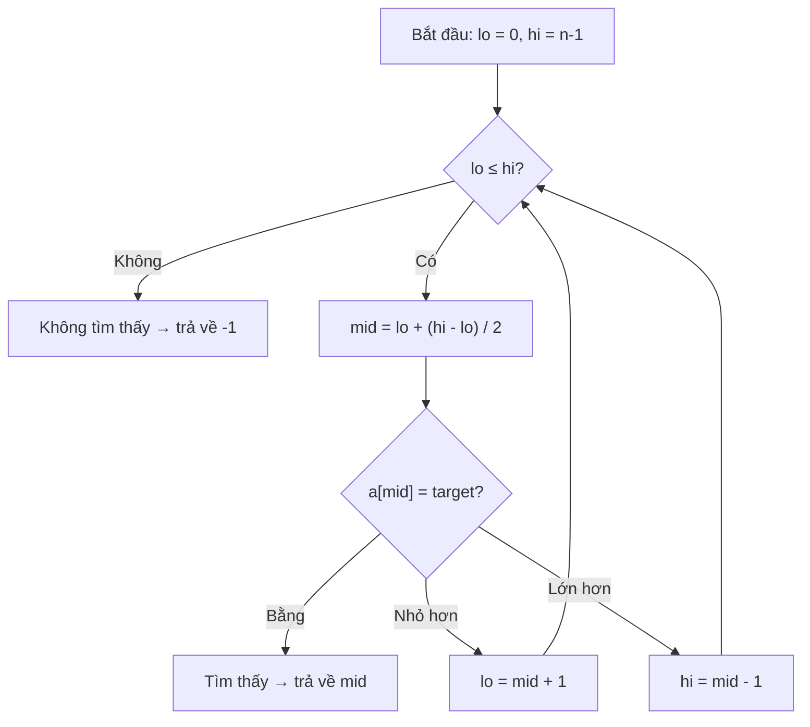
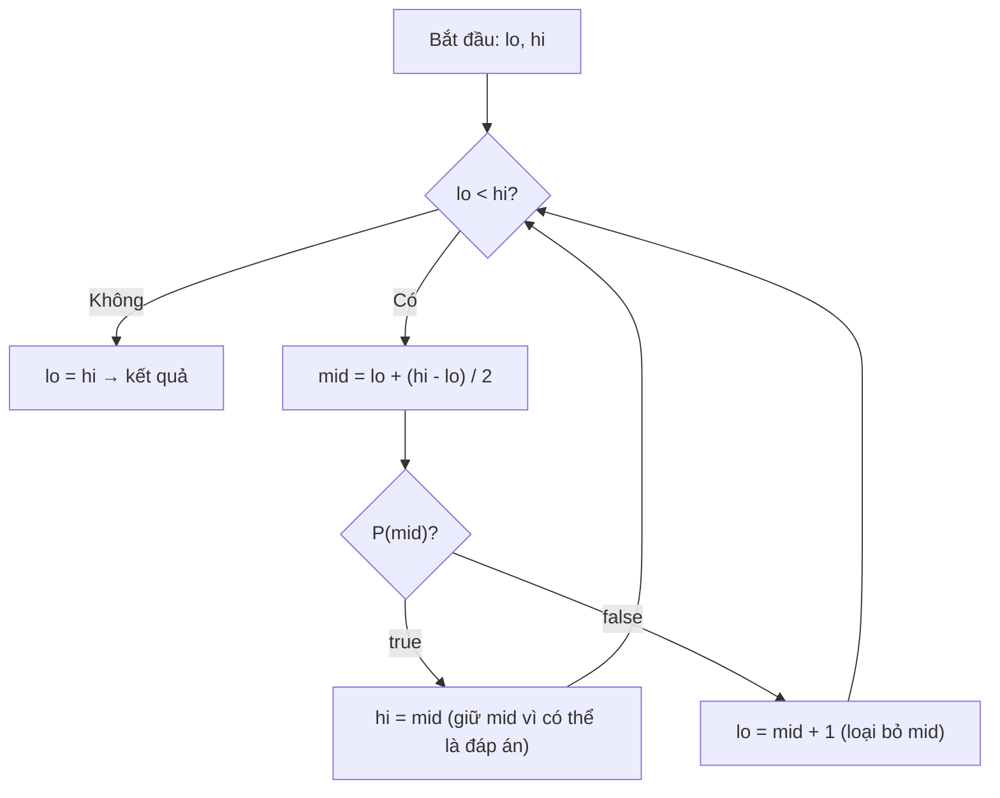

# Bài 3: Tìm Kiếm Nhị Phân - Chia Để Trị Trong 20 Bước!

> **Tác giả:** FPTOJ Team<br>
> **Nội dung tham khảo từ:** VNOI Wiki - Tìm kiếm nhị phân, Topcoder - Binary Search

---

## Bản chất vấn đề

### Bài toán: Tìm sách trong thư viện

Bạn vào thư viện có **1.000.000 cuốn sách** xếp theo thứ tự ABC. Bạn muốn tìm cuốn sách có tên bắt đầu bằng chữ "T".

**Cách 1 - Tìm tuyến tính (dùng tay):** Đọc từng cuốn từ đầu đến cuối → Cần tới $1.000.000$ lần kiểm tra.

**Cách 2 - Tìm nhị phân (thông minh):**

- Mở ra giữa giá sách → thấy chữ "M" → "T" nằm sau "M" → bỏ nửa đầu!
- Mở ra giữa nửa sau → thấy chữ "S" → "T" nằm sau "S" → bỏ thêm nửa!
- Mở ra giữa phần còn lại → thấy chữ "T" → **Tìm thấy!**

Chỉ cần $\approx 20$ bước thay vì $1.000.000$ bước! Đó là sức mạnh của **Tìm kiếm nhị phân** (Binary Search)!

### Điều kiện áp dụng

Tìm kiếm nhị phân **chỉ hoạt động** khi dữ liệu có tính **đơn điệu**:

- **Đơn điệu tăng:** Nếu $x$ tăng thì $f(x)$ cũng tăng (hoặc giữ nguyên).
- Ví dụ: Mảng đã sắp xếp tăng $[1, 3, 5, 7, 9]$ → chỉ số tăng thì giá trị tăng.
- Tổng quát hơn: Hàm kiểm tra $P(x)$ có dạng $\underbrace{false, \ldots, false}_{k}, \underbrace{true, \ldots, true}_{n-k}$.

### Nhận biết bài Binary Search

Bài toán có thể dùng Binary Search khi:

1. Cần tìm **giá trị min/max** thỏa mãn điều kiện nào đó
2. Hàm kiểm tra có tính chất **đơn điệu**: nếu $x$ thỏa mãn thì mọi $y > x$ (hoặc $y < x$) cũng thỏa mãn
3. Dễ dàng viết hàm kiểm tra $P(x)$ với độ phức tạp hợp lý

---

## Tư duy cốt lõi

### Tìm kiếm nhị phân cơ bản - Tìm phần tử trong mảng đã sắp xếp

**Ý tưởng cốt lõi:**

1. Giữ 2 biến `lo` (đầu) và `hi` (cuối) đánh dấu khoảng tìm kiếm
2. Xét phần tử ở giữa `mid`:
   - Nếu $a[mid] = target$ → **Tìm thấy!**
   - Nếu $a[mid] < target$ → Target nằm bên phải → `lo = mid + 1`
   - Nếu $a[mid] > target$ → Target nằm bên trái → `hi = mid - 1`
3. Lặp lại cho đến khi `lo > hi` (không tìm thấy)



**Minh họa:** Tìm $55$ trong mảng $[0, 5, 13, 19, 21, 41, 55, 68, 72, 81, 98]$

| Bước | lo | hi | mid | $a[mid]$ | So sánh | Kết quả |
|:-----:|:--:|:--:|:---:|:---------:|:--------:|:--------|
| 1 | 0 | 10 | 5 | 41 | $41 < 55$ | lo = 6 |
| 2 | 6 | 10 | 8 | 72 | $72 > 55$ | hi = 7 |
| 3 | 6 | 7 | 6 | 55 | $55 = 55$ | **Tìm thấy!** |

```matplotlib
a = [0, 5, 13, 19, 21, 41, 55, 68, 72, 81, 98]
target = 55

fig, axs = plt.subplots(3, 1, figsize=(10, 8))

lo, hi, mid = 0, 10, 5
colors = ['gray'] * len(a)
for i in range(lo, hi + 1):
    colors[i] = 'blue'
colors[mid] = 'orange'
colors[a.index(target)] = 'green'
axs[0].bar(range(len(a)), a, color=colors, alpha=0.7)
axs[0].set_title('Bước 1: lo=0, hi=10, mid=5 (a[mid]=41 < 55) -> lo=6')
axs[0].set_xticks(range(len(a)))
axs[0].set_xticklabels(a)

lo, hi, mid = 6, 10, 8
colors = ['gray'] * len(a)
for i in range(lo, hi + 1):
    colors[i] = 'blue'
colors[mid] = 'orange'
colors[a.index(target)] = 'green'
axs[1].bar(range(len(a)), a, color=colors, alpha=0.7)
axs[1].set_title('Bước 2: lo=6, hi=10, mid=8 (a[mid]=72 > 55) -> hi=7')
axs[1].set_xticks(range(len(a)))
axs[1].set_xticklabels(a)

lo, hi, mid = 6, 7, 6
colors = ['gray'] * len(a)
for i in range(lo, hi + 1):
    colors[i] = 'blue'
colors[mid] = 'orange'
axs[2].bar(range(len(a)), a, color=colors, alpha=0.7)
axs[2].set_title('Bước 3: lo=6, hi=7, mid=6 (a[mid]=55 == 55) -> Tìm thấy!')
axs[2].set_xticks(range(len(a)))
axs[2].set_xticklabels(a)

plt.tight_layout()
```


### Tìm kiếm nhị phân tổng quát - "Ma thuật" thực sự!

Ngoài việc tìm phần tử trong mảng, Binary Search còn giải được **rất nhiều bài toán** khác! Bí quyết là:

> **Thiết kế hàm kiểm tra $P(x)$ có tính chất:** Nếu $P(x) = true$ thì mọi $y > x$ cũng $= true$.

Khi đó dãy $P(x)$ sẽ có dạng: $false, false, \ldots, false, true, true, \ldots, true$

→ Dùng Binary Search tìm **giá trị $x$ nhỏ nhất** mà $P(x) = true$!

**Ví dụ thực tế - Bài toán vận chuyển:**

> Có $N$ gói hàng, cần chuyển trong $days$ ngày. Mỗi ngày chỉ chở được tối đa $MAX$ kg. Tìm $MAX$ nhỏ nhất!

**Hàm kiểm tra $P(MAX)$:** "Với sức chở $MAX$, có thể chuyển hết hàng trong $days$ ngày không?"

- $P(MAX) = true$ → mọi $MAX' > MAX$ cũng $= true$ (chở được nhiều hơn → càng dễ xong)
- $P(MAX) = false$ → mọi $MAX' < MAX$ cũng $= false$ (chở ít hơn → càng không xong)

→ Dùng Binary Search tìm $MAX$ nhỏ nhất mà $P(MAX) = true$!

### Các biến thể Binary Search

| Biểu thức | Ý nghĩa | Khi nào dùng |
|:----------|:---------|:--------------|
| `lower_bound(a.begin(), a.end(), x)` | Vị trí **đầu tiên** mà $a[i] \geq x$ | Tìm phần tử $\geq x$ |
| `upper_bound(a.begin(), a.end(), x)` | Vị trí **đầu tiên** mà $a[i] > x$ | Tìm phần tử $> x$ |
| `lower_bound` + `upper_bound` | Khoảng $[l, r)$ mà $a[i] = x$ | Đếm số phần tử bằng $x$ |

### Làm tròn khi chia số nguyên

Khi tính `mid = (lo + hi) / 2` với số nguyên:

- $(3 + 7) / 2 = 5$
- $(3 + 8) / 2 = 5$ (làm tròn xuống)

**Lưu ý quan trọng:** Dùng `mid = lo + (hi - lo) / 2` thay vì `(lo + hi) / 2` để **tránh tràn số** khi $lo + hi$ quá lớn!

---

## Phân tích tính đúng đắn

### Tại sao Binary Search luôn đúng?

**Bất biến (Invariant):** Trong mỗi bước, đáp án luôn nằm trong khoảng $[lo, hi]$.

- **Ban đầu:** $[lo, hi] = [0, n-1]$ chứa toàn bộ mảng → đáp án chắc chắn nằm trong đây.
- **Mỗi bước:** Ta loại bỏ **chính xác** nửa không gian tìm kiếm không chứa đáp án.
  - Nếu $a[mid] < target$: mọi phần tử $\leq a[mid]$ đều $< target$ → bỏ an toàn.
  - Nếu $a[mid] > target$: mọi phần tử $\geq a[mid]$ đều $> target$ → bỏ an toàn.
- **Khi dừng:** $lo > hi$ → khoảng rỗng → không có phần tử nào bằng $target$.

### Tại sao template tổng quát đúng?

Với template tìm $x$ nhỏ nhất mà $P(x) = true$:



**Bất biến:** Đáp án luôn nằm trong $[lo, hi]$, và $P(hi) = true$.

- Nếu $P(mid) = true$: $mid$ có thể là đáp án, nhưng cũng có thể có đáp án nhỏ hơn → giữ $mid$ (gán $hi = mid$).
- Nếu $P(mid) = false$: $mid$ chắc chắn không phải đáp án, và mọi $x < mid$ cũng $= false$ → loại bỏ $mid$ (gán $lo = mid + 1$).

### Bẫy lặp vô hạn

Khi `lo = hi - 1`, nếu dùng `mid = lo + (hi - lo) / 2` thì $mid = lo$.

- Nếu $P(mid) = false$ mà gán `lo = mid` → `lo` không đổi → **lặp vô hạn!**
- **Giải pháp:** Luôn gán `lo = mid + 1` khi $P(mid) = false$.

Khi tìm **$x$ lớn nhất** mà $P(x) = false$, cần dùng `mid = lo + (hi - lo + 1) / 2` (làm tròn lên) để tránh lặp vô hạn.

---

## Đánh giá độ phức tạp

### Độ phức tạp thời gian: $O(\log N)$

Mỗi bước giảm **một nửa** không gian tìm kiếm:

$$\frac{N}{2} \rightarrow \frac{N}{4} \rightarrow \frac{N}{8} \rightarrow \cdots \rightarrow 1$$

Số bước tối đa: $\lceil \log_2 N \rceil$

| $N$ | Số bước tối đa |
|----:|:---------------:|
| $1.000$ | $10$ |
| $1.000.000$ | $20$ |
| $1.000.000.000$ | $30$ |
| $10^{18}$ | $60$ |

**Lưu ý:** Nếu mỗi bước gọi hàm kiểm tra $P(x)$ với độ phức tạp $O(M)$, tổng độ phức tạp là $O(M \log N)$.

### Độ phức tạp không gian: $O(1)$

Chỉ sử dụng một số biến cố định (`lo`, `hi`, `mid`) → không gian $O(1)$.

---

## Code minh họa

### Binary Search cơ bản

=== "C++"

    ```cpp
    #include <bits/stdc++.h>
    using namespace std;

    int binarySearch(int a[], int n, int target) {
        int lo = 0, hi = n - 1;
        while (lo <= hi) {
            int mid = lo + (hi - lo) / 2;
            if (a[mid] == target)
                return mid;
            else if (a[mid] < target)
                lo = mid + 1;
            else
                hi = mid - 1;
        }
        return -1;
    }

    int main() {
        int a[] = {0, 5, 13, 19, 21, 41, 55, 68, 72, 81, 98};
        int n = 11;
        cout << binarySearch(a, n, 55) << endl;  // Output: 6
        cout << binarySearch(a, n, 100) << endl;  // Output: -1
        return 0;
    }
    ```

=== "Python"

    ```python
    def binary_search(a, target):
        lo, hi = 0, len(a) - 1
        while lo <= hi:
            mid = lo + (hi - lo) // 2
            if a[mid] == target:
                return mid
            elif a[mid] < target:
                lo = mid + 1
            else:
                hi = mid - 1
        return -1

    a = [0, 5, 13, 19, 21, 41, 55, 68, 72, 81, 98]
    print(binary_search(a, 55))   # Output: 6
    print(binary_search(a, 100))  # Output: -1
    ```

### Binary Search tổng quát - Tìm $x$ nhỏ nhất mà $P(x) = true$

=== "C++"

    ```cpp
    #include <bits/stdc++.h>
    using namespace std;

    bool P(int x) {
        // Viết logic bài toán ở đây
        return true;
    }

    int binarySearch(int lo, int hi) {
        while (lo < hi) {
            int mid = lo + (hi - lo) / 2;
            if (P(mid))
                hi = mid;
            else
                lo = mid + 1;
        }
        if (!P(lo)) return -1;
        return lo;
    }
    ```

=== "Python"

    ```python
    def binary_search_general(lo, hi, P):
        while lo < hi:
            mid = lo + (hi - lo) // 2
            if P(mid):
                hi = mid
            else:
                lo = mid + 1
        return lo if P(lo) else -1
    ```

### Binary Search tìm $x$ lớn nhất mà $P(x) = true$

=== "C++"

    ```cpp
    #include <bits/stdc++.h>
    using namespace std;

    bool P(long long x, long long N) {
        return x * x <= N;
    }

    long long sqrtBinarySearch(long long N) {
        long long lo = 0, hi = N;
        while (lo < hi) {
            long long mid = lo + (hi - lo + 1) / 2;
            if (P(mid, N))
                lo = mid;
            else
                hi = mid - 1;
        }
        return lo;
    }

    int main() {
        cout << sqrtBinarySearch(100) << endl;  // Output: 10
        cout << sqrtBinarySearch(99) << endl;   // Output: 9
        return 0;
    }
    ```

=== "Python"

    ```python
    def sqrt_binary(n):
        lo, hi = 0, n
        while lo < hi:
            mid = lo + (hi - lo + 1) // 2
            if mid * mid <= n:
                lo = mid
            else:
                hi = mid - 1
        return lo

    print(sqrt_binary(100))  # Output: 10
    print(sqrt_binary(99))   # Output: 9
    ```

### Bài toán vận chuyển (LeetCode 1011)

=== "C++"

    ```cpp
    #include <bits/stdc++.h>
    using namespace std;

    bool canShip(vector<int>& weights, int capacity, int days) {
        int currentWeight = 0;
        int daysUsed = 1;
        for (int w : weights) {
            if (currentWeight + w <= capacity) {
                currentWeight += w;
            } else {
                daysUsed++;
                currentWeight = w;
            }
        }
        return daysUsed <= days;
    }

    int shipWithinDays(vector<int>& weights, int days) {
        int lo = 0, hi = 0;
        for (int w : weights) {
            lo = max(lo, w);
            hi += w;
        }
        while (lo < hi) {
            int mid = lo + (hi - lo) / 2;
            if (canShip(weights, mid, days))
                hi = mid;
            else
                lo = mid + 1;
        }
        return lo;
    }
    ```

=== "Python"

    ```python
    def can_ship(weights, capacity, days):
        current_weight = 0
        days_used = 1
        for w in weights:
            if current_weight + w <= capacity:
                current_weight += w
            else:
                days_used += 1
                current_weight = w
        return days_used <= days

    def ship_within_days(weights, days):
        lo, hi = max(weights), sum(weights)
        while lo < hi:
            mid = lo + (hi - lo) // 2
            if can_ship(weights, mid, days):
                hi = mid
            else:
                lo = mid + 1
        return lo
    ```

### Dùng thư viện STL / Python

=== "C++"

    ```cpp
    #include <bits/stdc++.h>
    using namespace std;

    int main() {
        vector<int> a = {1, 3, 5, 7, 9, 11, 13};

        bool found = binary_search(a.begin(), a.end(), 7);

        auto it1 = lower_bound(a.begin(), a.end(), 6);
        int pos1 = it1 - a.begin();

        auto it2 = upper_bound(a.begin(), a.end(), 7);
        int pos2 = it2 - a.begin();

        int count = pos2 - pos1;
        return 0;
    }
    ```

=== "Python"

    ```python
    import bisect

    a = [1, 3, 5, 7, 9, 11, 13]
    found = 7 in a

    pos1 = bisect.bisect_left(a, 6)
    pos2 = bisect.bisect_right(a, 7)
    count = pos2 - pos1
    ```

---

## Cạm bẫy hay gặp

### Bẫy 1: Lặp vô hạn

=== "C++"

    ```cpp
    // SAI: Có thể lặp vô hạn khi lo = hi - 1
    while (lo < hi) {
        int mid = lo + (hi - lo) / 2;
        if (P(mid))
            hi = mid;
        else
            lo = mid;   // SAI! Phải là lo = mid + 1
    }

    // DUNG:
    while (lo < hi) {
        int mid = lo + (hi - lo) / 2;
        if (P(mid))
            hi = mid;
        else
            lo = mid + 1;
    }
    ```

=== "Python"

    ```python
    # SAI: Co the lap vo han khi lo = hi - 1
    while lo < hi:
        mid = lo + (hi - lo) // 2
        if P(mid):
            hi = mid
        else:
            lo = mid        # SAI! Phai la lo = mid + 1

    # DUNG:
    while lo < hi:
        mid = lo + (hi - lo) // 2
        if P(mid):
            hi = mid
        else:
            lo = mid + 1
    ```

### Bẫy 2: Tràn số khi tính mid

=== "C++"

    ```cpp
    // SAI: (lo + hi) co the tran so nguyen
    int mid = (lo + hi) / 2;

    // DUNG:
    int mid = lo + (hi - lo) / 2;
    ```

=== "Python"

    ```python
    # Python khong tran so, nhung nen dung cach dung de nhat quan
    mid = lo + (hi - lo) // 2
    ```

### Bẫy 3: Sai cận khi tìm "false cuối cùng"

Khi tìm $x$ lớn nhất mà $P(x) = false$, cần dùng `mid = lo + (hi - lo + 1) / 2` (làm tròn lên):

=== "C++"

    ```cpp
    while (lo < hi) {
        int mid = lo + (hi - lo + 1) / 2;
        if (P(mid))
            hi = mid - 1;
        else
            lo = mid;
    }
    ```

=== "Python"

    ```python
    while lo < hi:
        mid = lo + (hi - lo + 1) // 2
        if P(mid):
            hi = mid - 1
        else:
            lo = mid
    ```

**Lý do:** Nếu dùng `mid = lo + (hi - lo) / 2` và chỉ còn 2 phần tử $[false, true]$, mid sẽ $= lo$, vòng lặp sẽ lặp vô hạn!

### Bẫy 4: Quên kiểm tra điều kiện mảng đã sắp xếp

Binary Search **chỉ hoạt động** trên dữ liệu đã sắp xếp! Nếu mảng chưa sắp xếp → kết quả sai hoàn toàn.

### Bẫy 5: Binary Search trên số thực

Dừng khi khoảng đủ nhỏ ($\varepsilon = 10^{-9}$) hoặc lặp đúng 100 lần:

=== "C++"

    ```cpp
    while (hi - lo > 1e-9) {
        double mid = (lo + hi) / 2.0;
        if (P(mid))
            hi = mid;
        else
            lo = mid;
    }
    ```

=== "Python"

    ```python
    while hi - lo > 1e-9:
        mid = (lo + hi) / 2.0
        if P(mid):
            hi = mid
        else:
            lo = mid
    ```

---

## Bài tập luyện tập

| Bài | Nền tảng | Độ khó | Chủ đề |
|-----|----------|--------|--------|
| [CSES - Distinct Values](https://cses.fi/problemset/task/1621) | CSES | ⭐ | Binary search cơ bản |
| [CSES - Factory Machines](https://cses.fi/problemset/task/1620) | CSES | ⭐⭐ | BS on answer |
| [CSES - Array Division](https://cses.fi/problemset/task/1085) | CSES | ⭐⭐⭐ | Tổng max min |
| [LeetCode 704 - Binary Search](https://leetcode.com/problems/binary-search/) | LC | ⭐ | BS cơ bản |
| [LeetCode 34 - Find First and Last Position](https://leetcode.com/problems/find-first-and-last-position-of-element-in-sorted-array/) | LC | ⭐⭐ | lower/upper bound |
| [LeetCode 875 - Koko Eating Bananas](https://leetcode.com/problems/koko-eating-bananas/) | LC | ⭐⭐ | BS on answer |
| [LeetCode 1011 - Capacity To Ship](https://leetcode.com/problems/capacity-to-ship-packages-within-d-days/) | LC | ⭐⭐ | BS on answer |
| [VNOJ - Sort](https://oj.vnoi.info/problem/fc082_sort) | VNOJ | ⭐⭐ | BS + sorting |
| [VNOJ - VOSTR](https://oj.vnoi.info/problem/vostr) | VNOJ | ⭐⭐⭐ | BS trên xâu |
| [SPOJ - Aggressive Cows](https://www.spoj.com/problems/AGGRCOW/) | SPOJ | ⭐⭐ | Khoảng cách min |

---

## Tài liệu tham khảo

- [VNOI Wiki - Tìm kiếm nhị phân](https://wiki.vnoi.info/algo/basic/binary-search)
- [Topcoder - Binary Search](https://www.topcoder.com/thrive/articles/Binary%20Search)
- [CP-Algorithms - Binary Search](https://cp-algorithms.com/num_methods/binary_search.html)
- [USACO Guide - Binary Search](https://usaco.guide/silver/binary-search)
- [YouTube - Binary Search (Errichto)](https://www.youtube.com/watch?v=GU7DpgHINWQ)
- [LeetCode - Binary Search Study Plan](https://leetcode.com/studyplan/binary-search/)

**Bài tiếp theo:** [Kĩ thuật hai con trỏ →](ky-thuat-hai-con-tro.md)
