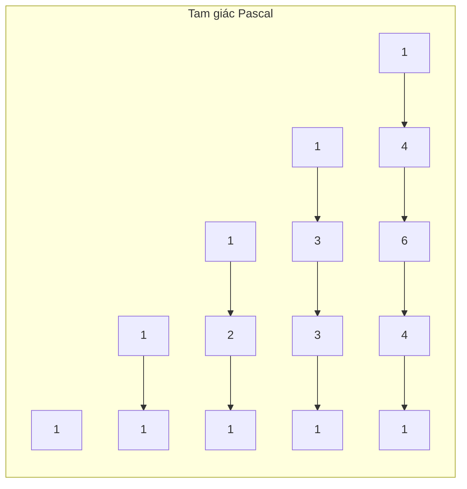

# Bài 19: Tổ Hợp & Xác Suất

> **Tác giả:** FPTOJ Team<br>
> **Nội dung tham khảo từ:** VNOI Wiki - Cách tính số tổ hợp, Xác suất

---

## 1. Tổ hợp $C(n, k)$

### Bản chất vấn đề

Cho $n$ phần tử, chọn ra $k$ phần tử mà **không quan tâm thứ tự**. Hỏi có bao nhiêu cách chọn?

Công thức:

$$C(n, k) = \frac{n!}{k!(n-k)!}$$

Ví dụ: $C(5,2) = \frac{5!}{2! \cdot 3!} = 10$.

### Tư duy cốt lõi

Công thức truy hồi quan trọng nhất — **định lý Pascal**:

$$C(n, k) = C(n-1, k-1) + C(n-1, k)$$

**Giải thích:** Xét phần tử thứ $n$ trong tập $n$ phần tử:

- **Chọn phần tử thứ $n$:** Cần chọn thêm $k-1$ phần tử từ $n-1$ phần tử còn lại → $C(n-1, k-1)$
- **Không chọn phần tử thứ $n$:** Cần chọn $k$ phần tử từ $n-1$ phần tử còn lại → $C(n-1, k)$

Tổng hai trường hợp chính là $C(n, k)$.

Các tính chất cơ bản:

| Tính chất | Công thức |
|-----------|-----------|
| Đường biên | $C(n, 0) = C(n, n) = 1$ |
| Đối xứng | $C(n, k) = C(n, n-k)$ |
| Truy hồi | $C(n, k) = C(n-1, k-1) + C(n-1, k)$ |

### Tam giác Pascal



Bảng giá trị $C(n, k)$:

| $n$ \ $k$ | 0 | 1 | 2 | 3 | 4 | 5 |
|------------|---|---|---|---|---|---|
| 0 | 1 | | | | | |
| 1 | 1 | 1 | | | | |
| 2 | 1 | 2 | 1 | | | |
| 3 | 1 | 3 | 3 | 1 | | |
| 4 | 1 | 4 | 6 | 4 | 1 | |
| 5 | 1 | 5 | 10 | 10 | 5 | 1 |

Kiểm tra: $C(4,2) = C(3,1) + C(3,2) = 3 + 3 = 6$ ✓

### Phân tích tính đúng đắn

Định lý Pascal đúng vì mọi tập con $k$ phần tử của $n$ phần tử được phân thành hai nhóm không giao nhau:

- Nhóm chứa phần tử thứ $n$: tương ứng $C(n-1, k-1)$ cách
- Nhóm không chứa phần tử thứ $n$: tương ứng $C(n-1, k)$ cách

Hai nhóm này là phân hoạch đầy đủ → tổng bằng $C(n, k)$.

### Đánh giá độ phức tạp

Xây dựng tam giác Pascal đến hàng $N$:

- **Thời gian:** $O(N^2)$ — duyệt qua mọi cặp $(i, j)$ với $0 \le j \le i \le N$
- **Bộ nhớ:** $O(N^2)$ — lưu toàn bộ bảng $C$
- **Truy vấn:** $O(1)$ — chỉ cần tra cứu $C[n][k]$

---

## 2. Cách tính $C(n, k)$ modulo $10^9 + 7$

### Bản chất vấn đề

Với $n$ lớn, $n!$ vượt quá khả năng lưu trữ. Cần tính $C(n, k) \bmod M$ với $M = 10^9 + 7$ là số nguyên tố.

Hai phương pháp chính:

| | Tam giác Pascal | Factorial + Inverse |
|--|-----------------|---------------------|
| Preprocess | $O(N^2)$ | $O(N)$ |
| Truy vấn | $O(1)$ | $O(1)$ |
| Bộ nhớ | $O(N^2)$ | $O(N)$ |
| Giới hạn $N$ | ~5000 | ~$10^6$ |
| Yêu cầu | Không | $M$ nguyên tố |

### Tư duy cốt lõi

**Cách 1: Tam giác Pascal** — Dùng trực tiếp công thức truy hồi $C(i, j) = C(i-1, j-1) + C(i-1, j) \bmod M$.

**Cách 2: Factorial + Modular Inverse** — Tính $C(n, k) = n! \cdot (k!)^{-1} \cdot ((n-k)!)^{-1} \bmod M$.

Nghịch đảo modulo tính bằng Fermat: $a^{-1} \equiv a^{M-2} \pmod{M}$ (vì $M$ nguyên tố).

Để tối ưu, tính mảng `inv_fact` bằng cách đi ngược từ $n$:

$$\text{inv\_fact}[i] = \text{inv\_fact}[i+1] \cdot (i+1) \bmod M$$

### Phân tích tính đúng đắn

**Cách 1:** Đúng trực tiếp theo định lý Pascal, mọi giá trị đều lấy modulo nên không tràn.

**Cách 2:** Theo định lý nhỏ Fermat, với $M$ nguyên tố và $\gcd(a, M) = 1$:

$$a^{M-1} \equiv 1 \pmod{M} \implies a^{M-2} \equiv a^{-1} \pmod{M}$$

Do đó $(k!)^{-1} \equiv (k!)^{M-2} \pmod{M}$, và công thức $C(n, k) = \frac{n!}{k!(n-k)!}$ chuyển thành phép nhân modulo.

### Code

=== "C++"

    ```cpp
    #include <bits/stdc++.h>
    using namespace std;

    const long long MOD = 1e9 + 7;

    // Cách 1: Tam giác Pascal — O(N²) preprocess, O(1) truy vấn
    long long C_pascal[5001][5001];

    void buildPascal(int n) {
        for (int i = 0; i <= n; i++) {
            C_pascal[i][0] = C_pascal[i][i] = 1;
            for (int j = 1; j < i; j++)
                C_pascal[i][j] = (C_pascal[i-1][j-1] + C_pascal[i-1][j]) % MOD;
        }
    }

    // Cách 2: Factorial + Modular Inverse — O(N) preprocess, O(1) truy vấn
    long long powerMod(long long a, long long b, long long mod) {
        long long result = 1;
        a %= mod;
        while (b > 0) {
            if (b & 1) result = result * a % mod;
            a = a * a % mod;
            b >>= 1;
        }
        return result;
    }

    long long fact[1000001], inv_fact[1000001];

    void buildFactorial(int n) {
        fact[0] = 1;
        for (int i = 1; i <= n; i++)
            fact[i] = fact[i-1] * i % MOD;

        inv_fact[n] = powerMod(fact[n], MOD - 2, MOD);
        for (int i = n - 1; i >= 0; i--)
            inv_fact[i] = inv_fact[i+1] * (i+1) % MOD;
    }

    long long nCk(int n, int k) {
        if (k < 0 || k > n) return 0;
        return fact[n] % MOD * inv_fact[k] % MOD * inv_fact[n-k] % MOD;
    }
    ```

=== "Python"

    ```python
    MOD = 10**9 + 7

    # Cách 1: Tam giác Pascal
    def build_pascal(n):
        C = [[0] * (n + 1) for _ in range(n + 1)]
        for i in range(n + 1):
            C[i][0] = C[i][i] = 1
            for j in range(1, i):
                C[i][j] = (C[i-1][j-1] + C[i-1][j]) % MOD
        return C

    # Cách 2: Factorial + Modular Inverse
    def build_factorial(n):
        fact = [1] * (n + 1)
        for i in range(1, n + 1):
            fact[i] = fact[i-1] * i % MOD
        inv_fact = [1] * (n + 1)
        inv_fact[n] = pow(fact[n], MOD - 2, MOD)
        for i in range(n - 1, -1, -1):
            inv_fact[i] = inv_fact[i+1] * (i+1) % MOD
        return fact, inv_fact

    def nCk(n, k, fact, inv_fact):
        if k < 0 or k > n:
            return 0
        return fact[n] * inv_fact[k] % MOD * inv_fact[n-k] % MOD
    ```

### Đánh giá độ phức tạp

**Cách 1 — Tam giác Pascal:**

- Preprocess: $O(N^2)$ thời gian, $O(N^2)$ bộ nhớ
- Truy vấn: $O(1)$
- Phù hợp khi $N \le 5000$

**Cách 2 — Factorial + Inverse:**

- Preprocess: $O(N)$ thời gian, $O(N)$ bộ nhớ
- Truy vấn: $O(1)$
- Phù hợp khi $N \le 10^6$, yêu cầu $M$ nguyên tố

---

## 3. Các biến thể tổ hợp

### 3.1. Hoán vị có lặp (Multinomial)

#### Bản chất vấn đề

Cho $n$ đồ vật, trong đó có $n_1$ đồ loại 1, $n_2$ đồ loại 2, ..., $n_k$ đồ loại k ($n_1 + n_2 + \ldots + n_k = n$). Hỏi có bao nhiêu cách sắp xếp?

#### Tư duy cốt lõi

Nếu tất cả $n$ đồ vật khác nhau, có $n!$ cách sắp xếp. Nhưng $n_i$ đồ cùng loại hoán vị cho nhau không tạo cách mới, nên phải chia đi $n_1! \cdot n_2! \cdots n_k!$.

$$\text{Số cách} = \frac{n!}{n_1! \cdot n_2! \cdots n_k!}$$

#### Phân tích tính đúng đắn

Đây là tổng quát hóa của $C(n, k)$. Khi $k = 2$ với $n_1 = k, n_2 = n-k$, công thức trở thành:

$$\frac{n!}{k!(n-k)!} = C(n, k)$$

#### Ví dụ

Sắp xếp các ký tự trong "MISSISSIPPI": M(1), I(4), S(4), P(2), tổng 11 ký tự.

$$\frac{11!}{1! \cdot 4! \cdot 4! \cdot 2!} = 34650$$

### 3.2. Tổ hợp có lặp (Combination with repetition)

#### Bản chất vấn đề

Chọn $k$ đồ từ $n$ loại, **được phép chọn lại**. Hỏi có bao nhiêu cách chọn?

#### Tư duy cốt lõi

Mỗi cách chọn tương ứng với một nghiệm không âm của phương trình:

$$x_1 + x_2 + \ldots + x_n = k, \quad x_i \ge 0$$

Số nghiệm bằng $C(n+k-1, k)$ (dùng kỹ thuật "stars and bars").

#### Phân tích tính đúng đắn

Biến đổi: đặt $y_i = x_i + 1$, ta được $y_1 + y_2 + \ldots + y_n = k + n$ với $y_i \ge 1$. Số nghiệm dương bằng $C(k+n-1, n-1) = C(n+k-1, k)$.

#### Ví dụ

Chọn 3 viên kẹo từ 5 loại, được chọn lại:

$$C(5+3-1, 3) = C(7, 3) = 35$$

### 3.3. Catalan Numbers

#### Bản chất vấn đề

Dãy Catalan $C_n$ xuất hiện trong nhiều bài toán đếm: cây nhị phân, dãy ngoặc đúng, phân hoạch đa giác, ...

#### Tư duy cốt lõi

Công thức truy hồi:

$$C_0 = 1, \quad C_n = \sum_{i=0}^{n-1} C_i \cdot C_{n-1-i}$$

Công thức trực tiếp:

$$C_n = \frac{1}{n+1}\binom{2n}{n} = \frac{(2n)!}{(n+1)! \cdot n!}$$

Ký hiệu $\binom{n}{k}$ (đọc "n chập k") là cách viết khác của $C(n,k) = \frac{n!}{k!(n-k)!}$.

#### Phân tích tính đúng đắn

Công thức trực tiếp suy ra từ công thức truy hồi bằng sinh hàm (generating function). Dãy Catalan: $1, 1, 2, 5, 14, 42, 132, 429, \ldots$

Ứng dụng:

- Số cách đặt dấu ngoặc đúng cho biểu thức $n$ toán tử
- Số cây nhị phân có $n$ node
- Số đường đi trên lưới $n \times n$ không vượt qua đường chéo
- Số cách chia đa giác lồi $(n+2)$ cạnh thành tam giác

#### Code

=== "C++"

    ```cpp
    // Tính Catalan bằng công thức truy hồi — O(N²)
    void buildCatalan(int n, long long catalan[]) {
        catalan[0] = catalan[1] = 1;
        for (int i = 2; i <= n; i++) {
            catalan[i] = 0;
            for (int j = 0; j < i; j++)
                catalan[i] = (catalan[i] + catalan[j] * catalan[i-1-j]) % MOD;
        }
    }

    // Tính Catalan bằng công thức trực tiếp — O(log MOD) mỗi truy vấn
    long long catalanFast(int n) {
        return nCk(2*n, n) * powerMod(n+1, MOD-2, MOD) % MOD;
    }
    ```

=== "Python"

    ```python
    # Tính Catalan bằng công thức truy hồi — O(N²)
    def build_catalan(n):
        catalan = [0] * (n + 1)
        catalan[0] = catalan[1] = 1
        for i in range(2, n + 1):
            for j in range(i):
                catalan[i] = (catalan[i] + catalan[j] * catalan[i-1-j]) % MOD
        return catalan

    # Tính Catalan bằng công thức trực tiếp
    def catalan_fast(n, fact, inv_fact):
        return nCk(2*n, n, fact, inv_fact) * pow(n+1, MOD-2, MOD) % MOD
    ```

#### Đánh giá độ phức tạp

- Công thức truy hồi: $O(N^2)$ thời gian, $O(N)$ bộ nhớ
- Công thức trực tiếp: $O(\log M)$ mỗi truy vấn (sau khi preprocess factorial $O(N)$)

---

## 4. Xác suất cơ bản

### Bản chất vấn đề

Xác suất của biến cố $A$:

$$P(A) = \frac{\text{số kết quả thuận lợi}}{\text{tổng số kết quả}}$$

Các quy tắc:

| Quy tắc | Công thức |
|---------|-----------|
| Xác suất có điều kiện | $P(A \cap B) = P(A) \cdot P(B \mid A)$ |
| Xác suất hợp | $P(A \cup B) = P(A) + P(B) - P(A \cap B)$ |
| Bổ sung | $P(\bar{A}) = 1 - P(A)$ |

### Tư duy cốt lõi

**Bài toán tung xúc xắc:** Tung 2 xúc xắc, xác suất được tổng bằng 7?

- Kết quả thuận lợi: $(1,6), (2,5), (3,4), (4,3), (5,2), (6,1)$ → 6 cách
- Tổng kết quả: $6 \times 6 = 36$
- $P = \frac{6}{36} = \frac{1}{6}$

**Bài toán tung đồng xu:** Tung $n$ đồng xu, xác suất được đúng $k$ mặt ngửa?

$$P(k \text{ mặt ngửa}) = \frac{C(n, k)}{2^n}$$

### Phân tích tính đúng đắn

- Số cách chọn $k$ đồng xu ra mặt ngửa: $C(n, k)$
- Mỗi đồng xu có 2 trạng thái → tổng $2^n$ kết quả
- Mọi kết quả đều có xác suất bằng nhau (đồng xu công bằng)

### Code tính xác suất modulo

Khi tính xác suất modulo, phép chia chuyển thành nhân với nghịch đảo:

$$P = \text{tử số} \times (\text{mẫu số})^{-1} \bmod M$$

=== "C++"

    ```cpp
    // Xác suất được k mặt ngửa khi tung n đồng xu (modulo)
    long long probCoins(int n, int k) {
        if (k < 0 || k > n) return 0;
        long long numerator = nCk(n, k);
        long long denominator = powerMod(2, n, MOD);
        return numerator * powerMod(denominator, MOD - 2, MOD) % MOD;
    }
    ```

=== "Python"

    ```python
    # Xác suất được k mặt ngửa khi tung n đồng xu (modulo)
    def prob_coins(n, k, fact, inv_fact):
        if k < 0 or k > n:
            return 0
        numerator = nCk(n, k, fact, inv_fact)
        denominator = pow(2, n, MOD)
        return numerator * pow(denominator, MOD - 2, MOD) % MOD
    ```

### Đánh giá độ phức tạp

- Tính $C(n, k)$: $O(1)$ sau preprocess
- Tính $2^n$: $O(\log n)$ bằng lũy thừa nhị phân
- Tổng: $O(\log n)$ mỗi truy vấn

---

## 5. Xác suất trên DP

### Bản chất vấn đề

Nhiều bài toán xác suất phức tạp không có công thức đóng, cần dùng quy hoạch động (DP) để tính từng bước.

### Tư duy cốt lõi

**Ví dụ:** Tung $n$ đồng xu, xác suất có **nhiều hơn $\frac{n}{2}$** mặt ngửa?

Gọi $dp[i][j]$ = xác suất được $j$ mặt ngửa sau $i$ lần tung.

Công thức:

$$dp[i][j] = dp[i-1][j] \cdot \frac{1}{2} + dp[i-1][j-1] \cdot \frac{1}{2}$$

- $dp[i-1][j] \cdot \frac{1}{2}$: lần thứ $i$ ra sấp
- $dp[i-1][j-1] \cdot \frac{1}{2}$: lần thứ $i$ ra ngửa

Kết quả: $\sum_{j = \lfloor n/2 \rfloor + 1}^{n} dp[n][j]$

### Phân tích tính đúng đắn

Đây là bài toán phân phối nhị thức (binomial distribution). $dp[i][j]$ chính là:

$$dp[i][j] = C(i, j) \cdot \left(\frac{1}{2}\right)^i$$

DP tính đúng vì mỗi trạng thái $(i, j)$ được xây dựng từ hai trạng thái hợp lệ trước đó.

### Code

=== "C++"

    ```cpp
    double probMoreThanHalf(int n) {
        vector<vector<double>> dp(n+1, vector<double>(n+1, 0));
        dp[0][0] = 1.0;

        for (int i = 1; i <= n; i++) {
            for (int j = 0; j <= i; j++) {
                dp[i][j] = dp[i-1][j] * 0.5;
                if (j > 0) dp[i][j] += dp[i-1][j-1] * 0.5;
            }
        }

        double result = 0;
        for (int j = n/2 + 1; j <= n; j++)
            result += dp[n][j];
        return result;
    }
    ```

=== "Python"

    ```python
    def prob_more_than_half(n):
        dp = [[0.0] * (n + 1) for _ in range(n + 1)]
        dp[0][0] = 1.0
        for i in range(1, n + 1):
            for j in range(i + 1):
                dp[i][j] = dp[i-1][j] * 0.5
                if j > 0:
                    dp[i][j] += dp[i-1][j-1] * 0.5
        return sum(dp[n][n//2 + 1:])
    ```

### Đánh giá độ phức tạp

- **Thời gian:** $O(N^2)$ — duyệt qua mọi trạng thái $(i, j)$
- **Bộ nhớ:** $O(N^2)$ — lưu bảng $dp$. Có thể tối ưu xuống $O(N)$ vì chỉ cần hàng trước.

---

## 6. Kỳ vọng (Expected Value)

### Bản chất vấn đề

Kỳ vọng của biến ngẫu nhiên $X$:

$$E(X) = \sum_{x} x \cdot P(X = x)$$

### Tư duy cốt lõi

**Ví dụ 1:** Tung xúc xắc công bằng, kỳ vọng = $\sum_{i=1}^{6} i \cdot \frac{1}{6} = 3.5$

**Ví dụ 2:** Kỳ vọng số lần tung xúc xắc cho đến khi được mặt 6:

$$E = \frac{1}{P} = \frac{1}{1/6} = 6$$

Đây là phân phối hình học: $E = \frac{1}{p}$ với $p$ là xác suất thành công mỗi lần.

### Phân tích tính đúng đắn

Công thức kỳ vọng đúng cho mọi phân phối xác suất. Khi xác suất đều (như xúc xắc công bằng), có thể tính đơn giản:

$$E = \frac{\text{tổng giá trị}}{\text{số trường hợp}}$$

Khi xác suất không đều, bắt buộc dùng công thức tổng quát $E = \sum x \cdot P(x)$.

### Đánh giá độ phức tạp

Tính kỳ vọng thường kết hợp với DP: $O(N^2)$ hoặc $O(N)$ tùy bài toán.

---

## 7. Lưu ý / Cạm bẫy hay gặp

### Bẫy 1: Phép chia modulo ≠ phép chia thường

```cpp
// SAI: (a / b) % MOD ≠ (a % MOD) / (b % MOD)
long long wrong = (a / b) % MOD;

// ĐÚNG: Dùng modular inverse
long long correct = a % MOD * powerMod(b, MOD - 2, MOD) % MOD;
```

Lý do: Modular arithmetic không có phép chia trực tiếp. Phải chuyển sang nhân với nghịch đảo modulo.

### Bẫy 2: Tràn số khi tính factorial

```cpp
// SAI: fact[i] có thể tràn long long trước khi lấy modulo
fact[i] = fact[i-1] * i;

// ĐÚNG: Luôn lấy modulo sau mỗi phép nhân
fact[i] = fact[i-1] * i % MOD;
```

### Bẫy 3: Tam giác Pascal tốn bộ nhớ

```cpp
// C[5001][5001] → ~200MB bộ nhớ → có thể MLE!
long long C[5001][5001];

// Giải pháp: Chỉ dùng khi N ≤ 5000
// Với N > 5000, chuyển sang factorial + inverse (O(N) bộ nhớ)
```

### Bẫy 4: Catalan — Quên edge case và chia modulo

```cpp
// SAI: Không xử lý n = 0, dùng chia thường
long long catalan(int n) {
    return nCk(2*n, n) / (n+1);
}

// ĐÚNG:
long long catalan(int n) {
    if (n == 0) return 1;
    return nCk(2*n, n) * powerMod(n+1, MOD-2, MOD) % MOD;
}
```

### Bẫy 5: Sai điều kiện trong nCk

```cpp
// SAI: Không kiểm tra k < 0
long long nCk(int n, int k) {
    return fact[n] * inv_fact[k] % MOD * inv_fact[n-k] % MOD;
}

// ĐÚNG:
long long nCk(int n, int k) {
    if (k < 0 || k > n) return 0;
    return fact[n] % MOD * inv_fact[k] % MOD * inv_fact[n-k] % MOD;
}
```

### Bẫy 6: Quên tính nghịch đảo factorial đúng cách

```cpp
// SAI: Tính từng inv_fact[i] riêng lẻ → O(N log MOD)
for (int i = 0; i <= n; i++)
    inv_fact[i] = powerMod(fact[i], MOD - 2, MOD);

// ĐÚNG: Tính inv_fact[n] trước, sau đó đi ngược lại → O(N + log MOD)
inv_fact[n] = powerMod(fact[n], MOD - 2, MOD);
for (int i = n - 1; i >= 0; i--)
    inv_fact[i] = inv_fact[i+1] * (i+1) % MOD;
```

### Mẹo thi cử

- **$C(n, k)$ với $n$ lớn:** Dùng factorial + modular inverse
- **$C(n, k)$ với $n$ nhỏ ($\le 5000$):** Dùng tam giác Pascal
- **Xác suất modulo:** Phép chia → dùng `powerMod(b, MOD-2, MOD)`
- **Tránh tràn số:** Luôn lấy modulo sau mỗi phép nhân
- **Catalan:** Xuất hiện trong nhiều bài toán đếm hình học, cây, dãy ngoặc
- **Expected Value:** Thường kết hợp với DP

---

## 8. Bài tập luyện tập

| Bài | Nền tảng | Độ khó | Chủ đề |
|-----|----------|--------|--------|
| [CSES - Binomial Coefficients](https://cses.fi/problemset/task/1079) | CSES | ⭐⭐ | $C(n,k) \bmod p$ |
| [CSES - Creating Strings II](https://cses.fi/problemset/task/1716) | CSES | ⭐⭐ | Hoán vị có trùng |
| [CSES - Distributing Apples](https://cses.fi/problemset/task/1717) | CSES | ⭐⭐ | Tổ hợp có lặp |
| [VNOJ - Atcoder DP Contest I - Coins](https://oj.vnoi.info/problem/atcoder_dp_i) | VNOJ | ⭐⭐ | Probability DP |
| [VNOJ - VOMARBLE](https://oj.vnoi.info/problem/vomarble) | VNOJ | ⭐⭐⭐ | Combinatorics |
| [CSES - Counting Necklaces](https://cses.fi/problemset/task/2111) | CSES | ⭐⭐⭐ | Burnside's lemma |
| [LeetCode - Unique Paths](https://leetcode.com/problems/unique-paths/) | LC | ⭐⭐ | $C(n,k)$ cơ bản |

## Bài viết liên quan

- [Bài 18: Euclid & Modular Inverse](euclid-modular-inverse.md)
- [Bài 26: Số học nâng cao](so-hoc-nang-cao.md)

## Tài liệu tham khảo

- [VNOI Wiki - Cách tính số tổ hợp](https://wiki.vnoi.info/algo/algebra/nCk)
- [CP-Algorithms - Binomial Coefficients](https://cp-algorithms.com/combinatorics/binomial-coefficients.html)
- [HackerEarth - Combinatorics](https://www.hackerearth.com/practice/math/combinatorics/basics-combinatorics/tutorial/)
- [GeeksforGeeks - nCr using Pascal's Triangle](https://www.geeksforgeeks.org/dsa/program-to-calculate-the-value-of-ncr-using-pascals-triangle/)

**Bài tiếp theo:** [Manacher →](manacher.md)
