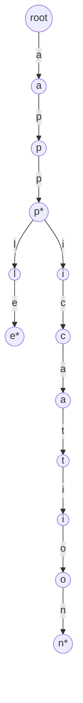
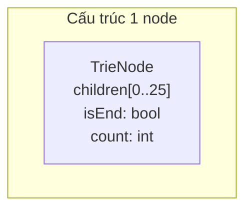

# Bài 17: Trie - Cây Tìm Kiếm Tiền Tố

> **Tác giả:** FPTOJ Team<br>
> **Nội dung tham khảo từ:** VNOI Wiki - Trie, CP-Algorithms, USACO Guide

---

## Bạn sẽ học được gì?

- Tại sao Hash Table và Set **thất bại** khi cần tìm kiếm theo tiền tố (prefix)
- Bản chất của Trie và cơ chế chia sẻ đường đi giữa các xâu có cùng tiền tố
- Cài đặt Trie cơ bản và Bitwise Trie cho bài toán XOR maximum
- Phân tích độ phức tạp thời gian $O(L)$ và không gian $O(N \times L \times |\Sigma|)$

---

## 1. Bản chất vấn đề

### Bài toán

Cho tập hợp $N$ xâu, mỗi xâu có độ dài tối đa $L$. Cần hỗ trợ hai thao tác:

1. **Thêm** một xâu vào tập hợp.
2. **Tìm kiếm:** Kiểm tra một xâu có tồn tại trong tập hợp không?
3. **Tìm theo tiền tố:** Liệt kê tất cả xâu bắt đầu bằng một prefix cho trước.

### Tại sao cấu trúc dữ liệu thông thường chưa đủ?

| Cấu trúc | Tìm kiếm chính xác | Tìm theo tiền tố (prefix) |
|----------|-------------------|---------------------------|
| Hash Table | $O(L)$ trung bình | $O(N \times L)$ phải duyệt hết |
| `std::set` / BST | $O(L \log N)$ | $O(N \times L \log N)$ |
| Mảng + sort | $O(L \log N)$ nhị phân | $O(L \log N + K)$ nếu đã sort |

Với tìm kiếm chính xác, Hash Table đã rất tốt. Nhưng với **tìm theo tiền tố** — tức là "tìm tất cả xâu bắt đầu bằng `"app"`" — ta buộc phải kiểm tra **từng xâu** trong tập hợp. Khi $N = 10^5$ và $L = 100$, mỗi truy vấn tốn đến $10^7$ phép so sánh.

### Tư duy cốt lõi

Các xâu như `"app"`, `"apple"`, `"application"` có cùng tiền tố `"app"`. Nếu ta **chia sẻ chung đường đi** cho phần tiền tố trùng nhau, thì:

- Thêm `"apple"`: tạo đường `a → p → p → l → e`.
- Thêm `"application"`: tại node `"pp"` đã tồn tại, chỉ cần **tiếp tục** tạo `l → i → c → a → t → i → o → n`.

Đây chính là ý tưởng của **Trie** (cây tiền tố): mỗi node biểu diễn một ký tự, đường đi từ gốc đến một node đánh dấu kết thúc tạo thành một xâu hợp lệ.



Trong sơ đồ trên, `*` đánh dấu node kết thúc của một từ hoàn chỉnh. Từ `"app"` và `"application"` **chia sẻ** chung đường `root → a → p → p`, tiết kiệm bộ nhớ và cho phép tìm prefix `"app"` chỉ trong $O(L)$ bước.

---

## 2. Cài đặt Trie cơ bản

### Cấu trúc node

Mỗi node chứa:
- Mảng `$children[|\Sigma|]$`: con trỏ đến các node con (mỗi phần tử tương ứng một ký tự trong bảng chữ cái $\Sigma$).
- `$isEnd$`: đánh dấu node này có phải kết thúc của một từ hợp lệ không.
- `$count$`: đếm số từ đi qua node này (hữu ích cho bài toán đếm prefix).

Với bảng chữ cái `a-z` ($|\Sigma| = 26$), mỗi node có tối đa 26 con.



### Hai thao tác chính

**Insert** — Thêm xâu $S$ vào Trie:

1. Bắt đầu từ `$root$`.
2. Với mỗi ký tự $c$ trong $S$: tính chỉ số `$idx = c - \text{'a'}$`. Nếu `$children[idx]$` là `nullptr`, tạo node mới. Di chuyển sang `$children[idx]$`.
3. Đánh dấu `$isEnd = true$` tại node cuối.

**Search** — Kiểm tra xâu $S$ có tồn tại:

1. Bắt đầu từ `$root$`.
2. Với mỗi ký tự $c$: nếu `$children[idx]$` là `nullptr` → trả về `false`. Ngược lại di chuyển tiếp.
3. Trả về `$isEnd$` tại node cuối (phải là kết thúc từ hợp lệ, không chỉ là tiền tố).

### Cài đặt

=== "C++"

    ```cpp
    #include <bits/stdc++.h>
    using namespace std;

    struct TrieNode {
        TrieNode* children[26];
        bool isEnd;
        int count;

        TrieNode() {
            for (int i = 0; i < 26; i++)
                children[i] = nullptr;
            isEnd = false;
            count = 0;
        }
    };

    struct Trie {
        TrieNode* root;

        Trie() { root = new TrieNode(); }

        void insert(string word) {
            TrieNode* cur = root;
            for (char c : word) {
                int idx = c - 'a';
                if (cur->children[idx] == nullptr)
                    cur->children[idx] = new TrieNode();
                cur = cur->children[idx];
                cur->count++;
            }
            cur->isEnd = true;
        }

        bool search(string word) {
            TrieNode* cur = root;
            for (char c : word) {
                int idx = c - 'a';
                if (cur->children[idx] == nullptr)
                    return false;
                cur = cur->children[idx];
            }
            return cur->isEnd;
        }

        bool startsWith(string prefix) {
            TrieNode* cur = root;
            for (char c : prefix) {
                int idx = c - 'a';
                if (cur->children[idx] == nullptr)
                    return false;
                cur = cur->children[idx];
            }
            return true;
        }

        int countPrefix(string prefix) {
            TrieNode* cur = root;
            for (char c : prefix) {
                int idx = c - 'a';
                if (cur->children[idx] == nullptr)
                    return 0;
                cur = cur->children[idx];
            }
            return cur->count;
        }

        void deleteTrie(TrieNode* node) {
            if (node == nullptr) return;
            for (int i = 0; i < 26; i++)
                deleteTrie(node->children[i]);
            delete node;
        }

        ~Trie() { deleteTrie(root); }
    };
    ```

=== "Python"

    ```python
    class TrieNode:
        def __init__(self):
            self.children = {}
            self.is_end = False
            self.count = 0

    class Trie:
        def __init__(self):
            self.root = TrieNode()

        def insert(self, word):
            cur = self.root
            for c in word:
                if c not in cur.children:
                    cur.children[c] = TrieNode()
                cur = cur.children[c]
                cur.count += 1
            cur.is_end = True

        def search(self, word):
            cur = self.root
            for c in word:
                if c not in cur.children:
                    return False
                cur = cur.children[c]
            return cur.is_end

        def starts_with(self, prefix):
            cur = self.root
            for c in prefix:
                if c not in cur.children:
                    return False
                cur = cur.children[c]
            return True

        def count_prefix(self, prefix):
            cur = self.root
            for c in prefix:
                if c not in cur.children:
                    return 0
                cur = cur.children[c]
            return cur.count
    ```

---

## 3. Phân tích tính đúng đắn

### Tại sao `$search$` trả về đúng kết quả?

Giả sử ta đã insert xâu `"apple"` và `"app"` vào Trie. Khi gọi `$search(\text{"app"})$`:

1. Duyệt `a` → tồn tại, di chuyển sang node con.
2. Duyệt `p` → tồn tại, di chuyển tiếp.
3. Duyệt `p` → tồn tại, đến node có `$isEnd = true$` (vì `"app"` đã được insert).
4. Trả về `true`.

Khi gọi `$search(\text{"ap"})$`:

1. Duyệt `a` → tồn tại.
2. Duyệt `p` → tồn tại.
3. Node hiện tại có `$isEnd = false$` (chưa ai insert `"ap"`).
4. Trả về `false`.

**Điểm mấu chốt:** `$startsWith$` chỉ kiểm tra đường đi có tồn tại, không cần `$isEnd$`. `$search$` yêu cầu cả đường đi **và** `$isEnd = true$`.

### Tại sao prefix search hoạt động trong $O(L)$?

Khi tìm tất cả xâu bắt đầu bằng prefix $P$ (độ dài $L$):

1. **Bước 1:** Đi theo đường $P[0] \to P[1] \to \ldots \to P[L-1]$ — mất $O(L)$.
2. **Bước 2:** Tại node cuối của $P$, duyệt tất cả nhánh con bằng DFS để thu thập xâu.

Bước 1 chỉ tốn $O(L)$ thay vì $O(N \times L)$ vì ta **không cần duyệt từng xâu** trong tập hợp. Đường đi đã được xác định duy nhất bởi prefix.

### Tại sao insert không ghi đè xâu cũ?

Mỗi lần insert, ta chỉ **tạo thêm** các node chưa tồn tại và **đi theo** các node đã có. Các node đã tồn tại không bị sửa đổi (ngoại trừ `$count$` tăng thêm 1). Do đó, insert `"apple"` sau `"app"` không làm mất `"app"`.

---

## 4. Đánh giá độ phức tạp

### Thời gian

| Thao tác | Độ phức tạp | Giải thích |
|----------|-------------|------------|
| Insert | $O(L)$ | Duyệt đúng $L$ ký tự, mỗi bước $O(1)$ |
| Search | $O(L)$ | Duyệt đúng $L$ ký tự |
| StartsWith | $O(L)$ | Duyệt đúng $L$ ký tự |
| CountPrefix | $O(L)$ | Duyệt đúng $L$ ký tự |
| Liệt kê prefix | $O(L + K)$ | $O(L)$ tìm node + $O(K)$ DFS thu thập kết quả |

Trong đó $L$ là độ dài xâu, $K$ là số xâu thỏa mãn prefix.

### Không gian

- **Trường hợp xấu nhất:** $O(N \times L \times |\Sigma|)$ khi tất cả xâu hoàn toàn khác nhau, không chia sẻ prefix.
- **Trường hợp tốt nhất:** $O(|\Sigma|)$ khi tất cả xâu giống nhau (chia sẻ toàn bộ đường đi).
- **Thực tế:** Trie tiết kiệm đáng kể khi tập xâu có nhiều prefix chung.

Với $|\Sigma| = 26$, mỗi node tốn $26 \times 8 + 1 + 4 \approx 213$ bytes (64-bit pointer). Cần cân nhắc khi $N \times L$ lớn.

### So sánh tổng quát

| Tiêu chí | Trie | Hash Table | `std::set` |
|----------|------|------------|------------|
| Tìm chính xác | $O(L)$ | $O(L)$ TB | $O(L \log N)$ |
| Tìm prefix | $O(L)$ | $O(N \times L)$ | $O(N \times L)$ |
| Bộ nhớ | Nhiều hơn | Ít hơn | Trung bình |
| Duyệt theo thứ tự | Dễ (DFS) | Khó | Có sẵn |

---

## 5. Ứng dụng: Auto-complete

Tìm tất cả xâu trong Trie bắt đầu bằng prefix cho trước.

=== "C++"

    ```cpp
    void findAllWithPrefix(TrieNode* node, string prefix, vector<string>& result) {
        if (node->isEnd)
            result.push_back(prefix);

        for (int i = 0; i < 26; i++) {
            if (node->children[i] != nullptr) {
                char c = 'a' + i;
                findAllWithPrefix(node->children[i], prefix + c, result);
            }
        }
    }

    vector<string> autocomplete(Trie& trie, string prefix) {
        TrieNode* cur = trie.root;
        for (char c : prefix) {
            int idx = c - 'a';
            if (cur->children[idx] == nullptr)
                return {};
            cur = cur->children[idx];
        }
        vector<string> result;
        findAllWithPrefix(cur, prefix, result);
        return result;
    }
    ```

=== "Python"

    ```python
    def find_all_with_prefix(node, prefix, result):
        if node.is_end:
            result.append(prefix)
        for c, child in node.children.items():
            find_all_with_prefix(child, prefix + c, result)

    def autocomplete(trie, prefix):
        cur = trie.root
        for c in prefix:
            if c not in cur.children:
                return []
            cur = cur.children[c]
        result = []
        find_all_with_prefix(cur, prefix, result)
        return result
    ```

---

## 6. Ứng dụng: Bitwise Trie - Tìm XOR lớn nhất

### Bài toán

Cho mảng $A$ gồm $N$ số nguyên không âm và số $X$. Tìm $A[i]$ sao cho $A[i] \oplus X$ là lớn nhất.

### Tư duy cốt lõi

Thay vì lưu ký tự, ta lưu **từng bit** (0 hoặc 1) của số. Mỗi số biểu diễn bằng chuỗi $31$ bit (cho số $\leq 10^9$).

Khi tìm XOR lớn nhất, tại mỗi bit ta **ưu tiên đi theo bit ngược** với bit của $X$:

- Bit của $X$ là 1 → ưu tiên đi bit 0 (vì $1 \oplus 0 = 1$).
- Bit của $X$ là 0 → ưu tiên đi bit 1 (vì $0 \oplus 1 = 1$).

Nếu nhánh ưu tiên không tồn tại, buộc phải đi theo bit giống.

### Ví dụ minh họa

Cho $X = 5 = (101)_2$ và $A = [3, 10, 5, 25, 2, 8]$. Khi tìm trong Bitwise Trie:

| Bit thứ | Bit của $X$ | Ưu tiên đi | Kết quả bit XOR |
|---------|-------------|------------|-----------------|
| 2 | 1 | 0 | 1 |
| 1 | 0 | 1 | 1 |
| 0 | 1 | 0 | 1 |

Đi theo đường $0 \to 1 \to 0$ dẫn đến số $25 = (11001)_2$. Kết quả: $5 \oplus 25 = 28$.

### Cài đặt

=== "C++"

    ```cpp
    struct BitTrieNode {
        BitTrieNode* children[2];
        BitTrieNode() {
            children[0] = children[1] = nullptr;
        }
    };

    struct BitTrie {
        BitTrieNode* root;
        static const int MAX_BIT = 30;

        BitTrie() { root = new BitTrieNode(); }

        void insert(int num) {
            BitTrieNode* cur = root;
            for (int i = MAX_BIT; i >= 0; i--) {
                int bit = (num >> i) & 1;
                if (cur->children[bit] == nullptr)
                    cur->children[bit] = new BitTrieNode();
                cur = cur->children[bit];
            }
        }

        int findMaxXor(int x) {
            BitTrieNode* cur = root;
            int result = 0;
            for (int i = MAX_BIT; i >= 0; i--) {
                int bit = (x >> i) & 1;
                int want = 1 - bit;

                if (cur->children[want] != nullptr) {
                    result |= (1 << i);
                    cur = cur->children[want];
                } else {
                    cur = cur->children[bit];
                }
            }
            return result;
        }
    };
    ```

=== "Python"

    ```python
    class BitTrieNode:
        def __init__(self):
            self.children = [None, None]

    class BitTrie:
        MAX_BIT = 30

        def __init__(self):
            self.root = BitTrieNode()

        def insert(self, num):
            cur = self.root
            for i in range(self.MAX_BIT, -1, -1):
                bit = (num >> i) & 1
                if cur.children[bit] is None:
                    cur.children[bit] = BitTrieNode()
                cur = cur.children[bit]

        def find_max_xor(self, x):
            cur = self.root
            result = 0
            for i in range(self.MAX_BIT, -1, -1):
                bit = (x >> i) & 1
                want = 1 - bit
                if cur.children[want] is not None:
                    result |= (1 << i)
                    cur = cur.children[want]
                else:
                    cur = cur.children[bit]
            return result
    ```

### Phân tích Bitwise Trie

- **Thời gian:** $O(31)$ cho mỗi thao tác insert hoặc findMaxXor — hằng số vì số bit cố định.
- **Không gian:** $O(N \times 31)$ cho $N$ số.
- **Ứng dụng:** LeetCode 421 (Maximum XOR of Two Numbers in an Array), nhiều bài VOI.

---

## 7. Lưu ý khi cài đặt

- **Bộ nhớ:** Với $|\Sigma|$ lớn (Unicode, v.v.), dùng `unordered_map<char, TrieNode*>` thay vì mảng cố định để tiết kiệm bộ nhớ.
- **Xóa từ:** Phức tạp hơn insert/search vì cần dọn các node không còn sử dụng. Trong competitive programming, hiếm khi cần xóa.
- **Đệ quy DFS:** Khi liệt kê prefix, có thể gặp stack overflow nếu xâu quá dài. Duyệt iterative nếu cần.

---

## 8. Bài tập luyện tập

| Bài | Nền tảng | Độ khó | Chủ đề |
|-----|----------|--------|--------|
| [CSES - Word Combinations](https://cses.fi/problemset/task/1731) | CSES | ⭐⭐⭐ | Trie + DP |
| [LeetCode - Implement Trie](https://leetcode.com/problems/implement-trie-prefix-tree/) | LeetCode | ⭐⭐ | Cài đặt Trie cơ bản |
| [LeetCode - Word Search II](https://leetcode.com/problems/word-search-ii/) | LeetCode | ⭐⭐⭐ | Trie + Backtracking |
| [LeetCode - Maximum XOR of Two Numbers](https://leetcode.com/problems/maximum-xor-of-two-numbers-in-an-array/) | LeetCode | ⭐⭐ | Bitwise Trie |
| [VNOJ - VOI18STR](https://oj.vnoi.info/problem/voi18str) | VNOJ | ⭐⭐⭐ | String + Trie |
| [CSES - Substring Queries](https://cses.fi/problemset/task/2110) | CSES | ⭐⭐⭐ | Cấu trúc hậu tố |

## Bài viết liên quan

- [Bài 16: Hash Table](hash-table.md)
- [Bài 9: KMP](kmp-tim-xau.md)

## Tài liệu tham khảo

- [VNOI Wiki - Trie](https://wiki.vnoi.info/algo/data-structures/trie)
- [CP-Algorithms - Trie](https://cp-algorithms.com/string/trie.html)
- [GeeksforGeeks - Trie Data Structure](https://www.geeksforgeeks.org/dsa/trie-insert-and-search/)
- [USACO Guide - Trie](https://usaco.gold/adv/trie)
- [YouTube - Trie Data Structure (takeuforward)](https://www.youtube.com/watch?v=AXjmTQ8LEoI)

**Bài tiếp theo:** [Heap (Hàng đợi ưu tiên) →](heap.md)
