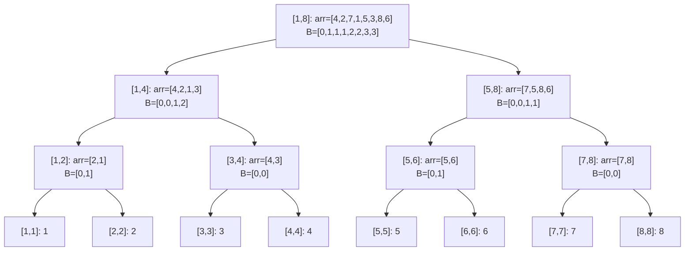

# Static Wavelet Tree - Truy Vấn Thứ Tự Trên Đoạn

> **Tác giả:** FPTOJ Team<br>
> **Nội dung tham khảo từ:** CP-Algorithms - Wavelet Tree

---

## 1. Bản chất vấn đề

### Bài toán: Truy vấn phần tử lớn thứ $k$ trong đoạn

Cho mảng $A$ gồm $N$ phần tử. Thực hiện $Q$ truy vấn:

- **$k$-th smallest in $[l, r]$:** Tìm phần tử nhỏ thứ $k$ trong đoạn $[l, r]$.
- **Count less than $x$ in $[l, r]$:** Đếm số phần tử nhỏ hơn $x$ trong đoạn $[l, r]$.

| Bài toán | Segment Tree | **Wavelet Tree** |
|----------|-------------|-----------------|
| $k$-th smallest | $O(\log^2 N)$ | $O(\log N)$ |
| Count less than $x$ | $O(\log^2 N)$ | $O(\log N)$ |
| Không gian | $O(N)$ | $O(N \log N)$ |

---

## 2. Tư duy cốt lõi

### Ý tưởng: Phân hoạch theo bit

Wavelet Tree là cây nhị phân mà mỗi nút quản lý 1 khoảng giá trị $[lo, hi]$:

- **Nút lá:** $lo = hi$ (chỉ 1 giá trị).
- **Nút trong:** Chia $[lo, hi]$ thành $[lo, mid]$ (con trái) và $[mid+1, hi]$ (con phải).

Mỗi nút lưu mảng `B` — đếm số phần tử thuộc con trái.

### Cấu trúc cây



```matplotlib
import numpy as np

arr = [4, 2, 7, 1, 5, 3, 8, 6]
n = len(arr)

fig, axes = plt.subplots(4, 1, figsize=(10, 8), sharex=True)

levels = [
    ("[1,8]", arr, [4, 2, 7, 1, 5, 3, 8, 6]),
    ("[1,4] vs [5,8]", arr, [4, 2, 7, 1, 5, 3, 8, 6]),
    ("[1,2] vs [3,4]\n[5,6] vs [7,8]", arr, [4, 2, 7, 1, 5, 3, 8, 6]),
    ("Lá", arr, [4, 2, 7, 1, 5, 3, 8, 6]),
]

level_splits = [
    {"left": [1,2,3,4], "right": [5,6,7,8], "mid": 4},
    {"left": [1,2], "right": [3,4], "mid_l": 2, "mid_r": 4},
    {"left": [1], "right": [2], "mid": 2},
    {},
]

colors_left = '#3498db'
colors_right = '#e74c3c'

level0_left = [1 if x <= 4 else 0 for x in arr]
level0_right = [1 if x > 4 else 0 for x in arr]

level1_left_vals = [x for x in arr if x <= 4]
level1_right_vals = [x for x in arr if x > 4]

x = np.arange(n)
width = 0.6

ax = axes[0]
left_colors = [colors_left if v <= 4 else colors_right for v in arr]
ax.bar(x, arr, width, color=left_colors, edgecolor='white', linewidth=0.5)
for i, v in enumerate(arr):
    ax.text(i, v + 0.2, str(v), ha='center', fontsize=10, fontweight='bold')
ax.set_ylabel('Gốc\n[1,8]', fontsize=11, fontweight='bold')
ax.set_ylim(0, 10)
ax.axhline(y=4, color='gray', linestyle='--', alpha=0.5)
ax.text(n - 0.5, 4.3, 'mid=4', fontsize=9, color='gray')

ax = axes[1]
colors1 = []
vals_reordered = [4, 2, 1, 3, 7, 5, 8, 6]
for v in vals_reordered:
    colors1.append(colors_left if v <= 4 else colors_right)
ax.bar(x, vals_reordered, width, color=colors1, edgecolor='white', linewidth=0.5)
for i, v in enumerate(vals_reordered):
    ax.text(i, v + 0.2, str(v), ha='center', fontsize=10, fontweight='bold')
ax.set_ylabel('Cấp 1\nTrái | Phải', fontsize=11, fontweight='bold')
ax.set_ylim(0, 10)
ax.axhline(y=4, color='gray', linestyle='--', alpha=0.5)
ax.plot([3.5, 3.5], [0, 9], 'k--', alpha=0.3)

ax = axes[2]
vals_l2 = [2, 1, 4, 3, 5, 6, 7, 8]
colors2 = []
for v in vals_l2:
    if v <= 2:
        colors2.append('#1abc9c')
    elif v <= 4:
        colors2.append('#9b59b6')
    elif v <= 6:
        colors2.append('#f39c12')
    else:
        colors2.append('#e74c3c')
ax.bar(x, vals_l2, width, color=colors2, edgecolor='white', linewidth=0.5)
for i, v in enumerate(vals_l2):
    ax.text(i, v + 0.2, str(v), ha='center', fontsize=10, fontweight='bold')
ax.set_ylabel('Cấp 2\n4 nhóm', fontsize=11, fontweight='bold')
ax.set_ylim(0, 10)

ax = axes[3]
vals_l3 = sorted(arr)
colors3 = ['#1abc9c', '#1abc9c', '#9b59b6', '#9b59b6', '#f39c12', '#f39c12', '#e74c3c', '#e74c3c']
ax.bar(x, vals_l3, width, color=colors3, edgecolor='white', linewidth=0.5)
for i, v in enumerate(vals_l3):
    ax.text(i, v + 0.2, str(v), ha='center', fontsize=10, fontweight='bold')
ax.set_ylabel('Lá\n[1,1]..[8,8]', fontsize=11, fontweight='bold')
ax.set_ylim(0, 10)

ax.set_xticks(x)
ax.set_xticklabels([f'[{i}]' for i in range(n)])
ax.set_xlabel('Vị trí trong mảng', fontsize=11)

fig.suptitle('Wavelet Tree: Cách các giá trị được phân hoạch tại mỗi cấp', fontsize=14, fontweight='bold', y=1.01)
plt.tight_layout()
```

### Trace: Tìm phần tử nhỏ thứ 3 trong $[0, 7]$ (toàn mảng)

Mảng: $[4, 2, 7, 1, 5, 3, 8, 6]$, $k = 3$

| Bước | Nút | Khoảng | $B$ | Số trái | So sánh | Hành động |
|------|-----|--------|-----|---------|---------|-----------|
| 1 | Gốc | $[1,8]$ | $[0,1,1,1,2,2,3,3]$ | $4$ | $k=3 \le 4$ | Sang trái |
| 2 | Con trái | $[1,4]$ | $[0,0,1,2]$ | $2$ | $k=3 > 2$ | Sang phải, $k=3-2=1$ |
| 3 | Con phải | $[3,4]$ | $[0,0]$ | $0$ | $k=1 > 0$ | Sang phải, $k=1-0=1$ |
| 4 | Lá | $[4,4]$ | — | — | — | Kết quả: **4** |

---

## 3. Phân tích tính đúng đắn

### Mảng $B$ đếm gì?

$B[i]$ = số phần tử từ $A[0]$ đến $A[i]$ thuộc **con trái** (có giá trị $\le mid$).

Khi query trên đoạn $[l, r]$:

- Số phần tử thuộc con trái trong $[l, r]$: `B[r] - B[l-1]`
- Nếu $k \le$ số trái → đệ quy sang trái.
- Nếu $k >$ số trái → đệ quy sang phải, $k' = k - \text{trái}$.

---

## 4. Đánh giá độ phức tạp

| Thao tác | Thời gian | Không gian |
|----------|-----------|------------|
| Xây cây | $O(N \log N)$ | $O(N \log N)$ |
| $k$-th smallest | $O(\log N)$ | $O(1)$ |
| Count less than $x$ | $O(\log N)$ | $O(1)$ |

---

## Code minh họa

=== "C++"

    ```cpp
    #include <bits/stdc++.h>
    using namespace std;

    struct WaveletTree {
        int lo, hi;
        vector<int> B;
        WaveletTree *left, *right;

        WaveletTree(vector<int>::iterator from, vector<int>::iterator to, int x, int y)
            : lo(x), hi(y), left(nullptr), right(nullptr) {
            if (from == to || lo == hi) return;
            int mid = (lo + hi) / 2;
            auto f = [mid](int x) { return x <= mid; };
            B.reserve(to - from + 1);
            B.push_back(0);
            for (auto it = from; it != to; it++)
                B.push_back(B.back() + f(*it));
            auto pivot = stable_partition(from, to, f);
            left = new WaveletTree(from, pivot, lo, mid);
            right = new WaveletTree(pivot, to, mid + 1, hi);
        }

        // Số phần tử <= k trong [l, r] (1-indexed)
        int countLessEq(int l, int r, int k) {
            if (l > r || k < lo) return 0;
            if (hi <= k) return r - l + 1;
            int lb = B[l - 1], rb = B[r];
            return left->countLessEq(lb + 1, rb, k) +
                   right->countLessEq(l - lb, r - rb, k);
        }

        // Phần tử nhỏ thứ k trong [l, r] (1-indexed)
        int kth(int l, int r, int k) {
            if (lo == hi) return lo;
            int lb = B[l - 1], rb = B[r];
            int inLeft = rb - lb;
            if (k <= inLeft)
                return left->kth(lb + 1, rb, k);
            else
                return right->kth(l - lb, r - rb, k - inLeft);
        }

        ~WaveletTree() { delete left; delete right; }
    };

    int main() {
        ios_base::sync_with_stdio(false);
        cin.tie(NULL);

        int n, q;
        cin >> n >> q;
        vector<int> a(n);
        for (int i = 0; i < n; i++) cin >> a[i];

        int minVal = *min_element(a.begin(), a.end());
        int maxVal = *max_element(a.begin(), a.end());
        WaveletTree wt(a.begin(), a.end(), minVal, maxVal);

        while (q--) {
            int type;
            cin >> type;
            if (type == 1) {
                int l, r, k;
                cin >> l >> r >> k;
                cout << wt.kth(l, r, k) << "\n";
            } else {
                int l, r, x;
                cin >> l >> r >> x;
                cout << wt.countLessEq(l, r, x) << "\n";
            }
        }
        return 0;
    }
    ```

=== "Python"

    ```python
    # Wavelet Tree trong Python (chỉ dùng cho mục đích học tập)
    # Với N lớn, nên dùng C++ vì Wavelet Tree tốn nhiều bộ nhớ trong Python

    class WaveletTree:
        def __init__(self, data, lo, hi):
            self.lo = lo
            self.hi = hi
            self.B = [0]
            self.left = self.right = None
            if lo == hi or not data:
                return
            mid = (lo + hi) // 2
            self.B = [0]
            for x in data:
                self.B.append(self.B[-1] + (1 if x <= mid else 0))
            left_data = [x for x in data if x <= mid]
            right_data = [x for x in data if x > mid]
            self.left = WaveletTree(left_data, lo, mid)
            self.right = WaveletTree(right_data, mid + 1, hi)

        def kth(self, l, r, k):
            if self.lo == self.hi:
                return self.lo
            in_left = self.B[r] - self.B[l - 1]
            if k <= in_left:
                new_l = self.B[l - 1] + 1
                new_r = self.B[r]
                return self.left.kth(new_l, new_r, k)
            else:
                new_l = l - self.B[l - 1]
                new_r = r - self.B[r]
                return self.right.kth(new_l, new_r, k - in_left)

    n, q = map(int, input().split())
    a = list(map(int, input().split()))
    lo, hi = min(a), max(a)
    wt = WaveletTree(a, lo, hi)

    for _ in range(q):
        parts = list(map(int, input().split()))
        if parts[0] == 1:
            l, r, k = parts[1], parts[2], parts[3]
            print(wt.kth(l, r, k))
    ```
