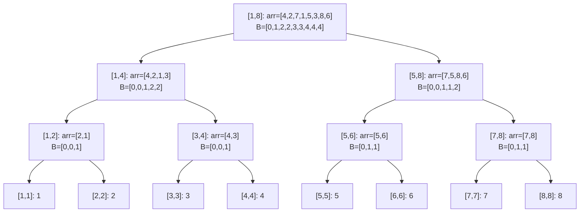

# Static Wavelet Tree - Truy Vấn Thứ Tự Trên Đoạn

> **Tác giả:** FPTOJ Team<br>
> **Nội dung tham khảo từ:** CP-Algorithms - Wavelet Tree

---

## 1. Bản chất vấn đề

### Bài toán: Truy vấn phần tử lớn thứ $k$ trong đoạn

Cho mảng $A$ gồm $N$ phần tử. Thực hiện $Q$ truy vấn:

- **$k$-th smallest in $[l, r]$:** Tìm phần tử nhỏ thứ $k$ trong đoạn $[l, r]$.
- **Count less than $x$ in $[l, r]$:** Đếm số phần tử nhỏ hơn $x$ trong đoạn $[l, r]$.

| Bài toán | Segment Tree | **Wavelet Tree** |
|----------|-------------|-----------------|
| $k$-th smallest | $O(\log^2 N)$ | $O(\log N)$ |
| Count less than $x$ | $O(\log^2 N)$ | $O(\log N)$ |
| Không gian | $O(N)$ | $O(N \log N)$ |

---

## 2. Tư duy cốt lõi

### Ý tưởng: Phân hoạch theo bit

Wavelet Tree là cây nhị phân mà mỗi nút quản lý 1 khoảng giá trị $[lo, hi]$:

- **Nút lá:** $lo = hi$ (chỉ 1 giá trị).
- **Nút trong:** Chia $[lo, hi]$ thành $[lo, mid]$ (con trái) và $[mid+1, hi]$ (con phải).

Mỗi nút lưu mảng `B` — đếm số phần tử thuộc con trái.

### Cấu trúc cây


```mermaid
graph TD
    A["[1,8]: arr=[4,2,7,1,5,3,8,6]\nB=[0,1,2,2,3,3,4,4,4]"]
    A --> B["[1,4]: arr=[4,2,1,3]\nB=[0,0,1,2,2]"]
    A --> C["[5,8]: arr=[7,5,8,6]\nB=[0,0,1,1,2]"]
    B --> D["[1,2]: arr=[2,1]\nB=[0,0,1]"]
    B --> E["[3,4]: arr=[4,3]\nB=[0,0,1]"]
    C --> F["[5,6]: arr=[5,6]\nB=[0,1,1]"]
    C --> G["[7,8]: arr=[7,8]\nB=[0,1,1]"]
    D --> H["[1,1]: 1"]
    D --> I["[2,2]: 2"]
    E --> J["[3,3]: 3"]
    E --> K["[4,4]: 4"]
    F --> L["[5,5]: 5"]
    F --> M["[6,6]: 6"]
    G --> N["[7,7]: 7"]
    G --> O["[8,8]: 8"]
```

!!! warning "Quy ước mảng B trong bài này"
    `B` có $n+1$ phần tử với `B[0] = 0`; `B[i]` = số phần tử trong `A[0..i-1]` thuộc con trái ($\le mid$). Ví dụ gốc ($n = 8$): $A = [4,2,7,1,5,3,8,6]$, $mid = 4$: các phần tử $\le 4$ ở vị trí $0,1,3,5$ → `B = [0,1,2,2,3,3,4,4,4]` (9 phần tử). Mọi bảng dưới đều theo quy ước này.

```matplotlib
import numpy as np

arr = [4, 2, 7, 1, 5, 3, 8, 6]
n = len(arr)

fig, axes = plt.subplots(4, 1, figsize=(10, 8), sharex=True)

levels = [
    ("[1,8]", arr, [4, 2, 7, 1, 5, 3, 8, 6]),
    ("[1,4] vs [5,8]", arr, [4, 2, 7, 1, 5, 3, 8, 6]),
    ("[1,2] vs [3,4]\n[5,6] vs [7,8]", arr, [4, 2, 7, 1, 5, 3, 8, 6]),
    ("Lá", arr, [4, 2, 7, 1, 5, 3, 8, 6]),
]

level_splits = [
    {"left": [1,2,3,4], "right": [5,6,7,8], "mid": 4},
    {"left": [1,2], "right": [3,4], "mid_l": 2, "mid_r": 4},
    {"left": [1], "right": [2], "mid": 2},
    {},
]

colors_left = '#3498db'
colors_right = '#e74c3c'

level0_left = [1 if x <= 4 else 0 for x in arr]
level0_right = [1 if x > 4 else 0 for x in arr]

level1_left_vals = [x for x in arr if x <= 4]
level1_right_vals = [x for x in arr if x > 4]

x = np.arange(n)
width = 0.6

ax = axes[0]
left_colors = [colors_left if v <= 4 else colors_right for v in arr]
ax.bar(x, arr, width, color=left_colors, edgecolor='white', linewidth=0.5)
for i, v in enumerate(arr):
    ax.text(i, v + 0.2, str(v), ha='center', fontsize=10, fontweight='bold')
ax.set_ylabel('Gốc\n[1,8]', fontsize=11, fontweight='bold')
ax.set_ylim(0, 10)
ax.axhline(y=4, color='gray', linestyle='--', alpha=0.5)
ax.text(n - 0.5, 4.3, 'mid=4', fontsize=9, color='gray')

ax = axes[1]
colors1 = []
vals_reordered = [4, 2, 1, 3, 7, 5, 8, 6]
for v in vals_reordered:
    colors1.append(colors_left if v <= 4 else colors_right)
ax.bar(x, vals_reordered, width, color=colors1, edgecolor='white', linewidth=0.5)
for i, v in enumerate(vals_reordered):
    ax.text(i, v + 0.2, str(v), ha='center', fontsize=10, fontweight='bold')
ax.set_ylabel('Cấp 1\nTrái | Phải', fontsize=11, fontweight='bold')
ax.set_ylim(0, 10)
ax.axhline(y=4, color='gray', linestyle='--', alpha=0.5)
ax.plot([3.5, 3.5], [0, 9], 'k--', alpha=0.3)

ax = axes[2]
vals_l2 = [2, 1, 4, 3, 5, 6, 7, 8]
colors2 = []
for v in vals_l2:
    if v <= 2:
        colors2.append('#1abc9c')
    elif v <= 4:
        colors2.append('#9b59b6')
    elif v <= 6:
        colors2.append('#f39c12')
    else:
        colors2.append('#e74c3c')
ax.bar(x, vals_l2, width, color=colors2, edgecolor='white', linewidth=0.5)
for i, v in enumerate(vals_l2):
    ax.text(i, v + 0.2, str(v), ha='center', fontsize=10, fontweight='bold')
ax.set_ylabel('Cấp 2\n4 nhóm', fontsize=11, fontweight='bold')
ax.set_ylim(0, 10)

ax = axes[3]
vals_l3 = sorted(arr)
colors3 = ['#1abc9c', '#1abc9c', '#9b59b6', '#9b59b6', '#f39c12', '#f39c12', '#e74c3c', '#e74c3c']
ax.bar(x, vals_l3, width, color=colors3, edgecolor='white', linewidth=0.5)
for i, v in enumerate(vals_l3):
    ax.text(i, v + 0.2, str(v), ha='center', fontsize=10, fontweight='bold')
ax.set_ylabel('Lá\n[1,1]..[8,8]', fontsize=11, fontweight='bold')
ax.set_ylim(0, 10)

ax.set_xticks(x)
ax.set_xticklabels([f'[{i}]' for i in range(n)])
ax.set_xlabel('Vị trí trong mảng', fontsize=11)

fig.suptitle('Wavelet Tree: Cách các giá trị được phân hoạch tại mỗi cấp', fontsize=14, fontweight='bold', y=1.01)
plt.tight_layout()
```

### Trace: Tìm phần tử nhỏ thứ 3 trong $[1, 8]$ (toàn mảng, 1-indexed)

Mảng: $[4, 2, 7, 1, 5, 3, 8, 6]$, $k = 3$. Đáp án đúng: mảng sắp xếp $[1,2,3,4,5,6,7,8]$ → số thứ 3 là **3**.

| Bước | Nút | $B$ | Số phần tử đi trái | So sánh | Hành động |
|------|-----|-----|-------------------|---------|-----------|
| 1 | Gốc $[1,8]$ | $[0,1,2,2,3,3,4,4,4]$ | $B[8]-B[0] = 4$ | $k=3 \le 4$ | Sang trái, giữ $k=3$ |
| 2 | Con trái $[1,4]$ | $[0,0,1,2,2]$ | $B[4]-B[0] = 2$ | $k=3 > 2$ | Sang phải, $k=3-2=1$ |
| 3 | Con phải $[3,4]$ | $[0,0,1]$ | $B[2]-B[0] = 1$ | $k=1 \le 1$ | Sang trái, giữ $k=1$ |
| 4 | Lá $[3,3]$ | — | — | — | Kết quả: **3** ✓ |

---

## 3. Phân tích tính đúng đắn

### Mảng $B$ đếm gì?

$B[i]$ = số phần tử từ $A[0]$ đến $A[i]$ thuộc **con trái** (có giá trị $\le mid$).

Khi query trên đoạn $[l, r]$:

- Số phần tử thuộc con trái trong $[l, r]$: `B[r] - B[l-1]`
- Nếu $k \le$ số trái → đệ quy sang trái.
- Nếu $k >$ số trái → đệ quy sang phải, $k' = k - \text{trái}$.

---

## 4. Đánh giá độ phức tạp

| Thao tác | Thời gian | Không gian |
|----------|-----------|------------|
| Xây cây | $O(N \log N)$ | $O(N \log N)$ |
| $k$-th smallest | $O(\log N)$ | $O(1)$ |
| Count less than $x$ | $O(\log N)$ | $O(1)$ |

---

## Code minh họa

=== "C++"

    ```cpp
    #include <bits/stdc++.h>
    using namespace std;

    struct WaveletTree {
        int lo, hi;
        vector<int> B;
        WaveletTree *left, *right;

        WaveletTree(vector<int>::iterator from, vector<int>::iterator to, int x, int y)
            : lo(x), hi(y), left(nullptr), right(nullptr) {
            if (from == to || lo == hi) return; // đoạn rỗng hoặc lá: dừng
            int mid = (lo + hi) / 2;
            auto f = [mid](int x) { return x <= mid; }; // true = về con trái
            B.reserve(to - from + 1);
            B.push_back(0); // B[0] = 0 để công thức B[r]-B[l-1] đúng với l=1
            for (auto it = from; it != to; it++)
                B.push_back(B.back() + f(*it)); // prefix count phần tử đi trái
            // stable_partition: giữ thứ tự tương đối (quan trọng cho ánh xạ l,r)
            auto pivot = stable_partition(from, to, f);
            left = new WaveletTree(from, pivot, lo, mid);
            right = new WaveletTree(pivot, to, mid + 1, hi);
        }

        // Số phần tử <= k trong [l, r] (1-indexed)
        int countLessEq(int l, int r, int k) {
            if (l > r || k < lo) return 0; // đoạn rỗng hoặc k nhỏ hơn mọi giá trị
            if (hi <= k) return r - l + 1; // cả nút đều <= k
            int lb = B[l - 1], rb = B[r]; // số phần tử đi trái trước l và tới r
            // Ánh xạ [l,r] sang 2 con: con trái [lb+1, rb], con phải [l-lb, r-rb]
            return left->countLessEq(lb + 1, rb, k) +
                   right->countLessEq(l - lb, r - rb, k);
        }

        // Phần tử nhỏ thứ k trong [l, r] (1-indexed)
        int kth(int l, int r, int k) {
            if (lo == hi) return lo; // lá: đáp án duy nhất
            int lb = B[l - 1], rb = B[r];
            int inLeft = rb - lb; // số phần tử của [l,r] đi sang trái
            if (k <= inLeft)
                return left->kth(lb + 1, rb, k); // đáp án ở con trái, giữ k
            else
                return right->kth(l - lb, r - rb, k - inLeft); // sang phải, trừ k
        }

        ~WaveletTree() { delete left; delete right; }
    };

    int main() {
        ios_base::sync_with_stdio(false);
        cin.tie(NULL);

        int n, q;
        cin >> n >> q;
        vector<int> a(n);
        for (int i = 0; i < n; i++) cin >> a[i];

        int minVal = *min_element(a.begin(), a.end());
        int maxVal = *max_element(a.begin(), a.end());
        WaveletTree wt(a.begin(), a.end(), minVal, maxVal);

        while (q--) {
            int type;
            cin >> type;
            if (type == 1) {
                int l, r, k;
                cin >> l >> r >> k;
                cout << wt.kth(l, r, k) << "\n";
            } else {
                int l, r, x;
                cin >> l >> r >> x;
                cout << wt.countLessEq(l, r, x) << "\n";
            }
        }
        return 0;
    }
    ```

=== "Python"

    ```python
    # Wavelet Tree trong Python (chỉ dùng cho mục đích học tập)
    # Với N lớn, nên dùng C++ vì Wavelet Tree tốn nhiều bộ nhớ trong Python

    class WaveletTree:
        def __init__(self, data, lo, hi):
            self.lo = lo
            self.hi = hi
            self.B = [0]
            self.left = self.right = None
            if lo == hi or not data:
                return
            mid = (lo + hi) // 2
            self.B = [0]
            for x in data:
                self.B.append(self.B[-1] + (1 if x <= mid else 0))
            left_data = [x for x in data if x <= mid]
            right_data = [x for x in data if x > mid]
            self.left = WaveletTree(left_data, lo, mid)
            self.right = WaveletTree(right_data, mid + 1, hi)

        def kth(self, l, r, k):
            if self.lo == self.hi:
                return self.lo
            in_left = self.B[r] - self.B[l - 1]
            if k <= in_left:
                new_l = self.B[l - 1] + 1
                new_r = self.B[r]
                return self.left.kth(new_l, new_r, k)
            else:
                new_l = l - self.B[l - 1]
                new_r = r - self.B[r]
                return self.right.kth(new_l, new_r, k - in_left)

    n, q = map(int, input().split())
    a = list(map(int, input().split()))
    lo, hi = min(a), max(a)
    wt = WaveletTree(a, lo, hi)

    for _ in range(q):
        parts = list(map(int, input().split()))
        if parts[0] == 1:
            l, r, k = parts[1], parts[2], parts[3]
            print(wt.kth(l, r, k))
    ```

---

## 5. Lỗi thường gặp

```cpp
// SAI: query 0-indexed trong khi code viết cho 1-indexed
wt.kth(0, 7, 3); // B[l-1] = B[-1] → đọc ngoài mảng!

// ĐÚNG: cộng 1 khi gọi (vị trí mảng 0..n-1 → query 1..n)
wt.kth(l + 1, r + 1, k);
```

- **Dùng `partition` thay vì `stable_partition`:** xáo trộn thứ tự tương đối → ánh xạ `lb/rb` sai, query ra rác. Bắt buộc `stable_partition`.
- **Miền giá trị `[lo, hi]` quá rộng** (vd `int` đầy đủ $2^{31}$): cây sâu 31 tầng, mỗi tầng $O(N)$ bộ nhớ → MLE/chậm. Luôn **nén giá trị** (discretization) trước khi dựng cây.
- **Nhầm `B` 0-indexed:** `B` có $n+1$ phần tử, `B[0] = 0`. Công thức `inLeft = B[r] - B[l-1]` chỉ đúng với query 1-indexed.
- **Tĩnh (static):** Wavelet Tree không hỗ trợ update điểm — cần update thì dùng BIT/fenwick cây hoặc persistent segment tree.

## 6. Bài tập luyện tập

| Mã bài | Tên bài tập | Độ khó | Kiểu bài tập (Bản chất) |
|---|---|---|---|
| [`wt-kth-smallest`](https://fptoj.com/problem/wt-kth-smallest) | K-th Smallest Trên Đoạn | ⭐ | Tìm số nhỏ thứ $K$ trong đoạn $[L, R]$ |
| [`wt-count-less`](https://fptoj.com/problem/wt-count-less) | Đếm Số Nhỏ Hơn Hoặc Bằng X | ⭐ | Đếm số lượng phần tử $\le X$ trong đoạn $[L, R]$ |
| [`wt-range-freq`](https://fptoj.com/problem/wt-range-freq) | Tần Suất Xuất Hiện Trong Khoảng | ⭐⭐ | Đếm số lần xuất hiện của phần tử $X$ trong đoạn $[L, R]$ |
| [`wt-kth-largest`](https://fptoj.com/problem/wt-kth-largest) | K-th Largest Trên Đoạn | ⭐⭐ | Tìm số lớn thứ $K$ trong đoạn $[L, R]$ |
| [`wt-range-count-in`](https://fptoj.com/problem/wt-range-count-in) | Đếm Số Trong Đoạn Giá Trị | ⭐⭐⭐ | Đếm số phần tử có giá trị nằm trong đoạn $[X, Y]$ |
| [`wt-median-range`](https://fptoj.com/problem/wt-median-range) | Số Trung Vị Trên Đoạn | ⭐⭐⭐ | Tìm số trung vị trong đoạn $[L, R]$ |
| [`wt-next-greater-val`](https://fptoj.com/problem/wt-next-greater-val) | Giá Trị Kế Tiếp Lớn Hơn | ⭐⭐⭐ | Tìm giá trị nhỏ nhất lớn hơn $X$ trong đoạn $[L, R]$ |
| [`wt-prev-smaller-val`](https://fptoj.com/problem/wt-prev-smaller-val) | Giá Trị Kế Tiếp Nhỏ Hơn | ⭐⭐⭐ | Tìm giá trị lớn nhất nhỏ hơn $X$ trong đoạn $[L, R]$ |
| [`wt-percentile`](https://fptoj.com/problem/wt-percentile) | Tìm Phân Vị Trên Đoạn | ⭐⭐⭐⭐ | Tìm phân vị thứ $P$ trên đoạn $[L, R]$ |
| [`wt-rect-count`](https://fptoj.com/problem/wt-rect-count) | Đếm Điểm Trong Hình Chữ Nhật | ⭐⭐⭐⭐ | 2D Range Counting: Đếm số điểm trong hình chữ nhật $[x_1, x_2] \times [y_1, y_2]$ |

---

**Bài liên quan:**
*   [Segment Tree](segment-tree.md)
*   [Persistent Segment Tree](persistent-segment-tree.md)
